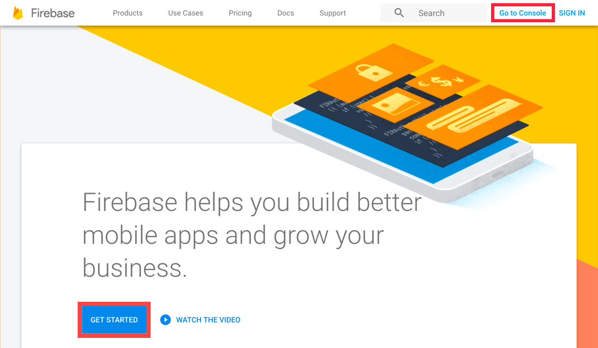
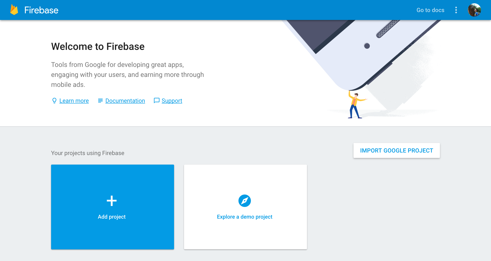
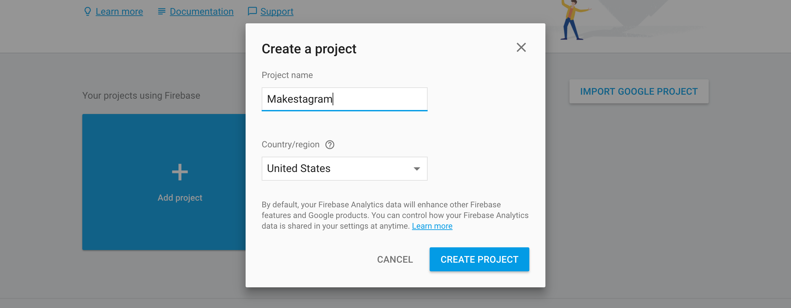
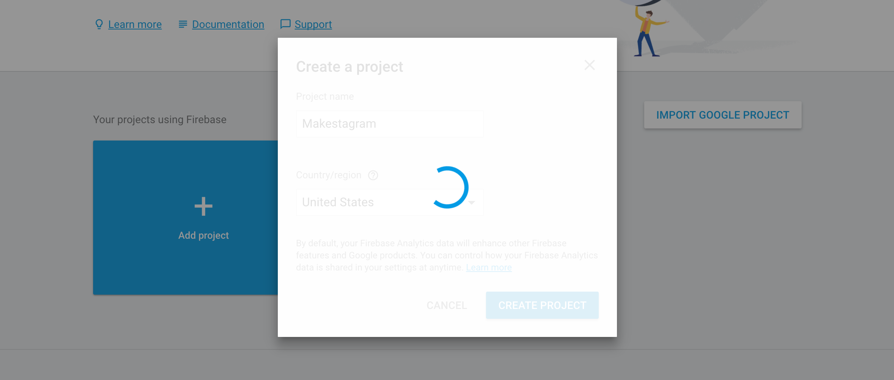
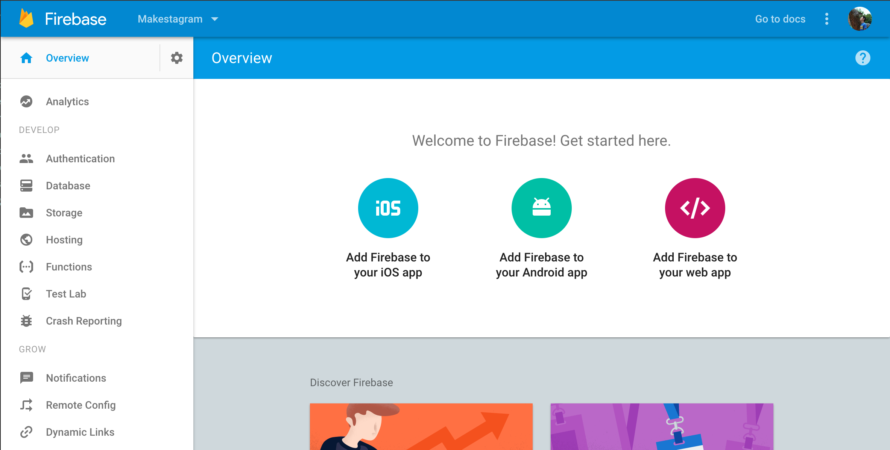

In order to build a photo sharing app, we will need to exchange information between multiple users on multiple devices.

In the _Make School Notes_ tutorial we built an app that only stores information locally on the user's phone. There is no way of sharing information with other users or accessing notes from other devices. This is fine for some apps; however, most applications need to provide a way for multiple users to interact with each other. In such cases we need to store the information used in the app on a server that is accessible by all users.

In this section you will set up a new Firebase project. The contents of this tutorial is as follows:

1. What is Firebase?
1. Setting up a new Firebase project

# What is Firebase?

## Background

Firebase is a mobile _backend as a service_ that was acquired by Google in October 2014. The idea was to allow individual mobile developers to build apps without having to worry about servers.

The role of the _backend_ in an internet application often revolves around _data persistence_. That means saving the user's data "in the cloud" (your backend servers) so that when they lose their phone, all their data will still be there when they reinstall your app. In reality, it's much more complicated than that, often because applications require specialized business logic. But for many developers Firebase is enough to ship an amazing app, without worrying about writing backend code.

## What does Firebase do for us?

Firebase lets you store your _data_, handle files such as images and videos, and even manages your users' logins and social network connections! We can create an infinite number of projects, ideas, hacks, and applications, without having to write our own backend.

Additionally Firebase provides an iOS library. This makes it easy to interact with the Firebase platform from within our app. Throughout this tutorial you will get to know Firebase in detail. Our very first step is setting up a new Firebase project.

If you're interested in learning more about Firebase and it's capabilities, [click here.](https://firebase.google.com/features/)

# Setting up a new Firebase project

Go to the Firebase website by [clicking here.](https://firebase.google.com/) You'll need to sign up or log in with your Google account to get started.

## Creating a new Firebase project

<!-- TODO: figure out why list isn't properly formatted -->

1. Get started by clicking on the `GET STARTED FOR FREE` button or the top right `Go to Console` button in the navigation bar.

1. This is your Firebase console. Here, you will see an overview of all your Firebase projects. Click `Add project` to create your first project.

1. Set your project name to "Makestagram" and select your country.

1. Wait for Firebase to setup your new project and redirect you to the project overview. It can take 15-30 seconds for this process to complete.

Once you have finished the steps above, you should have a new Firebase project setup. This is the place where we can see and manage our data, user accounts and interface with all the tools Firebase has to offer. It should look like this:

Next we'll need to create a new Xcode project!

