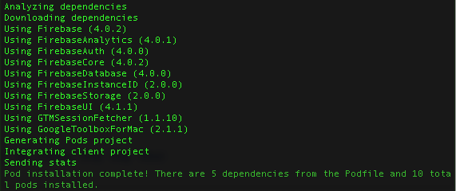

As always, we'll need to create a new Xcode project.

## Create a new Xcode project

1. Open Xcode and create a new project.
1. Choose the Single View Application as template. Click next.
1. Fill out the remaining info for your project. See the example provided below:
1. Save your Xcode project somewhere you'll be able to easily find later. i.e. `~/Code/`


Next we need to integrate Firebase into our project. To do this, we'll use a tool called _CocoaPods_. This will take care of all the third party libraries we rely on.

# What Is a Dependency Manager?

One way of adding third-party code to your project would be to download all of the source code and copy it into your project.

This may sound straightforward, but in reality this approach will fail for many projects. Many third-party libraries come with their own dependencies and very special rules about how they need to be compiled; information that is not in the source files but in the project file of the library.

Even if that approach works, you will have a hard time updating the library. You will have to remove all code and add it again.

To avoid these kinds of problems, software developers have built dependency managers. The most popular one for iOS is _CocoaPods_.

# How Does CocoaPods Work?

_CocoaPods_ provides a huge repository of available iOS libraries. When you want to use _CocoaPods_ you add a special file to your project in which you can list your dependencies. That file is called a _Podfile_.

If you want to use a library, you need to enter the name (and optionally the version) of the library into your _Podfile_. Then you can use one of the _CocoaPods_ commands to install the library that you listed in the _Podfile_.

# Creating a Podfile

In the _Getting Started_ section, you should have already installed _CocoaPods_. If not, make sure to go back and follow the instructions to install _CocoaPods_.

After installing _CocoaPods_, we can create a _Podfile_ that will allow us to declare dependencies for our project. The _CocoaPods_ tool provides us with a convenient method to do this:

> [action]
> Open the root directory of your project in a terminal and type:
>
```
pod init
```

<!--  -->

> [info]
> You can change directories to the root directory of your project by typing `cd ` (make sure you put a space after `cd`) and then dragging the project folder into Terminal. 

Now a _Podfile_ with some skeleton content will be created. Open the _Podfile_ in your favorite text editor. It should look like this:

```
# Uncomment this line to define a global platform for your project
# platform :ios, '9.0'

target 'Makestagram' do
  # Comment this line if you're not using Swift and don't want to use dynamic frameworks
  use_frameworks!

  # Pods for Makestagram

end
```

# Installing Our Dependencies

Now we are ready to add our dependencies to this file.

> [action]
> Update your _Podfile_ so that it looks like this. Note that we uncommented the `platform :ios, '9.0'` line. Also pay attention that you're using the correct single quotes.
>
```
# Uncomment this line to define a global platform for your project
platform :ios, '9.0'
>
target 'Makestagram' do
  # Comment this line if you're not using Swift and don't want to use dynamic frameworks
  use_frameworks!
>
  pod 'Firebase/Core'
  pod 'Firebase/Auth'
  pod 'FirebaseUI/Auth'
  pod 'Firebase/Database'
  pod 'Firebase/Storage'
end
```
>
> Then, return to the command line and run:
>
```
pod install
```
> This step may take some time the first time you run it, up to 10 or 15 minutes.

Now your dependencies will be download and installed.

> [action]
Verify that you have the correct version of each SDK by running `pod update` in the root directory of your Makestagram project. The Firebase CocoaPods should be at least 4.0.X. 

**The next step is very important.** After you have installed your first library, _CocoaPods_ will generate an _Xcode workspace_ for you. When using _CocoaPods_, you need to work with that _workspace_ and no longer with the Xcode _project_ that you have been working with.

> [action]
> **Close** your Xcode project. Then open the new **workspace** that _CocoaPods_ has generated:
> 

As discussed earlier, this project contains all the frameworks we need. Additionally it contains a few source code files that we will use later as we progress through the tutorial.

We're now ready to dive into the first step - integrating and connecting our app to Firebase.
