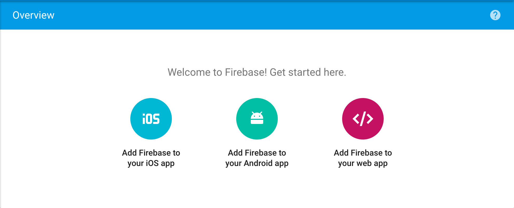
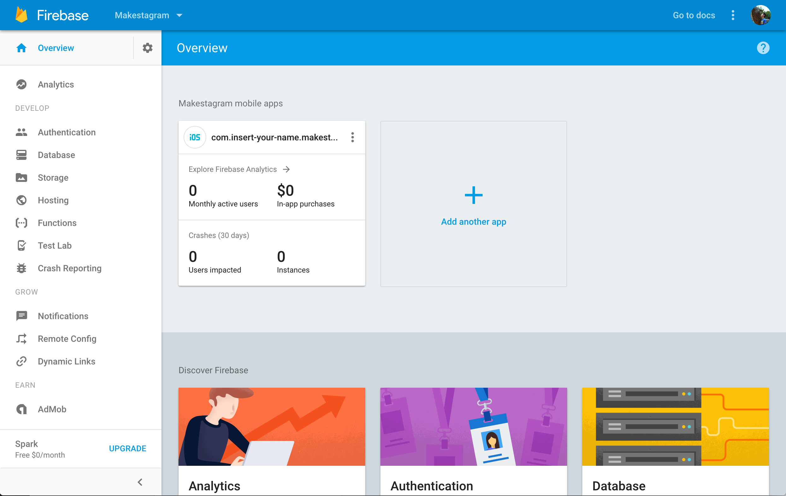

Time to pull up your browser again. You've created a new Firebase and Xcode project, but you need to connect them so they can communicate with each other.

# Adding Firebase to your iOS app

Go to your Firebase project overview. You should see three buttons for connecting Firebase to your app. You're going to click on the "Add Firebase to your iOS app" button and follow the instructions listed.

Follow the instructions provided to connect Firebase with your app.

You will have already installed and adding the Firebase SDK in step 3. Confirm that you have added and installed the 'Firebase/Core' CocoaPod and are using the `.xcworkspace` file.

# Finishing Up

After following the Firebase steps, your project overview should look like this:

We've setup our Xcode project to communicate with our Firebase project. This will allow us to make use of all of Firebase's features and functionality in the following steps! In the next section, we'll organize our codebase by thinking about how we'll store and group our source files.
