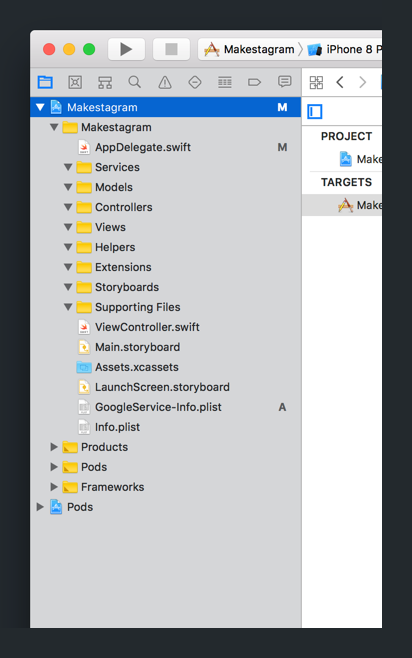
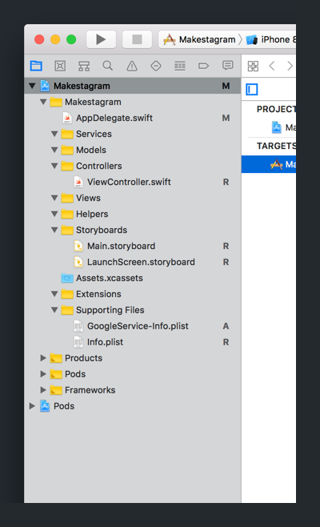
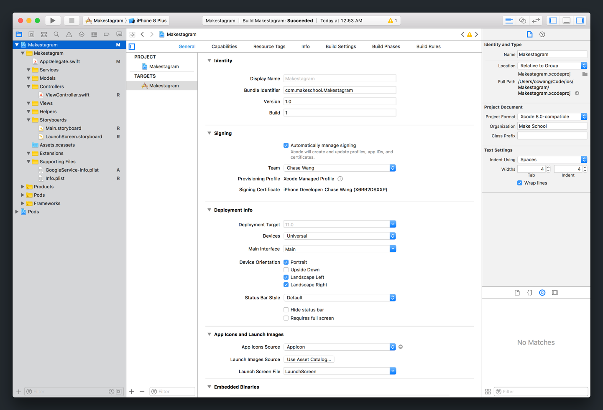

Although the term _architecture_ can be intimidating to new programmers, it's not as scary as you think. Architecture can be simply explained as how to better organize your code so that it's easier to build, change and debug.

In this step, we'll take some time to think about how we'll build our app and organize our code.

# Makestagram Features

The goal of this tutorial is to build a photo sharing app. Users shall be able to share photos, follow users and interact with other users through likes.

This is a detailed list of features our app will have:

- Sign up and login with email/password
- Follow other users
- View photos posted by other users
- Like photos
- Post photos
- Delete photos you posted
- Flag photos other users have posted

You are probably familiar with most of these features from popular social network apps. You might wonder why we included _flagging_ content in this simple photo sharing app. It turns out that it's an important feature to get your app into Apple's App Store. Apple requires apps with user created content to have a _flag_ feature - this way users can report inappropriate content. Since you will likely need this feature in your own apps, we have included it as part of the tutorial.

# App Outline

Once you have decided on your app's features, your next step should be to outline your app's structure. The outline should contain all the screens in your app, and should include how they will be connected. For **Makestagram**, the outline would look like this:

You should come up with a similar diagram before writing code for your original app - it will give you a better idea of how much effort it will take to build your app.

# Project Navigator Organization

Now let's create some groups in our _Project Navigator_ to help organize our code.

> [action]
Right-click in your _Project Navigator_ to create a new group named _Controllers_:
>

>
Step-by-step:
>
1. Right-click in your _Project Navigator_ to bring up a contextual menu.
1. In the contextual popup menu, click `New Group`.
1. Name your new group _Controllers_.

We've created our first _Project Navigator_ group. For the rest of our tutorial, we'll place our controller-related code in our new group.

We're off to a good start, but we'll need more that one group to organize our code.

> [challenge]
Follow the same process to add the remaining groups below:
>
- Extensions
- Helpers
- Models
- Services
- Storyboards
- Supporting
- Views

When you're done, your _Project Navigator_ should look like the following:

With our new groups, we can move each of the files in our _Project Navigator_ into the correct group.

> [action]
Drag each of your files in your _Project Navigator_ into the correct group 

This will cause in some side-effects resulting in your Xcode project being unable to locate your Info.plist. This is ok, we'll fix this next.

# Reconnecting The Info.plist

If you try to run your project now, it'll return the following error:

Oops! Moving our `Info.plist` seems to have disconnected it from our Xcode project.

Our `Info.plist` file is a XML representation of many of our app's settings. After moving it into the _Supporting Files_ group, we'll need to reconnect it to our project.

> [action]
First, select your `Makestagram` project in your project navigator. 
>
By default, you should land on the _General_ tab. The first section in _General_ will be _Identity_.
>
Next, in the empty _Identity_ section, click on the button to _Choose Info.plist File..._.
>
In the popup prompt, set your project's `Info.plist` by choosing the file named `Info.plist`. This will reconnect your project's identity with your `Info.plist` file. 

When you're done, refresh your project's _General Settings_ by navigating to another file and back. You should see your `Info.plist` connected as before:

> [info]
If you run your project, you may find a a warning with the following message: `Warning: The Copy Bundle Resources build phase contains this target's Info.plist file ...`
>
To remove this warning, we'll need to navigate to our Project _Build Phases_.
>
Click on your Project and navigate to the _Build Phases_ tab. Click on the collapsed _Copy Bundle Resources_ and select the _Info.plist_. With your _.plist_ selected, click the remove (-) button just below: 
>
Build your app again and the warning should be gone.

At this point, our app should be running again without errors. In addition, we've organized our files and resources into each of their respective groups. Keeping our project organized will make it easier to find files we're looking for as we start building our app. As we build our project and add more files, we'll continue to create and reorganize our files into groups.

# Intro to App Architecture

When we build apps, we want to try our best to think about architecture, or how we organize our code. Benefits of good software architecture include:

- Code is easy for other developers and yourself to understand
- Code can easily be changed, added and removed
- Code can be reused and shared with other projects
- Reduces and manages complexity (you don't have to remember why you did the things you did)

As we think about architecture, one of the most important points to remember is to break the functionality of our code into layers that are independent and can be re-used.

In our project, we'll be using a very common architectural design called _Model View Controller_, or MVC for short. We will separate our code into the following:

- **Models** store and represent data
- **Views** display the data as UI to the user
- **Controllers** will manage the logic between our models and views

In addition to MVC, we'll create a service layer between our app and Firebase. Our service layer will manage how our app interacts with Firebase, mainly concerning reading and writing data to our database.

We'll also create a few helper objects to make certain tasks separate and reusable in our apps.

In summary, we'll be organizing code we write using the _Model View Controller_ architectural pattern. Having good architecture will make it easy to build new features and debug bugs.
