Although the term _architecture_ can be intimidating to new programmers, it's not as scary as you think. Architecture can be simply explained as how to better organize your code so that it's easier to build, change and debug.

In this step, we'll take some time to think about how we'll build our app and organize our code.

# Makestagram Features

The goal of this tutorial is to build a photo sharing app. Users shall be able to share photos, follow users and interact with other users through likes.

This is a detailed list of features our app will have:

- Sign up and login with email/password
- Follow other users
- View photos posted by other users
- Like photos
- Post photos
- Delete photos you posted
- Flag photos other users have posted

You are probably familiar with most of these features from popular social network apps. You might wonder why we included _flagging_ content in this simple photo sharing app. It turns out that it's an important feature to get your app into Apple's App Store. Apple requires apps with user created content to have a _flag_ feature - this way users can report inappropriate content. Since you will likely need this feature in your own apps, we have included it as part of the tutorial.

# App Outline

Once you have decided on your app's features, your next step should be to outline your app's structure. The outline should contain all the screens in your app, and should include how they will be connected. For **Makestagram**, the outline would look like this:

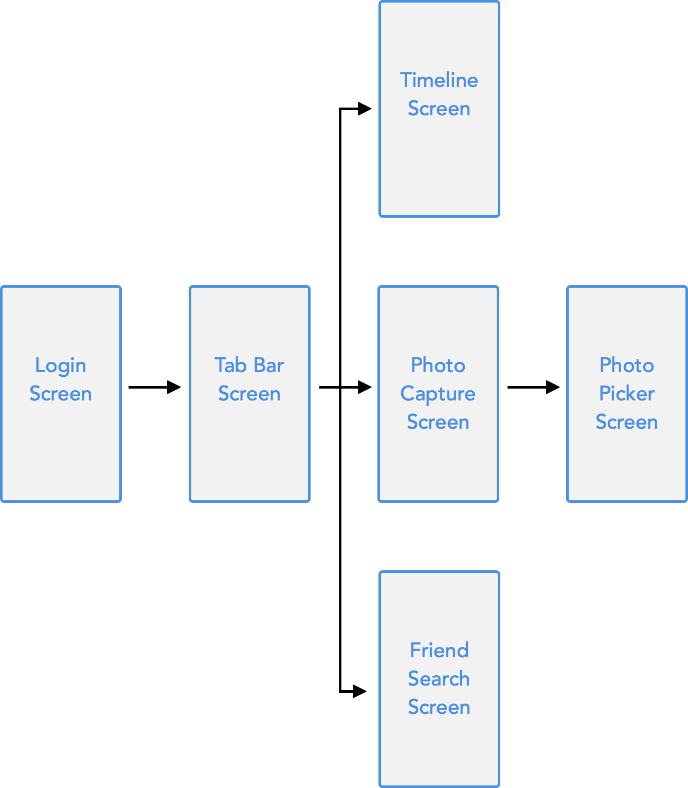

You should come up with a similar diagram before writing code for your original app - it will give you a better idea of how much effort it will take to build your app.

# Directory Structure

Now let's create our directory structure to better organize our code. Open the Makestagram subdirectory in the root directory of your Makestagram project. You can open this directory in Finder by right-clicking on your `AppDelegate` and selecting the option to `Show in Finder`.

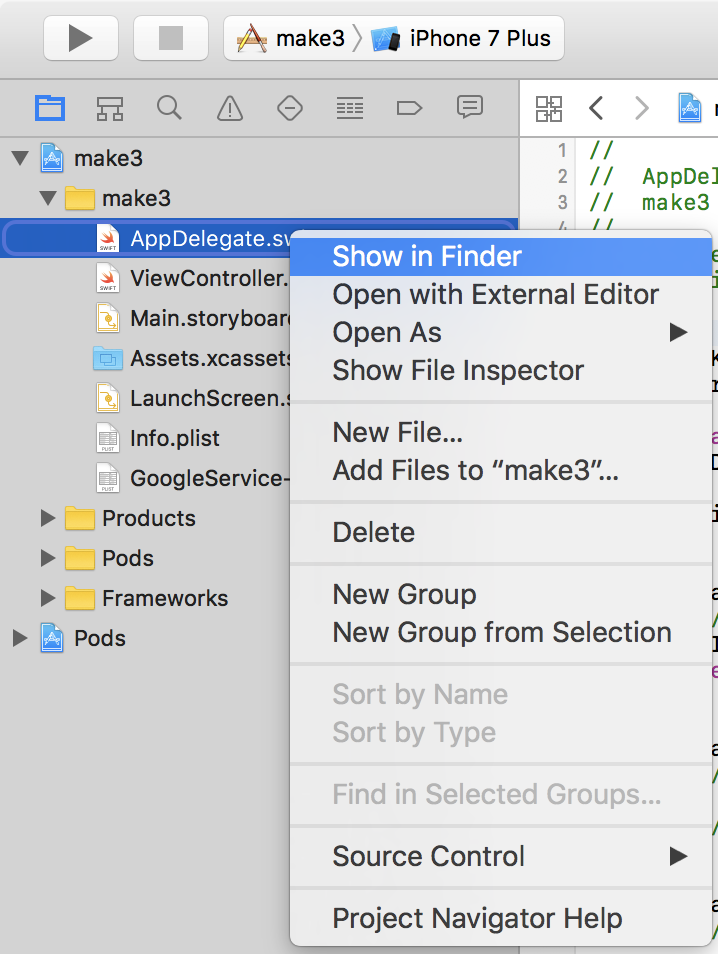

All the new code and files you create will go in this directory. Create the following folders to help organize our files:

- Controllers
- Extensions
- Helpers
- Models
- Services
- Storyboards
- Supporting
- Views

Next move all the related files into the correct subdirectories. This will cause some problems with Xcode not being able to find your files. This is ok, we'll fix that next. Your file directory should look like this:

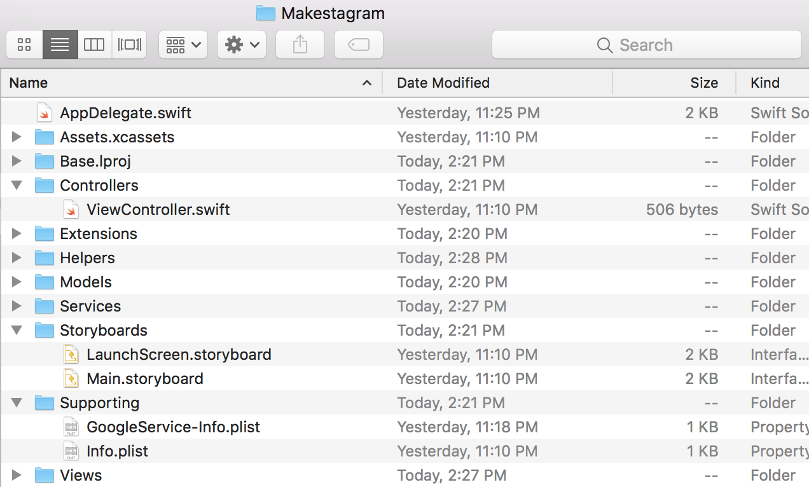

# Project Structure

Within our Xcode workspace, your Project navigator will display a project structure of all your files and resources. The structure of your project navigator is independent of your directory structure. Your project structure will organize your files in your project navigator within Xcode, while your directory structure will organize your files and resources on your computer.

In the last step, we rearranged the files in our Makestagram directory by creating new subdirectories for storing our `.swift` files. Xcode will no longer be able to find the files that we moved around. Your project navigator should have many greyed out files. Notice when you click on these missing files, nothing will happen.

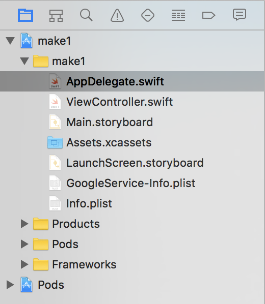

Keep in mind, if you move or rearrange files on computer, your Xcode project will no longer be able to find them unless you add them back into your project.

## Adding Back Missing Files

To add back files that have been rearranged, we'll first need to delete the missing, greyed out files.

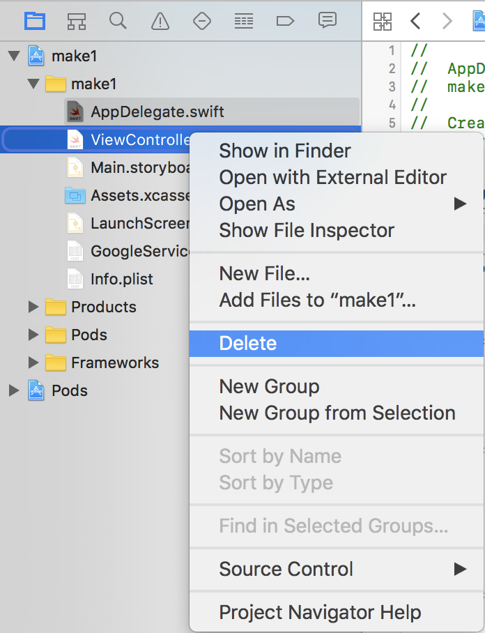

Next, we'll need to either right-click in our project navigator or click on the plus button in the bottom left corner of the project navigator and select the option `Add Files to "Makestagram"`:

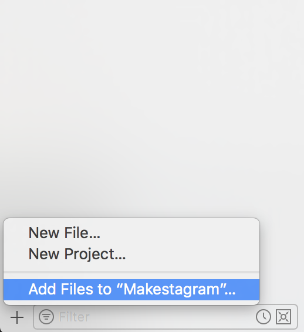

Next select the correct file you're trying to add in your file directory and click add:

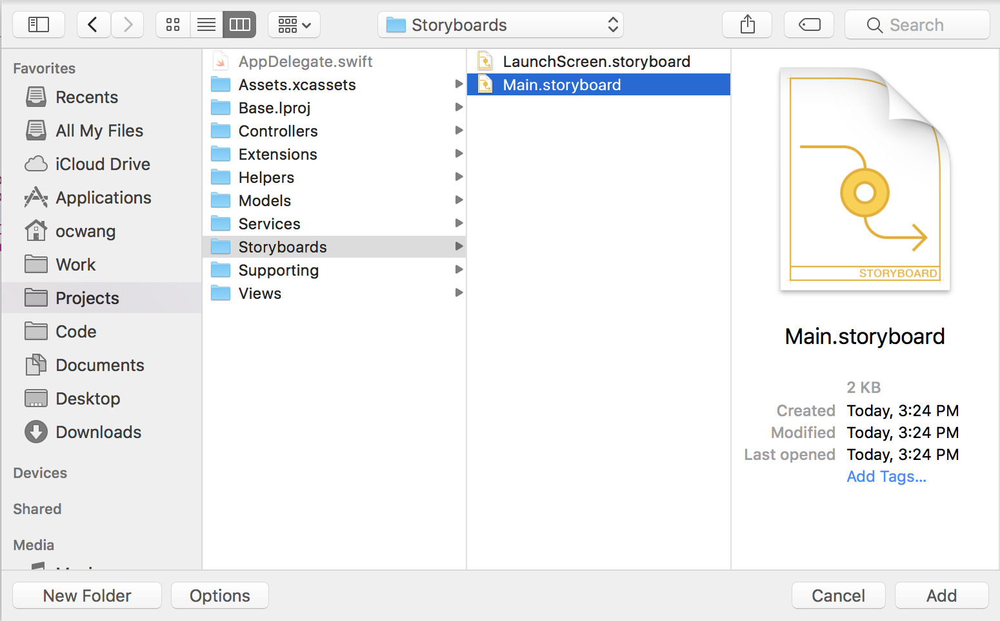

Repeat this process until you've added back all of the files you've rearranged. You should have deleted and re-added each of the following files:

- ViewController.swift
- Main.storyboard
- LaunchScreen.storyboard
- Info.plist
- GoogleService-Info.plist

After you've added each file back, you should be able to select each file and open it in Xcode:

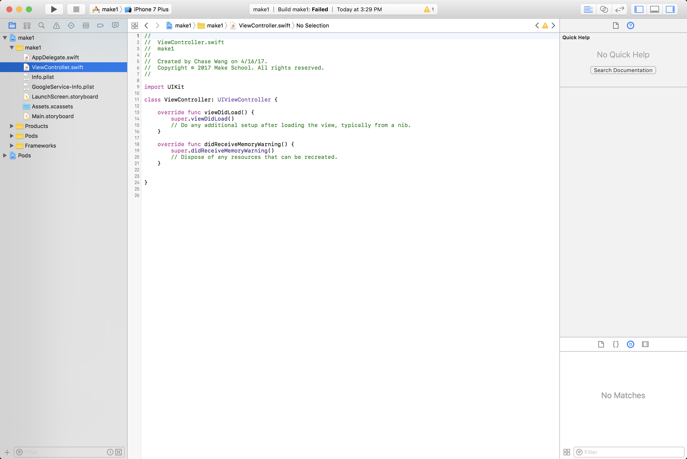

Build and run the app to make sure everything's working as expected.

## Setting our Info.plist

Oops! Our app doesn't run and returns the following error:

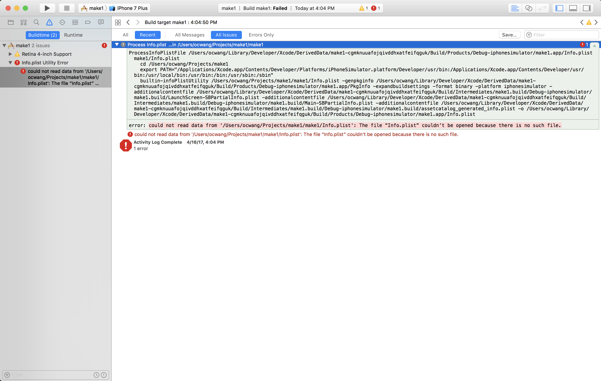

Our Info.plist file is a XML representation of many of our app's settings. After moving it into the _supporting_ folder, we need to reconfigure our project with the _Info.plist_ file.

To reset the _Info.plist_ file, select your `Makestagram` project in your project navigator.

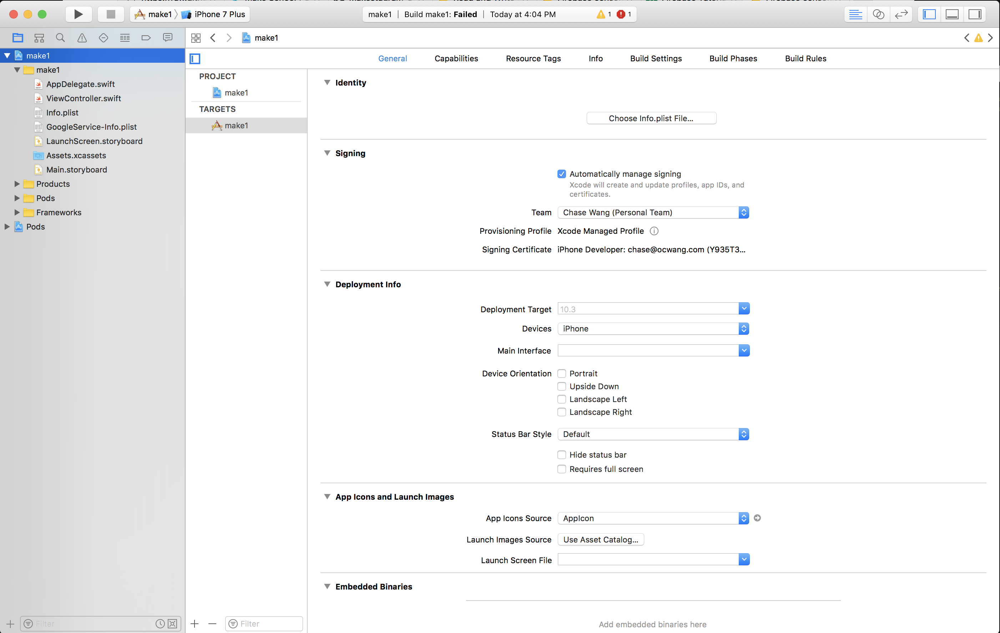

By default, you should land on the _General_ tab. The first section in _General_ will be _Identity_. You'll notice a prompt to set your Info.plist by choosing a file added to the project. Select the correct Info.plist and re-run your app:

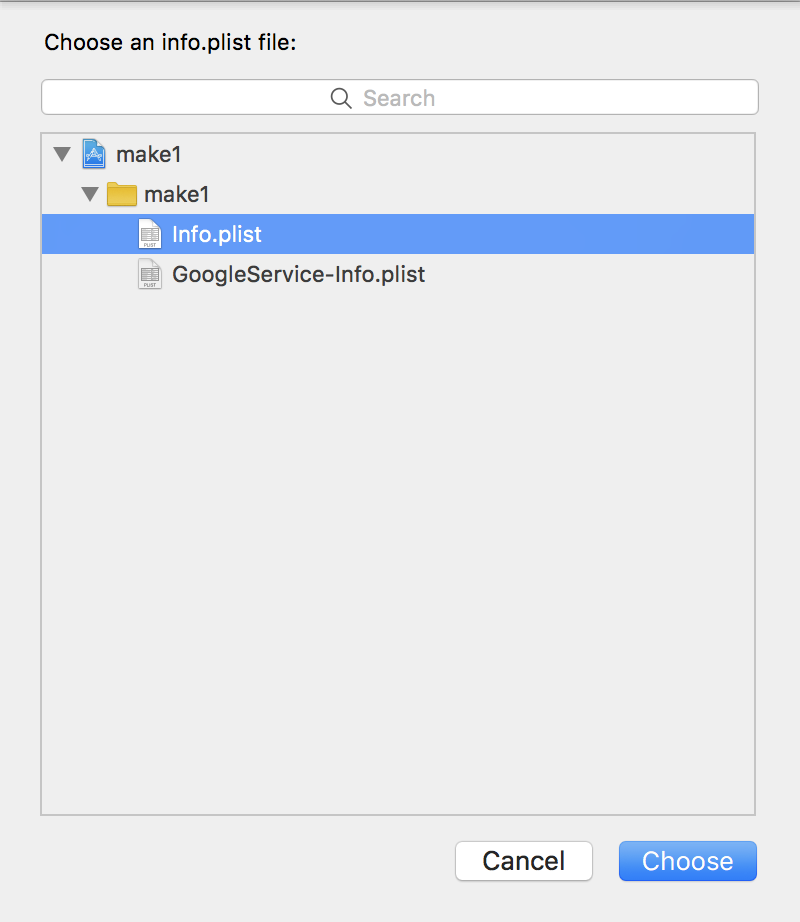

After you've reconfigured your _Info.plist_, build the app. You'll notice a warning with the following message: `Warning: The Copy Bundle Resources build phase contains this target's Info.plist file ...`

To remove this warning, we'll need to navigate to our Project _Build Phases_.

> [action]
Click on your Project and navigate to the _Build Phases_ tab. Click on the collapsed _Copy Bundle Resources_ and select the _Info.plist_. With your _.plist_ selected, click the remove (-) button just below: 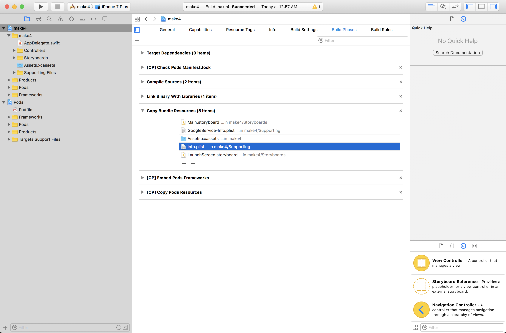

Build your app again and the warning should be gone.

## Organize our Project Structure

At this point, our app should now be running again and all our files and resources in our file directory are stored in the correct folders.

Last we'll want to organize the files in our project navigator into groups. Organizing our files will make it easier to find files we're looking for as we start building our app.

We'll do this by creating groups of similar files. Select a file you want to add to a group and right-click. You'll see a menu option for creating a new group from selection:

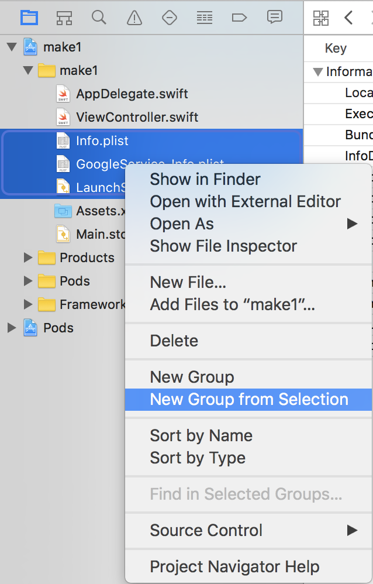

You can also select and drag files into their appropriate group. Remember that the project navigator structure and file directory structure are completely independent of each other. Rearranging files in one won't organize the structure of the other.

Repeat the previous steps until you've organized our project navigator as below:

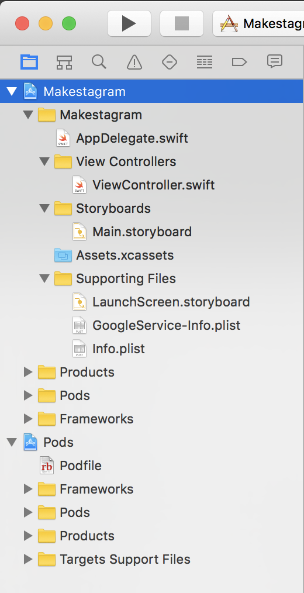

As we build our project and add more files, we'll continue to create and reorganize our files into groups. It's a bit of initial work but this is a good way to make sure your file system and Xcode project structure both stay organized. If you're interested in learning more, [click here.](http://vocaro.com/trevor/blog/2012/10/21/xcode-groups-vs-folder-references/)

# Intro to App Architecture

When we build apps, we want to try our best to think about architecture, or how we organize our code. Benefits of good software architecture include:

- Code is easy for other developers and yourself to understand
- Code can easily be changed, added and removed
- Code can be reused and shared with other projects
- Reduces and manages complexity (you don't have to remember why you did the things you did)

As we think about architecture, one of the most important points to remember is to break the functionality of our code into layers that are independent and can be re-used.

In our project, we'll be using a very common architectural design called _Model View Controller_, or MVC for short. We will separate our code into the following:

- **Models** store and represent data
- **Views** display the data as UI to the user
- **Controllers** will manage the logic between our models and views

In addition to MVC, we'll create a service layer between our app and Firebase. Our service layer will manage how our app interacts with Firebase, mainly concerning reading and writing data to our database.

We'll also create a few helper objects to make certain tasks separate and reusable in our apps.

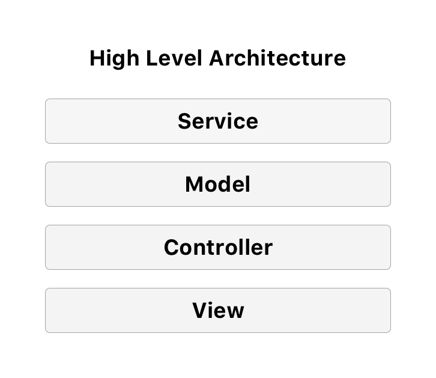

In summary, we'll be organizing code we write using the _Model View Controller_ architectural pattern. Having good architecture will make it easy to build new features and debug bugs.
