The previous sections of this tutorial have focused on set up. So far we've created a new Firebase and Xcode project. Enough setup! Let's start building Makestagram.

In this section, we'll work on creating our _login flow_ for:

- new users to create new accounts
- existing users to login

We'll begin by learning about authentication with Firebase!

# What is Authentication?

Authentication is the process of identifying which user is using the app. By verifying a user's identity, we can:

- keep track of which data belongs to who
- prevent people from accessing, stealing, modifying or deleting data without permission
- protect users from being impersonated by others

In addition, if a user logs out, their data will be safely stored in our database when they return.

## Firebase Auth

Firebase provides us with an easy way of authenticating users with their built in SDK and libraries. Throughout our _login flow_, we'll be using these pre-built components to save time and not have to worry about securely handling sensitive information.

To make sure we have access to these APIs and components, confirm you have `FirebaseAuth` and `FirebaseUI/Auth` listed and installed in your `Podfile`. Refer to the previous section `Setup Xcode Project` for details on how to setup your `Podfile`. If the following lines are missing from your `Podfile`, be sure to add them and run `pod install` before continuing:

```
pod 'Firebase/Auth'
pod 'FirebaseUI/Auth'
```

# Building a Login Flow

Our _login flow_ will allow new users to sign up and existing users to login. The designs for our _login flow_ will look like:

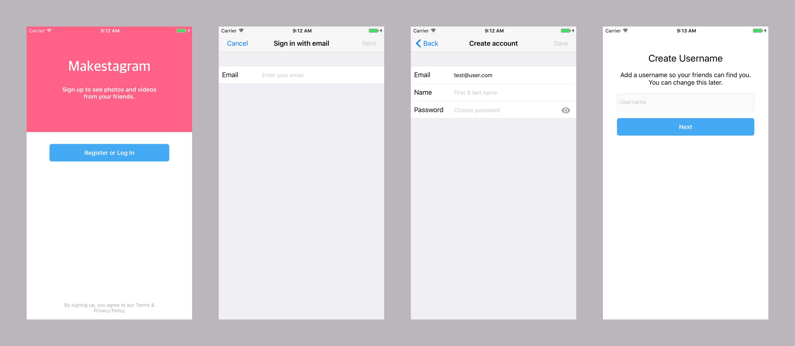

Before building a feature, it's always helpful to an idea of how the feature will work and what it will look like. Paper prototypes and wireframes are great tools to use so that we're able to focus on engineering as we're building.

# Creating a Login storyboard

Let's start building our _login flow_ by creating a new storyboard. Create a new storyboard file:

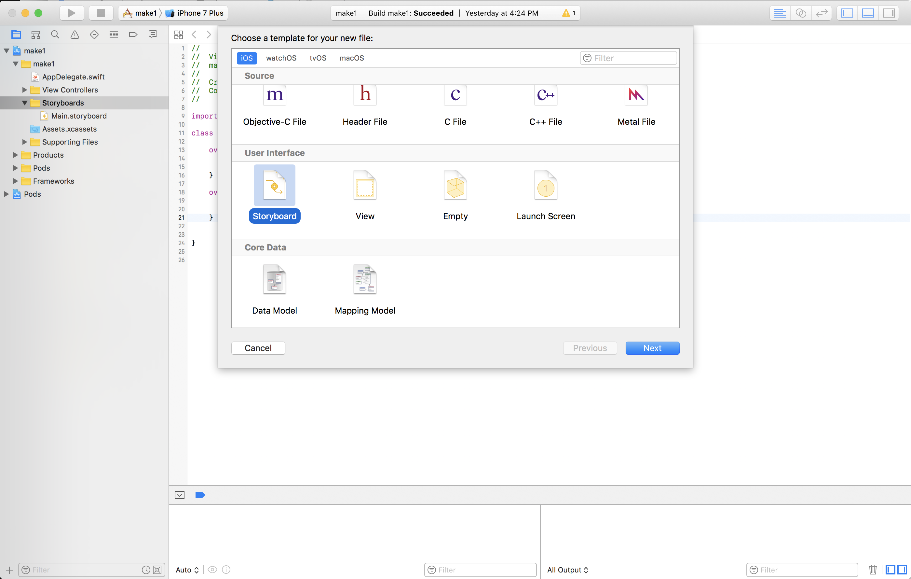

Name it `Login.storyboard` and make sure that you're creating the `.storyboard` file in the _Storyboards_ folder:

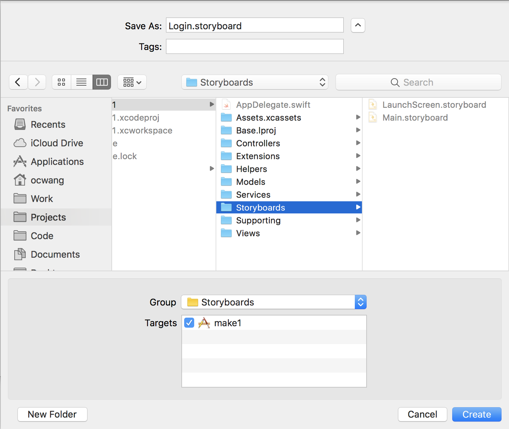

Keep your project navigator organized by keeping similar files in the same group:

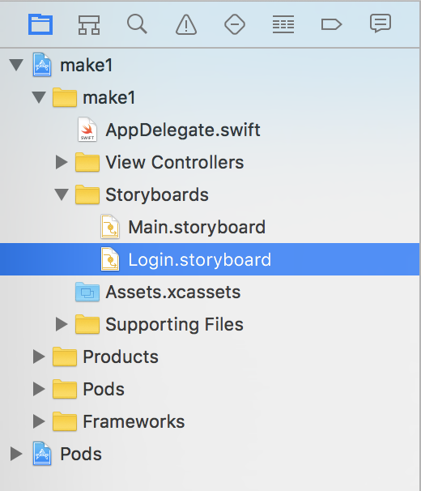

## Why multiple storyboards?

Separating the main flows of your app into specific, well-defined storyboards allows you keep your storyboards small and organized. Xcode provides many tools to make it easy for us to do this.

Imagine if you had 30 view controllers in a single storyboard! Not only would it be tough to find view controllers that you're looking for, the file would be extremely slow to open because of it's size. Version control and working with other developers would also be a nightmare. As a general rule, keep your storyboards small and defined to a single flow of your app.

# Setting up the Login View Controller

When a new user opens the app for the first time, we want them to see the login screen:

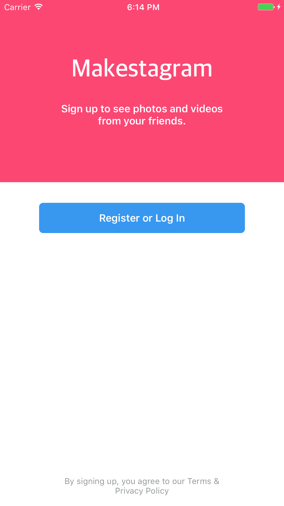

To begin, we'll need to create a new view controller within the `Login.storyboard`.

> [action]
>
> 1. Navigate to the Login storyboard and open the object library.
> 2. Drag a new view controller from the object library onto your Login storyboard.
> 3. Click on the new view controller and open the attributes inspector.
> 4. Find the checkbox for `Is Initial View Controller` and make sure the option is selected. You should see an arrow pointing to the left side of the view controller after you've completed this step.
>
> 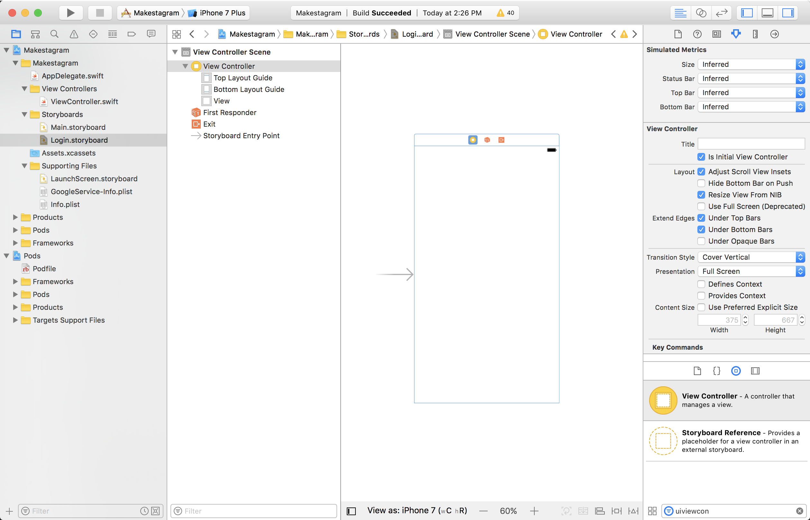

## What's the initial view controller?

The initial view controller represents the starting point for a specific storyboard file. This usually is the first screen that is presented to the user within a storyboard.

`UIStoryboard` provides you with a method to create a new instance of the initial view controller.

# Connecting the Login View Controller to code

So far we've created a new view controller within interface builder, but we haven't connected it to code. Create a new `LoginViewController.swift` class:

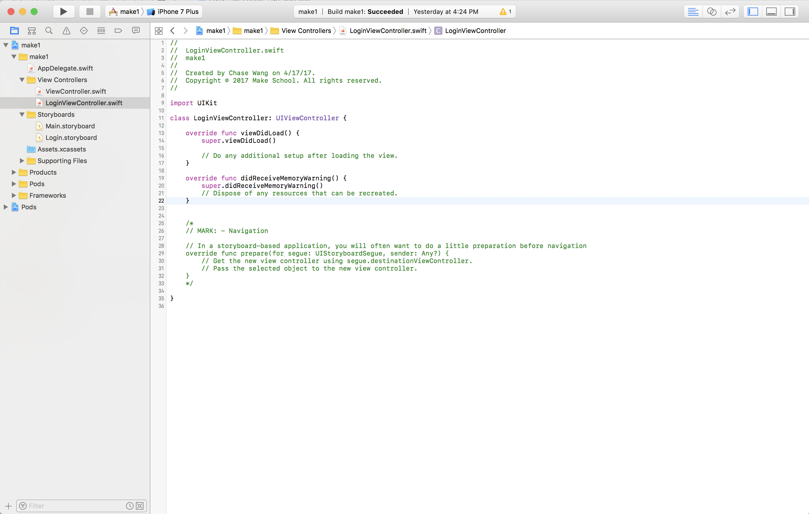

Navigate back to the login storyboard, select the view controller we've added and open the class inspector. Under the `Custom Class` section title, set the `Class` property to `LoginViewController`.

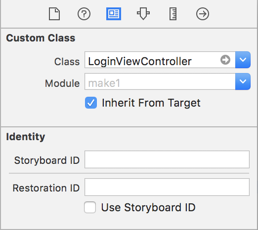

# Testing progress thus far

It's good practice to test as you add new code. Let's test our code to see if they work as we expect them to. To do this, we'll need some way of verifying the `LoginViewController` is the first screen that is shown.

An easy trick we can use, is changing the background color of our `LoginViewController` to a random color such as orange. The orange is bright and out of place, and will allow us easily to confirm our code is working.

Navigate to the Login storyboard, click on the `LoginViewController`'s view. In order to change the background color, you need to make sure you've selected the `view` of the `LoginViewController`.

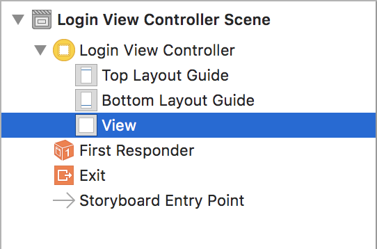

Next, we'll change the background color from white to orange in the property inspector:

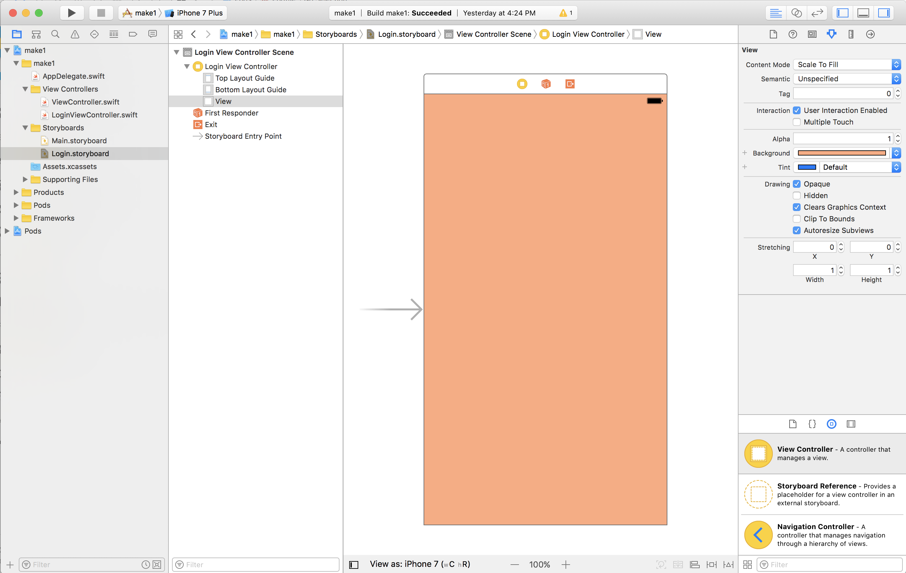

When we run the app, we'll expect to see a empty orange screen.

Run the app. What happens?

# Setting the root view controller

The view controller screen we land on is white, not orange. What happened?

This is because, by default, the initial view controller of the `Main.storyboard` will be shown to users when the app is launched. This property is defined in our `Info.plist` under `Main storyboard file base name`.

Instead of changing our `Info.plist` directly, we'll add code so when the app first launches it'll direct new users to our `Login.storyboard`. We'll need to add our logic with the `AppDelegate`'s life cycle method `application(_:didFinishLaunchingWithOptions:)`.

We'll learn about the `AppDelegate` next.

# What is the App Delegate?

The App Delegate is a _singleton_ object that handles important events in the life cycle of your app. This includes:

- executing your app's startup code
- handling app lifecycle events such as transitioning to the background or termination
- receiving push notifications or deep linking

## Changing the App Delegate's Root View Controller

To direct users to the correct storyboard, we'll add code into our `AppDelegate` method `application(_:didFinishLaunchingWithOptions:)`. This method is performed at launch time and can be used for additional setup before the app has launched. Add the following code in your `AppDelegate`:

```
func application(_ application: UIApplication, didFinishLaunchingWithOptions launchOptions: [UIApplicationLaunchOptionsKey: Any]?) -> Bool {
    FirebaseApp.configure()

    // 1
    let storyboard = UIStoryboard(name: "Login", bundle: .main)

    // 2
    if let initialViewController = storyboard.instantiateInitialViewController() {
        // 3
        window?.rootViewController = initialViewController
        // 4
        window?.makeKeyAndVisible()
    }

    return true
}
```

As our app launches, we redirect the user to the `Login.storyboard`'s initial view controller:

1. Create a instance of our Login storyboard that has `LoginViewController` set as its initial view controller
1. Check if the storyboard has a initial view controller set
1. If the storyboard's initial view controller exists, set it to the window's `rootViewController` property
1. Position the window above any other existing windows

Most of the steps should be self-explanatory except the concept of windows. In an iOS app, an `UIWindow` has the responsibilities of:

- displaying your app's visible content
- deliver touch events to your views
- handle orientation changes

Each `UIWindow` has a single `rootViewController` that contains views that are being displayed to the user. When you set a root view controller, the window adds the root view controller's view to the window and sizes it appropriately.

After making our changes to `AppDelegate`, run the app again! Confirm that the view controller's view is now orange. If it isn't orange, look over the previous steps to make sure you haven't missed anything.

We've successfully added logic in our `AppDelegate` to change our app window's root view controller. Next, we'll move on to adding some UI elements to allow the user to begin signing up and/or logging in.

# Adding UI to the Login Screen

Let's review the design our login screen:


Most of the heavy lifting will be done by a pre-made UI component created by FirebaseUI.

## Creating a Header View

Before we start, revert the background color of the `LoginViewController` back to white. Next we'll work on creating a header view that will display the name of our app and a short tagline for what our app does.

Drag a new view from the object library onto the view controller and set it's background color to `#FF6A95`:

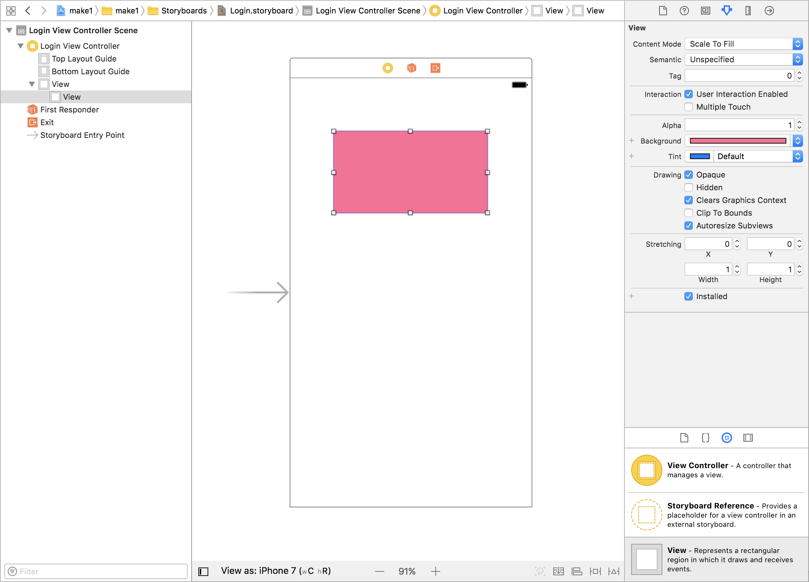

You can set the background color to a hex value clicking on the background color, navigating to the `Color Sliders` tab:

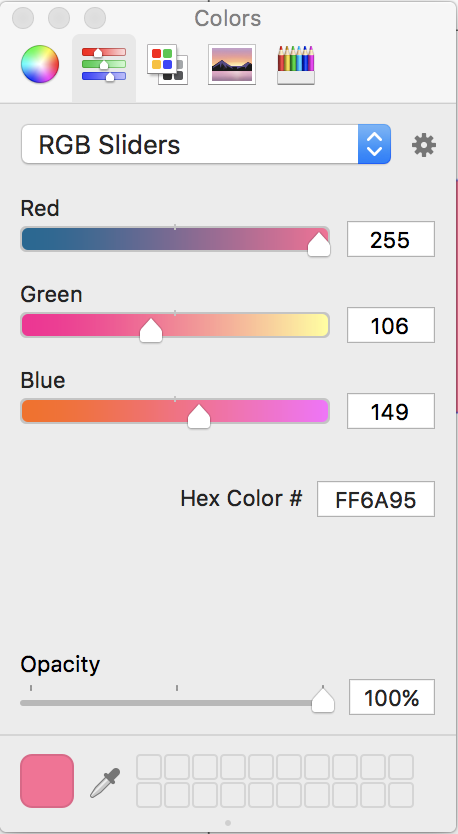

Set the following constraints for the header view:

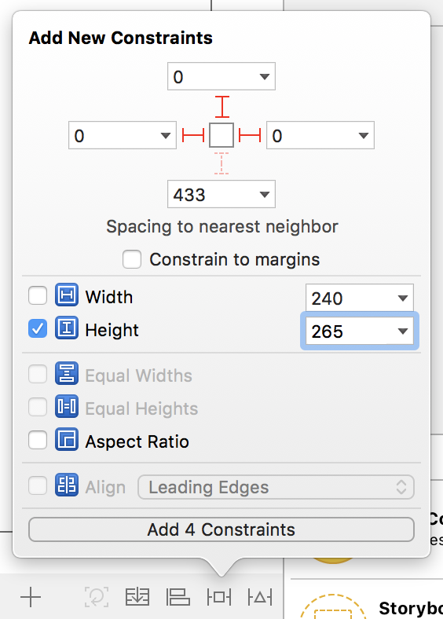

Make sure that the `Constraint to Margin` checkbox is unchecked and that the top constraint is relative to the view, not the top layout guide.

## Adding a Title and Tagline

Drag and drop two `UILabels` from the object library onto the header view.

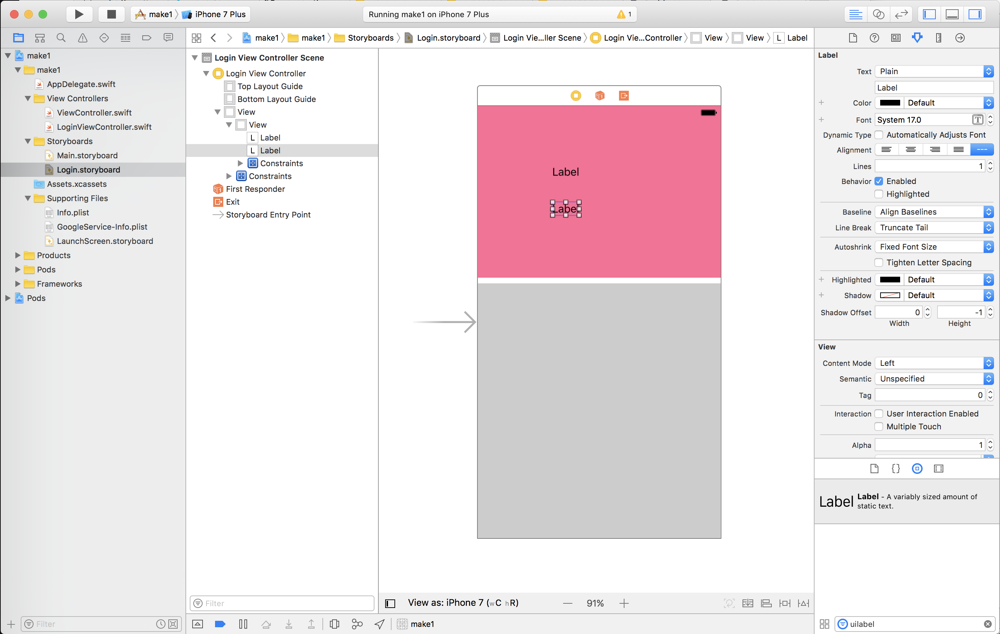

Change the text of the title label to:

- Title: Makestagram
- Font: Apple SD Gothic Neo, Bold 36
- Color: White
- Text Alignment: Center

After changing the font, you might need to resize the label to see the full title:

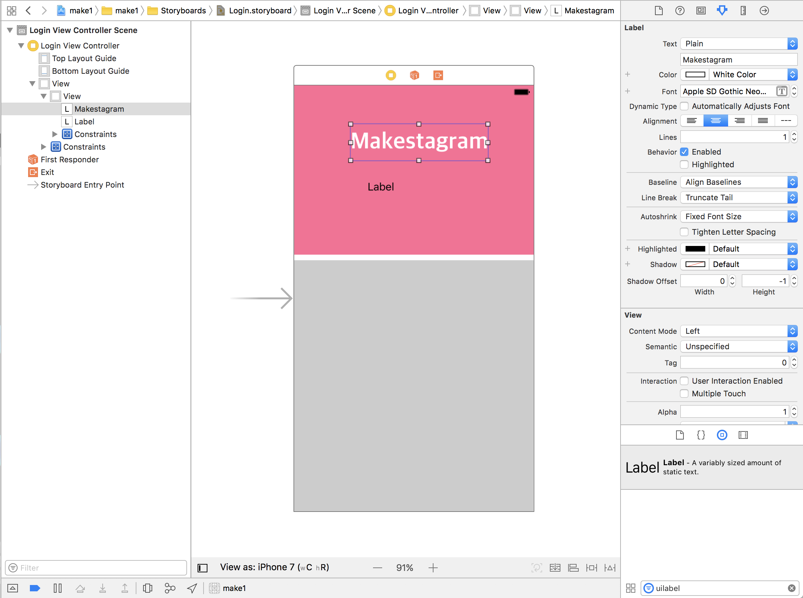

Next change the tagline label to:

- Text: Sign up to see photos and videos from your friends.
- Font: System, Semibold 15
- Color: White
- Text Alignment: Center
- Number of Lines: 2

You'll also need to resize the label to see the full text after changing it's properties:

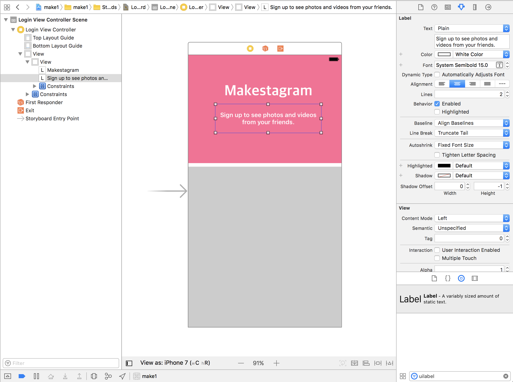

## Positioning the Header Labels

We'll position our labels using a vertical stack view. Select both the title and tagline labels and click the `Embed In Stack` button.

When you add both labels to your stack view, both labels might disappear off the screen. To fix it so that we can see our stack view, set the X and Y coordinates of the stack view to 0.

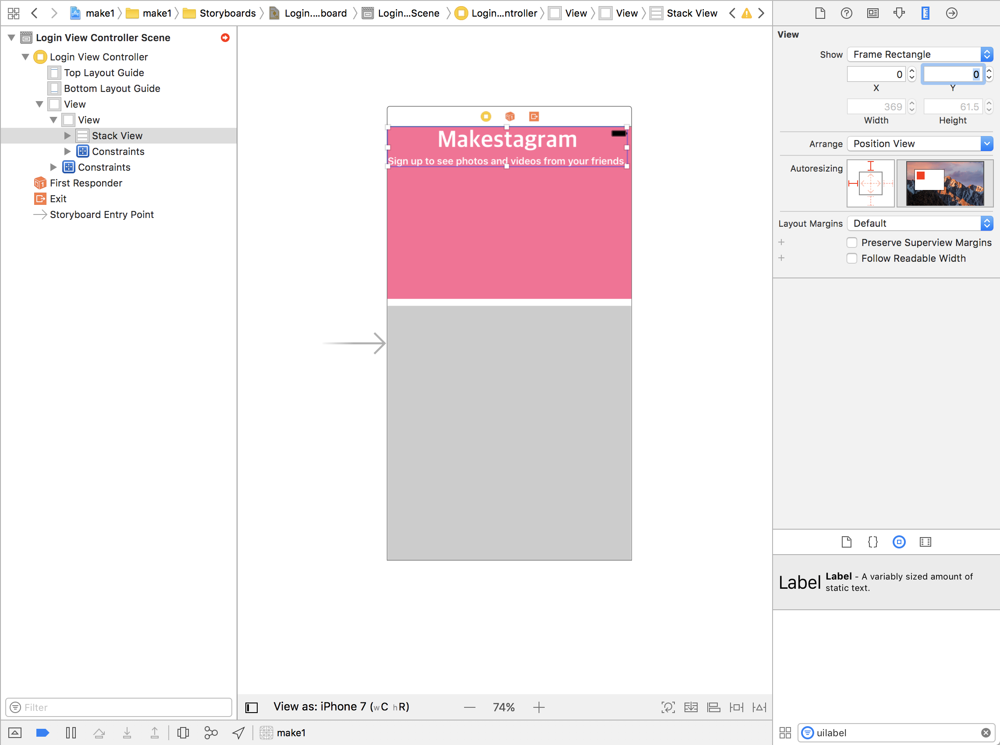

With the stack view selected, open the property inspector and change the `Spacing` property to 25.

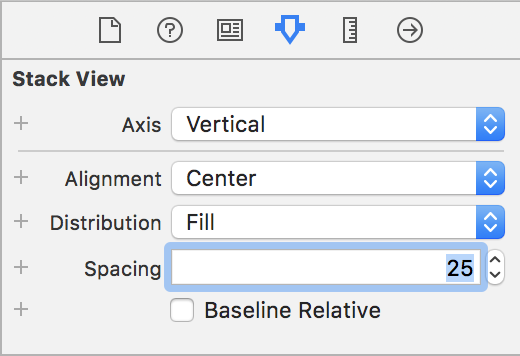

To center our stack view in the center of our header view, we'll select the stack view and center it horizontally and vertically within the header view.

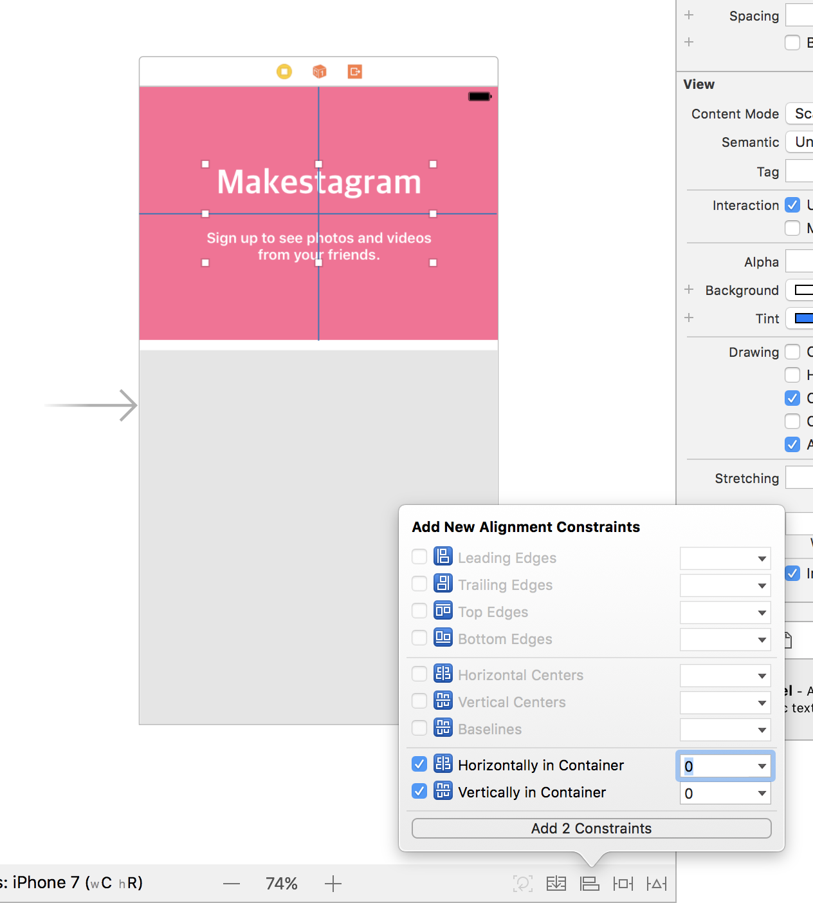

Last, we'll format our stack view's size ratio. Select the tagline label and set a fixed width of 240. With these changes, your header view should look like the following:

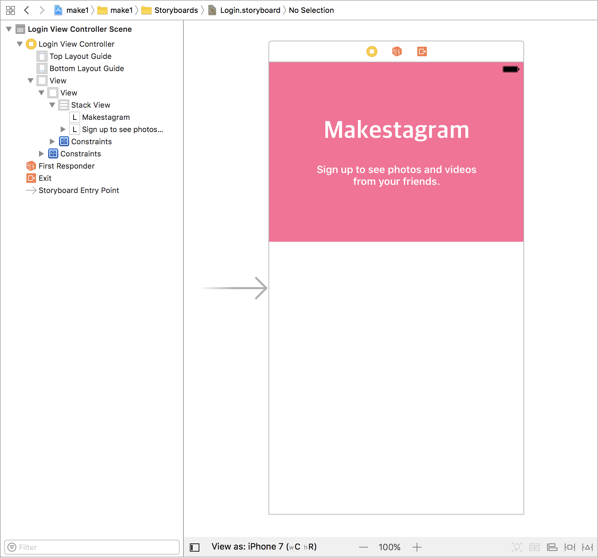

## Adding a Login Button

To finish the designs for our Login screen, we'll add a button that hands-off authentication to FirebaseUI. Drag an `UIButton` from the object library right under your header view. Change the following properties of the button:

- Button Type: Custom
- Button Title: Register or Log In
- Font: System, Semibold 15
- Text Color: White
- Background Color: `#3897F0`

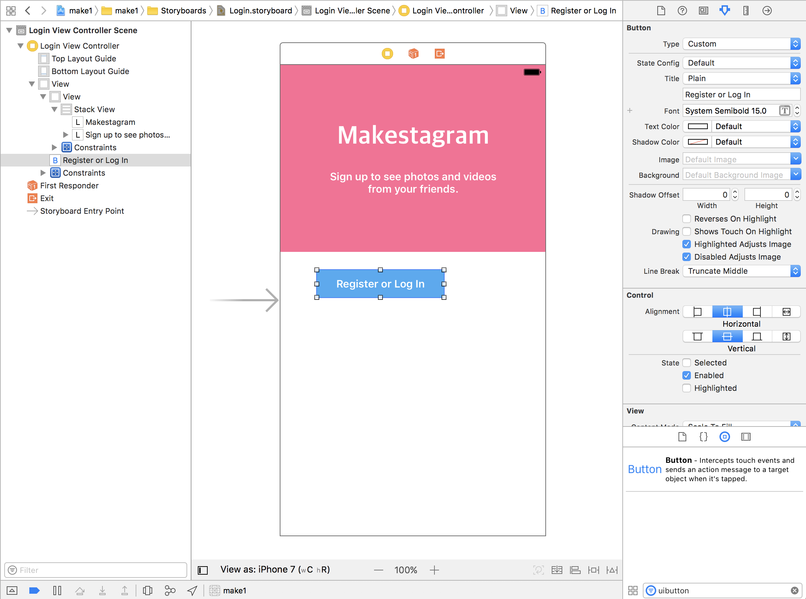

To finish up our login button, add the following constraints:

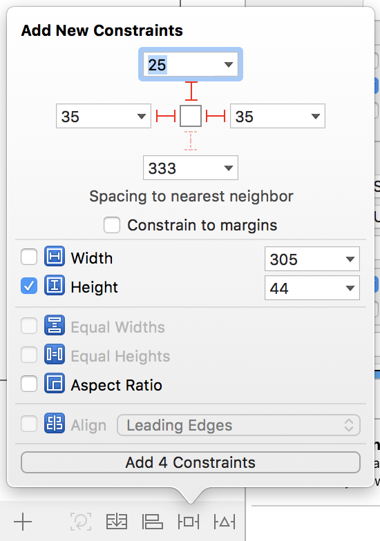

Great! We've added all of the UI elements for our login screen. Your `Login.storyboard` should look like the following:

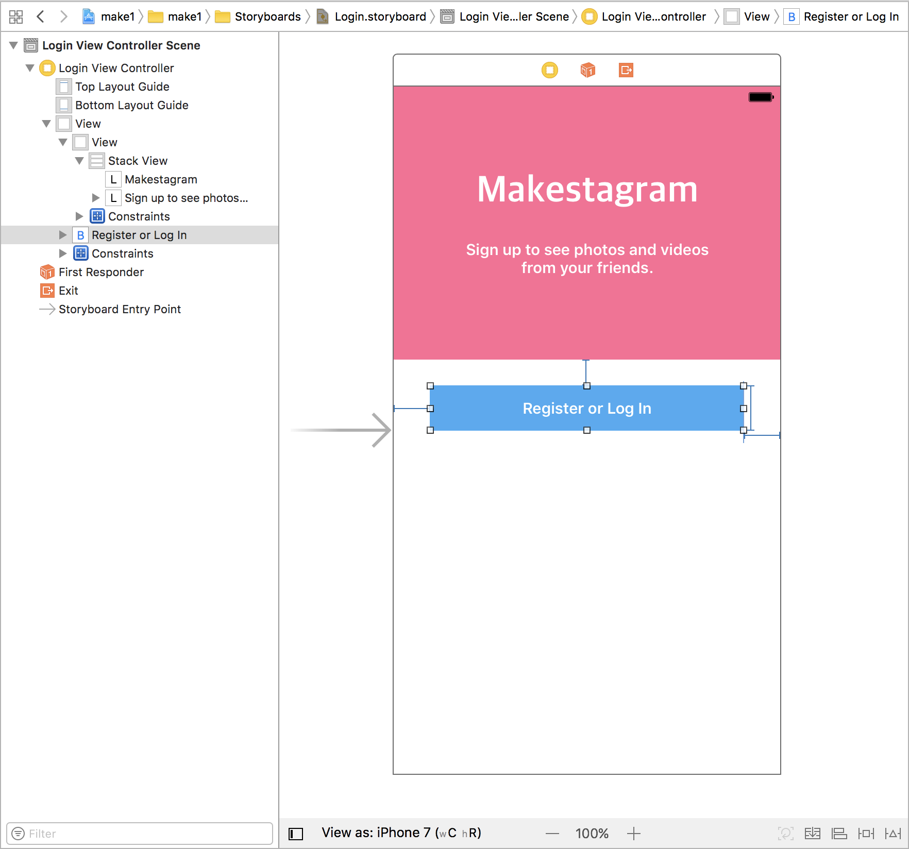

Run the app to test that we haven't introduced any bugs and everything is working as expected.

# Connecting our IBOutlets

Our login view controller looks great! However, if you'd like our app to be more than just looks, we'll need to connect our UI elements to our corresponding `LoginViewController.swift`.

Keep your `Login.storyboard` file open in your main editor and open the `LoginViewController.swift` file in your assistant editor. One quick way to do this, is holding down the option button and clicking on the file you want to open in the assistant editor.

When you have both your `Login.storyboard` and `LoginViewController.swift` files open side by side:

1. create an IBOutlet for the login button
1. add an IBAction for tapping the login button
1. place a print statement for tapping the login button

Your code should look like the following:

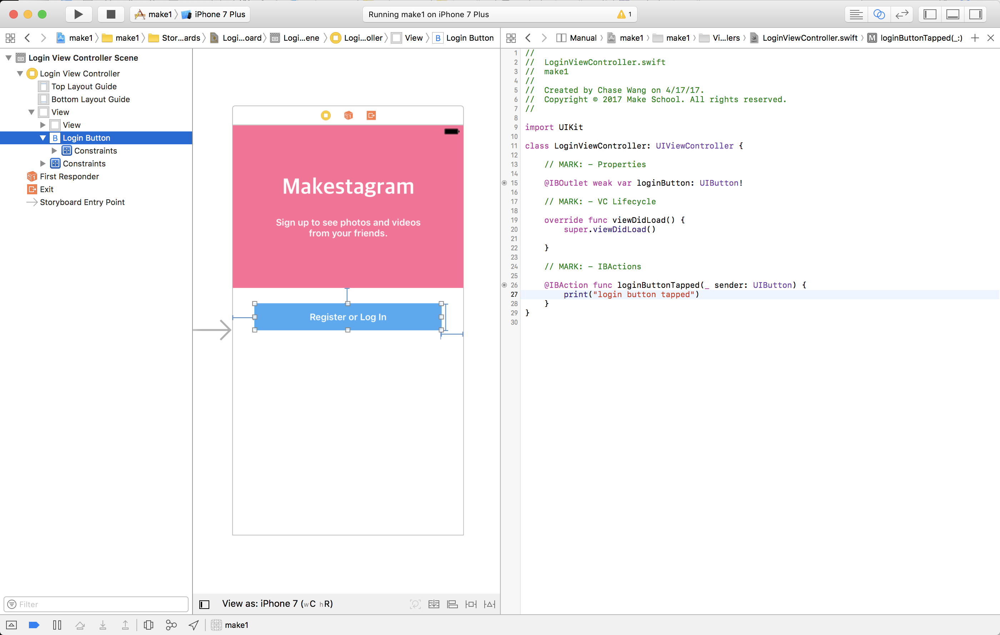

Let's test our code is working. You'll notice, every time we finish a major step, we run our code to make sure our code is working as expected and we haven't introduced any new bugs.

Run the app and tap the login button. If the print statement shows up in the debug console, you've successfully setup your login screen.

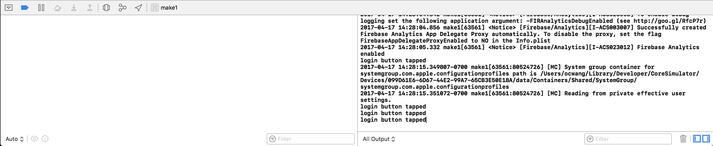

# Conclusion

So far, we've review many basic concepts in the previous tutorials as well as introduced some new ones. We've done the following:

- created a new storyboard
- set our window's root view controller
- implemented our login screen design

In the next section, we'll move on to using FirebaseUI to handle the functionality for authentication.
