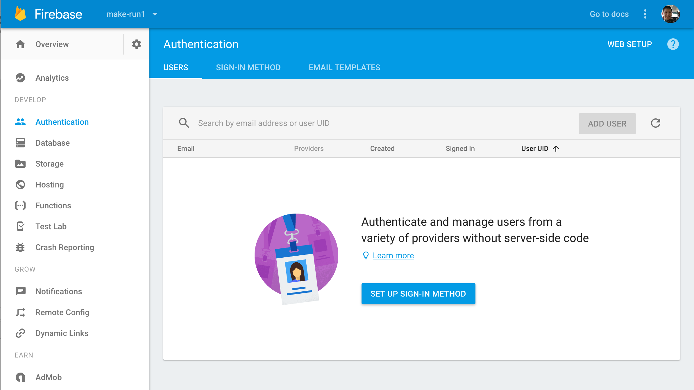
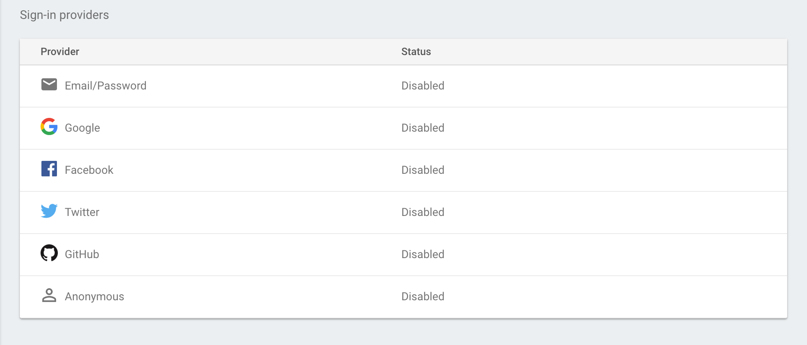
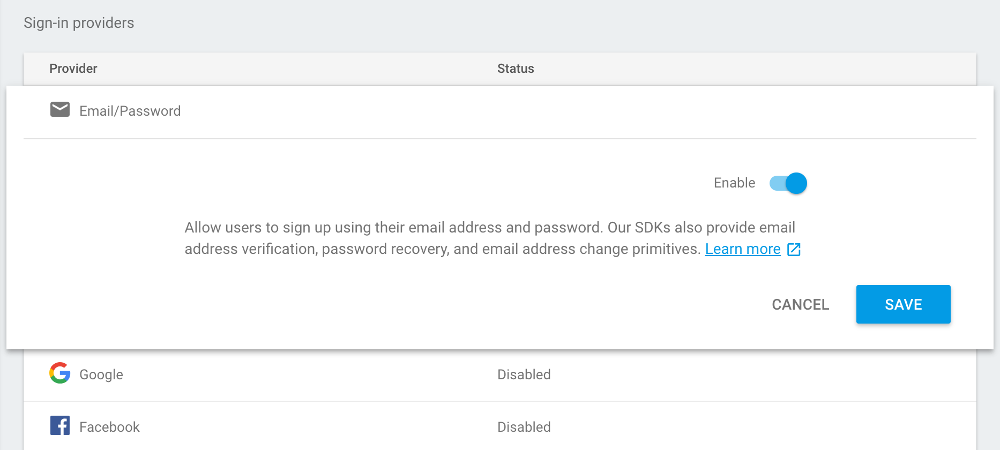
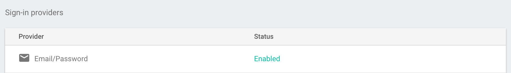
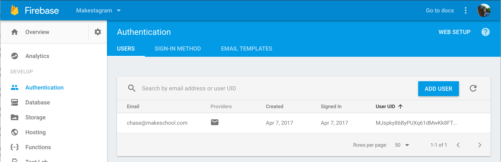

Up to this point, we've created and hooked up the UI elements for the initial login screen in our authentication process. In this section, we'll look at authenticating users through FirebaseAuth and FirebaseUI.

FirebaseUI is a pre-built UI component made by the Firebase team to help us easily handle sign up and log in functionality. It was made as an quick and easy, drop-in UI component for setting up authentication.

FirebaseAuth is an SDK that lets developers easily authenticate users through Firebase. FirebaseAuth will abstract the handling and storing of sensitive information that usually comes with implementing authentication.

Together, these libraries will make it extremely easy for us to setup and implement the authentication process for our Makestagram app. Keep in mind, it's also possible to implement your own custom authentication flow.

# Setting up FirebaseUI

Import the FirebaseAuth and FirebaseAuthUI library to `LoginViewController.swift` right below `import UIKit`. Whenever we want to use a third-party library that we've downloaded from Cocoapods, we'll need to import it to use it in our code.

```
import UIKit
import FirebaseAuth
import FirebaseAuthUI

// ...
```

Now that we can access the `FirebaseAuthUI` library, our next focus will be to hand-off the authentication process to FirebaseUI.

## Enabling Firebase Sign-in Providers

To use FirebaseUI to manage our user accounts, we'll need to tell Firebase which sign-in methods it accepts. Open your Firebase project in your browser and navigate to the Authentication tab. Click the `SET UP SIGN-IN METHOD` button and enable the email/password sign-in provider.



You should see a list of _Sign-In Providers_ that are all currently disabled:



Click on and enable the Email/Password provider:



After enabling the Email/Password provider, your have a status of `Enabled`:



Now that we've enabled our Email/Password provider, we can switch back to Xcode to continue implementing authentication.

## Using FirebaseUI's AuthViewController

Within FirebaseUI, we'll be using the AuthViewController. To implement the `AuthViewController`, we'll need to

1. access the `FUIAuth` default auth UI singleton
1. set the `FUIAuth`'s singleton's delegate
1. present the auth view controller
1. implement `FUIAuthDelegate` protocol

Within our `LoginViewController`, add the following to our `loginButtonTapped(sender:)` method:

```
// MARK: - IBActions

@IBAction func loginButtonTapped(_ sender: UIButton) {
    // 1
    guard let authUI = FUIAuth.defaultAuthUI()
        else { return }

    // 2
    authUI.delegate = self

    // 3
    let authViewController = authUI.authViewController()
    present(authViewController, animated: true)
}
```

You'll notice each line of code corresponds closely to each of the steps we previously defined:

1. access the `FUIAuth` default auth UI singleton
1. set `FUIAuth`'s singleton delegate
1. present the auth view controller

When `authViewController` is presented, Firebase presents its own UI to handle signing up or logging in the user. Keep in mind that Firebase's authViewController can also be customized to include different types of login. (i.e. Facebook, Google, Github)

However, we haven't finished all 4 steps we previously defined and that's why Xcode is yelling at us with a compiler error. In step 2, we set our `LoginViewController` to be a delegate of `authUI`, however our `LoginViewController` hasn't conformed to the `FUIAuthDelegate` protocol. Let's do that now!

After the closing curly brace of the `LoginViewController` class, add the following extension:

```
class LoginViewController: UIViewController {
    // ...
}

extension LoginViewController: FUIAuthDelegate {
    func authUI(_ authUI: FUIAuth, didSignInWith user: User?, error: Error?) {
        print("handle user signup / login")
    }
}
```

We've implemented the beginnings of our authentication logic.

Stop and run the app. Sign up with a new user account. Go back to the authentication tab in your Firebase dashboard and verify that you've created a new user. If everything goes well you should see the following in your Firebase project:



You can find a list of all users in the `users` tab of your Firebase project authentication tab.

## Basic Error Handling in FUIAuthDelegate

As you'll notice through running the app, each time you sign up or log into an existing accounts, the `FUIAuthDelegate` method `authUI(_:didSignInWith:error:)` will be called. This method's parameters are the FirebaseAuth user that was authenticated and/or an error that occurred. Let's implement some basic error handling that will let us know if something went wrong.

> [action]
Modify your `FUIAuthDelegate` as follows:
>
```
extension LoginViewController: FUIAuthDelegate {
    func authUI(_ authUI: FUIAuth, didSignInWith user: User?, error: Error?) {
        if let error = error {
            assertionFailure("Error signing in: \(error.localizedDescription)")
            return
        }
>
        print("handle user signup / login")
    }
}
```

Now, whenever there's an error while we're in development, the app will crash with a formatted error message of what went wrong. In production code, assertions are ignored and are a nice tool to let us know if something's going unexpectedly while we're building our apps.

There are much more elegant solutions for error handling, but for the sake of complexity we'll keep our error handling simple.

## The Firebase User

Another important parameter is the `User` object as defined in `FirebaseAuth` class. Each `User` represents an authenticated user within our Firebase dashboard. There's a few bits of information stored within the `User` object, but the most important is the user's UID.

## What is an UID?

UID is an acronym for unique identifier and represents a way to uniquely identify each of our users. When a user creates an account with FirebaseAuth, Firebase will assign each new user a unique string for that user account. We don't have to worry about creating the string ourselves, Firebase will manage that for us.

## Handling Future Namespace Conflicts

`User` is a very commonly used class name in most iOS projects. Because `FirebaseAuth` has also named their class `User`, we need to be mindful of namespace conflicts. In other words, if multiple `User` classes exist, Xcode won't know which one we're referring to in our code.

For example, if we were to create our own `User.swift` class, Xcode will have a namespace conflict and confuse our project-defined `Makestagram.User` and the `FirebaseAuth.User` class.

This will become confusing when we're coding. If you see a property of type `User`, we won't immediately know whether it's referring to the type of `Makestagram.User` or `FirebaseAuth.User`.

There's two ways to handle this problem. The first is to refer to the full namespace of the `User` type. In our `FUIAuthDelegate` method, we could refer to the full namespace of the `User`:

```
extension LoginViewController: FUIAuthDelegate {
    func authUI(_ authUI: FUIAuth, didSignInWith user: FirebaseAuth.User?, error: Error?) {
        // ...
    }
}
```

Notice we changed the argument type of `User` to `FirebaseAuth.User`. This will prevent namespace conflicts by being specific to which `User` type we're referring to in our code.

The second solution to make use of `FirebaseAuth.User` explicitly clear is to use a type alias. This means we'll create an alias namespace for an existing type. We can define a type alias with the following syntax:

```
typealias aliasName = existingType
```

Let's apply this to our current code. In our case, we'll change `FirebaseAuth.User` to `FIRUser`.

> [action]
At the top of your `LoginViewController.swift` file, add the following type alias:
>
```
typealias FIRUser = FirebaseAuth.User
>
class LoginViewController: UIViewController {
    // ...
}
```

Now we can use `FIRUser` to refer to the `FirebaseAuth.User` type. Let's change our delegate method to user our new type alias.

> [action]
In `LoginViewController`, change the `FUIAuthDelegate` delegate method definition to the following:
>
```
extension LoginViewController: FUIAuthDelegate {
    func authUI(_ authUI: FUIAuth, didSignInWith user: FIRUser?, error: Error?) {
        // ...
    }
}
```

From this point, we'll use `FIRUser` instead of `User` to refer to the `FirebaseAuth.User` type.

# Accessing the FIRUser Singleton

Whenever a user is authenticated with Firebase, the current `FIRUser` object can be accessed through the `FIRUser` singleton. This allows easy access to our `FIRUser` object anywhere within our app. The `FIRUser` singleton can be accessed with the following code snippet:

```
let user: FIRUser? = Auth.auth().currentUser
```

The type of the singleton is `FIRUser?`, which is an optional. This singleton can be nil when there is no user that is currently logged in with Firebase.

## What is a Singleton?

A singleton is similar to a global variable in that it provides an easy way for us to access a shared resource. Although singletons are used widely through the iOS ecosystem, we want to be careful and deliberate when creating our own singletons. Singletons are usually a sign of bad code architecture because they introduce tight coupling and hard-to-follow code.

# Handling User Signup / Login

After the user is authenticated, we'll want to redirect the user to a different view controller depending on whether they are a new user or an existing user:

1. **New users** will be sent to choose their username
1. **Existing users** will be sent to the home view controller that displays their feed

To determine if the user is a new user, we'll need to have some way to retrieve previous data about the user. Your first instinct might be to see if the FUIAuthDelegate returns any information that'll tell us if the user is a new or existing user. Unfortunately, it doesn't provide us much information outside of confirming that a new or existing user was authenticated by Firebase. FirebaseAuth doesn't help us much outside of providing an easy way to authenticate users. Instead we'll have to make use of the Firebase realtime database!
