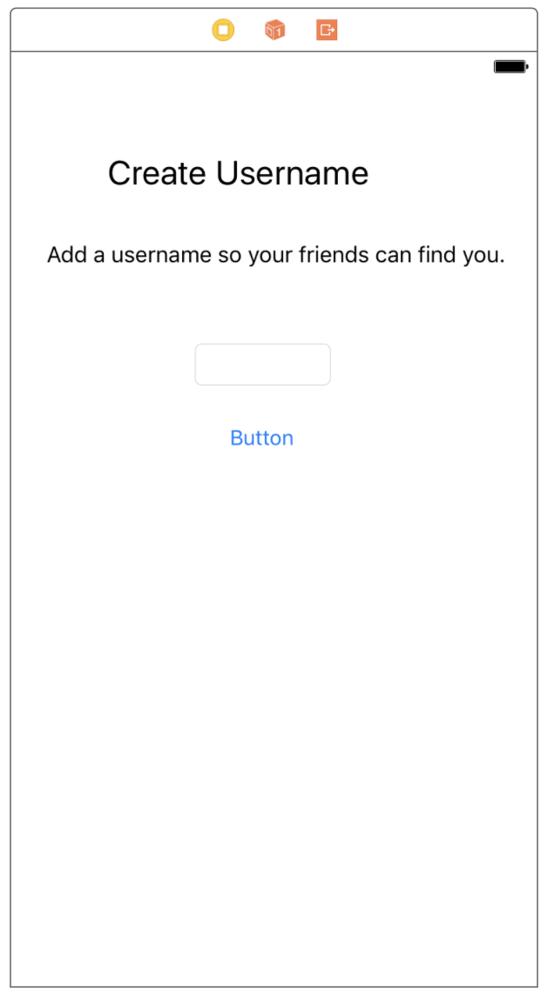

In the previous section, we've successfully setup some logic in our `LoginViewController` that is supposed to determines whether an authenticated user is a new or existing user. We uncovered through testing that it currently doesn't work. In this section, we'll look handle the login flow for new users which will fix our previous code.

# Writing Data to Firebase

We've previously learned how to read data from our database. To make use of our database, we'll need to learn how to write data to our database as well.

To write data to the database we'll need to implement the following steps:

1. Build a `FIRDatabaseReference` to the location you want to read from
1. Use `setValue` or `updateChildValues` method of `FIRDatabaseReference` to write data to the database

Let's walk through an example of writing to the database:

## Build a FIRDatabaseReference

Similar to reading, we'll need to import the appropriate library and create a reference to the location we want to write our data to:

```
let userRef = rootRef.child("users").child(user.uid)
```

## Writing Data to a FIRDatabaseReference Location

We can write data to our database with `setValue` or `updateChildValues` methods. The `setValue` will write the data we give it at the specfied location.

One important note is that using `setValue` will overwrite any data already stored at the specified location, including any child nodes.

The other method of writing data is using `updateChildValues`. The `updateChildValues` method will write data at at the specified location without overwrite other existing values or child nodes.

One capability of the `updateChildValues` is the ability to simiultaneously write specific children at multiple locations. We'll explore this concept later, but keep it in the back of your head for now.

Let's look at how we would implement `setValue`:

```
let userRef = rootRef.child("users").child(user.uid)
// 1
userRef.setValue(["username": "chase"])
```

1. We write the dictionary with the associated key `users/uid/username` to `chase`.

Now that we know how to write data to our database, we can move forward with handling our login flow for new users.

Let's implement the functionality for creating a new user inside our Firebase database.

# Writing a New User to our Database

Our current implementation of determining whether a user is new or returning doesn't work because our app never writes to the database the first time a `FIRUser` is created. We'll need to write code to store the user's data in our database the first time the user signs up.

As part of our login flow, new users will choose their username before creating a new user account. We'll implement `CreateUsernameViewController` to let users pick their username. `CreateUsernameViewController` will have the following design:


## Building CreateUsernameViewController

> [challenge]
At this point, you should be comfortable implementing a view controller in storyboard. Challenge yourself and see if you can implement the design above on your own!

Stop here! Don't continue until you've tried implementing `CreateUsernameViewController` on your own.

If you got stuck above or just want to review your solution, we'll walk through the process step by step next. If you feel confident in your code, feel free to skip ahead to the next section.

1. Open `Login.storyboard` and drag a new view controller into the storyboard from the object library.
1. Add two new `UILabel`s onto the new view controller. 
1. Format each label respectively:
>
```
// Title Label
Text: Create Username
Font: System 24
Alignment: Center
Color: Black
>
// Subtitle Label
Text: Add a username so your friends can find you.
Font: System 16
Alignment: Center
Color: Black
Number of Lines: 0
```
>
Don't worry about constraints yet, we'll use a stack view to position our views later.

1. Add a `UITextField` and `UIButton` from the object library: 
1. Format both the `UITextField` and `UIButton`:
>
```
// Username Text Field
Placeholder Text: Username
Background Color: #FAFAFA
>
// Next Button
Type: Custom
Background Color: #61A8ED
Title: Next
Title Font: System Semibold 15
```

1. Select all of the subviews that we've added onto our view controller. You can select all by clicking inside the view controller and dragging a box around all elements within: 
After all subviews are selected, add them to a stack view by clicking the `Embed In Stack` icon. All subviews we've added onto the view controller should now be inside the stack: 

1. Select the stack view and format it with the following constraints: 

1. Keep the stack view selected and open the _Attributes Inspector_. Update the spacing between items to 18: 

1. Update the formatting for both `UITextField` and `UIButton` with the following constraints: 

Your final `CreateUsernameViewController` should look like this: 

Remember, to finish creating our view controller we'll need to create a corresponding source file.

> [action]
Create a new `.swift` file in the `Controllers` folder called `CreateUsernameViewController.swift`:
>
```
import UIKit
>
class CreateUsernameViewController: UIViewController {
    // ...
}
```

After creating the source file, we'll need to set the class of our `CreateUsernameViewController` in storyboard.

> [action]
Open `Login.storyboard` and navigate to the _Identity Inspector_. Set the Custom Class to `CreateUsernameViewController`:
>


You should now have a new view controller in your `Login.storyboard` and a `CreateUsernameViewController.swift` file. We'll want to open both of these side by side to hook up some new IBOutlet and IBAction for the `UITextField` and `UIButton`. When you're finished, your storyboard and code should look like:


## Segueing to our New View Controller

Before we can implement the logic for when the next button is tapped, we need to first make the Login View Controller segue to the Create Username View Controller when a new user is created. To do that, we'll need to make sure our `LoginViewController` is in a `UINavigationController`.

> [action]
Open the login storyboard and select the `LoginViewController`. With the view controller selected, go to the `Editor` menu in the menu bar and select Embed In > Navigation Controller.
>


Your storyboard should now look like the following:


Before we move on, we won't need the navigation bar that a `UINavigationController` usually provides. Select the navigation controller and go to the property inspector. Under `Navigation Controller`, make sure you uncheck `Shows Navigation Bar` checkbox.


Next, add the segue between view controllers.

> [action]
Open `Login.storyboard` and ctrl-drag from `LoginViewController` to `CreateUsernameViewController`. When prompted to select the segue type, select `show`. Set the `Identifier` in the _Attributes Inspector_ to `toCreateUsername`:
>

>
After creating the segue in storyboard, we'll need to perform the segue in code. Add the following line to your `LoginViewController.swift` file:
>
    extension LoginViewController: FUIAuthDelegate {
        func authUI(_ authUI: FUIAuth, didSignInWith user: FIRUser?, error: Error?) {
            // ...
>
            userRef.observeSingleEvent(of: .value, with: { [unowned self] (snapshot) in
                if let user = User(snapshot: snapshot) {
                    print("Welcome back, \(user.username).")
                } else {
                    self.performSegue(withIdentifier: "toCreateUsername", sender: self)
                }
            })
        }
    }
}
```

Now when a new user signs up, they'll be redirected to choose their username. Run the app and make sure our code works up to this point before moving onto the next step of implementing the code for writing a new user to the database.

## Implementing Next Button Tapped

Let's review the current code in `CreateUsernameViewController` for `nextButtonTapped`:

```
@IBAction func nextButtonTapped(_ sender: UIButton) {
    // create user account here
}
```

When a user taps the next button we want the following to happen:

1. Get a reference to the current user that's logged into Firebase. We'll need the user uid to create the relative path to write to.
1. Check that the user has entered a username in the username text field.
1. Create a reference to the location we want to store the data
1. Create a dictionary of the data we want to store in our database
1. Write the dictionary at the specified location
1. Handle the success or failure of writing to the database

First we'll import the necessary libraries.

> [action]
Add the following to the top of `CreateUsernameViewController`:
>
```
import UIKit
import FirebaseAuth
import FirebaseDatabase
```

Then modify the `nextButtonTapped(_:)` of the `CreateUsernameViewController.swift` as follows:

```
@IBAction func nextButtonTapped(_ sender: UIButton) {
    // 1
    guard let firUser = FIRAuth.auth()?.currentUser,
        let username = usernameTextField.text,
        !username.isEmpty else { return }

    // 2
    let userAttrs = ["username": username]

    // 3
    let ref = FIRDatabase.database().reference().child("users").child(firUser.uid)

    // 4
    ref.setValue(userAttrs) { (error, ref) in
        if let error = error {
            assertionFailure(error.localizedDescription)
            return
        }

        // 5
        ref.observeSingleEvent(of: .value, with: { (snapshot) in
            let user = User(snapshot: snapshot)

            // handle newly created user here
        })
    }
}
```

Let's walk through the code above:

1. First we guard to check that a `FIRUser` is logged in and that the user has provided a username in the text field.
1. We create a dictionary to store the username the user has provided inside our database
1. We specify a relative path for the location of where we want to store our data
1. We write the data we want to store at the location we provided in step 3
1. We read the user we just wrote to the database and create a user from the snapshot

Now whenever an user is created, a user JSON object will also be created for them within our database.

# Testing our Code

Run the app and the code we have so far. If you want to reuse previous emails and passwords, you'll have to go into the authentication tab of your Firebase dashboard and delete the users you previously authenticated with:


Now, whenever you sign up with a user email you should be redirect to the `CreateUsernameViewController`. When you input a username and click the next button, you should also be able to verify that a new user has been written to the database:


Now, if we try logging in with the same existing user, you'll notice that our `LoginViewController` logic for the `FUIAuthDelegate` works correctly as well. Notice in the print statement in the debug console:


Now that our code is running, let's take a moment to refactor our current code.

You'll notice a pattern where we're writing code that works and then refactoring after we've implemented the quick and dirty solution. This two-step process allows us to quickly figure out how to get our code to work, without having our codebase turn into spaghetti.

# Service Classes

To refactor our code, we're going to refactor all code that interfaces with Firebase into a service layer. This does two things:

1. Keeps our code clean and decoupled by removing networking code from our view controllers
1. Allows us to reuse the method in our service classes from all view controllers

One reason why decoupling our networking code into a service layer is helpful is that in the case we decide to switch to another backend, we'll only need to re-write our service layer. We won't need to change our view controllers!

A huge benefit of good code architecture is being able to easily change your code without having to change every file in your project!

## What is a Service Layer?

A service layer helps you decouple your view controllers from your networking logic. We want to remove the networking code, such as reading and writing to our database, so that we can reuse the same code and access our networking logic from other view controllers.

> [action]
Let's create a new struct called `UserService.swift`. We'll put all our backend methods related to our user in here.
>
```
import Foundation
>
struct UserService {
    // insert user-related networking code here
}
```

Make sure you place all your service structs in the `Services` directory and create a new `Services` group in your project navigator:


Next let's create a static method that encapsulates the functionality for creating an user on Firebase.

```
import Foundation
import FirebaseAuth.FIRUser
import FirebaseDatabase

struct UserService {
    static func create(_ firUser: FIRUser, username: String, completion: @escaping (User?) -> Void) {
        let userAttrs = ["username": username]

        let ref = FIRDatabase.database().reference().child("users").child(firUser.uid)
        ref.setValue(userAttrs) { (error, ref) in
            if let error = error {
                assertionFailure(error.localizedDescription)
                return completion(nil)
            }

            ref.observeSingleEvent(of: .value, with: { (snapshot) in
                let user = User(snapshot: snapshot)
                completion(user)
            })
        }
    }
}
```

Here we remove the networking-related code of creating a new user in our `CreateUsernameViewController` and place it inside our service struct. The service struct will act as an intermediary for communicating between our app and Firebase.

Now let's go back to our `CreateUsernameViewController` and refactor the code to use our new service class.

> [action]
Modify `nextButtonTapped(_:)` to the following:
>
```
@IBAction func nextButtonTapped(_ sender: UIButton) {
    guard let firUser = FIRAuth.auth()?.currentUser,
        let username = usernameTextField.text,
        !username.isEmpty else { return }
>
    UserService.create(firUser, username: username) { (user) in
        guard let user = user else { return }
>
        print("Created new user: \(user.username)")
    }
}
```

Let's make sure everything works as expected. Run the app and create a new user to make sure our app is working as before.

# Changing the Root View Controller

After creating a new user in our `CreateUsernameViewController`, we want to let the user into the main storyboard of the app. To do that we need to change the current window's root view controller. Just as we initially set the root view controller in the `AppDelegate` to the intial view controller of the login storyboard, after the user has logged in, we need to change it back to the main storyboard.

> [action]
In your `nextButtonTapped(_:)` method, add the following:
>
```
UserService.create(firUser, username: username) { (user) in
    guard let _ = user else {
        return
    }
>
    let storyboard = UIStoryboard(name: "Main", bundle: .main)
>
    if let initialViewController = storyboard.instantiateInitialViewController() {
        self.view.window?.rootViewController = initialViewController
        self.view.window?.makeKeyAndVisible()
    }
}
```

Let's walk through the code we just added:

1. Create a new instance of our main storyboard
1. Check that the storyboard has an initial view controller
1. Get reference to the current window and set the `rootViewController` to the initial view controller

Let's run the app and test it out! You may need to delete the user JSON object in your database. If everything works correctly, you should be redirected to a blank white screen that is the initial view controller of the main storyboard.

## Handling Existing Users

Simliarly to our approach to new users, if we recieved an existing user on our login view controller, we also want to redirect them to the main storyboard by setting the window's root view controller.

Go ahead and add the following code to our `LoginViewController` in the `FUIAuthDelegate` method. This is the exact same code we used to set the root view controller after a new user was created.

```
// ...

userRef.observeSingleEvent(of: .value, with: { [unowned self] (snapshot) in
    if let _ = User(snapshot: snapshot) {
        let storyboard = UIStoryboard(name: "Main", bundle: .main)

        if let initialViewController = storyboard.instantiateInitialViewController() {
            self.view.window?.rootViewController = initialViewController
            self.view.window?.makeKeyAndVisible()
        }
    } else {
        self.performSegue(withIdentifier: "toCreateUsername", sender: self)
    }
})
```

# Creating a User singleton

Before moving on, we're going to create our own user singleton. Be wary of singletons. They're generally considered an anti-pattern and you want to only use them when it makes sense.

<!-- maybe explain more depth about why singletons are bad and when to use them -->

In our `User.swift` file, we're going to create a class variable like so:

```
// MARK: - Singleton

// 1
private static var _current: User?

// 2
static var current: User {
    // 3
    guard let currentUser = _current else {
        fatalError("Error: current user doesn't exist")
    }

    // 4
    return currentUser
}

// MARK: - Class Methods

// 5
static func setCurrent(_ user: User) {
    _current = user
}
```

Let's walk through the code we just created:

1. Create a private static variable to hold our current user. This method is private so it can't be access outside of this class.
1. Create a computed variable that only has a getter that can access the private _current variable.
1. Check that _current that is of type User? isn't nil. If _current is nil, and current is being read, the guard statement will crash with fatalError().
1. If _current isn't nil, it will be returned to the user.
1. Create a custom setter method to set the current user.

Now that we've created a User singleton, we need to make sure to set it once we receive the user from the database we set the singleton with our custom setter method. After the singleton is set, it will remain in memory for the rest of the app's lifecycle. It will be accessible from any view controller with the following code:

```
let user = User.current
```

Let's go ahead and make sure we set the current user.

> [action]
Open `LoginViewController` and add the following code in `authUI(_:didSignInWith:error:)`:
>
```
userRef.observeSingleEvent(of: .value, with: { [unowned self] (snapshot) in
    if let user = User(snapshot: snapshot) {
        User.setCurrent(user)
>
        let storyboard = UIStoryboard(name: "Main", bundle: .main)
        if let initialViewController = storyboard.instantiateInitialViewController() {
            self.view.window?.rootViewController = initialViewController
            self.view.window?.makeKeyAndVisible()
        }
    } else {
        self.performSegue(withIdentifier: "toCreateUsername", sender: self)
    }
})
```

Next update the following code in your `CreateUsernameViewController`:

```
UserService.create(firUser, username: username) { (user) in
    guard let user = user else {
        // handle error
        return
    }

    User.setCurrent(user)

    let storyboard = UIStoryboard(name: "Main", bundle: .main)
    if let initialViewController = storyboard.instantiateInitialViewController() {
        self.view.window?.rootViewController = initialViewController
        self.view.window?.makeKeyAndVisible()
    }
}
```

Congrats, now we successfully handle both new and existing users when they sign up or login in through our authentication system.

Run the app a couple times and try create new user accounts as well as logging into existing user accounts. Make sure that for each case, you're being taken through the correct user flow and redirected to the main storyboard.
