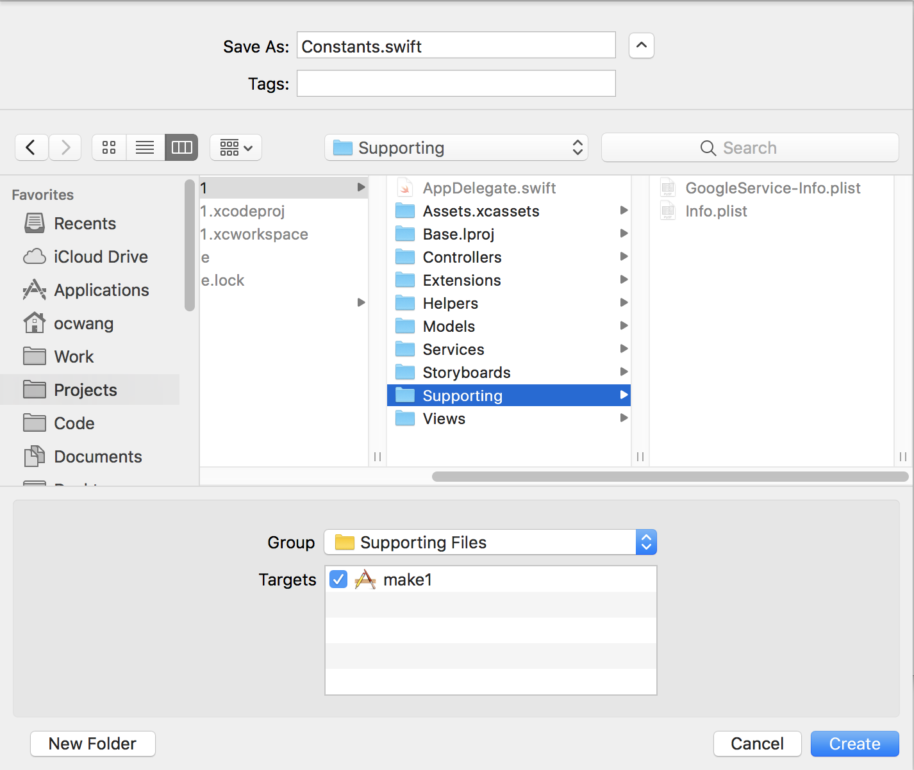
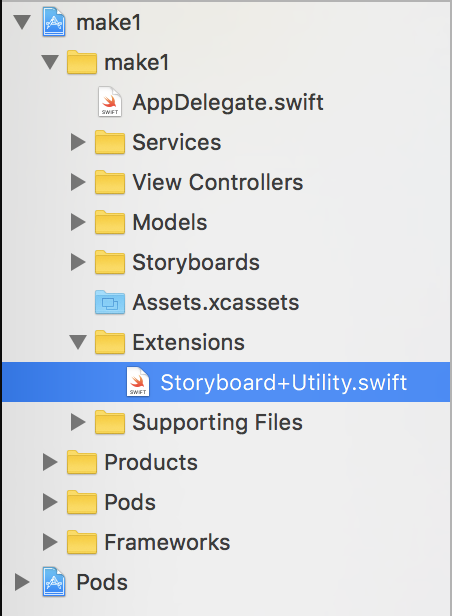

In the previous few sections we implemented our first feature: authentication and managing new/existing users. Before we move on to building out the main flow of the app, we'll pause to refactor our current code.

Refactoring and cleaning up your code will make it easier to build and debug your app in the future.

## Refactoring Show User

We refactored the method for creating a user to our `UserService` but we haven't refactored our `LoginViewController` to remove all networking logic as well. If you open your `LoginViewController`, you'll notice we still use create our `DatabaseReference` and read from our database in the `authUI(_:didSignInWith:error:)` method. Let's refactor that code to our `UserService`.

> [action]
>
Create a new class method in our `UserService` for reading a user from the database:
>
```
struct UserService {
    static func show(forUID uid: String, completion: @escaping (User?) -> Void) {
        let ref = Database.database().reference().child("users").child(uid)
        ref.observeSingleEvent(of: .value, with: { (snapshot) in
            guard let user = User(snapshot: snapshot) else {
                return completion(nil)
            }
>
            completion(user)
        })
    }
>
    // ...
}
```

Now we can remove the networking code in `LoginViewController`.

> [action]
Modify `authUI(_:didSignInWith:error:)` to the following:
>
```
func authUI(_ authUI: FUIAuth, didSignInWith user: FIRUser?, error: Error?) {
    // ...
>
    UserService.show(forUID: user.uid) { (user) in
        if let user = user {
            // handle existing user
            User.setCurrent(user)
>
            let storyboard = UIStoryboard(name: "Main", bundle: .main)
            if let initialViewController = storyboard.instantiateInitialViewController() {
                self.view.window?.rootViewController = initialViewController
                self.view.window?.makeKeyAndVisible()
            }
        } else {
            // handle new user
            self.performSegue(withIdentifier: "toCreateUsername", sender: self)
        }
    }
}
```

# Stringly-typed Constants

You may have noticed, several times within our code we use strings as identifiers for storyboards, segues, dictionary keys, etc. Although our code works, it's bad practice to have what's referred to as "stringly-typed" code because it's very error-prone to misspellings. If we do make a spelling error, the compiler won't be able to help us catch these bugs.

A common example you might run into is misspelling the name of a segue identifier in storyboard. Previously we set the segue identifer from our `LoginViewController` to the `CreateUsernameViewController` to be `toCreateUsername`.

It's a very common mistake to type:

```
self.performSegue(withIdentifier: "createUsername", sender: self)
```

Instead of:

```
self.performSegue(withIdentifier: "toCreateUsername", sender: self)
```

Two letters off! You can see how these mistakes are very easy to make. Let's take a look at the two most common ways of protecting ourselves from stringly-typed code: static constants and enums!

## Creating Constants

Let's start with the more basic of the two solutions: constants. We'll store our string identifiers as static constants so we can reuse them throughout the app without worrying about misspelling them. In fact, Xcode can now help us out with autocomplete!

> [action]
>
Create a new `Constants.swift` file in your Supporting directory.
>

>
Create a Constants struct inside of your `Constants.swift` file:
>
```
import Foundation
>
struct Constants {
    // ...
}
```
>
Let's add our first constant to get rid of our stringly-typed segue identifier in our `LoginViewController`. Let's add the following to our constants file:
>
```
struct Constants {
    struct Segue {
        static let toCreateUsername = "toCreateUsername"
    }
}
```
>
Now back in our `LoginViewController` file we can change the following:
>
```
ref.observeSingleEvent(of: .value, with: { [unowned self] (snapshot) in
    if let user = User(snapshot: snapshot) {
        User.setCurrent(user)
>
        let storyboard = UIStoryboard(name: "Main", bundle: .main)
        if let initialViewController = storyboard.instantiateInitialViewController() {
            self.view.window?.rootViewController = initialViewController
        }
    } else {
        // 1
        self.performSegue(withIdentifier: Constants.Segue.toCreateUsername, sender: self)
    }
})
```

As you can see, we've removed the string identifier for `toCreateUsername` and replaced it with a constant from our `Constants.swift` file. As you can see the main benefits of using constants are:

- constants can be reused in other code
- Xcode will allow us to quickly remember and fill in constants with autocomplete
- the compiler will throw an error if we misspell an identifier

Pretty handy! Let's take a look at the second way of handling stringly-typed code: enums!

# Using Enums

Enums are a powerful data-type in Swift that can be used in many cool ways. Let's use enums to clean up our references to initialize storyboards. Currently, the way we initialize a storyboard is with the following code:

```
let storyboard = UIStoryboard(name: "Main", bundle: .main)
```

You can see we have a stringly typed identifier of Main that refers to the filename of our `Main.storyboard` file.

> [action]
>
Let's see how enums help solve this problem. First create a new file called `Storyboard+Utility.swift` to contain some useful extensions for the `UIStoryboard` class. Make sure you create the new file in the appropriate directory and create a new group for it as well:
>

>
Inside our new `Storyboard+Utility.swift` file, extend `UIStoryboard` with the following enum:
>
```
import UIKit
>
extension UIStoryboard {
    enum MGType: String {
        case main
        case login
>
        var filename: String {
            return rawValue.capitalized
        }
    }
}
```

You'll notice we created a new enum within the `UIStoryboard` class called `MGType`. If you're wondering about the name, `MG` are simply initials for Makestagram to identify that this enum was created by our app. This will help avoid potential namespace conflicts with Apple or other third-party libraries.

Our enum contains a case for each of our app's storyboards. We also create a computed variable that capitalizes the `rawValue` of each case. This computed variable returns the corresponding filename for each storyboard.

> [action]
>
Next, we create a convenience initializer that will make user of our enum. It'll allow us to initialize the correct storyboard based each enum case. Right below the closing curly brace of `MGType` add the following convenience initializer:
>
```
extension UIStoryboard {
    // ...
>
    convenience init(type: MGType, bundle: Bundle? = nil) {
        self.init(name: type.filename, bundle: bundle)
    }
}
```

Now whenever we want to access a storyboard we can use the following:

```
let loginStoryboard = UIStoryboard(type: .login)
```

Wait! But we can do even better. If you notice all the times we use storyboard, there's other boilerplate code that we use that we can get rid of with our extension.

> [action]
>
Inside our extension, we can add the following:
>
```
extension UIStoryboard {
    // ...
>
    static func initialViewController(for type: MGType) -> UIViewController {
        let storyboard = UIStoryboard(type: type)
        guard let initialViewController = storyboard.instantiateInitialViewController() else {
            fatalError("Couldn't instantiate initial view controller for \(type.filename) storyboard.")
        }
>
        return initialViewController
    }
}
```
>
Now we can reduce our original code (in `LoginViewController` and `CreateUsernameViewController`) from:
>
```
let storyboard = UIStoryboard(type: .main)
if let initialViewController = storyboard.instantiateInitialViewController() {
    self.view.window?.rootViewController = initialViewController
    self.view.window?.makeKeyAndVisible()
}
```
>
And change it to the following:
>
```
let initialViewController = UIStoryboard.initialViewController(for: .main)
self.view.window?.rootViewController = initialViewController
self.view.window?.makeKeyAndVisible()
```

We no longer have to optionally unwrap the initial view controller and instead can use our convenience class method for getting a reference to the initial view controller of a storyboard. On top of that, everything is type safe!

> [challenge]
>
Refactor these lines in `AppDelegate` to use your new `UIStoryboard` extension.
>
```
let storyboard = UIStoryboard(name: "Login", bundle: .main)
if let initialViewController = storyboard.instantiateInitialViewController() {
    window?.rootViewController = initialViewController
    window?.makeKeyAndVisible()
}
```

# Wrapping Up

In this section, we refactored our existing code so that it's more manageable as we continue to build. Refactoring may seem tedious in the moment, but pays off as we add more and more features and our app becomes more and more complex.

As you advance in iOS development, you'll realize that you're not only building the codebase to add more features, but you're also building reusable components and evolving the Swift language itself to make it easier to build your app.

Before you move onto the next section, remember to refactor all of your stringly-typed code for changing root view controllers in your `AppDelegate`, `LoginViewController` and `CreateUsernameViewController` to use our new extensions.

Beyond this step, we won't include refactoring strings for the sake of brevity. If you see stringly-typed code in future steps, take the initiative to use the techniques learned to make your code type-safe!
