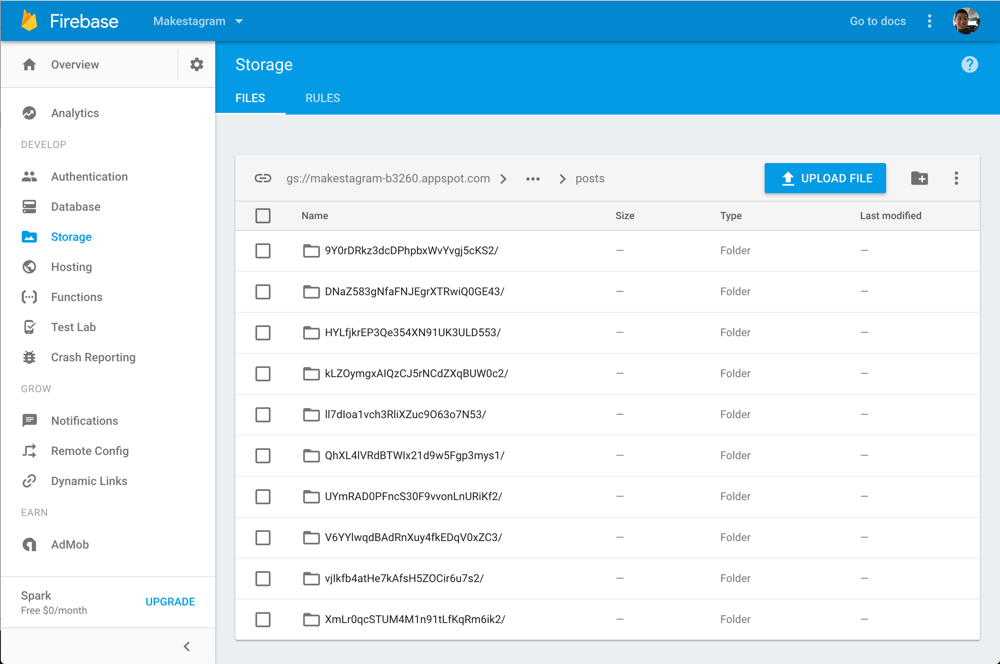
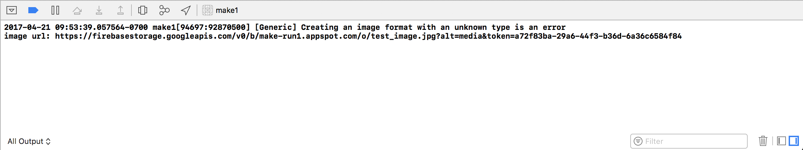
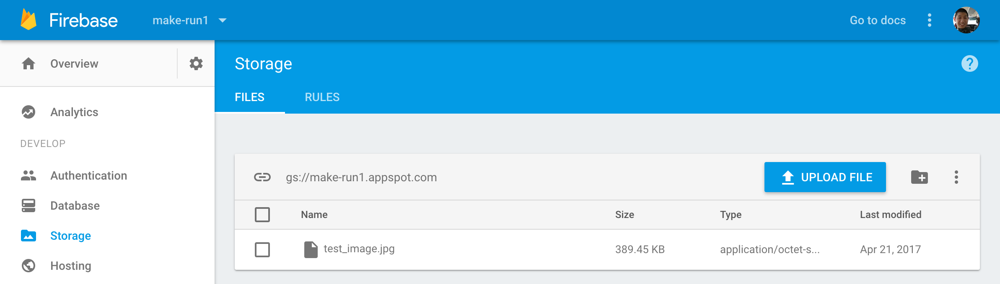
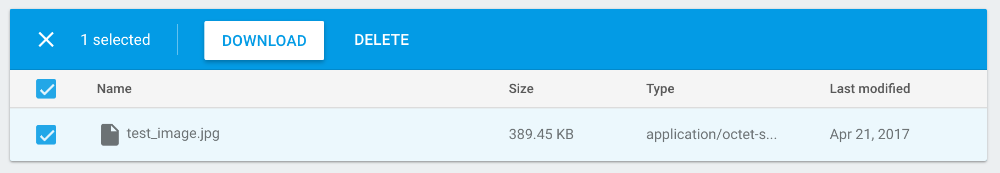

Up until now, we have interacted mainly with `FirebaseAuth` and the `Firebase Realtime Database`. Moving forward, we'll take our first look at `Firebase Storage` which is built on Google's cloud storage platform. Both _Snapchat_ and _Spotify_ are using the same _Google_ infrastructure in production. In this section you will learn how to store media, specifically photos, using Firebase. Later on, you'll also learn how to retrieve and download your media.

Let's start coding the functionality that uploads our photo to Firebase!

# Writing Media to Firebase

In most cases, writing media to Firebase includes three main1steps, in addition to handling the result of the upload. Here's the simplest example from the *Firebase Storage* documentation:

```
// 1 Media Data in memory
let data = Data()

// 2 Create a reference to the file you want to upload
let riversRef = storageRef.child("images/rivers.jpg")

// 3 Upload the file to the path "images/rivers.jpg"
let uploadTask = riversRef.put(data, metadata: nil) { (metadata, error) in
  guard let metadata = metadata else {
    // 4 Uh-oh, an error occurred!
    return
  }
  // 5 Metadata contains file metadata such as size, content-type, and download URL.
  let downloadURL = metadata.downloadURL
}
```

In the code above, we do the following:

1. First we need to convert our media to type `Data`
1. We need to create a relative path to the location at which we'll store our media and what we'll name the data. In this example, data is being stored in the `/images` location with a filename of `rivers.jpg`
1. With `Data` and a location to store the data, we can upload our `Data` to the location specified in the previous step
1. After the upload has completed, if there an error, we'll be able to handle it here
1. If there was no error, we'll be able to access a download URL for where our `Data` was stored

You can confirm that your data is stored in `Firebase Storage` by opening your Firebase dashboard in your browser and navigating to the `Storage` tab. Here, you'll be able to see an overview of all media files store in `Firebase Storage`. You can also view, delete and download files stored here:



 Right now your `Storage` tab should be empty because you haven't uploaded any media yet. Let's change that now!

# Adding the Upload Code

Our code will follow the same steps above to upload an image to Firebase, however, we'll add some more code to handle creating a `Post` object in our database after the upload is completed.

Our strategy for creating a new `Post` object in our database will be:

1. Upload the image to `Firebase Storage`
1. Write a new `Post` object in our database that stores the image URL returned in the previous step

You can see that our media data and database JSON object will be stored in separate Firebase services. We cannot store `Data` in the `Firebase Realtime Database`, just as we cannot store our accompanying `Post` JSON in `Firebase Storage`. Instead we'll use the `Firebase Storage` and `Firebase Realtime Database` together to build the functionality we want.

First, let's create a method that will help us upload an image to Firebase. We'll create a new service as an inteface between our app and `Firebase Storage`.

> [action]
Create a new file called `StorageService.swift` in the `Services` directory:

```
import UIKit
import FirebaseStorage

struct StorageService {
    // provide method for uploading images
}
```

Next we'll create a class method that will help us upload images to `Firebase Storage`. Add the following code in `StorageService.swift`:

```
static func uploadImage(_ image: UIImage, at reference: StorageReference, completion: @escaping (URL?) -> Void) {
    // 1
    guard let imageData = UIImageJPEGRepresentation(image, 0.1) else {
        return completion(nil)
    }

    // 2
    reference.put(imageData, metadata: nil, completion: { (metadata, error) in
        // 3
        if let error = error {
            assertionFailure(error.localizedDescription)
            return completion(nil)
        }

        // 4
        completion(metadata?.downloadURL())
    })
}
```

Let's break down the code:

1. First we change the image from an `UIImage` to `Data` and reduce the quality of the image. It is important to reduce the quality of the image because otherwise the images will take a long time to upload and download from `Firebase Storage`. If we can't convert the image into `Data`, we return nil to the completion callback to signal something went wrong.
1. We upload our media data to the path provided as a parameter to the method.
1. After the upload completes, we check if there was an error. If there is an error, we return nil to our completion closure to signal there was an error. Our `assertFailure` will crash the app and print the error when we're running in debug mode.
1. If everything was successful, we return the download URL for the image.

## Creating a Post

Accompanying each image upload will be a new post. Let's create a new service for our `PostService`.

> [action]
Create a new `PostService.swift` source file:
>
```
import UIKit
import FirebaseStorage
import FirebaseDatabase
>
struct PostService {
>
}
```

Next let's create a static method within our new service for creating a `Post` from an image:

```
static func create(for image: UIImage) {
    let imageRef = Storage.storage().reference().child("test_image.jpg")
    StorageService.uploadImage(image, at: imageRef) { (downloadURL) in
        guard let downloadURL = downloadURL else {
            return
        }

        let urlString = downloadURL.absoluteString
        print("image url: \(urlString)")
    }
}
```

To tie things together, let's use our new service to upload a new image to `Firebase Storage`. Once the user selected an image from the `UIImagePickerController`, the `completionHandler` property of our `MGPhotoHelper` will be executed. Let's change the closure we pass to upload the image once it's selected. Open `MainTabBarController` and change the following in `viewDidLoad`:

```
photoHelper.completionHandler = { image in
    PostService.create(for: image)
}
```

## Testing the Uploading Code

Now it's time to test our solution! Run the app and select an image from `UIImagePickerController`. After selecting an image, you should see the following in your debug console:



If the app crashes the first time on an error, re-run your app and try again. If it keep crashing, backpedal through the previous steps to make sure you're not missing any code.

To confirm our image upload worked is through our Firebase dashboard. Open your Firebase project overview in your browser and click the `Storage` tab. You should see `test_image.jpg` in the root directory of your `Firebase Storage`:



If you select the checkbox, you can download the image and confirm that it is the same image you uploaded previously:



# Conclusion

**Congratulations!** This means you have successfully uploaded data to Firebase! This is an important step towards building **Makestagram**.

Right now we are only uploading the image file, however we'll also need to create a `Post` object in our database so we can store other related information such as which user owns the post.

In the next section we will move from this very simple upload code to a more mature solution for creating new posts.
