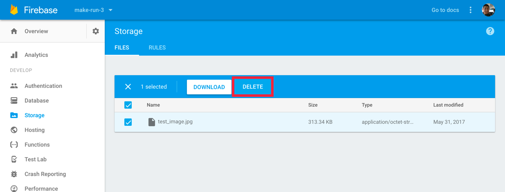
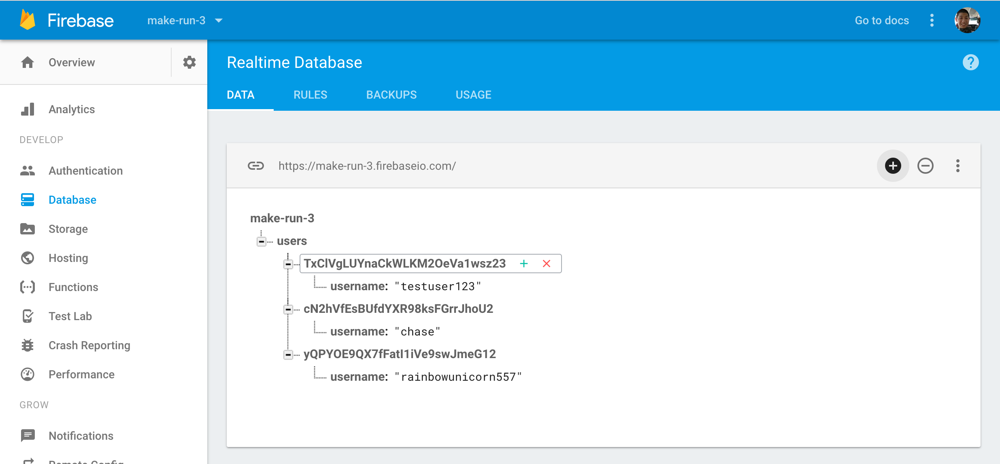

<!-- TODO: rethink about image height calculation -->

Now it's time to move from a working solution to a good one. We need to store more information along with the `Post` that we're creating. Right now we are only storing the image file, but we also need to store the `User` to which the post belongs.

This means that we'll need to create a `Post` class.

# Creating a Post Class

> [action]
Create a new class `Post.swift` in your `Models` directory:
>
```
import UIKit
import FirebaseDatabase.FIRDataSnapshot
>
class Post {
    // properties and initializers
}
```

Next let's add properties to store all the additional information we need. Add the following to your post class.

```
class Post {
    var key: String?
    let imageURL: String
    let imageHeight: CGFloat
    let creationDate: Date
}
```

You'll get some compiler errors for not having an initialiers or default values for certain properties. Let's go ahead and fix that:

```
init(imageURL: String, imageHeight: CGFloat) {
    self.imageURL = imageURL
    self.imageHeight = imageHeight
    self.creationDate = Date()
}
```

Here we create an initializer that creates a new `Post` from an image URL and image height.

# Create a New Post

After successfully uploading an image to `Firebase Storage`, we want to create a new `Post` object that gets stored in the database.

First add a new service method in `PostService` called `create(forURLString:aspectHeight:)`. We'll use this method to write a new `Post` object to our database.

```
private static func create(forURLString urlString: String, aspectHeight: CGFloat) {
    // create new post in database
}
```

Note that our class method is private because we don't want to allow access to this class method from anywhere except our previous `PostService.create(for:)` method. We don't want to be able to create a new post in the database without a image URL and aspect height. If we're working with other developers, this helps prevent them from using this method in ways other than which we originally intended.

Next let's setup the code to create a new `Post` JSON object in our database:

> [action]
Add the following code in `create(forURLString:aspectHeight:)`:
>
```
private static func create(forURLString urlString: String, aspectHeight: CGFloat) {
    // 1
    let currentUser = User.current
    // 2
    let post = Post(imageURL: urlString, imageHeight: aspectHeight)
    // 3
    let dict = post.dictValue
>
    // 4
    let postRef = FIRDatabase.database().reference().child("posts").child(currentUser.uid).childByAutoId()
    //5
    postRef.updateChildValues(dict)
}
```

This will create a JSON object in our database. Let's break down our steps:

1. Create a reference to the current user. We'll need the user's UID to construct the location of where we'll store our post data in our database.
1. Initialize a new `Post` using the data passed in by the parameters.
1. Convert the new post object into a dictionary so that it can be written as JSON in our database. We haven't added this computed variable to our `Post` object yet so the compiler will throw an error right now.
1. Construct the relative path to the location where we want to store the new post data. Notice that we're using the current user's UID as child nodes to keep track of which `Post` belongs to which user.
1. Write the data to the specified location.

To fix the compiler error, add the following computed variable to our `Post` class. This will be convenient for turning our `Post` objects into dictionaries of type `[String : Any]`:

```
var dictValue: [String : Any] {
    let createdAgo = creationDate.timeIntervalSince1970

    return ["image_url" : imageURL,
            "image_height" : imageHeight,
            "created_at" : createdAgo]
}
```

# Structuring Data

<!-- tough topic, probably needs to be revised again -->

Storing and structuring your data inside of your Firebase database requires forethought on the best way to structure your JSON tree.

Let's take another look at the relative path for which we stored our new `Post`:

```
let postRef = FIRDatabase.database().reference().child("posts").child(currentUser.uid).childByAutoId()
```

Another possible way of structuring our data would be to make each post a child node of a user. If so, the relative path would look like this:

```
let postRef = FIRDatabase.database().reference().child("users").child(currentUser.uid).child("posts").childByAutoId()
```

In both tree structures, it's easy to read and write data. However, the second tree structure comes with a disadvantage that's not immediately obvious.

If all of the posts stored within each respective user, then anytime we want to fetch the a user object from Firebase, we'll also fetching all of the user's posts within the snapshot as well.

If each user only has a couple posts, this isn't a big deal. However, in the scenario that a user has hundreds of thousands of posts, reading the user object from Firebase will return a slow response. In addition, storing all of the posts in memory might cause a memory warning that kills your app.

The solution, as we've already implement is flattening our Firebase database JSON tree by separating `Post` objects into it's own root level node. With the `posts` subtree, individual `Post` objects will be grouped by user UIDs that will identify the poster of each subset of posts.

This tree structure allows us to quickly retrieve any user's JSON object from Firebase, without automatically retrieving their posts as well. In addition, if we wanted to retrieve all of a user's posts, it's easy to find the relative path to read all of a single user's posts.

As you create apps with Firebase and practice structuring your data, you'll want to keep your JSON tree as flat as possible. Many times, this will involve a similar tree structure to the one we're implementing right now.

# Connecting our Image Upload to Creating a New Post

To use the service method we just created, we'll need to make some modifications to hook up `create(for:)` to `create(forURLString:aspectHeight:)`.

> [action]
Modify the `create(for:)` method to the following:
>
```
static func create(for image: UIImage) {
    let imageRef = FIRStorage.storage().reference().child("test_image.jpg")
    StorageService.uploadImage(image, at: imageRef) { (downloadURL) in
        guard let downloadURL = downloadURL else {
            return
        }
>
        let urlString = downloadURL.absoluteString
        create(forURLString: urlString, aspectHeight: 320)
    }
}
```

You'll notice here that we hardcode the aspect height of the image. The reason we want to store the aspect height is because when we render our image, we'll need to know the height of the image to display. We do this by calculating what the height of the image should be based on the maximum width and height of an iPhone.

We'll create a new image extension that calculates the aspect height based on the size of the iPhone 7 plus.

> [action]
Create a new file under extensions called `UIImage+Size.swift`:
>
```
import UIKit
>
extension UIImage {
    var aspectHeight: CGFloat {
        let heightRatio = size.height / 736
        let widthRatio = size.width / 414
        let aspectRatio = fmax(heightRatio, widthRatio)
>
        return size.height / aspectRatio
    }
}
```

We added a computed property to `UIImage` that will calculate the aspect height for the instance of a `UIImage` based on the size property of an image.

This solution overlooks a lot of complexity for the sake of being easy to implement. What would happen if we ran the app on an iPad?

Now we can update our `PostService` to calculate each image's aspect height when creating a post.

> [action]
Open `PostService` and modify `create(for:)` to use our new extension:
>
```
static func create(for image: UIImage) {
    let imageRef = FIRStorage.storage().reference().child("test_image.jpg")
    StorageService.uploadImage(image, at: imageRef) { (downloadURL) in
        guard let downloadURL = downloadURL else {
            return
        }
>
        let urlString = downloadURL.absoluteString
        let aspectHeight = image.aspectHeight
        create(forURLString: urlString, aspectHeight: aspectHeight)
    }
}
```

Last, we'll need to create a more suitable location for our post image files to be stored. Right now, since we're storing all of our images at the same path. If you haven't figured it out already; they're being overwritten. Let's create a new extension for `FIRStorageReference` that generates a new storage location for each user's post:

> [action]
Create a new extension file called `FIRStorageReference+Post.swift` with the following content:
>
```
import Foundation
import FirebaseStorage
>
extension FIRStorageReference {
    static let dateFormatter = ISO8601DateFormatter()
>
    static func newPostImageReference() -> FIRStorageReference {
        let uid = User.current.uid
        let timestamp = dateFormatter.string(from: Date())
>
        return FIRStorage.storage().reference().child("images/posts/\(uid)/\(timestamp).jpg")
    }
}
```

Here we create an extension to FIRStorageReference with a class method that will generate a new location for each new post image that is created by the current ISO timestamp.

We can update our code in `PostService` to use the new location generation:

> [action]
Modify `create(for:)` to the following:
>
```
static func create(for image: UIImage) {
    let imageRef = FIRStorageReference.newPostImageReference()
    StorageService.uploadImage(image, at: imageRef) { (downloadURL) in
        guard let downloadURL = downloadURL else {
            return
        }
>
        let urlString = downloadURL.absoluteString
        let aspectHeight = image.aspectHeight
        create(forURLString: urlString, aspectHeight: aspectHeight)
    }
}
```

# Testing our Code

Before we move on, let's test our code. To do that we'll need to clean out some of old data.

> [action]
Delete you test image or any other previous images from `Firebase Storage`: 
>
Also delete any previous posts in your Firebase database. This will remove any posts with incomplete data. In the image below, note that we've deleted the `posts` subtree by hovering over the _posts_ text and clicking the red X button. 

As we build and add new code, our database might contain incomplete or inconsistent data. We want to make sure that we delete this previous data, otherwise it might create bugs in our production code.

Now that we've finished cleaning our data, let's test our code!

> [action]
Run the app and create a new `Post`.

If everything is working correctly, you'll see a new `Post` object created in our database and the accompanying image stored at the correct path in `Firebase Storage`.

# Conclusion

We've improved the photo upload mechanism a lot! We've created our own custom `Post` class and added a class method in our `PostService` to create a `Post` JSON object in our database.

In our next step we'll look at reading data from our database and displaying it to our users.
