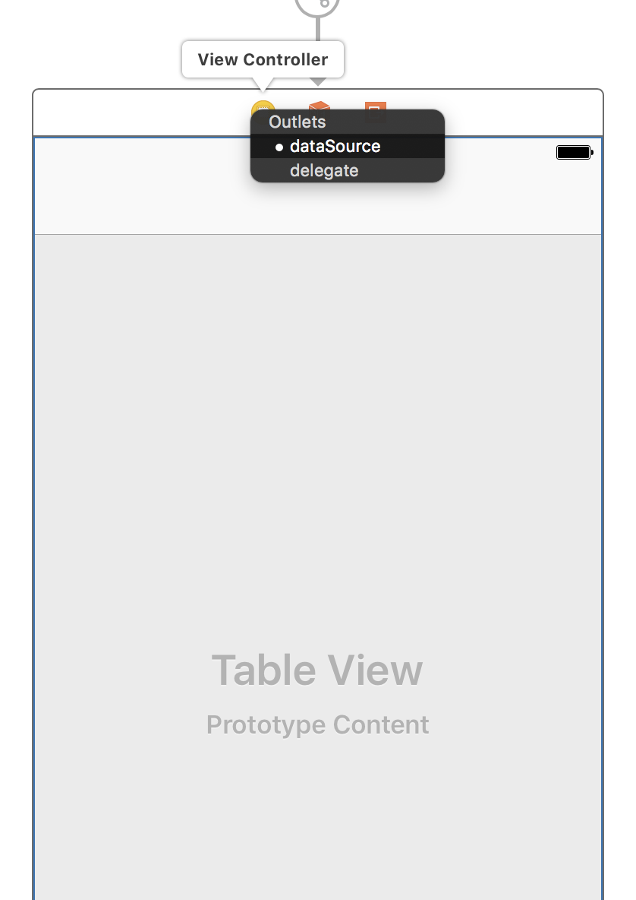

Our app is now able to create and store posts in Firebase. In this section, we'll look at building the next feature: the timeline. Our timeline will retrieve post data from our database and display it to our user.

As a first step in implementing the _Timeline_ feature, we will set up the basic UI for the `HomeViewController`.

# Creating a Home Storyboard

As we've discussed in previous sections, we want to keep our storyboard files small and contained to individual user flows of the app. We'll begin by refactoring our existing `HomeViewController` into its own storyboard file.

## Adding a Navigation Controller

First, we'll add a navigation controller to our `HomeViewController`. This will give our `HomeViewController` a navigation bar and allow us to easily segue to new view controllers in the future.

> [action]
Open `Main.storyboard` and select the `HomeViewController`; click on top menu item `Editor`>`Embed In`>`Navigation Controller`:


## Refactoring to Storyboard

Next we'll refactor our first tab into its own storyboard.

> [action]
>
1. Select both the `UINavigationController` and `HomeViewController` by clicking and dragging so that both are selected
1. Click on the top menu item `Editor`>`Refactor to Storyboard`
1. Create your new `Home.storyboard` file in the Storyboards folder

You have now refactored one of the tab bar view controllers into another storyboard. Your `Main.storyboard` file should now look like this:


And your `Home.storyboard` file should look like the following:


# Adding a Table View to the HomeViewController

Let's add a table view to the `HomeViewController` - we will use that table view to display the posts in a user's timeline.

> [action]
Open `Home.storyboard` and add a Table View to the `HomeViewController`. The resulting scene hierarchy should look like this:
>

>
Next, set the table view constraints:

>
Make sure that the top and bottom constraints are relative to the `HomeViewController` view and not the top and bottom layout guides:


## Defining a Table View Data Source and Delegate

In order to fill this table view with data, we need to define a data source and delegate.

> [action]
Define the `UITableViewDataSource` and `UITableViewDelegate`:
>
1. Set the `HomeViewController` to be the data source of the table view by ctrl-dragging from the table view to the view controller. 
1. Repeat the same action to set the `UITableViewDelegate` as well. You should have set both the data source and delegate as shown below: 

# Implementing Home View Controller

Let's start building our `HomeViewController`.

> [action]
Confirm that you have already created a source file named `HomeViewController.swift`. Also, make sure you've set the class of `HomeViewController` in the storyboard _Identity Inspector_: 
>
If you haven't already, go ahead and follow the steps above now.

## Defining a Referencing Outlet

We will also need to access this table view in code; therefore we need to set up a referencing outlet. Ctrl-drag from your storyboard table view to your `HomeViewController.swift` to create an `IBOutlet`.

> [action]
Set up a referencing outlet, as shown below, and name the property `tableView`:


# Create a Prototype Cell

We'll need a cell to display the images that we download.

> [action]
Drag a _Prototype Cell_ from the object library to the `UITableView`:

>
Next, select the cell and open the _Attributes Inspector_. We want to add a `Reuse Identifer` so we can reference our cell in code. If you don't see the `Reuse Identifier` field, make sure you have the `UITableViewCell` prototype selected and not it's content view.
>
Set the identifier to `PostImageCell`:


# Reading Data from Firebase

We retrieve data the same way we did in our login flow. In our first iteration, we'll retrieve and display all of the current user's posts. Later in this tutorial, we'll implement an actual timeline of users that we're following.

Similar to our `User` model, let's create a failable initialer in our `Post` class to take a `DataSnapshot`.

> [action]
Open your `Post.swift` class and add the following:
>
```
init?(snapshot: DataSnapshot) {
    guard let dict = snapshot.value as? [String : Any],
        let imageURL = dict["image_url"] as? String,
        let imageHeight = dict["image_height"] as? CGFloat,
        let createdAgo = dict["created_at"] as? TimeInterval
        else { return nil }
>
    self.key = snapshot.key
    self.imageURL = imageURL
    self.imageHeight = imageHeight
    self.creationDate = Date(timeIntervalSince1970: createdAgo)
}
```

Next we need a service method that will retrieve all of a user's posts from Firebase. This will be the data that we display in our timeline.

> [action]
Add the following class method to `UserService`:
>
```
static func posts(for user: User, completion: @escaping ([Post]) -> Void) {
    let ref = Database.database().reference().child("posts").child(user.uid)
>
    ref.observeSingleEvent(of: .value, with: { (snapshot) in
        guard let snapshot = snapshot.children.allObjects as? [DataSnapshot] else {
            return completion([])
        }
>
        let posts = snapshot.reversed().flatMap(Post.init)
        completion(posts)
    })
}
```

We follow the same steps as previously discussed from reading from Firebase. Look through and make sure you understand what's going on!

Great! Now we have a method that will fetch and return all of our posts from Firebase from a given user. We can use this to display the posts we've made so far. Let's go back to our `HomeViewController` and display our posts.

# Displaying our Posts

In the future, we want our `HomeViewController` to display a timeline of posts from people we're following, but for now we're going just display our own posts that we've made.

First we'll need to setup our `HomeViewController` to have a data source.

> [action]
Create an empty array of posts in `HomeViewController`:
>
```
class HomeViewController: UIViewController {
>
    // MARK: - Properties
>
    var posts = [Post]()
>
    // ...
}

Next we'll setup our `TableViewDataSource` to retrieve data from our `Post` array.

```
// MARK: - UITableViewDataSource

extension HomeViewController: UITableViewDataSource {
    func tableView(_ tableView: UITableView, numberOfRowsInSection section: Int) -> Int {
        return posts.count
    }

    func tableView(_ tableView: UITableView, cellForRowAt indexPath: IndexPath) -> UITableViewCell {
        let cell = tableView.dequeueReusableCell(withIdentifier: "PostImageCell", for: indexPath)
        cell.backgroundColor = .red

        return cell
    }
}
```

Now our table view will display the same number of cells as in our `posts` array. Last, we'll add the following code to our `viewDidLoad` to fetch our posts from Firebase:

```
override func viewDidLoad() {
    super.viewDidLoad()

    UserService.posts(for: User.current) { (posts) in
        self.posts = posts
        self.tableView.reloadData()
    }
}
```

Let's run our code and see if it's working. If all goes right, you should see some of the posts that are stored in your database. Right now, we're only displaying blank red cells, but each one represents one of the current user's posts.

If you open your Firebase project and navigate to the database, you should be able to expand your JSON tree and see your posts. If everything has gone right your project should look like this:


# Conclusion

Admittedly the app is still looking pretty boring - but you have implemented the foundation for a very important feature. To make our progress more visual, we'll focus on displaying the posts with images in the next step.
