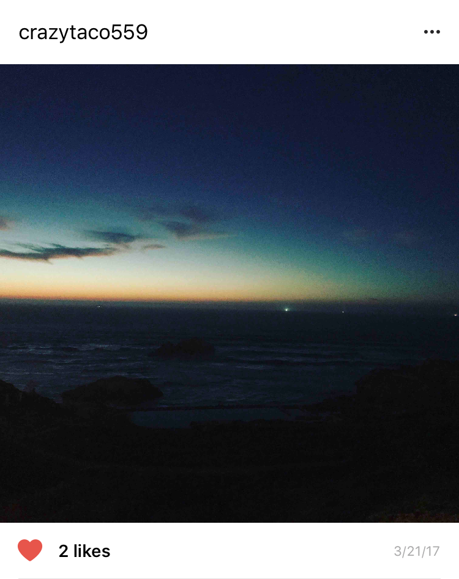
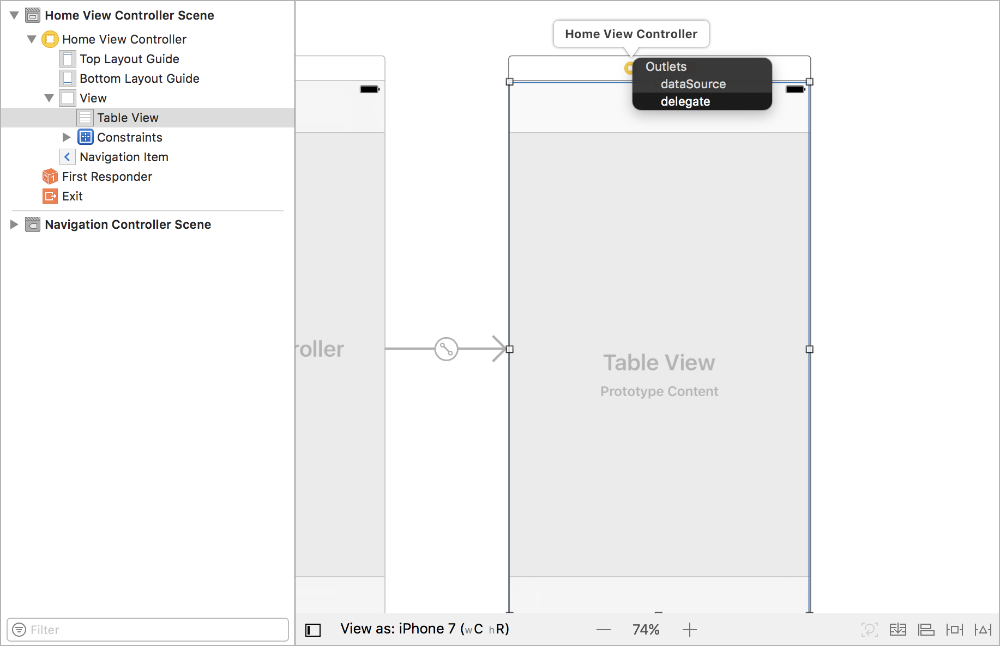
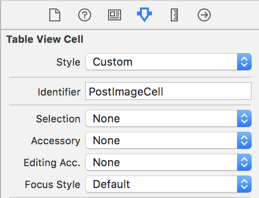
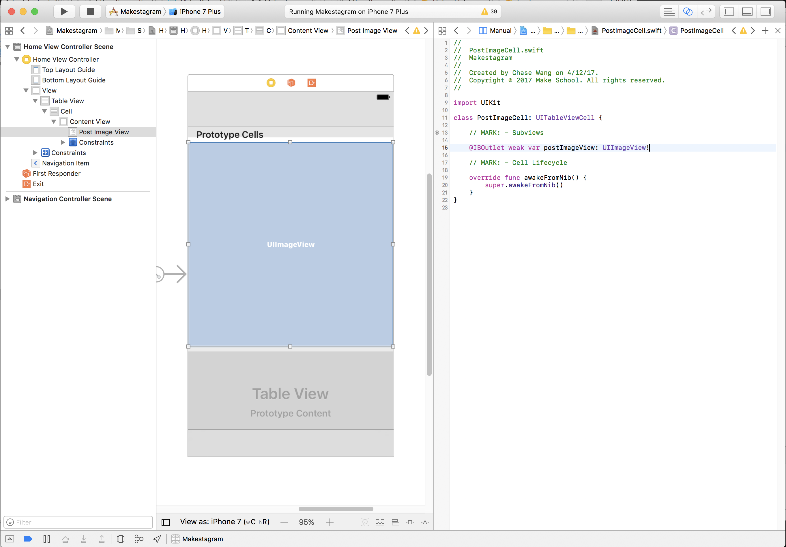
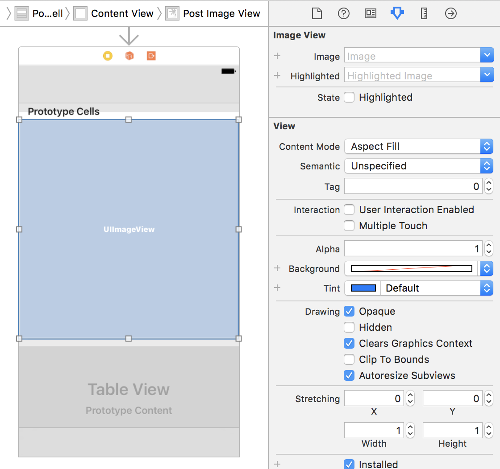

As promised, this step will focus on displaying the photos associated with each post. The design for our each `Post` will look like the following:



In this section we'll go through the process of create a custom image cell that will display each post image.

# Implementing the Table View Delegate

Each `Post` image will be of varying size depending on the aspect height of the image. We'll need a way to dynamically adjust height of each image cell. We'll do this using the `tableView(_:heightForRowAt:)` method of `UITableViewDelegate`. This will first require us to make sure the table view's delegate property is set.

> [action]
Open `Home.storyboard` and select the table view of your `HomeViewController`. Ctrl-drag from from your storyboard to your view controller to set the delegate:


Next we'll need to conform `HomeViewController` to `UITableViewDelegate`. Open `HomeViewController.swift` and add the following:

```
// MARK: - UITableViewDelegate

extension HomeViewController: UITableViewDelegate {
    func tableView(_ tableView: UITableView, heightForRowAt indexPath: IndexPath) -> CGFloat {
        let post = posts[indexPath.row]

        return post.imageHeight
    }
}
```

Implementing this method returns the height that each cell should be given an index path. This allows us to have cells that are varying heights within the same table view.

# Setting up a Custom Table View Cell

Next, to implement our custom cells, we'll verify our attributes of our cells to be the following.

> [action]
Select your _Prototype Cell_ and open the attributes inspector. Make sure your cell has the following attributes:
>
- **Style**: Custom
- **Identifier**: PostImageCell
- **Selection**: None
>
Confirm your cell has the following attributes:


Next we'll need to install a pod to download our image and display it in our table view cell.

## Installing Kingfisher

[Kingfisher](https://github.com/onevcat/Kingfisher) is a popular Swift library for asynchronously downloading and caching images. We'll be using _Kingfisher_ to display our post images. But first, we'll need to install Kingfisher via **CocoaPods**.

Navigate to the _Kingfisher_ installation guide by [clicking here](https://github.com/onevcat/Kingfisher/wiki/Installation-Guide). Follow the instructions under **CocoaPods** to install the library.

You should be instructed to add _Kingfisher_ pod to your _Podfile_. Don't forget to run the `pod install` command in your Makestagram root directory.

Once you have _Kingfisher_ installed, you should be able to use it as follows:

```
let url = URL(string: "https://domain.com/image.jpg")!
imageView.kf.setImage(with: url)
```

As you can see, *Kingfisher* provides an easy API for us to download `URL` and display `UIImage`s.

## Creating the PostImageCell

Next we're going to implement displaying images for our `PostImageCell`. First, we'll need to create a source file for `PostImageCell`.

> [action]
Create a new source file in the `Views` directory called `PostImageCell` that is a subclass of `UITableViewCell`; replace the contents of the file with the following:
>
    import UIKit
>
    class PostImageCell: UITableViewCell {
>
        override func awakeFromNib() {
            super.awakeFromNib()
        }
    }

Next open `Home.storyboard` and do the following:

> [action]
>
1. Set the class of the cell to `PostImageCell` in the Identity Inspector
1. Open the Size Inspector and change the default height of the prototype cell to be 375
1. Drag an `UIImageView` from the object library onto your `PostImageCell`
1. Constraint the `UIImageView` to each side of the cell
1. Create an `IBOutlet` for your `postImageView` in your `PostImageCell.swift` class


Additionally we need to change the `Content Mode` of the image view. Currently it is set to the default value which is `Scale To Fill`. That will distort the image to fit into the size of the image view. Distorted images look ugly! It's much better to crop them. To do that we change the `Content Mode` to `Aspect Fit`.

> [action]
Select the `UIImageView` on the cell in `Home.storyboard` and click on the _Attributes Inspector_. Change the _Content Mode_ from `Scale To Fill` to `Aspect Fit`. 

# Displaying the Image

Last, let's update our tableview's datasource to show our image. First let's import the Kingfisher library with the following line:

> [action]
Add the following line to top of your `HomeViewController.swift`:
>
```
import Kingfisher
```
>
Next change your `UITableViewDataSource` in your `HomeViewController` to the following:
>
```
func tableView(_ tableView: UITableView, cellForRowAt indexPath: IndexPath) -> UITableViewCell {
    let post = posts[indexPath.row]
    let cell = tableView.dequeueReusableCell(withIdentifier: "PostImageCell", for: indexPath) as! PostImageCell
>
    let imageURL = URL(string: post.imageURL)
    cell.postImageView.kf.setImage(with: imageURL)
>
    return cell
}
```

# Configuring our TableView

Next let's add some styling for our table view. This code will add some minor UI changes to your table view.

> [action]
Add the following method within your `HomeViewController`:
>
```
func configureTableView() {
    // remove separators for empty cells
    tableView.tableFooterView = UIView()
    // remove separators from cells
    tableView.separatorStyle = .none
}
```
>
Next let's call the method in our `viewDidLoad`:
>
```
override func viewDidLoad() {
    super.viewDidLoad()
>
    configureTableView()
>
    // ...
}
```

Now you can run the app again. And for the first time you should see our photos on the screen!

# Conclusion

In this chapter you have learned how to set up a custom table view cell. Almost all iOS apps use table views in combination with custom cells, so this knowledge will be very useful for your own app!

For now we have implemented downloading the photos for each post - after all, the focus of this chapter was to make some visual progress! In the next step we will focus on improving the UI by adding a header and action footer for each post.
