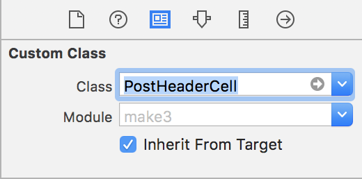
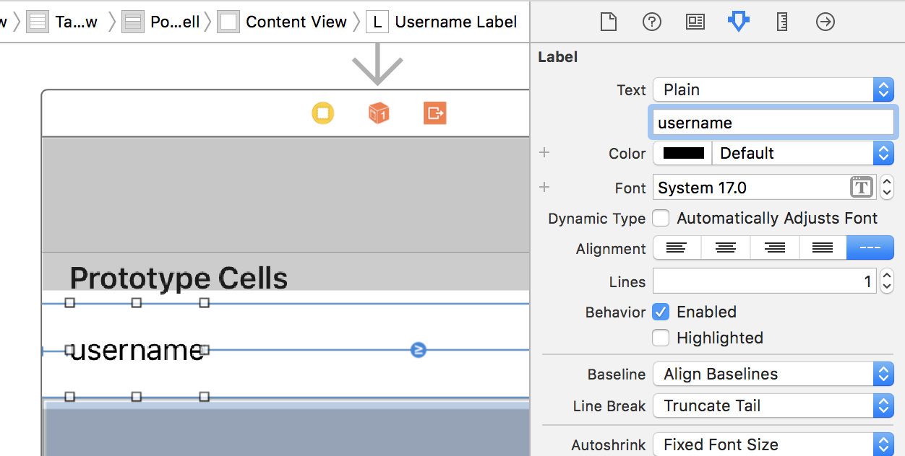
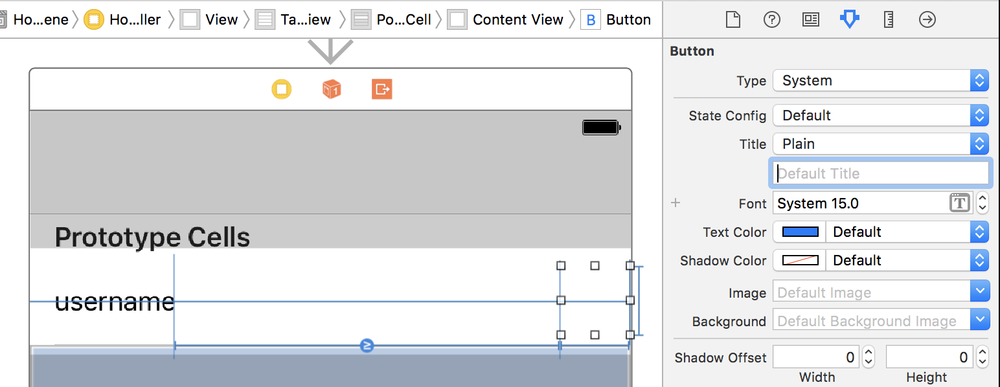
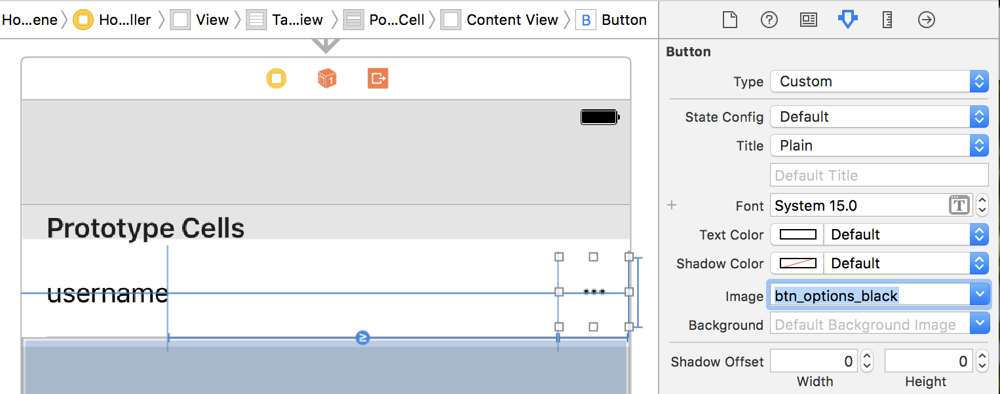
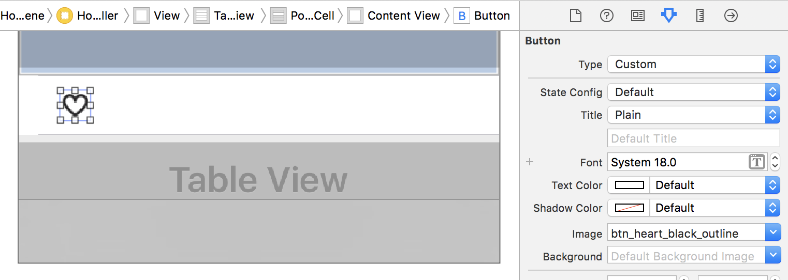
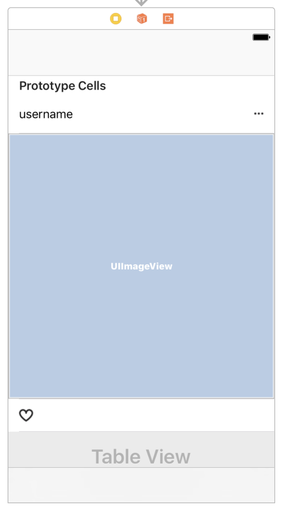
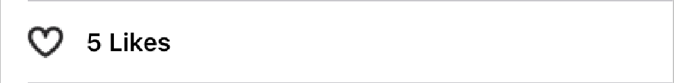
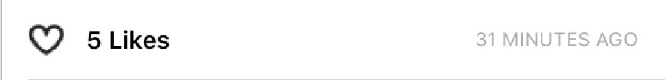
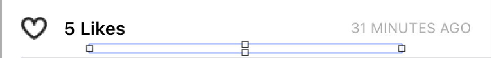

In this section, we'll focus on completing the UI elements for the `HomeViewController`. Let's review the design we'll implement for each post:


Adding to the existing `PostImageCell`, we'll create a header cell and an action cell for each post. The header cell will display the poster's username and eventually give the current user the ability to flag inappropriate content. The action cell will display the number of likes for a given post and allow a user to like a post.

Let's start by creating a new cell for the post header.

# Creating a Post Header Cell

In this step we'll be focused on creating the header.

> [action]
Create a new custom cell:
>
1. Open `Home.storyboard` and find the `HomeViewController`
2. Drag a new prototype cell from the object library to the table view on `HomeViewController`. Make sure it's placed above the current `PostImageCell`.

3. Open the attributes inspector and change the cell style, selection style, and set the `Identifier` to `PostHeaderCell`

4. Open the size inspector and set a custom `Row Height` of 54


## Adding Subviews

We've now created a new cell with some custom attributes. Let's move on to adding some subviews onto our prototype cell. In this step, we'll add a `UILabel` to display the username of the poster and a options button for users to report inappropriate content.

When you're finished, your prototype cell should look like:


> [action]
Drag a `UIButton` from the object library onto the prototype cell. Add the following constraints to the button:

>
Next, we'll do the same with the `UILabel` and add the following constraints:


After setting up our subviews, we'll need to connect them to code.

> [action]
>
Create a new `PostHeaderCell.swift` that is a subclass of `UITableViewCell`. Make your source file contains the following:
>
```
import UIKit
>
class PostHeaderCell: UITableViewCell {
>
    override func awakeFromNib() {
        super.awakeFromNib()
    }
}
```
>
Make sure you go back and set the _Custom Class_ in the _Identity Inspector_ for the `PostHeaderCell` in your storyboard. 

Next, we'll hook up our storyboard prototype cell to our source file.

> [action]
Add an IBOutlet for the username label. Open your Home storyboard and `PostHeaderCell` side by side with the assistant navigator and ctrl-drag from the username label to right above the `awakeFromNib` method:
>
```
class PostHeaderCell: UITableViewCell {
    @IBOutlet weak var usernameLabel: UILabel!
>
    override func awakeFromNib() {
        super.awakeFromNib()
    }
}
```
>
Next, we'll add an IBAction for when the options button is tapped. Ctrl-drag from the options button right below `awakeFromNib`. This time, we'll change the connection type from an outlet to an action. Your `PostHeaderCell` should look like the following:
>
```
class PostHeaderCell: UITableViewCell {
>
    @IBOutlet weak var usernameLabel: UILabel!
>
    override func awakeFromNib() {
        super.awakeFromNib()
    }
>
    @IBAction func optionsButtonTapped(_ sender: UIButton) {
        print("options button tapped")
    }
}
```
>
Finally, we'll modify the attributes of our label and button in storyboard to follow the design. Make sure the _Attributes Inspector_ is open in the right pane.
>
1. Change the text property of our `usernameLabel` in our storyboard to `username`: 
1. Delete the title of the button and set it to be blank. 
1. Last, set the `Image` property to `btn_options_black`: 

Great! We've finished creating our `PostHeaderCell`. Now we'll move on to creating our `PostActionCell`.

# Creating a Post Action Cell

We'll repeat similar steps to do the same for creating a `PostActionCell` that will be displayed below each `PostImageCell`.

> [challenge]
Add another prototype cell in the storyboard below the `PostImageCell` called `PostActionCell.swift`. Set the following properties in your _Attribute Inspector_ and _Size Inspector_:
>
- **Selection Style**: None
- **Cell Identifier**: PostActionCell
- **Custom Height**: 46
>
If you don't remember how to add and configure a custom table view cell, review the last step to refresh your memory.

## Adding Subviews

On our action cell, we'll add the following subviews:

- a button for users to like a post
- a label to display the number of likes a post has
- a second label for a timestamp
- a custom separator view

Let's start by adding the like button:

> [action]
Drag a `UIButton` from the object library to the action cell and set the following attributes:
>
- **Type**: Custom
- **Title**: _Leave Blank_
- **Image**: `ic_unfilled_heart`
>

>
Then add the following constraints for the like button: 

Your like button should look like the following: 

Next let's add a like count label to display the number of likes a post currently has:

> [action]
Drag a `UILabel` from the object library beside the like button and set the following attributes:
>
- **Text**: 5 Likes
- **Font:** System Semibold 14.0
>
Next, add the following constraints for the like count label: 

After setting the attributes and constraints above, your `PostActionCell` should look like the following: 

We'll also need a `UILabel` to display the timestamp of when a post was first created:

> [action]
Drag a `UILabel` from the _Object Library_ onto the far right side of the cell:

>
Then set the following atttributes for the label:
>
- **Text**: 31 MINUTES AGO
- **Font**: System 11
- **Text Color**: `#9A9A9A`
>
Add the following constraints for the timestamp label:


At this point, your `PostActionCell` should look like the following: 

Last, we'll add a custom separator at the bottom of our action cell to help visually break each post from the following. You can think of this as a bottom border.

> [action]
Drag a `UIView` onto the action cell and position it to look like a bottom border: 
>
Set the color of your bottom separator to `#DBDBDB`:

>
Finish by adding the following constraints onto your `UIView`:


After finishing all the steps above, your prototype cell should look like the following: 

## Hooking up the Source Code

Let's create our IBOutlets and IBAction methods.

> [challenge]
Create a new `PostActionCell.swift` class and create the following IBOutlets and IBAction method. Remember to set the Custom Class in the _Identity Inspector_ for the prototype cell.

<!--  -->

> [solution]
When you're finished hooking up your IBOutlets and IBAction, your `PostActionCell.swift` file should look like the following:
>
```
import UIKit
>
class PostActionCell: UITableViewCell {
>
    // MARK: - Subviews
>
    @IBOutlet weak var likeButton: UIButton!
    @IBOutlet weak var likeCountLabel: UILabel!
    @IBOutlet weak var timeAgoLabel: UILabel!
>
    // MARK: - Cell Lifecycle
>
    override func awakeFromNib() {
        super.awakeFromNib()
    }
>
    // MARK: - IBActions
>
    @IBAction func likeButtonTapped(_ sender: UIButton) {
        print("like button tapped")
    }
}
```

At this point, we've successfully created two additional cells that will help display our `Post`. Next we'll look at configuring our `UITableViewDataSource` and `UITableViewDelegate` so that our two new cells display the correct content for each post.

# Configuring our DataSource and Delegate

To display our newly added header and action cells, we'll need to reconfigure our table view data source and delegate. Instead of displaying a single cell, we now need to display 3 cells for each post: a header, image and action cell.

To do this, we'll group the table view into sections. Each `Post` will be it's own section with 3 rows for each respective cell.

> [action]
Add the following to the `UITableViewDataSource` extension:
>
```
func numberOfSections(in tableView: UITableView) -> Int {
    return posts.count
}
```
>
Next, we'll reconfigure `tableView(_:numberOfRowsInSection)` to the following:
>
```
func tableView(_ tableView: UITableView, numberOfRowsInSection section: Int) -> Int {
    return 3
}
```

This method will now return 3 rows for each section to correspond with our header, image and action cells.

Now that we've set up the data source to display the correct number of sections and rows, we'll need to return the corresponding cell in `tableView(_:cellForRowAt:)`:

> [action]
Modify `tableView(_:cellForRowAt:)` to handle each respective cell:
>
```
func tableView(_ tableView: UITableView, cellForRowAt indexPath: IndexPath) -> UITableViewCell {
    let post = posts[indexPath.section]
>
    switch indexPath.row {
    case 0:
        let cell = tableView.dequeueReusableCell(withIdentifier: "PostHeaderCell") as! PostHeaderCell
        cell.usernameLabel.text = User.current.username
>
        return cell
>
    case 1:
        let cell = tableView.dequeueReusableCell(withIdentifier: "PostImageCell") as! PostImageCell
        let imageURL = URL(string: post.imageURL)
        cell.postImageView.kf.setImage(with: imageURL)
>
        return cell
>
    case 2:
        let cell = tableView.dequeueReusableCell(withIdentifier: "PostActionCell") as! PostActionCell
>
        return cell
>
    default:
        fatalError("Error: unexpected indexPath.")
    }
}
```

Now we've successfully setup our data source. Let's move on to modifying our `UITableViewDelegate` to handle our new cells. We'll need to make sure that the height of each cell is being displayed correctly. Let's add cell heights to account for the `PostHeaderCell` and `PostActionCell`.

> [action]
Add the following class method to `PostHeaderCell`:
>
    class PostHeaderCell: UITableViewCell {
>
        static let height: CGFloat = 54
>
        // ...
    }
>
Repeat the following for `PostActionCell`:
>
    class PostActionCell: UITableViewCell {
>
        static let height: CGFloat = 46
>
        // ...
    }
>
Next, change your `UITableViewDelegate` to the following:
>
```
// MARK: - UITableViewDelegate
>
extension HomeViewController: UITableViewDelegate {
    func tableView(_ tableView: UITableView, heightForRowAt indexPath: IndexPath) -> CGFloat {
        switch indexPath.row {
        case 0:
            return PostHeaderCell.height
>
        case 1:
            let post = posts[indexPath.section]
            return post.imageHeight
>
        case 2:
            return PostActionCell.height
>
        default:
            fatalError()
        }
    }
}
```

Run the app and see if how each post is displayed in your `HomeViewController`. It should look like the image below:


# Configuring the Timestamp

Currently, our post have a timestamp of when it was created. To display this data, we'll need to configure `tableView(_:cellForRowAt:)`.

> [action]
Open `HomeViewController` and create a new `DateFormatter`:
>
    let timestampFormatter: DateFormatter = {
        let dateFormatter = DateFormatter()
        dateFormatter.dateStyle = .short
>
        return dateFormatter
    }()

A date formatter allows us to convert a `Date` into a formatted string. We'll use this to display the date our post was created.

> [action]
In `tableView(_:cellForRowAt:)` modify your code to the following:
>
```
func tableView(_ tableView: UITableView, cellForRowAt indexPath: IndexPath) -> UITableViewCell {
    // ...
>
    case 2:
        let cell = tableView.dequeueReusableCell(withIdentifier: "PostActionCell") as! PostActionCell
        cell.timeAgoLabel.text = timestampFormatter.string(from: post.creationDate)
>
        return cell
>
    // ...
}
```

# Adding a Navigation Bar Title

Before moving on, we'll set a title for our `HomeViewController` navigation bar.

> [action]
Open `Home.storyboard` and double-click on the `UINavigationBar` of the `HomeViewController`. Open the _Attribute Inspector_ in the right pane and change the `Title` attribute to `Makestagram`. 

Great, now we've successfully finished building the UI for displaying each `Post` in our table view. Run the app and you should see the following: 

From here, let's move on and add the ability to like posts.
