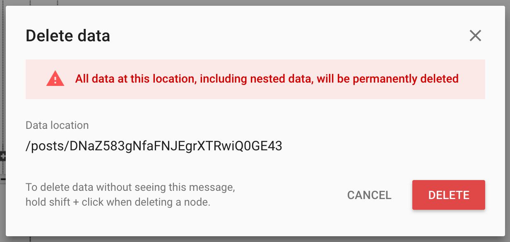

Users on our app are now able to create new posts and see them displayed as a timeline in `HomeViewController`. However, you'll notice the `PostActionCell` for each `Post` doesn't work. Let's fix that.

In this section, we'll working implementing likes. Likes are a common feature in most social media apps, first popularized by the Facebook like button.

In Makestagram, the likes feature will gives users the ability to like posts and see the number of likes each post has in the timeline.

Implementing likes will require us to store new like data in our database. We'll need to keep track of:

- which posts have been liked by which users
- the total number of likes each post currently has

Before adding new functionality, it's helpful to think about if the feature will require changes to the database. In our case, we'll need to store additional data. This means we'll need to give some forethought on the best way to store the new data into the existing JSON tree.

# Structuring Like Data

Remember back to when we added the functionality for creating posts?

We intentionally _flattened_ our database by separating our `users` JSON subtree from our `posts`. Moving forward, we'll store new like data using a similar strategy.

Instead of nesting the like data of each post within the `posts` node, we'll _flatten_ our database by creating a new `postLikes` node at the root of our JSON database.

Let's see what our new `postLikes` node will look like below:

```
makestagram-b3260 : {
    postLikes: {
        -Kfm0p2EMcrpN8XcLOR5: {
            user1_uid: true,
            user2_uid: true
        },
        -KgGuLttcC3PJbD8pWAT: {
            user4_uid: true,
            user8_uid: true
        },
        -KgLo0OrineV8l3_K9gK: {
            user1_uid: true
        },
    },
    posts: { ... },
    users: { ... }
}
```

Notice that we've created a child node named `postLikes` under the root node `makestagram-b3260`. We should have 3 root level child nodes: `users`, `posts`, `postLikes`.

Within the `postLikes` subtree, we store keys corresponding to child IDs for each post. Each post with more than one like will have it's own JSON object within `postLikes`.

Last, within each post key, we store the UID of all users who have liked the given post. Using this data structure, we're able to easily track which users have liked which posts.

## Adding a Like Count

In addition to our new `postLikes` node, we'll also be adding a new `like_count` property to each post. This property will be added to each existing post in the `posts` subtree. Adding to the existing `posts` JSON structure, our post JSON object will look:

```
makestagram-b3260 : {
    postLikes: { ... },
    posts: {
        user1_uid: {
            -Kfm0p2EMcrpN8XcLOR5: {
                created_at: 1490119356.786182,
                image_height: 374.9999999999999,
                image_url: "https://firebasestorage.googleapis.com/v0/b/mak...",
                like_count: 4
            },
            -KgGuLttcC3PJbD8pWAT: { ... },
            -KgLo0OrineV8l3_K9gK: { ... }
        },
        user2_uid: { ... },
        user3_uid: { ... }
    },
    users: { ... }
}
```

It might not be immediately obvious why we need an additional `like_count` for each post. Instead, couldn't we read all of the likes a post has from the `postLikes` node and sum the number of children? Can you think of any reasons why a `like_count` would be useful?

Although, it's not immediately obvious, a `like_count` is an read optimization that allows us to know the number of likes a post has just by reading from the `posts` node. This also prevents us from:

- having to make two network requests to display a post
- reading all likes into memory (imagine if a user had a couple million likes!)

Adding an additional `like_count` allows us to quickly read post data from Firebase.

However, we're not done!

To increment and decrement the `like_count`, we'll need to be able to traverse to the correct post in our `posts` node. The current relative path to the `like_count` is:

```
posts > user_uid > post_key > like_count
```

Looking at the relative path above, we'll need both the poster's UID and post key to increment and decrement the `like_count`. Currently, our `Post` model contains a reference to it's key. However, we don't know the user's uid of the poster!

We'll use a strategy called _denormalization_ to fix this!

## What is Denormalization?

_Denormalization_ is a method of improving the read performance by storing redundant copies of the same data in multiple locations. In our case, instead of reading each post and making another read to join it's poster, we store an additional copy of the poster in the post JSON object.

Our new post JSON will look like:

```
posts: {
    user1_uid: {
        -Kfm0p2EMcrpN8XcLOR5: {
            created_at: 1490119356.786182,
            image_height: 374.9999999999999,
            image_url: "https://firebasestorage.googleapis.com/v0/b/mak...",
            like_count: 4,
            poster: {
                uid: user1_uid,
                username: "testuser"
            }
        },
        -KgGuLttcC3PJbD8pWAT: { ... },
        -KgLo0OrineV8l3_K9gK: { ... }
    },
    user2_uid: { ... },
    user3_uid: { ... }
}
```

With this tree structure, our Firebase database will have multiple copies of the same user in both the `users` node and multiple post objects. However, this cost comes at the benefit of not needing to make multiple reads to database to fetch the poster with each post.

It's important to take time to think about how to organize and structure data in Firebase. Otherwise, you'll find yourself fight your database and data structure to implement new features and functionality. Now that we've organized our thoughts on what we want our data structure to look like, let implement a like service for our app!

# Creating a Like Service

As with all new functionality, we want to design easy APIs that allow use to reuse code. We'll create a new service for likes. Our like service will contain all networking and Firebase database code that will allow us to:

- like posts
- unlike posts
- determine whether a user currently has liked a post

> [action]
Create a new `LikeService.swift` source file in the `Services` folder:
>
    import Foundation
    import FirebaseDatabase
>
    struct LikeService {
        // ...
    }

First we'll want to add a service method for liking posts:

> [action]
Add the following class method to your `LikeService`:
>
    static func create(for post: Post, success: @escaping (Bool) -> Void) {
        // 1
        guard let key = post.key else {
            return success(false)
        }
>
        // 2
        let currentUID = User.current.uid
>
        // 3 code to like a post
    }

In the code above, we do some setup for liking a post:

1. Each post that we like must have a key. We check the post has a key and return false if there is not.
2. We create a reference to the current user's UID. We'll use this soon to build the location of where we'll store the data for liking the post.

Next, we'll add the code for writing the data for liking a post to our database. As with all writes, we follow the following steps:

1. Define a location for where we're planning to write data
2. Write the data by setting the value for the location specified
3. Handle a callback for the success of the write

> [action]
In the same `create(for:success)` method, add the following code:
>
    static func create(for post: Post, success: @escaping (Bool) -> Void) {
        // ...
>
        let likesRef = FIRDatabase.database().reference().child("postLikes").child(key).child(currentUID)
        likesRef.setValue(true) { (error, _) in
            if let error = error {
                assertionFailure(error.localizedDescription)
                return success(false)
            }
>
            return success(true)
        }
    }

Our `success` callback returns a `Bool` on whether the network request was successfully executed and our like data was saved to the database.

## Unliking Posts

In the previous step, we implemented a service method for liking a post. Try to see if you can implement the code for unliking a post.

Don't continue until you've finished!

> [solution]
> Verify your unliking code below:
>
    static func delete(for post: Post, success: @escaping (Bool) -> Void) {
        guard let key = post.key else {
            return success(false)
        }
>
        let currentUID = User.current.uid
>
        let likesRef = FIRDatabase.database().reference().child("postLikes").child(key).child(currentUID)
        likesRef.setValue(nil) { (error, _) in
            if let error = error {
                assertionFailure(error.localizedDescription)
                return success(false)
            }
>
            return success(true)
        }
    }

The code for unliking a post is mostly the same for liking a post. However instead of setting the value of the location to true, we set it to `nil` to delete the current node at that location. You could have also used the `removeValue(completionBlock:)` method of `FIRDatabaseReference` to delete the like object in our database.

At this point, we've created our first two service methods in our `LikeService`. We can use these methods to like and unlike posts. To complete the implementation of our like service, we'll need to add a `like_count` that we can increment and decrement whenever a post is liked / unliked.

<!-- Not sure if we need this -->
<!-- To add this functionality, we'll need to reference the UID of the user that each post belongs to. Using the poster's UID, we be able to traverse the `posts` subtree to modify a `like_count` of each post. -->

# Implementing a Like Count

To refresh our memory, to implement a like count, we'll need to:

- denormalize our data by adding a poster to each post
- add a like count property to each post

Our database JSON object for a given post will look like:

```
posts: {
    user1_uid: {
        -Kfm0p2EMcrpN8XcLOR5: {
            created_at: 1490119356.786182,
            image_height: 374.9999999999999,
            image_url: "https://firebasestorage.googleapis.com/v0/b/mak...",
            like_count: 4,
            poster: {
                uid: user1_uid,
                username: "testuser"
            }
        },
        -KgGuLttcC3PJbD8pWAT: { ... },
        -KgLo0OrineV8l3_K9gK: { ... }
    },
    user2_uid: { ... },
    user3_uid: { ... }
}
```

## Updating the Post Data Model
Let's start by change our `Post` model to store the new data:

> [action]
Open the `Post.swift` source file and add the following new properties:
>
    var likeCount: Int
    let poster: User

Our `poster` property will store a reference to the user that owns the post.

> [action]
Update each `Post` init method to configure our new properties:
>
    // MARK: - Init
>
    init?(snapshot: FIRDataSnapshot) {
        guard let dict = snapshot.value as? [String : Any],
>
            // ...
>
            let likeCount = dict["like_count"] as? Int,
            let userDict = dict["poster"] as? [String : Any],
            let uid = userDict["uid"] as? String,
            let username = userDict["username"] as? String
            else { return nil }
>
        // ...
>
        self.likeCount = likeCount
        self.poster = User(uid: uid, username: username)
    }
>
    init(imageURL: String, imageHeight: CGFloat) {
>
        // ...
>
        self.likeCount = 0
        self.poster = User.current
    }


Last, update the computed `dictValue` for the `Post` model. We want our database representation of each post to include the new `likeCount` and `poster` data:

> [action]
Update `dictValue`:
>
    var dictValue: [String : Any] {
        let createdAgo = creationDate.timeIntervalSince1970
        let userDict = ["uid" : poster.uid,
                        "username" : poster.username]
>
        return ["image_url" : imageURL,
                "image_height" : imageHeight,
                "created_at" : createdAgo,
                "like_count" : likeCount,
                "poster" : userDict]
    }

We've modified our `Post` model hold our new post data from our database.

## Keeping Post Data Consistent
To keep our database post data consistent, we'll need to delete any current posts in your `posts` node.

> [action]
Hover over the `posts` node in your database and a delete button should appear:


Clicking the delete button will prompt you with a warning.

> [action]
Proceed and delete all of your current posts:


## Adding Transaction Blocks

All of the code we've changed so far has been setup to implement the like count functionality. Our next step will be to implement the incrementing and decrementing of each post's like count.

To increment and decrement our like count, we'll be using a new Firebase API that saves data as a transaction operation. A transaction block will prevent data from being corrupted from multiple writes happening at the same time.

> [action]
Open `LikeService` and modify the existing methods for liking and unliking posts:
>
    static func create(for post: Post, success: @escaping (Bool) -> Void) {
        // ...
>
        let likesRef = FIRDatabase.database().reference().child("postLikes").child(key).child(currentUID)
        likesRef.setValue(true) { (error, _) in
            if let error = error {
                assertionFailure(error.localizedDescription)
                return success(false)
            }
>
            let likeCountRef = FIRDatabase.database().reference().child("posts").child(post.poster.uid).child(key).child("like_count")
            likeCountRef.runTransactionBlock({ (mutableData) -> FIRTransactionResult in
                let currentCount = mutableData.value as? Int ?? 0
>
                mutableData.value = currentCount + 1
>
                return FIRTransactionResult.success(withValue: mutableData)
            }, andCompletionBlock: { (error, _, _) in
                if let error = error {
                    assertionFailure(error.localizedDescription)
                    success(false)
                } else {
                    success(true)
                }
            })
        }
    }

In the code above, we add code in the completion block that increments the `like_count` of a post after a post has been liked. Note how we use the `poster` property to build the relative path to the like count location we want to write at.

After creating a reference to the location of `like_count`, we use `runTransactionBlock(_:andCompletionBlock:)` to increment the current `like_count` value by 1.

> [challenge]
> Now that we've implementing incrementing the like count after liking a post, implement the reverse of decrementing the like count of a post whenever a user unlikes a post.

> [solution]
>
    static func delete(for post: Post, success: @escaping (Bool) -> Void) {
        // ...
>
        let likesRef = FIRDatabase.database().reference().child("postLikes").child(key).child(currentUID)
        likesRef.setValue(nil) { (error, _) in
            if let error = error {
                assertionFailure(error.localizedDescription)
                return success(false)
            }
>
            let likeCountRef = FIRDatabase.database().reference().child("posts").child(post.poster.uid).child(key).child("like_count")
            likeCountRef.runTransactionBlock({ (mutableData) -> FIRTransactionResult in
                let currentCount = mutableData.value as? Int ?? 0
>
                mutableData.value = currentCount - 1
>
                return FIRTransactionResult.success(withValue: mutableData)
            }, andCompletionBlock: { (error, _, _) in
                if let error = error {
                    assertionFailure(error.localizedDescription)
                    success(false)
                } else {
                    success(true)
                }
            })
        }
    }

At this point, we've updated our `LikeService` to increment and decrement a post after a user has liked or unliked a post. Before we move on, let's review transaction blocks and what they're used for.

# What is a Transaction Block?

One problem with multiple users using the app at the same time is handling multiple users writing different data to the database at the same time. For example, imagine the following scenario:

1. User 1 and 2 both open the app and see post A in thier timeline
2. For both users, post A has 5 likes
3. User 1 and 2 both like post A at the exact same time

<!-- TODO: image or diagram would be nice to have :) -->

What do you think will happen? What do we want to happen?

Without transaction blocks, the like count will be incremented by one when it should be incremented by 2. Both User 1 and 2 will write the database to have a like count of 6. Do you see our problem? Our like count should be 7, but instead is 6. Here, we say our data has been corrupted.

Transaction operation solve this problem for us by making sure only one user can update the value at a time. In addition, it'll handle incrementing the current value without losing data written by other users.

In the situation above, it would handle requests from User A and B one by one. The first request would update the like count of post A from 5 to 6. The second would update the value from 6 to 7. Just what we wanted!

## When to use Transactions

The most common us case for using transaction operations is for properties that can't be corrupted by multiple writes happening at the same time. This is great for counters, balances, and other number values.

## Using Transaction Blocks

Let's look at a sample use of the Firebase transaction API:

```
// 1
ref.runTransactionBlock({ (currentData: FIRMutableData) -> FIRTransactionResult in
    // 2 increment value
    let currentValue = currentData.value as? Int ?? 0
    currentData.value = currentValue + 1

    // 3
    return FIRTransactionResult.success(withValue: currentData)
}, andCompletionBlock: { (error: Error?, committed: Bool, snapshot: FIRDataSnapshot?) in
    // 4
    if let error = error {
        // handle error
    }

    // 5 handle success
})
```

We implement a transaction with the following steps:

1. Call the transaction API on the FIRDatabaseReference location we want to update
2. Check that the value exists and increment it if it does
3. Return the updated value
4. Handle the completion block if there's an error
5. Handle the completino block if the transaction was successful

Transaction operations are an important tool provided by Firebase to help developer solve specific problems around maintaining data integrity. Now that you know what they're used for and how to use them, you can build more complex data structures and apps.

# Configuring Logic to the UI

We now have service methods that will like and unlike posts. We'll need to update our current UI to display these changes.

> [action]
Open `HomeViewController` and modify `tableView(_:cellForRowAt:)` to the following:
>
    case 2:
        let cell = tableView.dequeueReusableCell(withIdentifier: "PostActionCell") as! PostActionCell
        cell.likeCountLabel.text = "\(post.likeCount) likes"
>
        return cell

## Connecting the Like Button

We'll also need to connect our like button to use our service class to create and delete likes.

We need to return whether the post is already liked so we know which state the post is currently in. This will require us to re-do some of the code we've already done to factor in likes.

First, let's add an `isLiked` property to our post. This will tell us whether the current user has liked the current post:

```
var isLiked = false
```

We'll give this a default value of `false` because initially when we first read the post from the database, we won't know the initial value. In addition, we'll make this a variable instead of a constant because we want to be able to change the state of this property later to match whether the current user has actually liked the post. Next we'll need to add a class method to our `LikeService` to tell whether a post is liked by the current user.

> [action]
Create a new service method for determining whether the current `Post` is liked:
>
    static func isPostLiked(_ post: Post, byCurrentUserWithCompletion completion: @escaping (Bool) -> Void) {
        guard let postKey = post.key else {
            assertionFailure("Error: post must have key.")
            return completion(false)
        }
>
        let likesRef = FIRDatabase.database().reference().child("postLikes").child(postKey)
        likesRef.queryEqual(toValue: nil, childKey: User.current.uid).observeSingleEvent(of: .value, with: { (snapshot) in
            if let _ = snapshot.value as? [String : Bool] {
                completion(true)
            } else {
                completion(false)
            }
        })
    }

First we make sure that the post has a key. Then we create a relative path to the location of where we store the data of our uid for the current user if there is a like. Then we use a special query that checks whether anything exists at the value that we're reading from. If there is, we know that the current user has liked the post. Otherwise, we know that the user hasn't.

We'll need to update our reading from posts to check if each post returned is liked by the current user. Let's do that now:

```
static func posts(for user: User, completion: @escaping ([Post]) -> Void) {
    let ref = FIRDatabase.database().reference().child("posts").child(user.uid)
    ref.observeSingleEvent(of: .value, with: { (snapshot) in
        guard let snapshot = snapshot.children.allObjects as? [FIRDataSnapshot] else {
            return completion([])
        }

        let dispatchGroup = DispatchGroup()

        let posts: [Post] =
            snapshot
                .reversed()
                .flatMap {
                    guard let post = Post(snapshot: $0)
                        else { return nil }

                    dispatchGroup.enter()

                    LikeService.isPostLiked(post) { (isLiked) in
                        post.isLiked = isLiked

                        dispatchGroup.leave()
                    }

                    return post
                }

        dispatchGroup.notify(queue: .main, execute: {
            completion(posts)
        })
    })
}
```

Here we rewrite our code to check whether each of our posts is liked by the current user. We use dispatch groups to wait for all of the asychronous code to return. Once all of our requests have returned, we send our posts to the completion handler on the main thread. Now each post that is returned with our `posts(for:completion:)` service method will have whether the user has liked it or not.

## What are Dispatch Groups?

Dispatch groups are an advanced GCD topic that allow you to monitor the completion of a group of tasks. We won't dive deep into GCD or dispatch groups here, but we use them to notify us after all of our network requests have been executed. They work by matching the number of items that have been started with the number that have been finished. You can begin and complete a new item by calling `enter()` and `leave()` on the dispatch group instance respectively. When the number of tasks that have been started equal the number completed, the dispatch group can notify you that all tasks have been executed.

In the code we just wrote, notice we add a new item to the dispatch group as we run a async network call to determine whether the post is liked by the current user. We complete the item after we get a response from Firebase.

# Hooking up the UI

Now that we've finished implementing our service methods for liking and displaying posts, we'll need to hook up our UI to display our changes.

## Handling Like Button Events

We'll start by creating a delegate for our `PostActionCell` to communicate with our `HomeViewController`. Whenever the `likeButton` on the `PostActionCell` is tapped, it'll notify it's delegate to handle the event.

> [action]
Add the following protocol to your `PostActionCell` above the class definition:
>
    protocol PostActionCellDelegate: class {
        func didTapLikeButton(_ likeButton: UIButton, on cell: PostActionCell)
    }
>
    class PostActionCell: UITableViewCell {
        // ...
    }

The `PostActionCellDelegate` allows us to define a protocol that any delegate of `PostActionCell` must conform to. This will allow the delegate to handle the event of the `likeButton` being tapped.

Next, we'll add a delegate property of type `PostActionCellDelegate?`:

```
class PostActionCell: UITableViewCell {

    // MARK: - Properties
    weak var delegate: PostActionCellDelegate?

    // ...
}
```

Last, to notify the delegate when a user taps the like button, we'll call the delegate's `didTapLikeButton(_:on:)` whenever `likeButtonTapped` is executed:

```
class PostActionCell: UITableViewCell {

    // ...

    // MARK: - IBActions
    @IBAction func likeButtonTapped(_ sender: UIButton) {
        delegate?.didTapLikeButton(sender, on: self)
    }
}
```

## Configuring the PostActionCell UI

Now that we can set our `HomeViewController` as the delegate of `PostActionCell`, we'll need to implement the protocol `PostActionCellDelegate` and set the delegate.

> [action]
Open `HomeViewController` and add the following extension at the bottom of the source file:
>
    extension HomeViewController: PostActionCellDelegate {
        func didTapLikeButton(_ likeButton: UIButton, on cell: PostActionCell) {
            print("did tap like button")
        }
    }

Next, we'll refactor our `tableView(_:cellForRowAt:)` method for our `PostActionCell`:

Find the correct case for your `PostActionCell` in `tableView(_:cellForRowAt:)` and change it to the following:

```
extension HomeViewController: UITableViewDataSource {
    // ...

    func tableView(_ tableView: UITableView, cellForRowAt indexPath: IndexPath) -> UITableViewCell {
        // ...

        case 2:
            let cell = tableView.dequeueReusableCell(withIdentifier: "PostActionCell") as! PostActionCell
            cell.delegate = self
            configureCell(cell, with: post)

            return cell

        // ...
    }

    func configureCell(_ cell: PostActionCell, with post: Post) {
        cell.timeAgoLabel.text = timestampFormatter.string(from: post.creationDate)
        cell.likeButton.isSelected = post.isLiked
        cell.likeCountLabel.text = "\(post.likeCount) likes"
    }
}
```

We'll move the configuring of our cell outside into another method so we can reference it later to redisplay our cell.

You'll notice that if the post is liked, we set the `isSelected` of the `UIButton` to true. For this to work and change the button UI, we'll need to add an image for the selected state of our button.

> [action]
Open `Home.storyboard` and set the image of the selected `likeButton`:


Next we'll need to add the logic to handle the event when the `likeButton` of the `PostActionCell` is tapped. But first we'll add a convenience method to our like service that we'll use the easily like and unlike posts.

> [action]
Open `LikeService` and add the following method:

```
static func setIsLiked(_ isLiked: Bool, for post: Post, success: @escaping (Bool) -> Void) {
    if isLiked {
        create(for: post, success: success)
    } else {
        delete(for: post, success: success)
    }
}
```

To finish up, we'll need to implement the logic for when the `likeButton` of a `PostActionCell` is tapped. Implement the following in your `PostActionCellDelegate` extension in `HomeViewController`:

> [action]
Open `HomeViewController` and add the following in `didTapLikeButton(_:on:)`:
>
        func didTapLikeButton(_ likeButton: UIButton, on cell: PostActionCell) {
            // 1
            guard let indexPath = tableView.indexPath(for: cell)
                else { return }
>
            // 2
            likeButton.isUserInteractionEnabled = false
            // 3
            let post = posts[indexPath.section]
>
            // 4
            LikeService.setIsLiked(!post.isLiked, for: post) { (success) in
                // 5
                defer {
                    likeButton.isUserInteractionEnabled = true
                }
>
                // 6
                guard success
                    else { return }
>
                // 7
                post.likeCount += !post.isLiked ? 1 : -1
                post.isLiked = !post.isLiked
>
                // 8
                guard let cell = self.tableView.cellForRow(at: indexPath) as? PostActionCell
                    else { return }
>
                // 9
                DispatchQueue.main.async {
                    self.configureCell(cell, with: post)
                }
            }
        }

Let's walk through the code we just added step by step:

1. First we make sure that an index path exists for the the given cell. We'll need the index path of the cell later on to reference the correct post.
2. Set the `isUserInteractionEnabled` property of the `UIButton` to `false` so the user doesn't accidentally send multiple requests by tapping too quickly.
3. Reference the correct post corresponding with the `PostActionCell` that the user tapped.
4. Use our `LikeService` to like or unlike the post based on the `isLiked` property.
5. Use defer to set `isUserInteractionEnabled` to `true` whenever the closure returns.
6. Basic error handling if something goes wrong with our network request.
7. Change the `likeCount` and `isLiked` properties of our post if our network request was successful.
8. Get a reference to the current cell.
9. Update the UI of the cell on the main thread. Remember that all UI updates must happen on the main thread.

Congrats, we've implemented our likes feature! We'll move on next to implementing followers.
