Social media apps aren't very social if you're not able to interact with other users. In this section, we'll build the functionality for following and unfollowing other users. Creating follow relationships between users will be the foundation for implementing all future social features: mainly the timeline.

To get started, let's think about any new data we'll need to handle or store in the database to implement our new functionality!

# Structuring Follow Data

Creating follow relationships between users will require us to store new data within our database. We'll create two new root nodes: `followers` and `following`. Breaking our follow data into two new subtrees will allow us to easily keep track of relationships between different users.

Let's model what our new `followers` tree will look like:

```
followers: {
    user1_uid: {
      user2_uid: true,
      user3_uid, true
    }
}
```

The `followers` node will allow us to fetch data on which users are following any user.

The `following` node will look similarly:

```
following: {
    user1: {
      user3: true
    }
}
```

With a data structure in mind, let's begin implementing a new follow service to interact with our database.

# Creating our Follow Service

> [action]
Create a new source file named `FollowService.swift`:
>
```
import Foundation
import FirebaseDatabase
>
struct FollowService {
    // ...
}
```

In our new FollowService struct, we'll store all our follow-related network requests to keep our service layer organized. Let's begin by implementing a service method for following another user.

> [action]
Add the static method to your `FollowService`:
>
```
private static func followUser(_ user: User, forCurrentUserWithSuccess success: @escaping (Bool) -> Void) {
    // 1
    let currentUID = User.current.uid
    let followData = ["followers/\(user.uid)/\(currentUID)" : true,
                      "following/\(currentUID)/\(user.uid)" : true]
>
    // 2
    let ref = Database.database().reference()
    ref.updateChildValues(followData) { (error, _) in
        if let error = error {
            assertionFailure(error.localizedDescription)
        }
>
        // 3
        success(error == nil)
    }
}
```


Let's walk through our code:

1. We create a dictionary to update multiple locations at the same time. We set the appropriate key-value for our followers and following.
1. We write our new relationship to Firebase.
1. We return whether the update was successful based on whether there was an error.

Now, let's move on to implementing the service method for unfollowing a user.

> [challenge]
Try and implement a new service method in `FollowService` for unfollowing a user. The class method should take a `User` and success closure of type `(Bool) -> Void`.

<!--  -->

> [solution]
Verify your solution for unfollowing a user below:
>
```
private static func unfollowUser(_ user: User, forCurrentUserWithSuccess success: @escaping (Bool) -> Void) {
    let currentUID = User.current.uid
    // Use NSNull() object instead of nil because updateChildValues expects type [Hashable : Any]
    // http://stackoverflow.com/questions/38462074/using-updatechildvalues-to-delete-from-firebase
    let followData = ["followers/\(user.uid)/\(currentUID)" : NSNull(),
                      "following/\(currentUID)/\(user.uid)" : NSNull()]
>
    let ref = Database.database().reference()
    ref.updateChildValues(followData) { (error, ref) in
        if let error = error {
            assertionFailure(error.localizedDescription)
        }
>
        success(error == nil)
    }
}
```
>
Notice that we're able to simuntaneously delete multiple nodes in our database by setting the value of multiple relative paths to `NSNull()`. Be careful, if you try the same with `nil` directly, you'll get an error thrown by the compiler because `updateChildValues` is expecting a argument of `[String : Any]`.

To make our `FollowService` easier to use, let's create another service method that will let us directly set the follow relationship to the current user.

> [action]
Create the a service method to in `FollowService` to easily set the follow relationship between two users:
>
```
static func setIsFollowing(_ isFollowing: Bool, fromCurrentUserTo followee: User, success: @escaping (Bool) -> Void) {
    if isFollowing {
        followUser(followee, forCurrentUserWithSuccess: success)
    } else {
        unfollowUser(followee, forCurrentUserWithSuccess: success)
    }
}
```

The last service method we'll need to implement in our `FollowService` will determine the current follow relationship between users. We'll need an easy way to tell if we're currently following another user or not.

> [challenge]
Try implementing a new service method that will return a `(Bool) -> Void` if a user is being followed by the current user. If you get stuck, look back at the code we've implemented in `LikeService` in the previous section.

<!--  -->

> [solution]
The following method allows us to determine whether a user is already followed by the current user:
>
```
static func isUserFollowed(_ user: User, byCurrentUserWithCompletion completion: @escaping (Bool) -> Void) {
    let currentUID = User.current.uid
    let ref = Database.database().reference().child("followers").child(currentUID)
>
    ref.queryEqual(toValue: nil, childKey: currentUID).observeSingleEvent(of: .value, with: { (snapshot) in
        if let _ = snapshot.value as? [String : Bool] {
            completion(true)
        } else {
            completion(false)
        }
    })
}
```

Great! We've setup our follow-related service methods for following and unfollowing users, we'll need to create some UI to display the relationship. Let's go to our `Main storyboard`.

# Setting the UI

We're going to create a `FindFriendsViewController` to find and follow other users on our app. When our design is finished, it'll look like this:

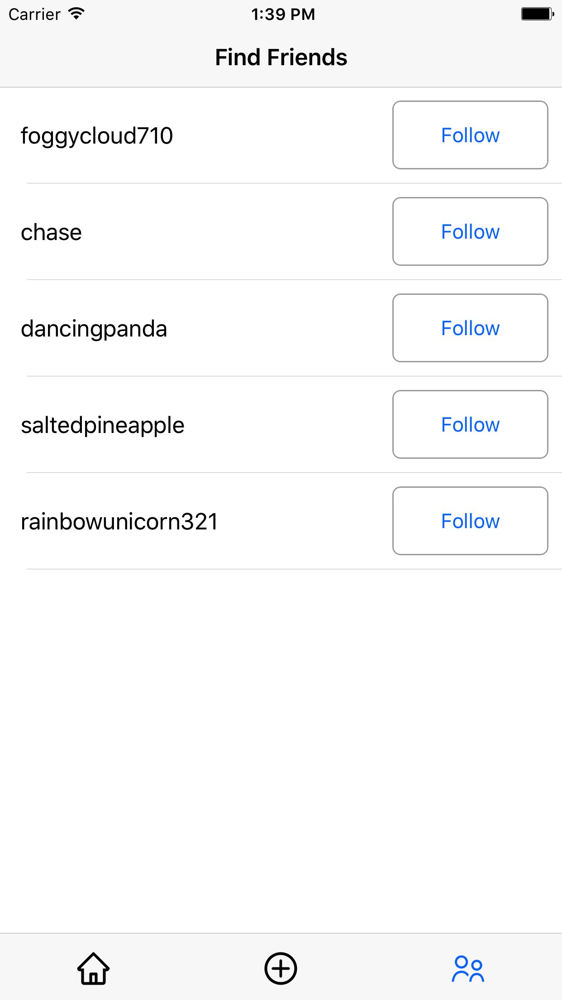

Let's get started by creating a `FindFriendsViewController.swift` file.

> [action]
Create a new view controller named `FindFriendsViewController`:
>
```
import UIKit
>
class FindFriendsViewController: UIViewController {
>
    override func viewDidLoad() {
        super.viewDidLoad()
    }
}
```


After creating the file, we'll want to set the class for our third tab view controller in our main storyboard.

> [action]
Open `Main.storyboard` and select the view controller for the third tab. Open the _Identity Inspector_ and set the class to `FindFriendsViewController`:
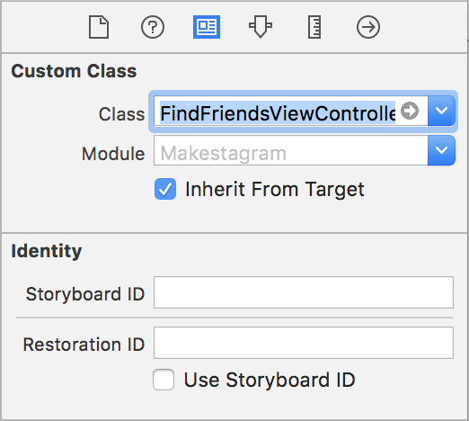

Next, we'll embed our `FindFriendsViewController` within a navigation controller. This will give us a navigation bar for our view controller.

> [challenge]
Embed your `FindFriendsViewController` in storyboard into a `UINavigationController`. Then with both the `UINavigationController` and `FindFriendsViewController` selected, refactor both into a new storyboard called `FindFriends.storyboard`.

<!--  -->

> [solution]
To refactor into a new storyboard, select the `FindFriendsViewController` and `UINavigationController` by click-dragging over both of them. Next, click the `Editor`>`Refactor to Storyboard...` button in the top menu. Name this storyboard `FindFriends.storyboard`.
>
When your done your `FindFriends.storyboard` should look like the image below: 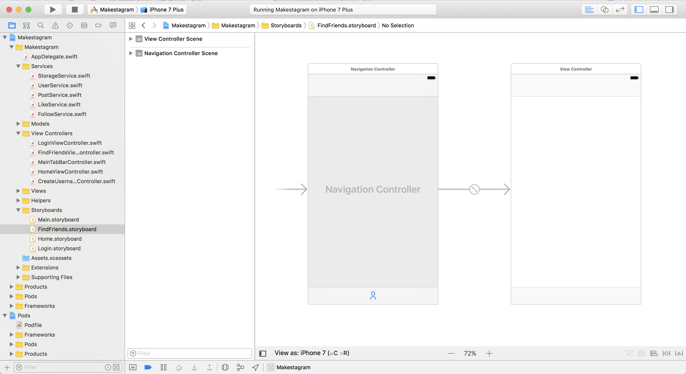

In our new storyboard, let's set the title for the navigation bar of `FindFriendsViewController` to `Find Friends`.

> [action]
Select the navigation bar of the `FindFriendsViewController`. Open the Attributes Inspector and set the `Title` property of the `Navigation Item` to `Find Friends`:
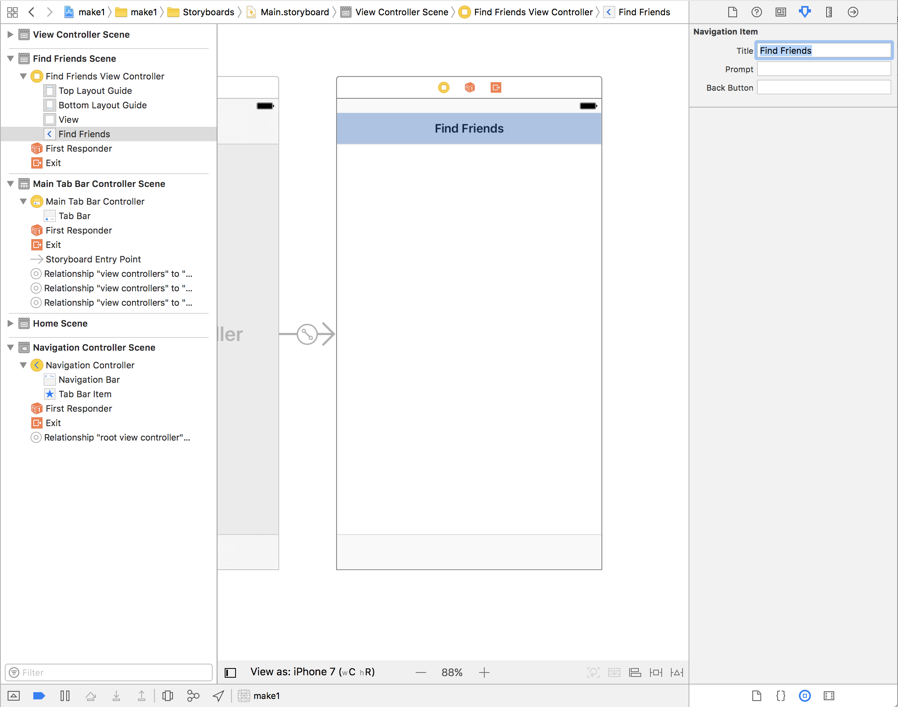

# Adding the Table View

We'll now add our `UITableView` to our view controller.

> [action]
Drag a `UITableView` from the _Object Library_ onto the `FindFriendsViewController`. Set the constraints to the edges of the superview. Make sure you constraint the top and bottom of the table view to the view, not the top and bottom layout guides: 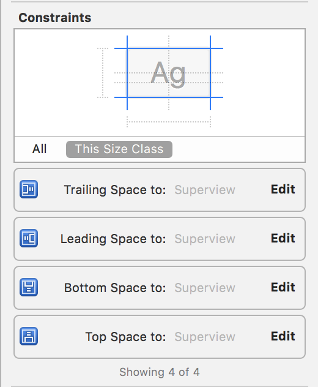
>
Before moving on, ctrl-drag from the `UITableView` to the `FindFriendsViewController` and set the `UITableViewDataSource`.

## Creating a FindFriendsCell

Next we'll create our prototype cell that will represent other users on Makestagram. For each user we need:

1. A `UILabel` to display the user's username
1. A `UIButton` to follow or unfollow each user

> [action]
Drag and drop a new prototype cell from the object library onto the new `UITableView` of the `FindFriendsViewController`: 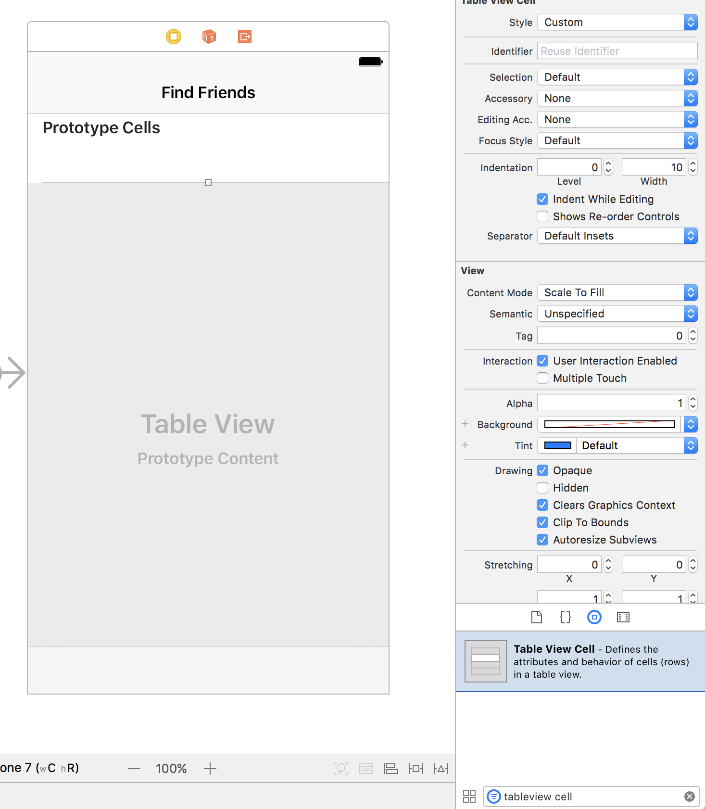
>
We'll also need to create an accompanying source file for our cell. Create a new subclass of `UITableViewCell` called `FindFriendsCell.swift`:
>
```
import UIKit
>
class FindFriendsCell: UITableViewCell {
>
    override func awakeFromNib() {
        super.awakeFromNib()
    }
}
```

## Configuring the FindFriendsCell

> [action]
Next we'll begin configuring the cell:
>
1. Select the cell and open the size inspector. Add a custom row height of 71: 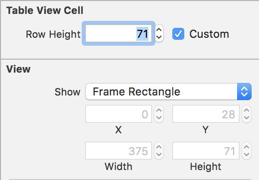
1. Open the Attributes Inspector and set the `Cell Identifier` as `FindFriendsCell`: 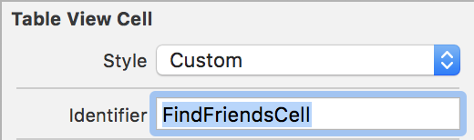
1. Add a `UILabel` with the following with the following constraints: 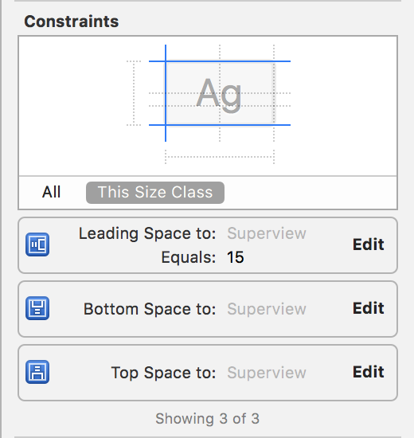
1. Add a follow/unfollow `UIButton` with the following constraints: 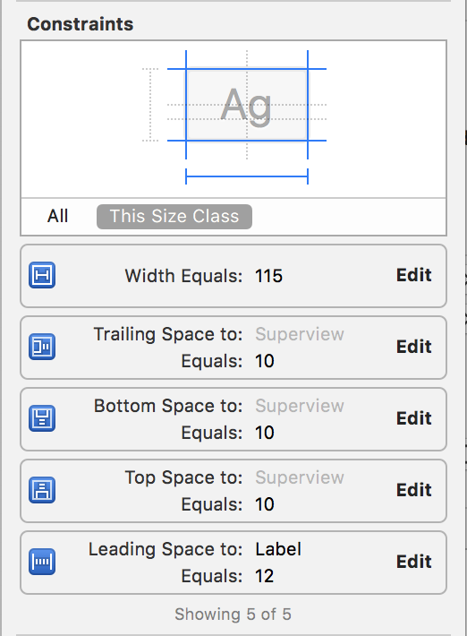
1. Set the custom class in the _Identity Inspector_ in our storyboard: 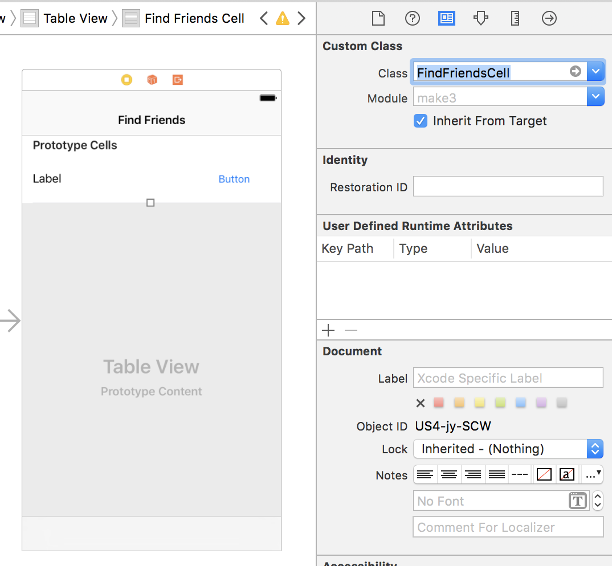

## Setting Up IBOutlets and IBActions

Let's make IBOutlets for both the label and the button of the `FindFriendsCell`.

> [action]
Open your `FindFriendsCell` source file and the `FindFriends.storyboard` side-by-side: 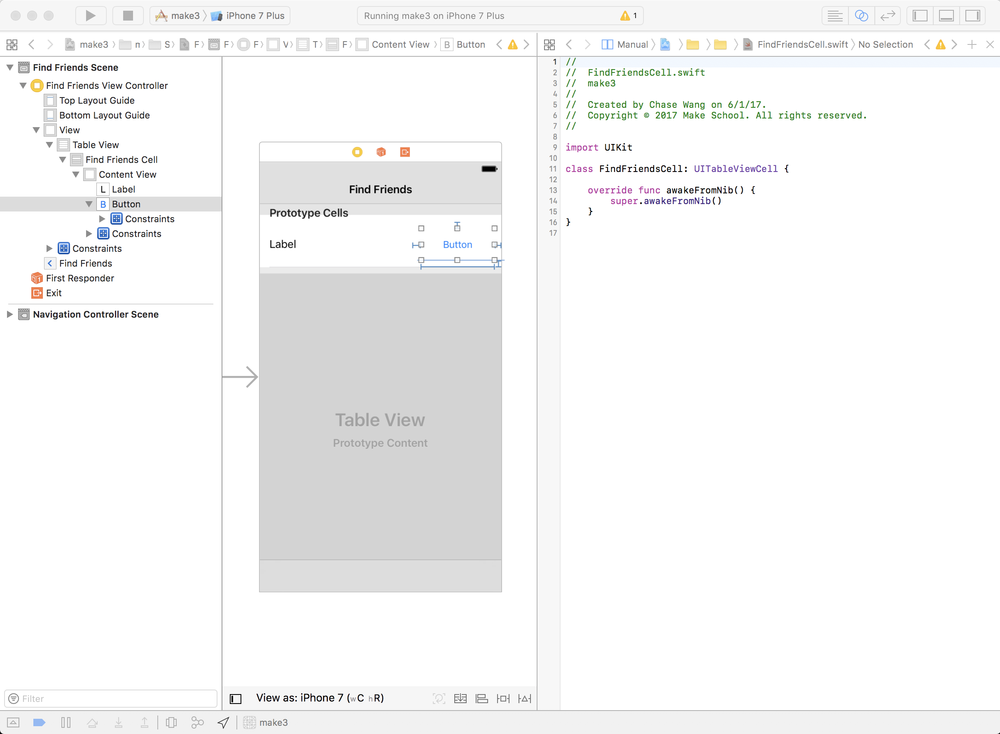
>
Create an IBAction for the label and follow button. Your code should look like the following after creating the IBOutlets and IBActions:
>
```
import UIKit
>
class FindFriendsCell: UITableViewCell {
>
    // MARK: - Properties
>
    @IBOutlet weak var followButton: UIButton!
    @IBOutlet weak var usernameLabel: UILabel!
>
    // MARK: - Cell Lifecycle
>
    override func awakeFromNib() {
        super.awakeFromNib()
    }
>
    // MARK: - IBActions
>
    @IBAction func followButtonTapped(_ sender: UIButton) {
        print("follow button tapped")
    }
}
```

For our last IBOutlet, we'll switch to our `FindFriendsViewController`.

> [action]
Open both the the `FindFriendsViewController` source file and `FindFriends.storyboard` side-by-side and create an IBOutlet for the `UITableView`: 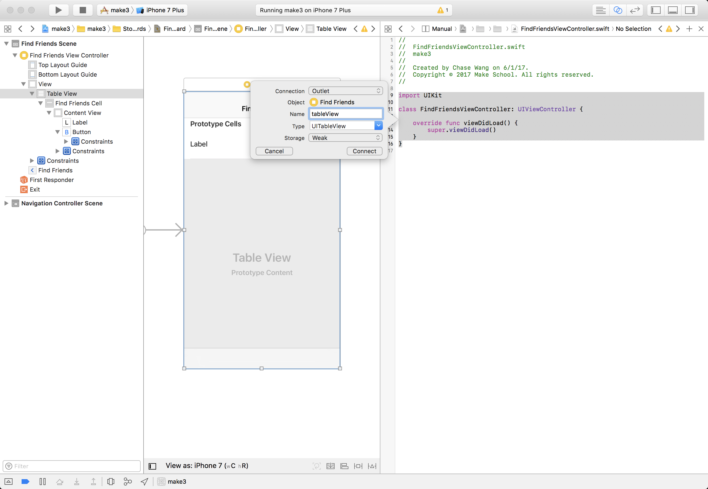

## Adding Style Customizations

We've created the basic structure for our cell, now it's time to add some small style customizations. We're going to add different titles based on the selection of the cell.

> [action]
Open `FindFriendsCell` source file and change `awakeFromNib` to the following:
>
```
override func awakeFromNib() {
    super.awakeFromNib()
>
    followButton.layer.borderColor = UIColor.lightGray.cgColor
    followButton.layer.borderWidth = 1
    followButton.layer.cornerRadius = 6
    followButton.clipsToBounds = true
>
    followButton.setTitle("Follow", for: .normal)
    followButton.setTitle("Following", for: .selected)
}
```

Next, we'll configure the table view in `FindFriendsViewController`.

> [action]
Open `FindFriendsViewController` and modify it to the following:
>
```
class FindFriendsViewController: UIViewController {
>
    // MARK: - Properties
>
    var users = [User]()
>
    // MARK: - Subviews
>
    @IBOutlet weak var tableView: UITableView!
>
    // MARK: - VC Lifecycle
>
    override func viewDidLoad() {
        super.viewDidLoad()
>
        // remove separators for empty cells
        tableView.tableFooterView = UIView()
        tableView.rowHeight = 71
    }
}
```

# Implementing the Data Source

We create a empty array of users to hold all of our users. Next we'll need to add code for our `UITableViewDataSource`.

> [action]
Add the following add the bottom of your file:
>
```
// MARK: - UITableViewDataSource
>
extension FindFriendsViewController: UITableViewDataSource {
    func tableView(_ tableView: UITableView, numberOfRowsInSection section: Int) -> Int {
        return users.count
    }
>
    func tableView(_ tableView: UITableView, cellForRowAt indexPath: IndexPath) -> UITableViewCell {
        let cell = tableView.dequeueReusableCell(withIdentifier: "FindFriendsCell") as! FindFriendsCell
        configure(cell: cell, atIndexPath: indexPath)
>
        return cell
    }
>
    func configure(cell: FindFriendsCell, atIndexPath indexPath: IndexPath) {
        let user = users[indexPath.row]
>
        cell.usernameLabel.text = user.username
    }
}
```

Now we need to fetch all of the users on the server and display them. But first we'll add a `isFollowed` property to our `User` class.

> [action]
Open `User.swift` and add a new property:
>
```
var isFollowed = false
```
>
Next, we'll edit our `configure(cell:atIndexPath:)` with the following:
>
```
func configure(cell: FindFriendsCell, atIndexPath indexPath: IndexPath) {
    let user = users[indexPath.row]
>
    cell.usernameLabel.text = user.username
    cell.followButton.isSelected = user.isFollowed
}
```

# Fetching All Users

Now to finish things up, let's create a service to fetch all users on the app and display them.

> [action]
Open `UserService` and create the follow new service method:
>
```
static func usersExcludingCurrentUser(completion: @escaping ([User]) -> Void) {
    let currentUser = User.current
    // 1
    let ref = Database.database().reference().child("users")
>
    // 2
    ref.observeSingleEvent(of: .value, with: { (snapshot) in
        guard let snapshot = snapshot.children.allObjects as? [DataSnapshot]
            else { return completion([]) }
>
        // 3
        let users =
            snapshot
                .flatMap(User.init)
                .filter { $0.uid != currentUser.uid }
>
        // 4
        let dispatchGroup = DispatchGroup()
        users.forEach { (user) in
            dispatchGroup.enter()
>
            // 5
            FollowService.isUserFollowed(user) { (isFollowed) in
                user.isFollowed = isFollowed
                dispatchGroup.leave()
            }
        }
>
        // 6
        dispatchGroup.notify(queue: .main, execute: {
            completion(users)
        })
    })
}
```

The code we've implemented here is similar to the code we've previously written for determining whether each of a user's posts was liked by the current user. Let's break it down:

1. Create a `DatabaseReference` to read all users from the database.
1. Read the `users` node from the database.
1. Take the snapshot and perform a few transformations. First, we convert all of the child `DataSnapshot` into `User` using our failable initializer. Next we filter out the current user object from the `User` array.
1. Create a new `DispatchGroup` so that we can be notified when all asynchronous tasks are finished executing. We'll use the `notify(queue:)` method on `DispatchGroup` as a completion handler for when all follow data has been read.
1. Make a request for each individual user to determine if the user is being followed by the current user.
1. Run the completion block after all follow relationship data has returned.

Let's hook this up in our `FindFriendsViewController`.

> [action]
Open `FindFriendsViewController` and add the following in `viewWillAppear(_:)`:
>
```
override func viewWillAppear(_ animated: Bool) {
    super.viewWillAppear(animated)
>
    UserService.usersExcludingCurrentUser { [unowned self] (users) in
        self.users = users
>
        DispatchQueue.main.async {
            self.tableView.reloadData()
        }
    }
}
```

Here, we fetch all users from our database and set them to our datasource. Then we refresh the UI on the main thread because all UI updates must be on the main thread. If everything works correctly you should see all others you've created on the database. If you don't have any other users, delete the app and create a couple new users to see your progress.

# Implementing the Follow Button Logic

Now we can move on to the last part of configuring our UI: enabling our button to work. To do so, let's create a delegate for our `FindFriendsCell`.

> [action]
Add the following to the top of your `FindFriendsCell` class:
>
```
protocol FindFriendsCellDelegate: class {
    func didTapFollowButton(_ followButton: UIButton, on cell: FindFriendsCell)
}
```
>
Next we'll add a delegate to the cell itself:
>
```
class FindFriendsCell: UITableViewCell {
>
    weak var delegate: FindFriendsCellDelegate?
>
    // ...
}
>
```
>
And call the delegate when the follow button is tapped:
>
```
@IBAction func followButtonTapped(_ sender: UIButton) {
    delegate?.didTapFollowButton(sender, on: self)
}
```

In our `FindFriendsViewController` we'll need to set and implement the `FindFriendsCellDelegate`.

> [action]
Open `FindFriendsViewController` and modify `tableView(_:cellForRowAt:)` to the following:
>
```
func tableView(_ tableView: UITableView, cellForRowAt indexPath: IndexPath) -> UITableViewCell {
    let cell = tableView.dequeueReusableCell(withIdentifier: "FindFriendsCell") as! FindFriendsCell
    cell.delegate = self
    configure(cell: cell, atIndexPath: indexPath)
>
    return cell
}
```

Last, let's make sure our `FindFriendsViewController` conforms to the protocol.

> [action]
Implement the `FindFriendsCellDelegate` in `FindFriendsViewController`. Add the following code to the bottom of your view controller:
>
```
extension FindFriendsViewController: FindFriendsCellDelegate {
    func didTapFollowButton(_ followButton: UIButton, on cell: FindFriendsCell) {
        guard let indexPath = tableView.indexPath(for: cell) else { return }
>
        followButton.isUserInteractionEnabled = false
        let followee = users[indexPath.row]
>
        FollowService.setIsFollowing(!followee.isFollowed, fromCurrentUserTo: followee) { (success) in
            defer {
                followButton.isUserInteractionEnabled = true
            }
>
            guard success else { return }
>
            followee.isFollowed = !followee.isFollowed
            self.tableView.reloadRows(at: [indexPath], with: .none)
        }
    }
}
```

# Conclusion

We're done! Test it out. Try following and unfollowing users and see the changes in your Firebase database. You should also see the UI change from follow to following whether a user is being followed.
