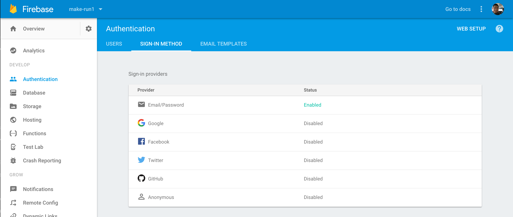

In this extension, we'll be customizing `FirebaseUI` by adding support for Facebook and Google login. Setting up 3rd party login is tedious but luckily, `FirebaseAuth` will help alleviate some of the setup.

For our users, it's really easy to confuse, mix-up, or even forgetting all the emails, usernames, and passwords used to sign up for different apps. Implementing 3rd party login, such as with Facebook and Google, will make it easier for users to authenticate without having to worrying about remembering their credentials.

Be warned! Even with `FirebaseAuth`, there's a lot of setup and following instructions to implement Facebook and Google login.

# Adding Facebook Login

Implementing Facebook login isn't technically challenging, but there are many steps to follow. Make sure that you're following each step in order!

## Creating a New Facebook App

First we'll need to register our app on Facebook.

> [action]
Follow the steps below to register your app on Facebook
>
1. We'll need to create a new app on the [Facebook for Developers](https://developers.facebook.com/) site. Click the `Log In` button at the top right hand corner and log into Facebook if you're not already. 
>
1. Next, hover over `My Apps` next to your profile pictures. This will be in the top right hand corner of the navigation bar. You should see the ability to `Add a New App`. Click the button and follow the instructions involved: 
>
Unfortunately, Facebook won't let you create new app with the Display Name including the term `gram`, so for now you can use something like `Make School App`. When you're new Facebook app has been created, you should land on a dashboard for integrating different Facebook products into your app that looks like this: 

## Adding the iOS Platform

The next thing we'll need to do is configure out new Facebook App by adding the iOS platform.

> [action]
Add the iOS platform to your registered Facebook app:
>
1. Navigate to the `Settings` tab of your app. 
>
1. Under your basic settings, look for the `Add Platform` button. 
>
1. Select the iOS platform to add. You should see a new form for setting up your iOS app with Facebook. Make sure to add your `Bundle Identifier` from your iOS app. 

## Installing the Facebook SDK Cocoapods

Next, we'll install the Facebook SDK. There's multiple ways of installing the Facebook SDK, but we'll use CocoaPods because we're most familiar with it.

> [action]
Add the following lines to your Podfile.
>
```
target 'Makestagram' do
  use_frameworks!
>
  // ...
>
  pod 'FacebookCore'
  pod 'FacebookLogin'
>
  // ...
end
```
>
After make the changes above to your Podfile, open terminal and navigate to the root directory of your project. Run `pod install` before moving on.

## Configuring Facebook Login

Open your browser and navigate back to your Facebook App. From here, we'll configure Facebook login.

> [action]
In the left-side navigation pane, click the `+ Add Product` button.

>
When prompted, select the iOS platform. You'll be directed to a list of instructions to follow. You should see the screen below:

>
**Skip** steps 1 and 2. You have already installed the Facebook SDK via Cocoapods.
>
To finish the configuration for Facebook login, you'll need to follow steps 3 through 5. You don't need to complete steps 6-10 because we'll be using `FirebaseUI` to handle our Facebook login UI.

# Setting Up Firebase for Facebook Login

At this point, we've configured and set up Facebook to handle Facebook login. Now we'll move over to Firebase and handle the Firebase configuration as well. First we'll add Facebook as a sign-in provider. Currently our app only has email/password authentication. Let's change that now:

> [action]
Follow the instructions to enable Facebook as a sign-in provider:
>
1. Open your Firebase project in a new browser and click on the Authentication tab. 
>
1. Next change the top navigation from `USERS` to `SIGN-IN METHOD`. You should see a list of `Sign-in Providers`: 
>
1. Click the Facebook provider and fill in info based on your Facebook App Dashboard: 
>
1. You'll need to go back to your Facebook Login settings to add the OAuth Redirect URI as instructed in above: 
>
1. Open your Facebook App and open your Facebook Login settings. Insert the OAuth Redirect URI: 

Great! Your Facebook sign-in provider should now be enabled:


# Configuring Firebase Facebook Login UI

Now that both Facebook and Firebase are correctly setup to handle Facebook login functionality, we'll add the UI to handle the functionality. First, we'll need to install a new Cocoapod called `pod 'FirebaseUI/Facebook'`:

> [action]
Open your Podfile and add the following line:
>
```
target 'Makestagram' do
>
    // ...
>
    pod 'FirebaseUI/Facebook'
end
```
>
Open terminal and navigate to the root directory of the project. Type `pod install` before continuing.

Last, we'll need to add some code to implement our new Facebook login UI.

# Implementing FirebaseUI for Facebook Login

First, we'll add a new method to our `AppDelegate`:

> [action]
Open `AppDelegate` and make sure you import `FirebaseUI` at the top of the file:
>
```
import FirebaseUI
```
>
Next add the following method to your app delegate:
>
```
func application(_ app: UIApplication, open url: URL, options: [UIApplicationOpenURLOptionsKey : Any] = [:]) -> Bool {
    let sourceApplication = options[UIApplicationOpenURLOptionsKey.sourceApplication] as! String?
    if FUIAuth.defaultAuthUI()?.handleOpen(url, sourceApplication: sourceApplication) ?? false {
        return true
    }
>
    // other URL handling goes here
>
    return false
}
```

This will handle any URL that direct back to our app. Specifically it'll handle redirecting data and control back to our app after a user has logged into Facebook.

Next, we'll need to add two lines of code to implement the actual Facebook login UI.

> [action]
Open `LoginViewController` and make sure you add the line below at the top of your source file:
>
```
import FirebaseFacebookAuthUI
```
>
Then add the following two lines to `loginButtonTapped(_:)`:
>
```
@IBAction func loginButtonTapped(_ sender: UIButton) {
    guard let authUI = FUIAuth.defaultAuthUI()
        else { return }
>
    authUI.delegate = self
>
    // configure Auth UI for Facebook login
    let providers: [FUIAuthProvider] = [FUIFacebookAuth()]
    authUI.providers = providers
>
    let authViewController = authUI.authViewController()
    present(authViewController, animated: true)
}
```

By setting the `authUI` providers, we configure the `authViewController` with the ability to allow users to login with Facebook! Next, we'll look at implementing the same functionality with Google.

# Adding Google Login

Now that we've been through the steps of adding a 3rd party login once, it'll be a lot easier the second time. Let's begin adding Google login!

## Configuring Google Sign-In

Google Sign-In uses cocoapods to install and manage dependencies. We'll need to install another pod to continue.

> [action]
Add the following line to your Podfile
>
```
target 'Makestagram' do
  // ...
>
  pod 'GoogleSignIn'
end
```
>
After adding the line above, open terminal and navigate to the root directory of your project. Run `pod install` to add the new dependencies.

## Setting Up Firebase for Google Sign-In

Similar to how we configured Firebase with a Sign-In Provider for Facebook login, we'll need to do the same for Google Sign-In.

> [action]
Follow the steps below to enable Google as a Sign-In Provider:
>
1. Navigate and enable the Sign-In Provider for Google for your Firebase project. 
>
1. 

Follow all steps to this point, you should now have 3 Sign-In Providers enabled:


## Adding a Custom URL Scheme

To finish setting up the functionality for Google Sign-In, we'll need to add a new custom URL scheme. Previous we followed Facebook instructions to do this, and adding a new URL scheme directly to our Info.plist file. This time, we'll add a new custom URL scheme in our project configuration.

> [action]
1. Open your project configuration by clicking on project name in your project navigator. 
>
1. Make sure your app is selected in the Targets section: 
>
1. Then select the Info tab and open the URL Types section at the bottom. You should see 1 URL Type for Facebook. 
>
1. Click the + button, and add a URL scheme for your reversed client ID. To find this value, open the GoogleService-Info.plist configuration file, and look for the REVERSED_CLIENT_ID key. Copy the value of that key, and paste it into the URL Schemes box on the configuration page. Leave the other fields blank. 

We've successfully set up the functionality to implement Google Sign-In. Let's look at configuring the UI next.

## Configuring the UI

We've already done a lot of setup previous when we added the Facebook login UI to FirebaseUI. This time will be a lot easier. First we'll need to install the corresponding dependencies for FirebaseUI.

> [challenge]
Install the pod `FirebaseUI/Google`.

<!--  -->

> [solution]
Your Podfile should now look like:
>
```
target 'Makestagram' do
  // ...
>
  pod 'FirebaseUI/Facebook'
  pod 'FacebookCore'
  pod 'FacebookLogin'
>
  pod 'FirebaseUI/Google'
  pod 'GoogleSignIn'
end
```
>
Don't forget you have to run `pod install` to install new dependencies from FirebaseUI.

Last, we'll need to modify our code so FirebaseUI will know to display the correct UI.

> [action]
Open `LoginViewController` and add the following import statement to the top of your code:
>
```
import FirebaseGoogleAuthUI
```
>
Next, change `loginButtonTapped(_:)` to the following:
>
```
@IBAction func loginButtonTapped(_ sender: UIButton) {
    guard let authUI = FUIAuth.defaultAuthUI()
        else { return }
>
    authUI.delegate = self
>
    // add google provider
    let providers: [FUIAuthProvider] = [FUIGoogleAuth(), FUIFacebookAuth()]
    authUI.providers = providers
>
    let authViewController = authUI.authViewController()
    present(authViewController, animated: true)
}
```

In the code above, we added the FUIGoogleAuth provider so our UI will update accordingly.

Let's run the app to test things out! You might need to delete the app off of your phone if you're already logged in. When you click the login button, you should see the ability to sign in with Google and Facebook!

# Where To Go From Here?

Whew! That was a lot of setup and configuration.

We've now successfully implemented the functionality for Facebook and Google authentication with FirebaseUI. Providing 3rd party authentication for are users makes it easier for them to log in without having to remember their credentials.

If you're looking for more control and customization of the UI, you can implement your own custom UI while using Firebase authentication with Facebook and Google. You can look into the documentation of how to do that here:

[Facebook Login](https://firebase.google.com/docs/auth/ios/facebook-login)
[Google Sign-In](https://firebase.google.com/docs/auth/ios/google-signin)

<!-- TODO: consider adding ui customizations to firebase auth ui -->
