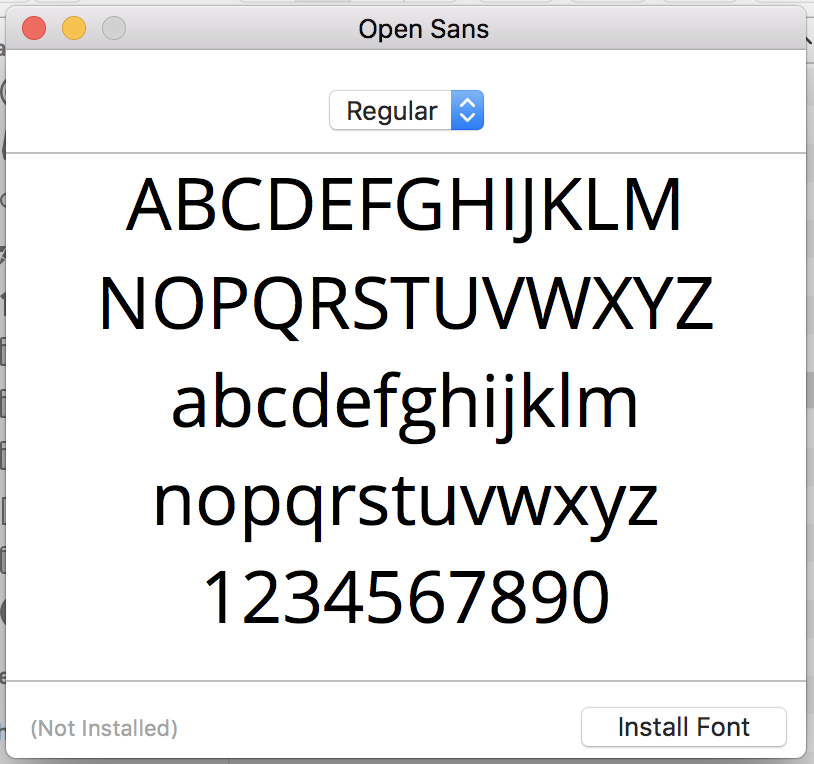

In this extension, we'll take a look at keeping the design across our app consistent. As we build different screen and multiple view controllers, we want to make sure that we use the same colors, fonts and font sizes.

In this extension, we'll work on three things:

1. Adding a custom font to our app
2. Making it easy to create `UIColor` with hex values
3. Creating a unified style sheet we can reuse through our app
<!-- TODO: 4. Add UIAppearance -->

# Adding a Custom Font

As a beginner, most of the time you'll be using the System font `San Francisco` in your app. However, at some point you may want to add a custom font that isn't supported by iOS out of the box. To do that, we'll need to add and configure our custom font to our Xcode project.

In this step, we'll add the font `Open Sans` to use in our project. But first, we'll need to download the .ttf file for `Open Sans` by [clicking here.](https://www.fontsquirrel.com/fonts/open-sans).

After downloading the .ttf file, install each `Open Sans` weight on your mac. You can do this double-clicking on the .ttf font variation. You should see a prompt to install the font.



Now that we've installed `Open Sans` on our computer, we still need to add it to our Xcode project. Let's do that next:

Follow the steps provided at the link below:

[Adding a Custom Font to your iOS App](http://codewithchris.com/common-mistakes-with-adding-custom-fonts-to-your-ios-app/)

After following all the steps in the link above, you should be able to access the `Open Sans` font in IBBuilder. Additionally, we'll be able to access our code programmatically with the following line of code:
```
let openSansFont = UIFont(name: "OpenSans", size: 12)
```

Now that we've successfully added a custom font, let's look at adding colors as hex values programmatically.

# Creating UIColors with Hex Values

We know how to add hex values through storyboard, but sometimes we'll want to set colors programmatically so we don't have to fumble through the various settings of IBBuilder. To do that, we'll create a new extension to add additional functionality to `UIColor`.

> [action]
Create a new extension for `UIColor` named `UIColor+Utility.swift`:
>
```
import UIKit
>
extension UIColor {
    // ...
}
```
>
Next, we'll create an initializer to create a `UIColor` from a hex value. Add the following to your extension:
>
```
extension UIColor {
    /*
     * Converts hex integer into UIColor
     *
     * Usage: UIColor(hex: 0xFFFFFF)
     *
     */
    
    private convenience init(hex: Int) {
        let components = (
            R: CGFloat((hex >> 16) & 0xff) / 255,
            G: CGFloat((hex >> 08) & 0xff) / 255,
            B: CGFloat((hex >> 00) & 0xff) / 255
        )
        
        self.init(red: components.R, green: components.G, blue: components.B, alpha: 1)
    }
}
```

We make our convenience initializer private because we don't want to encourage hard-coding hex values throughout the rest of our app. Within our initializer we break down our hex value into RBG components and use the `UIColor.(red:green:blue:)` initializer to create a new instance of `UIColor`.

Right now, we won't be able to use this new convenience initializer from other source files because it's access control. We'll look at how to make use of our hex initialier in the next step!

# Create a App Style Sheet

Throughout our app, we'll want to create a consistent design by reusing the same colors, fonts, and font sizes throughout our app. An easy way to do this is to define static variables for each of our brand colors and fonts. Then we can reuse each of these static variables throughout our app without having to worry about keeping our `UIFont` or `UIColor` values consistent.

To start, we'll make use of our new convenience initializer for creating a `UIColor` from a hex value:

> [action]
Add the following static variables to our `UIColor+Utility.swift` extension:
>
```
extension UIColor {
    // ...
>
    static var mgBlue: UIColor {
        return UIColor(hex: 0x3796F0)
    }
>
    static var mgLightGray: UIColor {
        return UIColor(hex: 0xDDDCDC)
    }
>
    static var mgRed: UIColor {
        return UIColor(hex: 0xE7554B)
    }
}
```
    
We've added a few brand colors that we can reuse throughout our entire app. Whenever we want to set a `UIColor` programmatically, we can simply use the code:

```
let brandBlue = UIColor.mgBlue
```

Not only do we have to worry about stringly-typed code or setting the correct hex value, but if we ever decide to change the brand colors, we can simply change the hex value in our extension file. From there, all of our source files will be updated everywhere. This saves us the trouble of having to go through and modify each source file individual in the case we want to change a brand color.

Next, we'll apply the same principle for our `Open Sans` font.

> [action]
Create a new source file called `UIFont+Utility.swift` and add the following code:
>
```
import UIKit.UIFont
>
extension UIFont {
>
    // MARK: - Brand Fonts
>
    static var mgRegular: UIFont {
        return UIFont(name: "OpenSans", size: 16)!
    }
}
```
    
We can now reuse our regular font size with the following line:

```
let regularFont = UIFont.mgRegular
```

You can create multiple brand fonts for headers, subheaders, subtext, etc. This will allow you to easily reuse and enforce consistent fonts throughout your app!

# Where To Go From Here?

In conclusion, we've learned more about app style sheets by learning how to add a custom font and adding reusable extensions to `UIFont` and `UIColor`. In the future, we can reuse this in our projects to make it easier to keep a consistent design throughout our app!

<!-- TODO: add UIAppearance -->
