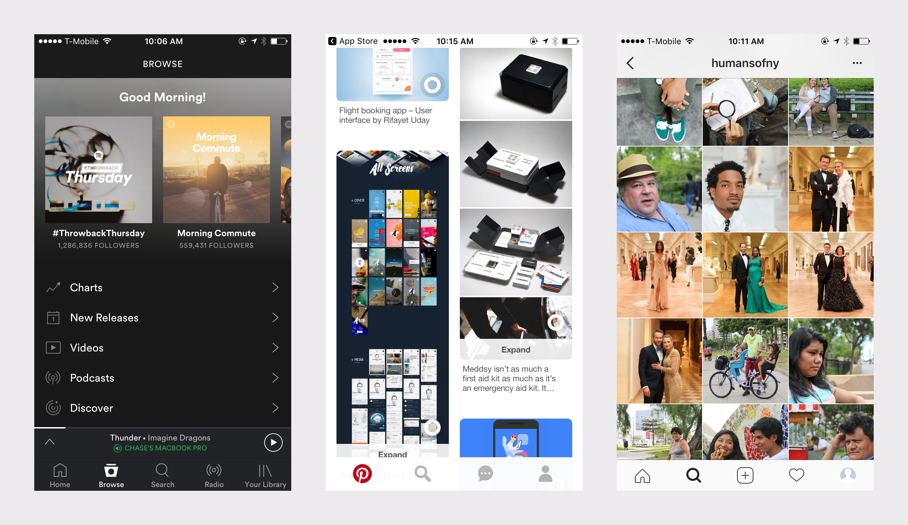
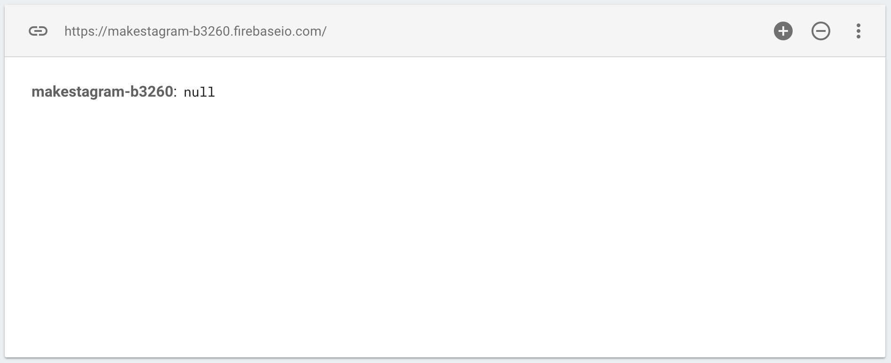

<!-- TODO: FirebaseAuth log out functionality should be refactored into separate service struct -->

In this extension, we'll look at another key component in `UIKit` called `UICollectionView`.

Collection views allow us to build scrolling interfaces that have flexible, changeable layouts. This allows us to display content in formats such as grids and horizontal scrolling cells.

You have most likely used many `UICollectionView` in popular apps including Spotify, Pinterest, and of course, Instagram.



> [challenge]
Spot the collection view and identify what it's used for in each of the examples above.

<!-- break -->

> [solution]
Each of the apps above use collection views in different ways:
>
- Spotify: horizontal scrolling playlists
- Pinterest: cascading waterfall feed
- Instagram: 3x3 photo grid

In this extension, you'll learned the foundation for building your own collection views like the ones above. We'll use `UICollectionView` to implementing a profile view controller similar to Instagram's. When we're finished our new profile view controller will look like this:


# Profile Setup

Before we start implementing our design, we'll want to:

1. Break down our design into `UIKit` components that we'll implement
1. Think about which service methods we'll need to add or modify to support the new feature

We'll start laying the ground work by taking a closer look at the design.

## Breaking Down the Design

For our design, we'll use a single `UICollectionView` to display the profile.

Collection views have a built in `SupplementaryView` that allows us to create headers and footers for each section. We'll use the `SupplementaryView` to create a `ProfileHeaderView`. The `ProfileHeaderView` will contain some additional info about each user and a settings button to allow the user to sign out.

The rest of the collection view will be used to display a grid format of thumbnails for each post's image.

We'll implement our `UICollectionView` like this:


Note that to implement the new design, we'll need to rearrange our current `UITabBarController` and `FindFriendsViewController`. We'll move the `FindFriendsViewController` from a tab to an `UIBarButtonItem` on the profile view controller navigation bar.

## Structuring New Data

Implementing our profile header view will require us to store additional data in Firebase. Similar to how we previously implemented a `like_count` for each post, we'll want to store the following additional data with each user object in our JSON tree:

- post_count
- follower_count
- following_count

Our new database `user` object will look like this:

```
users: {
    user1_uid: {
        follower_count: 5,
        following_count: 3,
        post_count: 10,
        username: "chase"
    },
    user2_uid: {...},
    user3_uid: {...}
}
```

We'll use transaction blocks to increment and decrement these counts. Keeping these new count data consistent will require us to modify our existing services to include this functionality.

## Modifying Existing Services

To save the data above, we'll need to modify our existing services as follows:

1. When creating a new user, each of the new user's counts should be initially set as 0
1. When creating a new post, the current user's post count should be incremented by 1
1. When following a user, both follower and followee need to have their following/follower count incremented respectively
1. When unfollowing a user, both unfollower and unfollowee need to have their following/follower count decremented respectively

We'll start by initially setting each user's profile counts to 0 when a new user is first created.

> [action]
Open your `UserService` and find the `create(_:username:completion:)` service method. Change the `userAttrs` dictionary to the following:
>
```
static func create(_ firUser: FIRUser, username: String, completion: @escaping (User?) -> Void) {
    let userAttrs: [String : Any] = ["username": username,
                                      "follower_count": 0,
                                      "following_count" : 0,
                                      "post_count" : 0]
>
    // ...
}
```

Each new user will now initially have a `follower_count`, `following_count`, and `post_count` of 0 when they first sign up.

Before we continue modifying our service methods, we'll need to change the `User` model to store our new data.

> [action]
Add the following properties to `User.swift`:
>
```
var followerCount: Int?
var followingCount: Int?
var postCount: Int?
```

We'll also want to change our failable initializer to read our new JSON data from Firebase.

> [action]
Modify the `User` failable initializer to read and store the new count data:
>
```
init?(snapshot: DataSnapshot) {
    guard let dict = snapshot.value as? [String : Any],
        let username = dict["username"] as? String,
        let followerCount = dict["follower_count"] as? Int,
        let followingCount = dict["following_count"] as? Int,
        let postCount = dict["post_count"] as? Int
        else { return nil }
>
    self.uid = snapshot.key
    self.username = username
    self.followerCount = followerCount
    self.followingCount = followingCount
    self.postCount = postCount
>
    super.init()
}
```

With the following changes, we'll be able to store our new user data.

Now let's continue with modifying our service methods to support the new profile feature. We want to increment the `post_count` of each user every time a new post is created.

> [action]
Open `PostService` and navigate to `create(forURLString:aspectHeight:)`. We'll be adding an additional transaction operation to increment the post count of the current user.
>
```
private static func create(forURLString urlString: String, aspectHeight: CGFloat) {
    // ...
>
    UserService.followers(for: currentUser) { (followerUIDs) in
        // ...
>
        rootRef.updateChildValues(updatedData, withCompletionBlock: { (error, ref) in
            let postCountRef = Database.database().reference().child("users").child(currentUser.uid).child("post_count")
>
            postCountRef.runTransactionBlock({ (mutableData) -> TransactionResult in
                let currentCount = mutableData.value as? Int ?? 0
>
                mutableData.value = currentCount + 1
>
                return TransactionResult.success(withValue: mutableData)
            })
        })
    }
}
```

Next, let's move on to modifying the follow and unfollow service methods.

> [action]
Open `FollowService` and modify the `followUser(_:forCurrentUserWithSuccess:)`:
>
```
private static func followUser(_ user: User, forCurrentUserWithSuccess success: @escaping (Bool) -> Void) {
    let currentUID = User.current.uid
    let followData = ["followers/\(user.uid)/\(currentUID)" : true,
                      "following/\(currentUID)/\(user.uid)" : true]
>
    let ref = Database.database().reference()
    ref.updateChildValues(followData) { (error, _) in
        if let error = error {
            assertionFailure(error.localizedDescription)
            success(false)
        }
>
        // 1
        let dispatchGroup = DispatchGroup()
>
        // 2
        dispatchGroup.enter()
>
        // 3
        let followingCountRef = Database.database().reference().child("users").child(currentUID).child("following_count")
        followingCountRef.runTransactionBlock({ (mutableData) -> TransactionResult in
            // 4
            let currentCount = mutableData.value as? Int ?? 0
            mutableData.value = currentCount + 1
>
            return TransactionResult.success(withValue: mutableData)
        }, andCompletionBlock: { (error, committed, snapshot) in
            if let error = error {
                assertionFailure(error.localizedDescription)
                return
            }
>
            dispatchGroup.leave()
        })
>
        // 5
        dispatchGroup.enter()
        let followerCountRef = Database.database().reference().child("users").child(user.uid).child("follower_count")
        followerCountRef.runTransactionBlock({ (mutableData) -> TransactionResult in
            let currentCount = mutableData.value as? Int ?? 0
            mutableData.value = currentCount + 1
>
            return TransactionResult.success(withValue: mutableData)
        }, andCompletionBlock: { (error, committed, snapshot) in
            if let error = error {
                assertionFailure(error.localizedDescription)
                return
            }
>
            dispatchGroup.leave()
        })
>
        // 6
        dispatchGroup.enter()
        UserService.posts(for: user) { (posts) in
            let postKeys = posts.flatMap { $0.key }
>
            var followData = [String : Any]()
            let timelinePostDict = ["poster_uid" : user.uid]
            postKeys.forEach { followData["timeline/\(currentUID)/\($0)"] = timelinePostDict }
>
            ref.updateChildValues(followData, withCompletionBlock: { (error, ref) in
                if let error = error {
                    assertionFailure(error.localizedDescription)
                }
>
                dispatchGroup.leave()
            })
        }
>
        // 7
        dispatchGroup.notify(queue: .main) {
            success(true)
        }
    }
}
```

That was a lot of code! Let's walk through the changes we made:

1. We created a dispatch group to manage the completion of asynchronous requests.
1. Each time we make a request, we call `dispatchGroup.enter()`. For this instance, we'll tracking the completion of incrementing the `following_count`.
1. We create a reference to the location of the `following_count` that we want to increment and use transaction operations to increment the count.
1. Boilerplate logic for incrementing a count using Firebase transaction blocks.
1. We repeat steps 2 through 4 for the current user's `follower_count`.
1. Our original logic to add each of the user's post to the current user's timeline is modified to make use of the _Dispatch Group_.
1. We move the `success` callback to be executed after all three previous requests have been completed.

Now we'll need to repeat the steps above for unfollowing a user.

> [challenge]
Try implementing the new logic for unfollowing a user using the previous code we just wrote as a reference.

<!--  -->

> [solution]
Check your answer to make sure your solution is correct!
>
```
private static func unfollowUser(_ user: User, forCurrentUserWithSuccess success: @escaping (Bool) -> Void) {
    let currentUID = User.current.uid
    // Use NSNull() object instead of nil because updateChildValues expects type [Hashable : Any]
    // http://stackoverflow.com/questions/38462074/using-updatechildvalues-to-delete-from-firebase
    let followData = ["followers/\(user.uid)/\(currentUID)" : NSNull(),
                      "following/\(currentUID)/\(user.uid)" : NSNull()]
>
    let ref = Database.database().reference()
    ref.updateChildValues(followData) { (error, ref) in
        if let error = error {
            assertionFailure(error.localizedDescription)
            return success(false)
        }
>
        let dispatchGroup = DispatchGroup()
>
        dispatchGroup.enter()
        let followingCountRef = Database.database().reference().child("users").child(currentUID).child("following_count")
        followingCountRef.runTransactionBlock({ (mutableData) -> TransactionResult in
            let currentCount = mutableData.value as? Int ?? 0
            mutableData.value = currentCount - 1
>
            return TransactionResult.success(withValue: mutableData)
        }, andCompletionBlock: { (error, committed, snapshot) in
            if let error = error {
                assertionFailure(error.localizedDescription)
                return
            }
>
            dispatchGroup.leave()
        })
>
        dispatchGroup.enter()
        let followerCountRef = Database.database().reference().child("users").child(user.uid).child("follower_count")
        followerCountRef.runTransactionBlock({ (mutableData) -> TransactionResult in
            let currentCount = mutableData.value as? Int ?? 0
            mutableData.value = currentCount - 1
>
            return TransactionResult.success(withValue: mutableData)
        }, andCompletionBlock: { (error, committed, snapshot) in
            if let error = error {
                assertionFailure(error.localizedDescription)
                return
            }
>
            dispatchGroup.leave()
        })
>
        dispatchGroup.enter()
        UserService.posts(for: user, completion: { (posts) in
            var unfollowData = [String : Any]()
            let postsKeys = posts.flatMap { $0.key }
            postsKeys.forEach {
                // Use NSNull() object instead of nil because updateChildValues expects type [Hashable : Any]
                unfollowData["timeline/\(currentUID)/\($0)"] = NSNull()
            }
>
            ref.updateChildValues(unfollowData, withCompletionBlock: { (error, ref) in
                if let error = error {
                    assertionFailure(error.localizedDescription)
                }
>
                dispatchGroup.leave()
            })
        })
>
        dispatchGroup.notify(queue: .main) {
            success(true)
        }
    }
}
```

We've finished modifying our existing functionality to meet our new profile view controller. However, it'll be nice to implement a new service method to return the data for a user's profile. This will allow us to easily fetch the data for any user's profile.

## Creating a New Profile Service

For our new service, we'll want to retrieve data to provide content for a given user's profile. We'll return the user object and all of the user's posts from Firebase.

> [action]
Open `UserService` and create the following new service method:
>
```
static func observeProfile(for user: User, completion: @escaping (DatabaseReference, User?, [Post]) -> Void) -> DatabaseHandle {
    // 1
    let userRef = Database.database().reference().child("users").child(user.uid)
>
    // 2
    return userRef.observe(.value, with: { snapshot in
        // 3
        guard let user = User(snapshot: snapshot) else {
            return completion(userRef, nil, [])
        }
>
        // 4
        posts(for: user, completion: { posts in
            // 5
            completion(userRef, user, posts)
        })
    })
}
```

In the code above:

1. Create a reference to the location we want to read the user object from.
1. Observer the `DatabaseReference` to retrieve the user object.
1. Check that the data returned is a valid user. If not, return an empty completion block.
1. Retrieve all posts for the respective user.
1. Return the completion block with a reference to the `DatabaseReference`, user, and posts if successful.

You might be wondering why we use _observe_ instead of _observe single event_ as we do in all of our other service methods. This is because we've built our new profile service method to continuously observe the user object at the specified location for changes. If any changes occur, the completion closure will be executed again.

Observers can be extremely useful for certain types of service methods. They allow us to observe changes to data within our Firebase database without need to make extra requests. Using them requires careful forethought because they also come with a host of problems:

- forgetting to remove observers causing _retain cycles_
- unordered data or forgetting to handle certain use cases

We won't dive too deep into using the observe functionality of Firebase in this extension. If you're interested in learning more, check out the extension specifically on using the realtime capabilities of Firebase.

## Cleaning Up Previous Data

One of the problems with NoSQL databases is keeping the data in your database consistent. In our current example, we've added `post_count`, `follower_count` and `following_count` to our user object. However, all previously created users won't have these properties in our database.

Since we haven't launched our app, we have the option to reset our Firebase database by deleting all current data. That's what we'll do now.

First, you'll need to open your Firebase project in your web browser and navigate to the database tab that displays your database JSON tree.

> [action]
Delete all current data in your database. Once you're on the Database tab for your Firebase project follow the steps below:
>
1. Hover over the root node of your database. i.e. `makestagram-b3260` 
>
1. Click the red X to delete to delete all the current data within your database. You will also need to confirm on the delete prompt. 

After confirming you want to delete your database, your database tab should look like this:



You'll also need to delete the app off your simulator or iPhone and create a new user through the login flow.

# Creating the ProfileViewController

Now that we've added and modified our service methods to support our new functionality, let's implement our new profile view controller.

> [action]
Create a new .swift source file for `ProfileViewController.swift`:
>
```
import UIKit
>
class ProfileViewController: UIViewController {
>
    // MARK: - VC Lifecycle
>
    override func viewDidLoad() {
        super.viewDidLoad()
    }
}
```

## Configuring Tab Bar / Existing Find Friends

Next, we'll need to reconfigure our current tab bar to replace the `FindFriendsViewController` with the `ProfileViewController`.

> [action]
>
1. Open `Main.storyboard` and select the reference to the `FindFriends.storyboard`. You can do this by clicking the line between the `UITabBarController` and the storyboard. After making sure you've selected the reference, delete it. 
>
2. After deleting the reference, you should be left with two tabs on your `UITabBarController` and a dangling `FindFriends.storyboard` reference. Select the storyboard reference and delete it as well. 
>
3. Drag a new `UIViewController` into your main storyboard and set it's _Custom Class_ to your new `ProfileViewController`. 
>
4. In your storyboard, ctrl-drag from the `UITabBarController` to your `ProfileViewController`. Select the option `Relationship Segue > view controllers`. This will make your `ProfileViewController` the third tab of your `UITabBarController`. 
>
5. Select your `ProfileViewController` and select the `UITabBarItem`. You'll need to open the _Attributes Inspector_ to change it's properties. Set the title to be blank and set the image to `ic_tab_profile_black`. 
>
6. Next, open the _Size Inspector_ and adjust the image insets. 

Now that we've successfully setup our Profile tab, let embed our `ProfileViewController` into a `UINavigationController` and then into it's own storyboard.

> [action]
>
1. In your main storyboard, embed your `ProfileViewController` in a `UINavigationController`.
1. Select both your `ProfileViewController` and your `UINavigationController` and refactor them into a new storyboard called `Profile.storyboard`.

You should have a new `Profile.storyboard` file that looks like this:


## Add Collection View

Now that we've configured the new profile view controller, we'll work on implementing the collection view functionality.

> [action]
>
1. Open `Profile.storyboard` and drag a `UICollectionView` from the _Object Library_ onto your `ProfileViewController`. 
2. Set the constraints to the each of the edges for the `ProfileViewController` view. Make sure that the top and bottom constraints are set to the view and **not** the top and bottom layout guides. 
3. You will set each of the constraints from the top, leading, trailing and bottom to 0 from the view. Make sure that _Constraint to margins_ is unchecked. 
4. Last, ctrl-drag from the `UICollectionView` to the `ProfileViewController` and set both the datasource and delegate. We'll use these laters to populate our `UICollectionView` with content. 

# Configuring the Collection View

Moving on, we'll need to create a reference from our `UICollectionView` in our `ProfileViewController`. Open both your `Profile.storyboard` and `ProfileViewController` side-by-side using the assistant editor.

> [action]
Ctrl-drag from your `UICollectionView` in `Profile.storyboard` to create an IBOutlet named `collectionView` in your `ProfileViewController.swift` source file: 

Next, we'll want to conform to our `UICollectionViewDataSource` to display content in our collection view. To satisfy the `UICollectionViewDataSource` protocol, we'll need to add two methods to ensure `ProfileViewController` conforms to the protocol.

> [action]
Add the following extension in your `ProfileViewController`:
>
```
class ProfileViewController: UIViewController {...}
>
extension ProfileViewController: UICollectionViewDataSource {
    func collectionView(_ collectionView: UICollectionView, numberOfItemsInSection section: Int) -> Int {
        fatalError("TODO: return number of cells")
    }
>
    func collectionView(_ collectionView: UICollectionView, cellForItemAt indexPath: IndexPath) -> UICollectionViewCell {
        fatalError("TODO: return configured cell")
    }
}
```

In the code above, we've added the required methods of the `UICollectionViewDataSource` protocol. Right now we haven't implemented the functionality for either of these methods. Instead, as a placeholder we've used `fatalError`, which will crash the app if it's called.

We'll revisit this code later after we've created a custom `UICollectionViewCell`.

## Adding Cells

Each of our collection view cells will contain an thumb-sized image of a corresponding `Post` image. We'll go ahead and create our custom `UICollectionViewCell`.

> [action]
Create a new `.swift` file called `PostThumbImageCell.swift` that subclasses `UICollectionViewCell`:
>
```
import UIKit
>
class PostThumbImageCell: UICollectionViewCell {
>
}
```

Next, open `Profile.storyboard` and your `PostThumbImageCell` source file side-by-side using the assistant editor. Select the `UICollectionViewCell` prototype cell already in the `UICollectionViewCell`.

> [action]
>
1. With the storyboard `UICollectionViewCell` selected, navigate to the _Size Inspector_ and change the _Size_ property from `Default` to `Custom`. 
2. Following the step above, set the width and height to `124`. 
3. Navigate to the _Attributes Inspector_. Change the `Identifier` to `PostThumbImageCell`. 
4. Navigate to the _Identity Inspector_ in your `Profile.storyboard`. Set the `Class` of the `UICollectionViewCell` to `PostThumbImageCell`. 

We've set the initial attributes and size values of our new `UICollectionViewCell`. Next, we'll add an `UIImageView` that will display a thumb of the `Post` image.

> [action]
>
1. Drag a `UIImageView` from the _Object Library_ onto your `UICollectionViewCell`. 
2. Set the constraints of the `UIImageView` to 0 for each of the edges. 
3. Last, create a IBOutlet from the `UIImageView` on your `UICollectionViewCell` in storyboard to your `PostThumbImageCell.swift` file. 

Now we can go back to our `ProfileViewController` and implement the remaining code that we previous left out.

> [action]
Navigate to your `ProfileViewController` and change your `UICollectionViewDataSource` to the following:
>
```
extension ProfileViewController: UICollectionViewDataSource {
    func collectionView(_ collectionView: UICollectionView, numberOfItemsInSection section: Int) -> Int {
        return 3
    }
>
    func collectionView(_ collectionView: UICollectionView, cellForItemAt indexPath: IndexPath) -> UICollectionViewCell {
        let cell = collectionView.dequeueReusableCell(withReuseIdentifier: "PostThumbImageCell", for: indexPath) as! PostThumbImageCell
        cell.thumbImageView.backgroundColor = .red
>
        return cell
    }
}
```

We've hard-coded the value `3` and haven't set the `Post` image in the `UICollectionViewCell` yet. We'll get there soon and replace our hard-coded values to represent data from our database.

If you run the app now, you should see the following:


Notice that the size of our collection view cells is incorrect. We want rows of 3x3 like Instagram. Let's fix that next!

## Calculating Cell Size

As we've mentioned before, `UICollectionView` give developers a lot of control over managing layout and how cells are displayed. This is made possible by `UICollectionViewDelegateFlowLayout`.

The `UICollectionViewDelegateFlowLayout` protocol conforms to the `UICollectionViewDelegate` protocol. You can implement the `UICollectionViewDelegateFlowLayout` by setting the delegate of the `UICollectionView`, as we did earlier.

Let's add some logic that will calculate the cell size to create a 3x3 grid for our `ProfileViewController`.

> [action]
Add the following extension in your `ProfileViewController` under your `UICollectionViewDataSource`.
>
```
// MARK: - UICollectionViewDelegateFlowLayout
>
extension ProfileViewController: UICollectionViewDelegateFlowLayout {
    func collectionView(_ collectionView: UICollectionView, layout collectionViewLayout: UICollectionViewLayout, sizeForItemAt indexPath: IndexPath) -> CGSize {
        let itemSize = CGSize(width: 124, height: 124)
>
        return itemSize
    }
>
    func collectionView(_ collectionView: UICollectionView, layout collectionViewLayout: UICollectionViewLayout, minimumInteritemSpacingForSectionAt section: Int) -> CGFloat {
        return 1.5
    }
>
    func collectionView(_ collectionView: UICollectionView, layout collectionViewLayout: UICollectionViewLayout, minimumLineSpacingForSectionAt section: Int) -> CGFloat {
        return 1.5
    }
}
```

Right now, we're returning hard-coded cell sizes and spacing. We'll need to implement some logic to calculate the cell size based on the screen size.

> [action]
Change `collectionView(_:layout:sizeForItemAt:)` to the following:
>
```
func collectionView(_ collectionView: UICollectionView, layout collectionViewLayout: UICollectionViewLayout, sizeForItemAt indexPath: IndexPath) -> CGSize {
    let columns: CGFloat = 3
    let spacing: CGFloat = 1.5
    let totalHorizontalSpacing = (columns - 1) * spacing
>
    let itemWidth = (collectionView.bounds.width - totalHorizontalSpacing) / columns
    let itemSize = CGSize(width: itemWidth, height: itemWidth)
>
    return itemSize
}
```

Above, we use the number of columns to calculate the item size of each `UICollectionViewCell`. This guarentees we'll have a evenly sized 3x3 row regardless of the device we're using.

If you run your app, you should now notice your `UICollectionViewCell` are equally sized in a 3x1 grid! 

## Adding Profile Header View

With out `UICollectionViewCell`s displaying in the correct layout, we'll move to creating our `ProfileHeaderView`.

> [action]
Select your `UICollectionView` on your `ProfileViewController`. Navigate to the _Attributes Inspector_ and check the option for a `Section Header`. 

You should see a `Collection Reusable View` appear right above your prototype cell. In some cases, Xcode doesn't properly refresh the storyboard. You might have to open another file and come back for it to properly display your section header view. 

> [action]
With the section header view selected, set a `Reuse Identifier` to `ProfileHeaderView`: 
>
Next create a source file for `ProfileHeaderView.swift`. It should be a subclass of `UICollectionReusableView`:
>
```
import UIKit
>
class ProfileHeaderView: UICollectionReusableView {
>
}
```
>
Set the `Class` in the _Identity Inspector_ for the collection reusable view for `ProfileHeaderView`. 

Before we move on to adding UI elements to our header view, let's resize the `UICollectionReusableView` to have a height of 138.

> [action]
Open the _Size Inspector_ and change the size to the following: 

With that, we'll move on to adding subviews to our profile header view to display the user's post count, follower count, and following count. In addition, we'll add a settings button to allow the current user to log out.

> [action]
Let's start implementing the UI of our `ProfileHeaderView`:
>
1. Start by dragging 2 `UILabel`s from the _Object Library_ onto the `UICollectionReusableView`. Position one above the other. 
1. Select both labels by shift-dragging over both labels. 
1. With both labels selected, click the `Embed In Stack` button beside the add constraints buttons. 
1. Select the stack view and option-drag off of the stack view to create two more duplicates. 
1. Select all three stack views and add them to a horizontal stack view by clicking the `Embed In Stack View` button. 
1. Set the horizontal spacing of the horizontal stack view to 25. 

Next we'll work on adding a settings button and adding more constraints to make our `ProfileHeaderView` look like the design.

> [action]
Add the settings button to our `ProfileHeaderView`:
>
1. Drag a `UIButton` below the horizontal stack view. 
1. Open the _Attributes Inspector_ and change the button type from `System` to `Custom`.
1. Change the title text to `Settings`.
1. Change the text color of the button title from white to black.
1. Change the title text font to `System Semibold 15.0`.

Now that we've finished configuring our stack view and settings button, we'll work on adding constraints to position each UI element.

# Setting Constraints

> [action]
Add the following constraints to your settings button. 

Now we'll add constraints to the horizontal stack view. Make sure the stack view is positioned above the button. You may have to select the stack view and adjust it's vertical position.

> [action]
For the horizontal stack view, add the following constraints:
>
1. Add a bottom constraint of 20 from the settings button
1. Center the stack view horizontally in the `ProfileHeaderView`
1. Add an equal width constraint from the horizontal stack view to the settings button.

At this point, your `ProfileHeaderView` should look like this:


As you can see, it doesn't look like our design yet. We'll need to add more constraints. First, let's select all three vertical stack views within the horizontal stack view and set an equal width constraint. 

Next, we'll adjust the equal width of the horizontal stack view to be a 0.8 ratio to the settings button. Navigate to the _Size Inspector_ and double-click on the equal width constraint. Change the multiplier from 1 to 0.8. 

Now, go through and change the text alignment for each label to `Center`. 

To finish off, we'll need to change the font and text color attributes of our `UILabel`s.

> [action]
Change the font and font sizes for each label to the following:
>
1. Change each of the top labels of each vertical stack view to the font of `System Bold 20.0`. Change the label text from the default `Label` to some number between 1-100. Repeat this process for the remaining two top labels.
>
1. For each of the bottom labels, we'll change the font to `System 12.0` with a text color of `Light Gray Color`. Change each of the bottom labels to `posts`, `followers` and `following` respectively.

When you're completed, your storyboard should look like the following:


Now that we've finished adding our UI elements in `Profile.storyboard`, we'll need to create the corresponding IBOutlets in the source file.

Open your `ProfileHeaderView.swift` source file and the `Profile.storyboard` side-by-side. Create IBOutlets for each of the numbered count labels and the settings button. Additionally create an IBAction for tapping on the the settings button. After you're finished, your source file should look like below:

```
import UIKit

class ProfileHeaderView: UICollectionReusableView {

    // MARK: - Subviews

    @IBOutlet weak var postCountLabel: UILabel!
    @IBOutlet weak var followerCountLabel: UILabel!
    @IBOutlet weak var followingCountLabel: UILabel!
    @IBOutlet weak var settingsButton: UIButton!

    // MARK: - Lifecycle

    override func awakeFromNib() {
        super.awakeFromNib()
    }

    // MARK: - IBAction

    @IBAction func settingsButtonTapped(_ sender: UIButton) {
        print("settings button tapped")
    }
}
```

Before we move on, let's create a light gray border around our button following our design.

> [action]
Open `ProfileHeaderView` and modify `awakeFromNib` to the following:
>
```
override func awakeFromNib() {
    super.awakeFromNib()
>
    settingsButton.layer.cornerRadius = 6
    settingsButton.layer.borderColor = UIColor.lightGray.cgColor
    settingsButton.layer.borderWidth = 1
}
```

Now that we have our view configured, we'll need to hook up our datasource to display our `ProfileHeaderView`.

> [action]
Open `ProfileViewController` and add the following code in your `UICollectionViewDataSource`:
>
```
extension ProfileViewController: UICollectionViewDataSource {
    // ...
>
    func collectionView(_ collectionView: UICollectionView, viewForSupplementaryElementOfKind kind: String, at indexPath: IndexPath) -> UICollectionReusableView {
        guard kind == UICollectionElementKindSectionHeader else {
            fatalError("Unexpected element kind.")
        }
>
        let headerView = collectionView.dequeueReusableSupplementaryView(ofKind: kind, withReuseIdentifier: "ProfileHeaderView", for: indexPath) as! ProfileHeaderView
>
        headerView.postCountLabel.text = "8"
        headerView.followerCountLabel.text = "20"
        headerView.followingCountLabel.text = "13"
>
        return headerView
    }
}
```

Run the app to see our progress! If you run into any problems, be sure to go back over the previous steps to make sure you're not missing any instructions.


## Integrating Profile Service Method

Congrats! We've set up a pretty complex UI so far with our `UICollectionView`. Let's finishing things up by making use of our profile service method.

First, we'll need to add some new properties to store our user's data in `ProfileViewController`.

> [action]
Add the following properties to the top of your `ProfileViewController`:
>
```
class ProfileViewController: UIViewController {
>
    // MARK: - Properties
>
    var user: User!
    var posts = [Post]()
>
    var profileHandle: DatabaseHandle = 0
    var profileRef: DatabaseReference?
>
    // ...
}
```

We'll need a user that represents the current user displayed in our `ProfileViewController`.

We create a posts array that will hold all of the user's posts.

Last, we'll need a couple properties that are special to regarding handling observers. We won't go into detail here, but there will be another extension on observers and implementing real-time data flow.

Side note: for this extension, we'll only display the current user in the third tab. If you're interested, you can use reuse the `ProfileViewController` and implement logic for displaying profiles of other users on your own.

To use Firebase objects, we'll need to import Firebase. Add the following right below your import statements:

```
import FirebaseDatabase
```

Next, let's add a call to retrieve the corresponding data from Firebase with our profile service method:

> [action]
Change `viewDidLoad` in your `ProfileViewController`:
>
```
override func viewDidLoad() {
    super.viewDidLoad()
>
    user = user ?? User.current
    navigationItem.title = user.username
>
    profileHandle = UserService.observeProfile(for: user) { [unowned self] (ref, user, posts) in
        self.profileRef = ref
        self.user = user
        self.posts = posts
>
        DispatchQueue.main.async {
            self.collectionView.reloadData()
        }
    }
}
```

This will populate our `UICollectionView` with the updated content!

Next, we'll add the following in `deinit` to remove the observer when the view controller is dismissed.

> [action]
Add the following code below `viewDidLoad`:
>
```
deinit {
    profileRef?.removeObserver(withHandle: profileHandle)
}
```

In order to display the data, we'll need to reconfigure our `UICollectionViewDataSource` to display the current user's data.

> [action]
Change the `UICollectionViewDataSource` to the following:
>
```
extension ProfileViewController: UICollectionViewDataSource {
    func collectionView(_ collectionView: UICollectionView, numberOfItemsInSection section: Int) -> Int {
        return posts.count
    }
>
    func collectionView(_ collectionView: UICollectionView, cellForItemAt indexPath: IndexPath) -> UICollectionViewCell {
        let cell = collectionView.dequeueReusableCell(withReuseIdentifier: "PostThumbImageCell", for: indexPath) as! PostThumbImageCell
>
        let post = posts[indexPath.row]
        let imageURL = URL(string: post.imageURL)
        cell.thumbImageView.kf.setImage(with: imageURL)
>
        return cell
    }
>
    func collectionView(_ collectionView: UICollectionView, viewForSupplementaryElementOfKind kind: String, at indexPath: IndexPath) -> UICollectionReusableView {
        guard kind == UICollectionElementKindSectionHeader else {
            fatalError("Unexpected element kind.")
        }
>
        let headerView = collectionView.dequeueReusableSupplementaryView(ofKind: kind, withReuseIdentifier: "ProfileHeaderView", for: indexPath) as! ProfileHeaderView
>
        let postCount = user.postCount ?? 0
        headerView.postCountLabel.text = "\(postCount)"
>
        let followerCount = user.followerCount ?? 0
        headerView.followerCountLabel.text = "\(followerCount)"
>
        let followingCount = user.followingCount ?? 0
        headerView.followingCountLabel.text = "\(followingCount)"
>
        return headerView
    }
}
```

Notice, we configure our `ProfileHeaderView` and `PostThumbImageCell` to display the correct content we fetched from the database.

Run the app again! You should now see the `UICollectionView` populated with your current user's data! If the app crashes, check that the user data within your database is clean.

# Implementing Log Out Functionality

Before we wrap up, let's add an important functionality to log out of the app.

First, we'll need to create protocol for the `ProfileHeaderView` to communicate to the `ProfileViewController` when the settings button is tapped.

> [action]
Add the following to the top of your `ProfileHeaderView`:
>
```
protocol ProfileHeaderViewDelegate: class {
    func didTapSettingsButton(_ button: UIButton, on headerView: ProfileHeaderView)
}
```

Next, we'll need to add a delegate property to our `ProfileHeaderView`.

> [action]
Add the following `delegate` property:
>
```
class ProfileHeaderView: UICollectionReusableView {
    // MARK: - Properties
    weak var delegate: ProfileHeaderViewDelegate?
>
    // ...
}
```

Last, we'll call on the delegate to handle the settings button tap.

> [action]
Modify `settingsButtonTapped(_:)` to the following:
>
```
@IBAction func settingsButtonTapped(_ sender: UIButton) {
    delegate?.didTapSettingsButton(sender, on: self)
}
```

Next, we'll navigate to `ProfileViewController` to implement the delegate.

> [action]
Set the `delegate` in `collectionView(_:viewForSupplementaryElementOfKind:at:)`:
>
```
func collectionView(_ collectionView: UICollectionView, viewForSupplementaryElementOfKind kind: String, at indexPath: IndexPath) -> UICollectionReusableView {
    // ...
>
    headerView.delegate = self
>
    // ...
}
```

We'll need to implement the `ProfileHeaderViewDelegate`.

> [action]
Add the following to the bottom of the `ProfileViewController.swift` source file:
>
```
extension ProfileViewController: ProfileHeaderViewDelegate {
    func didTapSettingsButton(_ button: UIButton, on headerView: ProfileHeaderView) {
        let alertController = UIAlertController(title: nil, message: nil, preferredStyle: .actionSheet)
>
        let signOutAction = UIAlertAction(title: "Sign Out", style: .default) { _ in
            print("log out user")
        }
        alertController.addAction(signOutAction)
>
        let cancelAction = UIAlertAction(title: "Cancel", style: .cancel, handler: nil)
        alertController.addAction(cancelAction)
>
        present(alertController, animated: true)
    }
}
```

Here, we add the logic to display a `UIAlertController` with the option to log out for the current user.

Last we'll need to implement the `Auth` functionality for logging out. We'll need to implement functionality from FirebaseAuth to do that.

> [action]
Add the following under your import statements:
>
```
import FirebaseAuth
```

Next add a new property that will store a reference to a observer that will listen for the current user's authentication state. We'll need this to stop the observer if we dismiss the profile view controller.

> [action]
Add a new `authHandle` property to `ProfileViewController`:
>
```
class ProfileViewController: UIViewController {
>
    // MARK: - Properties
    var authHandle: AuthStateDidChangeListenerHandle?
>
    // ...
}
```

Next, we'll add code to our view controller lifecycle methods that listen for a state change in our user's authentication status.

> [action]
Modify your view controller lifecycle methods to the following:
>
```
override func viewDidLoad() {
    super.viewDidLoad()
>
    // ...
>
    authHandle = Auth.auth().addStateDidChangeListener() { [unowned self] (auth, user) in
        guard user == nil else { return }
>
        let loginViewController = UIStoryboard.initialViewController(for: .login)
        self.view.window?.rootViewController = loginViewController
        self.view.window?.makeKeyAndVisible()
    }
}
>
deinit {
    if let authHandle = authHandle {
        Auth.auth().removeStateDidChangeListener(authHandle)
    }
>
    // ...
}
```

In the code above, we add an observer, similar to the the one we added regarding our profile, that listens for the current user's authentication status to change. If so, we check that the user value returned is `nil`. This means that the user has been logged out. If so, we set the window's root view controller to the initial view controller of the login storyboard.

In addition, we do some clean up when the view controller is deinitialized. We check if `authHandle` exists, and if so, we remove the listener.

Last, we'll just need to add the code to log out the user.

> [action]
In the `ProfileHeaderViewDelegate`, modify `didTapSettingsButton(_:on:)` to the following:
>
```
func didTapSettingsButton(_ button: UIButton, on headerView: ProfileHeaderView) {
    // ...
>
    let signOutAction = UIAlertAction(title: "Sign Out", style: .default) { _ in
        do {
            try Auth.auth().signOut()
        } catch let error as NSError {
            assertionFailure("Error signing out: \(error.localizedDescription)")
        }
    }
>
    // ...
}
```

In the code above, we use `Auth` to sign out the current user from Firebase.

Run the app and try logging out!

# Where To Go From Here

Congrats! You've now learned to implement a `UICollectionView`. Collection views have much more functionality, but in this extension, we've learned to implement a common 3x3 grid layout. If you're interested in more advanced features of `UICollectionView`, check out tutorials on manipulating `UICollectionViewDelegateFlowLayout`. With this, you can create horizontal carousels and Pinterest waterfall style layouts.

With your new knowledge of `UICollectionView` you have greater control over the different ways you can display content!
