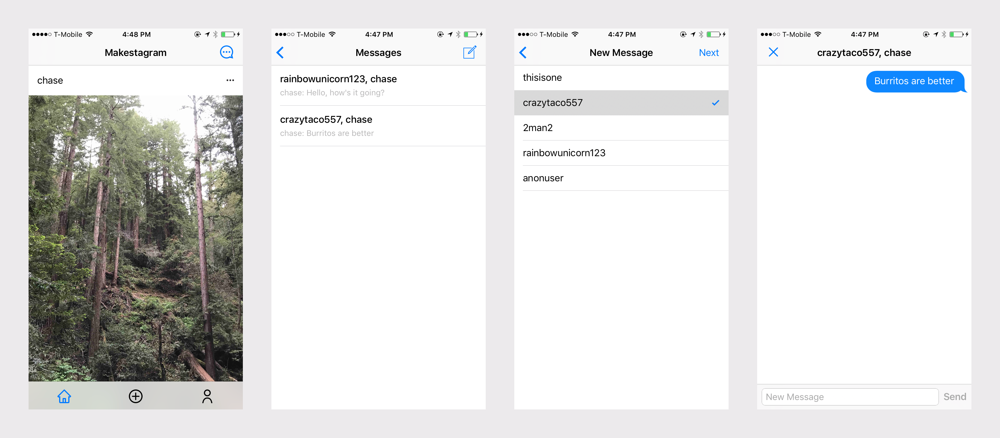
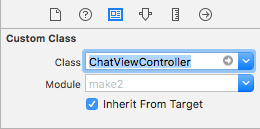

In this extension, we'll look at one of the most powerful features of the Firebase Realtime Database: realtime data synching.

Realtime data synching allows _clients_, or each user's device, to listen and become notified when data is added, deleted, or modified in the database.

Under the hood, Firebase is using _WebSockets_ to create a two-way communication channel between the client and server. This allows the server to push data to the client without needing explicit requests.

This type of technology has become increasingly popular in today's apps because it opens the possibility for many new feature and app ideas. For example, instead of implementing pull-to-refresh in a timeline, you could use _WebSockets_ to listen for new data and update accordingly.

In this extension, you'll learn how to use realtime data syncing by implementing a direct messaging chat feature for Makestagram!

# Design

In the process of creating a new feature, we'll need to make many design decisions about our direct messaging feature.

Let's start by defining some core aspects of how our messaging system will work:

- users can direct message other users
- users can only start chats with users that they are following
- each chat can only contain two users

<!-- - TODO: send media images to users -->

We'll utilize Firebase's realtime capabilities for the following:

- realtime updates on which chats the current user is a member of
- keep messages within a chat updated whenever new messages are sent

<!-- - TODO: show typing indicator for each chat -->

By applying some forethought about what we're building and how it'll work, we can later focus on building out the feature itself.

When creating your own features, making wireframes and user flows will be extremely helpful. For this direct messaging feature, our user flow will look like the following:



Before we start writing code, we'll want to think about how we'll implement the design above. We'll need to identify:

1. Do we need to make changes to the database or store new data? If so, how will we structure our database JSON tree?
1. What new service methods and data models will we need to implement direct messaging?
1. How can we break down our design into UI components that we'll build?

Let's start by thinking about how data structure for our database.

# Database Structure

New features with big app flows such as direct messaging will usually require you to change or add new data to your database structure. In our case, we'll need our database to allow the following:

- creating and reading existing chats
- storing messages for each chat

## Chat Tree Structure

To allow for the functionality above, we'll add two root-level nodes: chats and messages. First, let's take a look at our new `chats` node:

```
chats: {
    uid_1: {
        chat_key_1: {
            title: "crazytaco, rainbowunicorn123",
            memberHash: "-336801455283512829",
            lastMesssage: "crazytaco: hello world",
            lastMesssageSent: 1497918951.91262,
            members: {
                uid_1: true,
                uid_2: true
            }
        },
        chat_key_2: {...}
    },
    uid_2: {
        chat_key_1: {
            title: "crazytaco, rainbowunicorn123",
            memberHash: "-336801455283512829",
            lastMesssage: "crazytaco: hello world",
            lastMesssageSent: 1497918951.91262,
            members: {
                uid_1: true,
                uid_2: true
            }
        },
        chat_key_3: {...}
    },
    uid_3: {...},
    uid_4: {...}
}
```

In the tree structure above, the first thing you'll notice is that the first sub-node of `chats` is each user's UID. This allows us to easily group which users each respective chat.

Also notice that `uid_1` and `uid_2` both contain `chat_key_1`. This is important to note, because we're denormalizing our chat data. In other words, we're storing multiple copies of our chat data in different sub-nodes so we don't have to join data. This will increase read performance and although it may not be obvious now, this tree structure will be important for allowing us to make use of the realtime capabilities later in the tutorial.

## Messages Tree Structure

Next, let's take a look at the messages tree structure:

```
messages: {
    chat_key_1: {
        message_key_1: {
            content: "hello world",
            timestamp: 1497918951.91262,
            sender: {
                uid: uid_1,
                username: "crazytaco"
            }
        },
        message_key_2: {
            content: "first message",
            timestamp: 1177359852.47432,
            sender: {
                uid: uid_2,
                username: "rainbowunicorn123"
            }
        },
        message_key_3: {...},
        message_key_4: {...}
    },
    chat_key_2: {...},
    chat_key_3: {...},
    chat_key_4: {...},
}
```

In the `messages` node, we group each message with it's corresponding chat key. This allows us to flatten our tree structure and make easily paginate messages for each chat in the future.

With our new data structure in mind, we can create our data models in our app to represent `chats` and `messages`.

# Creating Models

Within our app, we can begin creating our models that will store chat and message data. Let's start by creating a model for a chat.

Let's take another look at the tree structure for each chat:

```
chats: {
    uid_1: {
        chat_key_1: {
            title: "crazytaco, rainbowunicorn123",
            memberHash: "-336801455283512829",
            lastMesssage: "crazytaco: hello world",
            lastMesssageSent: 1497918951.91262,
            members: {
                uid_1: true,
                uid_2: true
            }
        }
    }
}
```

By looking at the data stored within each chat, we can construct the skeleton for each `Chat` model:

> [action]
Create a new .swift file named `Chat.swift` with the following:
>
```
import Foundation
>
class Chat {
>
    // MARK - Properties
>
    var key: String?
    let title: String
    let memberHash: String
    let memberUIDs: [String]
    var lastMessage: String?
    var lastMessageSent: Date?
}
```

You'll notice that `key`, `lastMessage`, and `lastMessageSent` are optionals. This is because new chats won't have those values at first, so those properties can potentially be `nil`.

If you've added the new class above, the Xcode compiler will be throwing an error about the class not having any initializers. To fix the error, we'll need to implement our first initializer. We'll start with a failable initializer that initializes a new `Chat` from a Firebase snapshot.

> [action]
Before working with Firebase's `DataSnapshot`, we'll need to import the class. At the top of the file add the following:
>
```
import FirebaseDatabase.FIRDataSnapshot
```
>
Next, add the following failabile initializer under the properties you previously defined:
>
```
class Chat {
>
    // ...
>
    // MARK: - Init
>
    init?(snapshot: DataSnapshot) {
        guard !snapshot.key.isEmpty,
            let dict = snapshot.value as? [String : Any],
            let title = dict["title"] as? String,
            let memberHash = dict["memberHash"] as? String,
            let membersDict = dict["members"] as? [String : Bool],
            let lastMessage = dict["lastMessage"] as? String,
            let lastMessageSent = dict["lastMessageSent"] as? TimeInterval
            else { return nil }
>
        self.key = snapshot.key
        self.title = title
        self.memberHash = memberHash
        self.memberUIDs = Array(membersDict.keys)
        self.lastMessage = lastMessage
        self.lastMessageSent = Date(timeIntervalSince1970: lastMessageSent)
    }
}
```

With our new initializer, we'll be able to read valid chat data from our Firebase database. Within the initializer, we check and cast data to the correct types. If any data is missing, we return `nil`.

Next, let's repeat the same process and create a model for messages.

## Adding the Messages Model

Similar to our process for constructing our `Chat` model, we'll do the same for the `Message` model. First, we'll review the tree structure of the `messages` tree and each individual message.

```
messages: {
    chat_key_1: {
        message_key_1: {
            content: "hello world",
            timestamp: 1497918951.91262,
            sender: {
                uid: uid_1,
                username: "crazytaco"
            }
        }
    }
}
```

Looking at each individual message node, we can create an accompanying data model:

> [action]
Create a new `Message.swift` source file in your project:
>
```
class Message {
>
    // MARK: - Properties
>
    var key: String?
    let content: String
    let timestamp: Date
    let sender: User
}
```

To get rid of compiler errors, we'll need to add initializers to our new `Message` class. Similar to `Chat`, we'll start by adding a failable initializer to create a new `Message` from a `DataSnapshot`.

> [action]
To use `DataSnapshot`, we'll need to import the corresponding Firebase class. At the following at the top of `Messages.swift` outside the class.
>
```
import FirebaseDatabase.FIRDataSnapshot
```
>
Next, we'll create our failable initializer under the properties that we've defined:
>
```
class Message {
    // ...
>
    // MARK: - Init
>
    init?(snapshot: DataSnapshot) {
        guard let dict = snapshot.value as? [String : Any],
            let content = dict["content"] as? String,
            let timestamp = dict["timestamp"] as? TimeInterval,
            let userDict = dict["sender"] as? [String : Any],
            let uid = userDict["uid"] as? String,
            let username = userDict["username"] as? String
            else { return nil }
>
        self.key = snapshot.key
        self.content = content
        self.timestamp = Date(timeIntervalSince1970: timestamp)
        self.sender = User(uid: uid, username: username)
    }
}
```

In addition to our failable initializer, we'll add another init method to create a `Message` given content as an argument.

> [action]
Under your failable initializer you previously defined, add the following initializer:
>
```
// ...
>
init(content: String) {
    self.content = content
    self.timestamp = Date()
    self.sender = User.current
}
```

This initializer will allow us to create new `Message` models to store data that we'll eventually write to our database.

At this point, we've planned out our data structure in our Firebase database and created models for each respective data. From here, we'll add new methods to our service layer to support messaging functionality for our app.

# Building our Chat Services

Let's think about which service methods will be needed to implement direct messaging. Let's review our wireframes:


> [challenge]
Using the wireframes above, create a list of each service method you'll need and it's functionality.

<!--  -->

> [solution]
Below are a list of service methods we'll need:
>
- retrieve and listen chats of the current user
- list users that the current user is following
- check for existing chats with another user
- create new chats between users
- read messages within a chat
- send messages within a chat

With a list of new functionality our service layer will have to implement, we can begin coding!

# Retrieving Following Users

We'll start by implementing a new service method to retrieve a list of users that the current user is following.

> [action]
Open `UserService` and add the following static method within the struct:
>
```
static func following(for user: User = User.current, completion: @escaping ([User]) -> Void) {
    // 1
    let followingRef = Database.database().reference().child("following").child(user.uid)
    followingRef.observeSingleEvent(of: .value, with: { (snapshot) in
        // 2
        guard let followingDict = snapshot.value as? [String : Bool] else {
            return completion([])
        }
>
        // 3
        var following = [User]()
        let dispatchGroup = DispatchGroup()
>
        for uid in followingDict.keys {
            dispatchGroup.enter()
>
            show(forUID: uid) { user in
                if let user = user {
                    following.append(user)
                }
>
                dispatchGroup.leave()
            }
        }
>
        // 4
        dispatchGroup.notify(queue: .main) {
            completion(following)
        }
    })
}
```

Let's walk through our steps:

1. Create a reference to the location we want to read data from and retrieve the data
1. Check that the the data we retrieve is the expected type
1. Use dispatch groups to retrieve each user from their UID and build the array of following
1. Return the array of following after all tasks of the dispatch group have been completed

With this new service method, we'll be able to populate a table view with all users that the current user can message.

Let's move onto implementing the next service method.

# Creating New Chats

In this step, we'll begin building our chat-related service methods. To start, we'll need to create a new source file.

> [action]
Create a new swift file named `ChatService.swift`:
>
```
import Foundation
>
struct ChatService {
>
}
```

With our new `ChatService` file, we'll start implementing our chat-related service methods. Let's begin by creating a service method that will create new chats.

Before we begin, we'll add another initializer to our `Chat` class. We'll need to use this for creating new chats. This initializer will take the members of a new chat and temporarily store data until it's written to our database.

> [action]
Open `Chat.swift` and add the following initializer below the current initializer:
>
```
class Chat {
>
    // ...
>
   init(members: [User]){
        // 1
        assert(members.count == 2, "There must be two members in a chat.")
>
        // 2
        self.title = members.reduce("") { (acc, cur) -> String in
            return acc.isEmpty ? cur.username : "\(acc), \(cur.username)"
        }
        // 3
        self.memberHash = Chat.hash(forMembers: members)
        // 4
        self.memberUIDs = members.map { $0.uid }
    }
}
```

Let's walk through our new initializer:

1. Assert that there are only two members in a chat. If there are more than two members passed in the argument, the app will crash with the assert message.
1. Create the chat title using the usernames of each member.
1. Store a hash value that will prevent users from creating duplicate chats between users. This function isn't implemented yet so the compiler will throw an error. More on this soon!
1. Store each member's UID. this will allow us to easily update our denormalized chats when we create a service method for sending messages. Having reference to each member's UID will help construct a reference to locations where we'll need to write data.

Next, let's fix the compiler error by adding a class method that will create a member hash value based on each member's UID.

> [action]
Add the following class method in `Chat.swift`:
>
```
// MARK: - Class Methods
>
static func hash(forMembers members: [User]) -> String {
    guard members.count == 2 else {
        fatalError("There must be two members to compute member hash.")
    }
>
    let firstMember = members[0]
    let secondMember = members[1]
>
    let memberHash = String(firstMember.uid.hashValue ^ secondMember.uid.hashValue)
    return memberHash
}
```

In the method above, we XOR the two hashValues of each member's UID. This creates a new hash value that allows us to identify if a user already has an existing chat with another user. Before creating new chats, we'll be able to check for existing chats between users and prevent duplicate chats.

XORing is commutative, meaning that XORing the member UIDs will return the same value regardless of the order they are in.

After adding the code above, build the app and make sure there are no errors!

With our new initializer, we'll move on to creating a service method that creates new chats in our database. As a heads up, we'll heavily make use of Firebase's ability to write data to multiple locations simultaneously.

> [action]
To start, navigate to `ChatService` and add the following to the top of the file:
>
```
import FirebaseDatabase
```
>
Then add the following class method to `ChatService`:
>
```
static func create(from message: Message, with chat: Chat, completion: @escaping (Chat?) -> Void) {
>
    // 1
    var membersDict = [String : Bool]()
    for uid in chat.memberUIDs {
        membersDict[uid] = true
    }
>
    // 2
    let lastMessage = "\(message.sender.username): \(message.content)"
    chat.lastMessage = lastMessage
    let lastMessageSent = message.timestamp.timeIntervalSince1970
    chat.lastMessageSent = message.timestamp
>
    // 3
    let chatDict: [String : Any] = ["title" : chat.title,
                                    "memberHash" : chat.memberHash,
                                    "members" : membersDict,
                                    "lastMessage" : lastMessage,
                                    "lastMessageSent" : lastMessageSent]
>
    // 4
    let chatRef = FIRDatabase.database().reference().child("chats").child(User.current.uid).childByAutoId()
    chat.key = chatRef.key
>
    // 5
    var multiUpdateValue = [String : Any]()
>
    // 6
    for uid in chat.memberUIDs {
        multiUpdateValue["chats/\(uid)/\(chatRef.key)"] = chatDict
    }
>
    // 7
    let messagesRef = FIRDatabase.database().reference().child("messages").child(chatRef.key).childByAutoId()
    let messageKey = messagesRef.key
>
    // 8
    multiUpdateValue["messages/\(chatRef.key)/\(messageKey)"] = message.dictValue
>
    // 9
    let rootRef = FIRDatabase.database().reference()
    rootRef.updateChildValues(multiUpdateValue) { (error, ref) in
        if let error = error {
            assertionFailure(error.localizedDescription)
            return
        }
>
        completion(chat)
    }
}
```

Let's walk through the code above:

1. First we create a dictionary of each member's UID. We do this to easily each member's UID in JSON.
1. Populate our `Chat` object with missing data from the first message sent. Here, we're making a design decision not to create each chat until the first message is sent.
1. Create a dictionary of the chat JSON object to be stored in our database.
1. Generate a location for a new child node for the chat object.
1. Create a multi-location update dictionary. This will allow us to write to multiple locations without needing to make multiple API requests.
1. Update each of the chat member's chats with the denormalized chat JSON object.
1. Create a new DatabaseReference for a new messages child node.
1. Set the key value of the multi-location update dictionary to write the new message data. At this point, we don't have a `.dictValue` property on `Message` so we'll get an error. We'll fix this next.
1. Write the multi-location update to our database and return the chat if successful.

Whew! That was a lot of code. Mainly because we were constructing a multi-location update dictionary. Before moving on, let's add the `.dictValue` computed property to `Message`.

> [action]
Open `Message.swift` and add the following computed variable:
>
```
var dictValue: [String : Any] {
    let userDict = ["username" : sender.username,
                    "uid" : sender.uid]
>
    return ["sender" : userDict,
            "content" : content,
            "timestamp" : timestamp.timeIntervalSince1970]
}
```

This will allow us to easily convert `Message` objects into JSON.

With our new `create(from:with:completion:)` method, users will be able to create new chats in our database.

# Checking for Existing Chats

The next service method we'll implement will check for existing chats between users. We previously computed a hash of each chat member's UID for this functionality.

> [action]
Add the following service method to `ChatService`:
>
```
static func checkForExistingChat(with user: User, completion: @escaping (Chat?) -> Void) {
    // 1
    let members = [user, User.current]
    let hashValue = Chat.hash(forMembers: members)
>
    // 2
    let chatRef = Database.database().reference().child("chats").child(User.current.uid)
>
    // 3
    let query = chatRef.queryOrdered(byChild: "memberHash").queryEqual(toValue: hashValue)
>
    // 4
    query.observeSingleEvent(of: .value, with: { (snapshot) in
        guard let chatSnap = snapshot.children.allObjects.first as? DataSnapshot,
            let chat = Chat(snapshot: chatSnap)
            else { return completion(nil) }
>
        completion(chat)
    })
}
```

In the code above:

1. Get the hash value from each of the member's UIDs using the hashing class method from `Chat`
1. Create a reference to the current user's chat data to check for an existing chat with the other member
1. Construct a query for a matching `memberHash` child value of each chat JSON object.
1. Return the corresponding `Chat` if it exists.

We'll use this service method to prevent creating duplicate chats between users.

# Sending Messages in a Chat

For users to communicate, we'll need to create a service method for users to send messages within a chat. Let's implement this next:

> [action]
Add the code below in `ChatService`:
>
```
static func sendMessage(_ message: Message, for chat: Chat, success: ((Bool) -> Void)? = nil) {
    guard let chatKey = chat.key else {
        success?(false)
        return
    }
>
    var multiUpdateValue = [String : Any]()
>
    for uid in chat.memberUIDs {
        let lastMessage = "\(message.sender.username): \(message.content)"
        multiUpdateValue["chats/\(uid)/\(chatKey)/lastMessage"] = lastMessage
        multiUpdateValue["chats/\(uid)/\(chatKey)/lastMessageSent"] = message.timestamp.timeIntervalSince1970
    }
>
    let messagesRef = Database.database().reference().child("messages").child(chatKey).childByAutoId()
    let messageKey = messagesRef.key
    multiUpdateValue["messages/\(chatKey)/\(messageKey)"] = message.dictValue
>
    let rootRef = Database.database().reference()
    rootRef.updateChildValues(multiUpdateValue, withCompletionBlock: { (error, ref) in
        if let error = error {
            assertionFailure(error.localizedDescription)
            success?(false)
            return
        }
>
        success?(true)
    })
}
```

From our previous code breakdowns, you should be able to figure out what's going on. Take a moment to walk through the code above and refer back to previous service method code break-downs if you can't figure out what something does.

At this point, we've implemented many new service methods. However, none of these methods are a departure from how we've previously been reading and writing data. Following this step, we'll explore how to make use of Firebase's realtime capabilities.

# Realtime Data Synching with Observers

In this step, we'll implement the following functionality:

- observing and retrieving current data for the chats of the current user
- observing and retrieving messages within chats

First, let's go more in-depth about the realtime capabilities of Firebase.

One unique and powerful feature of Firebase involve realtime updates and data synchronization between clients. This means, every time data changes, any connected client can receive updated data very quickly.

Let's walk through an example:

```
// 1
let ref: DatabaseReference = ...

// 2
ref.observe(DataEventType.value, with: { (snapshot) in
    debugPrint(snapshot)
})
```

In the example above:

1. Get a reference to the location what we want to observe, or listen for data changes
1. Observe the location specified by the `DatabaseReference`. Notice we pass a `DataEventType` and completion handler as an arguments to `observe(_:with:)`. The `DataEventType` determines what type of events the observer is listening for. In the case of `.value`, the completion handler will be executed will occur whenever any data at the location has changed. The are other `DataEventType` such as `.childAdded` and `.childRemoved`.

It's important to remember that the completion handler won't occur just once. It'll be execute each time the `DataEventType` is triggered.

But we're not done yet. Observers require clean up because they don't automagically stop synching data when you leave a view controller. This requires you to be careful when using them, otherwise they can potentially cause memory problems.

When a observer is no longer needed, you need to manually remove it by passing the DatabaseHandle returned by the `observe(_:with:)` like the following:

```
let ref: DatabaseReference = ...

let handle = ref.observe(DataEventType.value, with: { (snapshot) in
    debugPrint(snapshot)
})

ref.removeObserver(withHandle: handle)
```

Now that we have a better idea of how observers work, let's implement a service method using our new knowledge.

## Observing User's Chats

In this service method, we'll focus on observing the chats of the current user. This will allow us to build a list of chats that the user is currently part of.

We'll use `observe(_:with:)` because we want the list to stay updated with the latest data.

> [action]
Open your `UserService` and add the following service method:
>
```
static func observeChats(for user: User = User.current, withCompletion completion: @escaping (DatabaseReference, [Chat]) -> Void) -> DatabaseHandle {
    let ref = Database.database().reference().child("chats").child(user.uid)
>
    return ref.observe(.value, with: { (snapshot) in
        guard let snapshot = snapshot.children.allObjects as? [DataSnapshot] else {
            return completion(ref, [])
        }
>
        let chats = snapshot.flatMap(Chat.init)
        completion(ref, chats)
    })
}
```

Our code does the following:

1. Create a reference to the user argument's chat data
2. Observe the user's chat data for `DataEventType.value`. If the `DataEventType` is triggered, the completion handler is executed.

Notice that our service method returns the `DatabaseHandle` returned from `observe(_:with:)`. Additionally, our completion handler returns the `DatabaseReference` of the service method. Both of these references are important for stopping the observer from continuously listening.

Using `observe(_:with:)` is particularly useful for this service method because it allows us to update data if child nodes are modified. In our case, if a new message is sent and `lastMessage` is modified, the completion handler will be executed again.

## Observing Chat Messages

Another important functionality will be observing messages within a chat. This will allow us to continuously display the last sent message within our chat.

> [action]
Open `ChatService` and add the following:
>
```
static func observeMessages(forChatKey chatKey: String, completion: @escaping (DatabaseReference, Message?) -> Void) -> DatabaseHandle {
    let messagesRef = Database.database().reference().child("messages").child(chatKey)
>
    return messagesRef.observe(.childAdded, with: { snapshot in
        guard let message = Message(snapshot: snapshot) else {
            return completion(messagesRef, nil)
        }
>
        completion(messagesRef, message)
    })
}
```

In the code above, we create an observer for a given chat's messages. In this service method, notice we use the `DataEventType.childAdded` instead of `.value`. This `DataEventType` will execute the callback once for each existing child at the specified `DatabaseReference` and again for any additional child addded. This is perfect for our direct messaging functionality.

One thing to note is that ideally you would implement this method with pagination. We won't go into pagination in this extension, but if you're interested in managing page size, there's an extension on generics and implementing pagination.

Congrats! We've finished adding our new service methods with the functionality needed to implement our messaging feature.

In the next step, we'll begin creating the views for our messaging flow.

# Creating Views

Let's review our designs and think about how we'll implement them:


For our new feature, we'll need to create 3 new view controllers:

- ChatListViewController: displays existing chats the current user is a member of
- NewChatViewController: allows users to create a new chat with user's that they are following
- ChatViewController: messaging UI for users to direct message one another

We'll implement both `ChatListViewController` and `NewChatViewController` with `UITableView`s. For `ChatViewController`, we'll use a CocoaPod called `JSQMessagesViewController` to create a messaging UI.

Let's begin implementing our messaging flow!

> [action]
First, we'll create a new storyboard for the messages flow.
>
1. Open `Home.storyboard`. Drag a `UIBarButtonItem` from the object library to the left-hand side of the `HomeViewController` navigation bar. 
1. Select the `UIBarButtonItem` and open the _Attributes Inspector_. Deleting the `title` and set the `image` attribute to `nav_messages_black`. 
1. Drag a new `UIViewController` from the object library into the storyboard. 
1. With the new `UIViewController` selected, go to the top Xcode `Editor` menu and select `Embed In` > `Navigation Controller`. 
1. Ctrl-drag from the `UIBarButtonItem` to the `UINavigationController` and create a `Present Modally` segue. 
1. Select the both the new `UIViewController` and it's `UINavigationController` and refactor it into a new `Chat.storyboard`. You can do this from the top Xcode menu `Editor` > `Refactor to Storyboard...`. 

Run the app to make sure everything is working. You should be able to click on the new messages bar button item on the home view controller and segue to the new view controller.

We've now setup a new storyboard for our direct messaging user flow!

# ChatListViewController

We'll begin by implementing the first view controller in our direction messaging flow.

> [action]
Create a new `UIViewController` source file named `ChatListViewController.swift`:
>
```
import UIKit
>
class ChatListViewController: UIViewController {
>
    // MARK: - VC Lifecycle
>
    override func viewDidLoad() {
        super.viewDidLoad()
    }
}
```
>
Navigate back to `Chat.storyboard`. Select the initial view controller and open the _Identity Inspector_ and set the `Custom Class` to `ChatListViewController`: 

Next, let's start adding subviews to our `ChatListViewController`.

> [action]
Open `Chat.storyboard` and center the storyboard on the single view controller. Follow the steps below:
>
1. Drag a _Navigation Item_ from the object library onto the `ChatListViewController` navigation bar. Then set the title to `Messages`. 
>
1. Next drag a `UIBarButtonItem` from the object library to the right-hand side of the `UINavigationBar`. Open the _Attributes Inspector_. Set the `System Item` attribute dropdown to `Compose`. 
>
1. Repeat the previous step by drag a `UIBarButtonItem` from the object library to the left-hand side of the `UINavigationBar`. Open the _Attributes Inspector_. Set the `System Item` attribute dropdown to `Stop`. 
>
1. Drag a `UITableView` from the object library onto the `ChatListViewController`. Set the constraints to the edge of it's super view. As always, make sure the top and bottom constraints are set relative to the super view's edges and not the top and bottom layout guides. 
>
1. Set the `UITableViewDataSource` to the `ChatListViewController`.
>
1. Create a `dismissButtonTapped(_:)` IBAction from your dismiss button to your `ChatListViewController` source file. 
>
1. Create a `tableView` IBOutlet to your `ChatListViewController` source file.
>
1. Drag a `UITableViewCell` from the object library onto the table view. Navigate to the _Size Inspector_ and set the row height to 71. 
>
1. Construct your `UITableViewCell` to look like the following. Each label should be 15 pts from the leading and trailing edges. The labels should be 5 pts apart and both labels should be centered within the cell. The font for the top title label should be `System Medium 17.0`. in `Default` color. The last message label should have a font of `System 14.0` in `Light Gray` color. 

Before adding implementation logic to our `ChatListViewController`, let's first create a new class for our `ChatListCell`.

> [action]
Create a new `UITableViewCell` source file called `ChatListCell.swift`:
>
```
import UIKit
>
class ChatListCell: UITableViewCell {
>
    // MARK: - Cell Lifcycle
>
    override func awakeFromNib() {
        super.awakeFromNib()
    }
>
    // MARK: - IBActions
>
    @IBAction func dismissButtonTapped(_ sender: UIBarButtonItem) {
        print("dismiss button tapped")
    }
}
```
>
Next, navigate back to `Chat.storyboard` and select the `UITableViewCell`. Open the _Identity Inspector_ and set the `Custom Class` to `ChatListCell`. 
>
With the cell still selected, open the _Attributes Inspector_ and set the `Identifier` to `ChatListCell`.
>
Finally, connect both labels with IBOutlets in the `ChatListCell.swift` source file. When you're completed, your source file should look like the following:
>
```
class ChatListCell: UITableViewCell {
>
    // MARK: - Subviews
>
    @IBOutlet weak var titleLabel: UILabel!
    @IBOutlet weak var lastMessageLabel: UILabel!
>
    // MARK: - Cell Lifecycle
>
    override func awakeFromNib() {
        super.awakeFromNib()
    }
}
```

With our new cell, we can begin implementing our logic for our `ChatListViewController`.

First, we'll add the functionality to dismiss our `ChatListViewController`.

> [action]
Open `ChatListViewController` and modify `dismissButtonTapped(_:)` to the following:
>
```
@IBAction func dismissButtonTapped(_ sender: UIBarButtonItem) {
    navigationController?.dismiss(animated: true)
}
```
>
Next create a `chats` array and implement the `UITableViewDataSource` below:
>
```
class ChatListViewController: UIViewController {
>
    // MARK: - Properties
>
    var chats = [Chat]()
>
    // ...
}
>
extension ChatListViewController: UITableViewDataSource {
    func tableView(_ tableView: UITableView, numberOfRowsInSection section: Int) -> Int {
        return chats.count
    }
>
    func tableView(_ tableView: UITableView, cellForRowAt indexPath: IndexPath) -> UITableViewCell {
        let cell = tableView.dequeueReusableCell(withIdentifier: "ChatListCell") as! ChatListCell
>
        let chat = chats[indexPath.row]
        cell.titleLabel.text = chat.title
        cell.lastMessageLabel.text = chat.lastMessage
>
        return cell
    }
}
```
>
Next let's configure our table view. Add the following to `viewDidLoad`:
>
```
override func viewDidLoad() {
    super.viewDidLoad()
>
    tableView.rowHeight = 71
    // remove separators for empty cells
    tableView.tableFooterView = UIView()
}
```
>
With our table view configured, let's use our service method to observe the current user's chats. First we'll need to import Firebase.
>
```
import FirebaseDatabase
```
>
Next add the following code:
>
```
class ChatListViewController: UIViewController {
>
    // MARK: - Properties
>
    var chats = [Chat]()
    // 1
    var userChatsHandle: FIRDatabaseHandle = 0
    var userChatsRef: FIRDatabaseReference?
>
    // MARK: - Subviews
>
    @IBOutlet weak var tableView: UITableView!
>
    // MARK: - VC Lifecycle
>
    override func viewDidLoad() {
        super.viewDidLoad()
>
        tableView.rowHeight = 71
        // remove separators for empty cells
        tableView.tableFooterView = UIView()
>
        // 2
        userChatsHandle = UserService.observeChats { [weak self] (ref, chats) in
            self?.userChatsRef = ref
            self?.chats = chats
>
            // 3
            DispatchQueue.main.async {
                self?.tableView.reloadData()
            }
        }
    }
>
    deinit {
        // 4
        userChatsRef?.removeObserver(withHandle: userChatsHandle)
    }
>
    @IBAction func dismissButtonTapped(_ sender: UIBarButtonItem) {
        navigationController?.dismiss(animated: true)
    }
}
```

Let's walk through the code above:

1. First we create two properties to store reference to the `DatabaseHandle` and `DatabaseReference`. We'll need this to clean up and stop observing data when the view controller is dismissed.
1. We use our service method that we created earlier to observe the current user's chats. Note that we set references to both the `DatabaseHandle` and `DatabaseReference`.
1. Once the completion handler is executed, we make sure we update the UI on the main thread.
1. Finally, when we dispose of the view controller, we manually remove the observer.

Build the app and make sure there are no compiler errors. If you run the app right now, you'll notice no chats appear yet. This is because the current user has no chats created in the database. We'll add the functionality to create a new chat next.

# NewChatViewController

In this step, we'll look at creating a view controller to let the current user create a new chat with any user that they're following.

> [action]
Open `Chat.storyboard` and drag a new `UIViewController` from the object library into the storyboard. 
>
Create an accompanying source file named `NewChatViewController`.
>
```
import UIKit
>
class NewChatViewController: UIViewController {
>
    override func viewDidLoad() {
        super.viewDidLoad()
    }
}
```
>
Back in your `Chat.storyboard`, open the _Identity Inspector_ and set the `Class` to `NewChatViewController`.
>
Last, ctrl-drag from the `ChatListViewController` compose bar button item to the `NewChatViewController` and create a show segue. 

Let's begin to configure our new view controller.

> [action]
Configure the view controller with the steps below:
>
1. Drag a `Navigation Item` from the object library to the navigation bar of the `NewChatViewController`. With the `Navigation Item` selected, change the `Title` property to `New Message`. 
1. Drag a `UIBarButtonItem` into the right-hand side of the `UINavigationBar`. Open the _Attributes Inspector_ and set the title to `Next`.
1. Drag a `UITableView` onto the `NewChatViewController`. Set the constraints to the the top, leading, trailing, bottom edges of the super view.
1. Drag a `UITableViewCell` from the object library onto the `UITableView`.
1. Set the `UITableViewDataSource` and `UITableViewDelegate` for the table view to the `NewChatViewController`.
1. With the cell selected, open the _Attributes Inspector_ and change the `Style` to `Basic`. Next change the `Accessory` attribute to `Checkmark`.

Before moving on, let's create a source file for our new `UITableViewCell`.

> [action]
Create a new subclass of `UITableViewCell` named `NewChatUserCell.swift`:
>
```
import UIKit
>
class NewChatUserCell: UITableViewCell {
>
    override func awakeFromNib() {
        super.awakeFromNib()
    }
}
```
>
Navigate back to your `Chat.storyboard` and set the class in the _Identity Inspector_. Also remember to set the `Identifier` in the _Attributes Inspector_ to `NewChatUserCell`.

Next, let's set up our IBOutlet and IBAction methods for our `NewChatViewController`.

> [action]
Open `Chat.storyboard` and `NewChatViewController` side-by-side using the assistant editor.
>
1. Create an IBOutlet for the `UITableView` named `tableView`
1. Create an IBOutlet for the next bar button item named `nextButton`
1. Create an IBAction for tapping the `nextButton` named `nextButtonTapped(_:)`
>
When you're finished, your `NewChatViewController` should look like the following:
>
```
class NewChatViewController: UIViewController {
>
    // MARK: - Subviews
>
    @IBOutlet weak var nextButton: UIBarButtonItem!
    @IBOutlet weak var tableView: UITableView!
>
    // MARK: - VC Lifecycle
>
    override func viewDidLoad() {
        super.viewDidLoad()
    }
>
    // MARK: - IBActions
>
    @IBAction func nextButtonTapped(_ sender: UIBarButtonItem) {
        print("next button tapped")
    }
}
```

Before diving into the implementation of the `UITableViewDataSource` and `UITableViewDelegate`, let's think about how the `NewChatViewController` will work.

We'll display a list of users that the current user is following. These are the users that the curernt user can direct message. The current user can select one of these users to start a chat with. When they start a new chat with a user, first we'll check for an existing chat with the selected user and return it if it exists. If no chat exists between the two users, we'll segue them to the `ChatViewController` where they'll be able to chat with the user.

When the user taps the `nextButton`, we won't immediately create a new chat if it doesn't already exist. We'll wait until the current user sends the first message before creating the new chat.

> [action]
Now let's implement our `UITableViewDataSource`. First add the following properties at the top of your `NewChatViewController`:
>
```
// MARK: - Properties
>
var following = [User]()
var selectedUser: User?
var existingChat: Chat?
```
>
Next add the following extension to populate our table view:
>
```
// MARK: - UITableViewDataSource
>
extension NewChatViewController: UITableViewDataSource {
    func tableView(_ tableView: UITableView, numberOfRowsInSection section: Int) -> Int {
        return following.count
    }
>
    func tableView(_ tableView: UITableView, cellForRowAt indexPath: IndexPath) -> UITableViewCell {
        let cell = tableView.dequeueReusableCell(withIdentifier: "NewChatUserCell") as! NewChatUserCell
        configureCell(cell, at: indexPath)
>
        return cell
    }
>
    func configureCell(_ cell: NewChatUserCell, at indexPath: IndexPath) {
        let follower = following[indexPath.row]
        cell.textLabel?.text = follower.username
>
        if let selectedUser = selectedUser, selectedUser.uid == follower.uid {
            cell.accessoryType = .checkmark
        } else {
            cell.accessoryType = .none
        }
    }
}
```

Notice in our code above, we set the cell accessory type to a `.checkmark` if the current user has selected any of the cells. If they haven't, we set the accessory type to none.

Next, we'll implement the logic for selecting and deselecting users. We'll use the following methods from the `UITableViewDelegate`.

> [action]
Implement the methods from `UITableViewDelegate`:
>
```
// MARK: - UITableViewDelegate
>
extension NewChatViewController: UITableViewDelegate {
    func tableView(_ tableView: UITableView, didSelectRowAt indexPath: IndexPath) {
        // 1
        guard let cell = tableView.cellForRow(at: indexPath) else { return }
>
        // 2
        selectedUser = following[indexPath.row]
        cell.accessoryType = .checkmark
>
        // 3
        nextButton.isEnabled = true
    }
>
    func tableView(_ tableView: UITableView, didDeselectRowAt indexPath: IndexPath) {
        // 4
        guard let cell = tableView.cellForRow(at: indexPath) else { return }
>
        // 5
        cell.accessoryType = .none
    }
}
```

Breaking down the logic above:

1. First we make get a reference to the `UITableViewCell` at the selected `indexPath`
1. Next we implement our logic for keeping track of selecting the user and updating the UI
1. We enable the next button once a user has been selected for the first time
1. Grab a reference to the `UITableViewCell` when another cell is selected and the previous will be deselected
1. Update the cell's accessory type to remove the checkmark UI

Using the logic above, we're able to maintain the state of a selected user after the current user taps on a cell.

Before moving on, let's do some configuration for our `NewChatViewController`.

> [action]
Add the following to `viewDidLoad`:
>
```
override func viewDidLoad() {
    super.viewDidLoad()
>
    nextButton.isEnabled = false
    // remove separators for empty cells
    tableView.tableFooterView = UIView()
}
```

We set the `isEnabled` property of `nextButton` to initially be false, because we don't want users to be able to nagivate to the next page without first selecting a user.

Next we'll use our service methods to provide content for our view controller.

> [action]
Populate the following array with the by implementing the service method in `viewDidLoad`:
>
```
override func viewDidLoad() {
    super.viewDidLoad()
>
    rhsNavBarButton.isEnabled = false
    // remove separators for empty cells
    tableView.tableFooterView = UIView()
>
    UserService.following { [weak self] (following) in
        self?.following = following
>
        DispatchQueue.main.async {
            self?.tableView.reloadData()
        }
    }
}
```
>
Next, we'll implement the logic when tapping the next button.
>
```
// MARK: - IBActions
>
@IBAction func nextButtonTapped(_ sender: UIBarButtonItem) {
    // 1
    guard let selectedUser = selectedUser else { return }
>
    // 2
    sender.isEnabled = false
    // 3
    ChatService.checkForExistingChat(with: selectedUser) { (chat) in
        // 4
        sender.isEnabled = true
        self.existingChat = chat
>
        self.performSegue(withIdentifier: "toChat", sender: self)
    }
}
```

Walking through the code above:

1. Check that there is a selected user to direct message.
1. Disable the `nextButton` to prevent the user from accidentally tapping the `nextButton` multiple times.
1. Check for an existing chat between both users.
1. Set the `existingChat` property if it exists, and segue to the `ChatViewController`.

To finish up our view controller, we'll setup the segue to the `ChatViewController`.

> [action]
Open `Chat.storyboard` and drag a new `UIViewController` into the storyboard. This will be our `ChatViewController`.
>
Ctrl-drag from the `NewChatViewController` to the new view controller and create a show segue. Select the segue and open the _Attributes Inspector_. Set the `Identifier` to `toChat`. 

To finish up our `NewChatViewController`, we'll need to add some logic as the view controller segues to the `ChatViewController`.

> [action]
Open `NewChatViewController` and add the extension below:
>
```
// MARK: - Navigation
>
extension NewChatViewController {
    override func prepare(for segue: UIStoryboardSegue, sender: Any?) {
        super.prepare(for: segue, sender: sender)
>
        if segue.identifier == "toChat", let destination = segue.destination as? ChatViewController, let selectedUser = selectedUser {
            let members = [selectedUser, User.current]
            destination.chat = existingChat ?? Chat(members: members)
        }
    }
}
```

We override `prepare(for:sender:)` to set the `ChatViewController` chat. If an existing chat doesn't exist, we create a new `Chat` using the members of chat.

Right now the compiler will throw errors because we haven't created the `ChatViewController` source file. Let's implement that next!

# ChatViewController

First, let's create a new source file for our `ChatViewController`.

> [action]
Create a new source file named `ChatViewController.swift`
>
```
import UIKit
>
class ChatViewController: UIViewController {
>
    // MARK: - Properties
>
    var chat: Chat!
>
    // MARK: - VC Lifecycle
>
    override func viewDidLoad() {
        super.viewDidLoad()
    }
}
```
>
Navigate back to `Chat.storyboard` and select the new `UIViewController`. Open the _Identity Inspector_ and set the class to `ChatViewController`. 

At this point, build your app. Adding the code above should remove our previous compiler errors.

Now that we've removed any errors from our app, we'll want to take a step back and think about how we'll implement our `ChatViewController`.

In our case, the majority of our UI will be implemented by the CocoaPod _JSQMessagesViewController_. But first, we'll need to install the new CocoaPod.

> [action]
Open your `Podfile`. Add the line below in your `target/do` block.
>
```
pod 'JSQMessagesViewController'
```

Next we'll need to install our new CocoaPod.

> [action]
Open terminal and navigate to the root directory of your Makestagram project. Run `pod install` to install _JSQMessagesViewController_ CocoaPod.

In your terminal, you should set both JSQMessagesViewController and JSQSystemSoundPlayer have been successfully installed.

With our new CocoaPod, we'll need to change the subclass of `ChatViewController` from `UIViewController` to `JSQMessagesViewController`.

> [action]
Open `ChatViewController` and add the following import to the top of the source file:
>
```
import JSQMessagesViewController
```
>
Next change the subclass of `ChatViewController` to `JSQMessagesViewController`:
>
```
class ChatViewController: JSQMessagesViewController {
    // ...
}
```

Next, we'll configure the UI of `ChatViewController`. Let's start with the `UINavigationBar`.

> [action]
Open `Chat.storyboard` and drag a `Navigation Item` from the object library to the navigation bar of the `ChatViewController`. Next drag a `UIBarButtonItem` onto the left-hand side of the `UINavigationBar`.
>
With the `UIBarButtonItem` selected, open the _Attributes Inspector_ and set the `System Item` property from `Custom` to `Stop`.

Your `ChatViewController` should look like the following: 

Next, we'll create an accompanying IBAction.

> [action]
Open your `ChatViewController` swift file and create an IBAction from your `UIBarButtonItem` called `dismissButtonTapped(_:)`.
>
```
class ChatViewController: JSQMessagesViewController {
>
    // ...
>
    // MARK: - IBActions
>
    @IBAction func dismissButtonTapped(_ sender: UIBarButtonItem) {
        print("dismiss button tapped")
    }
}
```
>
When the dismiss button is tapped, we want to navigate back to the root view controller of the `UINavigationController`. Modify `dismissButtonTapped(_:)` to the following:
>
```
@IBAction func dismissButtonTapped(_ sender: UIBarButtonItem) {
    navigationController?.popToRootViewController(animated: true)
}
```

With our dismiss button working, let's implement the UI for our `ChatViewController`.

To begin, we'll add some setup code that configures our `JSQMessagesViewController` subclass.

> [action]
Add the following code to `ChatViewController`:
>
```
// ...
>
override func viewDidLoad() {
    super.viewDidLoad()
>
    setupJSQMessagesViewController()
}
>
func setupJSQMessagesViewController() {
    // 1. identify current user
    senderId = User.current.uid
    senderDisplayName = User.current.username
    title = chat.title
>
    // 2. remove attachment button
    inputToolbar.contentView.leftBarButtonItem = nil
>
    // 3. remove avatars
    collectionView!.collectionViewLayout.incomingAvatarViewSize = CGSize.zero
    collectionView!.collectionViewLayout.outgoingAvatarViewSize = CGSize.zero
}
>
// ...
```

1. First, we'll need to do some setup for `JSQMessagesViewController` to identify the current user's messages. This allows the chat UI to determine which messages to display on the left vs. right side.
2. Next, we remove the attachment button. In many messaging interfaces, there's functionality to send media. For our use case, we won't implement this functionality.
3. Last, we remove the avatar images for each message. Mainly because our app doesn't have profile pictures yet.

Continuing our configuration, we'll need some additional properties to implement our `JSQMessagesCollectionViewDataSource` methods.

> [action]
We'll need to add a `Message` array to populate our data source. Add a `messages` array to the top of your `ChatViewController`.
>
```
var messages = [Message]()
```
>
Next, we'll need to add some computed properties. This allows us to specify a function initializes an property at compile-time.
>
```
var outgoingBubbleImageView: JSQMessagesBubbleImage = {
    guard let bubbleImageFactory = JSQMessagesBubbleImageFactory() else {
        fatalError("Error creating bubble image factory.")
    }
>
    let color = UIColor.jsq_messageBubbleBlue()
    return bubbleImageFactory.outgoingMessagesBubbleImage(with: color)
}()
>
var incomingBubbleImageView: JSQMessagesBubbleImage = {
    guard let bubbleImageFactory = JSQMessagesBubbleImageFactory() else {
        fatalError("Error creating bubble image factory.")
    }
>
    let color = UIColor.jsq_messageBubbleLightGray()
    return bubbleImageFactory.incomingMessagesBubbleImage(with: color)
}()
```
>
The `JSQMessageBubbleImage` is a class you haven't define or seen before. This is part of the `JSQMessagesViewController` CocoaPod. The `JSQMessageBubbleImage` creates the iOS message bubble that contains your text. You can see that we also define the incoming and outgoing colors for each bubble image.

With these new properties implemented, we can implement our `JSQMessagesCollectionViewDataSource` methods. Similar to a `UITableView` or `UICollectionView` data source, these method will populate the UI for our `ChatViewController`.

> [action]
Implement the data source methods in `ChatViewController`:
>
```
// MARK: - JSQMessagesCollectionViewDataSource
>
extension ChatViewController {
    // 1
    override func collectionView(_ collectionView: UICollectionView, numberOfItemsInSection section: Int) -> Int {
        return messages.count
    }
>
    // 2
    override func collectionView(_ collectionView: JSQMessagesCollectionView!, avatarImageDataForItemAt indexPath: IndexPath!) -> JSQMessageAvatarImageDataSource! {
        return nil
    }
>
    // 3
    override func collectionView(_ collectionView: JSQMessagesCollectionView!, messageDataForItemAt indexPath: IndexPath!) -> JSQMessageData! {
        return messages[indexPath.item].jsqMessageValue
    }
>
    // 4
    override func collectionView(_ collectionView: JSQMessagesCollectionView!, messageBubbleImageDataForItemAt indexPath: IndexPath!) -> JSQMessageBubbleImageDataSource! {
        let message = messages[indexPath.item]
        let sender = message.sender
>
        if sender.uid == senderId {
            return outgoingBubbleImageView
        } else {
            return incomingBubbleImageView
        }
    }
>
    // 5
    override func collectionView(_ collectionView: UICollectionView, cellForItemAt indexPath: IndexPath) -> UICollectionViewCell {
        let message = messages[indexPath.item]
        let cell = super.collectionView(collectionView, cellForItemAt: indexPath) as! JSQMessagesCollectionViewCell
        cell.textView?.textColor = (message.sender.uid == senderId) ? .white : .black

        return cell
    }
}
```

In the methods above we do the following:

1. Return the number of messages to display within the `ChatViewController`
1. Return `nil` for the avatar image. This displays nothing for each user's avatar image.
1. Return an object that conforms to the `JSQMessageData` protocol. We haven't implemented this property on our `Message` class yet so Xcode will throw an error. This let's the `JSQMessagesViewController` know, what text to display and the sender UID for the message.
1. In this method, we determine which bubble image to display for a given message. If the message sender's UID equals the current user's UID that we set as `senderId` in `viewDidLoad` then we return our `outgoingBubbleImageView`.
1. Last, we set the text color of the message bubble, also based on whether the message sender is the current user.

As you may have noticed, our `Message` class doesn't have a `jsqMessageValue` property. We'll implement that next:

> [action]
Open the `Message` class and add the following import statement:
```
import JSQMessagesViewController.JSQMessage
```
Next add the following lazily initialized property:
>
```
lazy var jsqMessageValue: JSQMessage = {
    return JSQMessage(senderId: self.sender.uid,
                      senderDisplayName: self.sender.username,
                      date: self.timestamp,
                      text: self.content)
}()
```

Don't worry too much about lazy initialized properties for now. The general gist is that their initialization is delayed to runtime whenever the object is first referenced.

To finish implementing the functionality for our `ChatViewController`, we'll need to connect our service methods to our UI.

First, we'll add a reference to a `DatabaseHandle` and `DatabaseReference` to prepare for observing the messages of a chat. This will allow us to clean up once the view controller is disposed.

> [action]
At the top of `ChatViewController`, add the following properties:
>
```
var messagesHandle: DatabaseHandle = 0
var messagesRef: DatabaseReference?
```

Next, we'll setup our observer. We'll want to observe messages of the chat and automatically update the UI accordingly. To prepare, we'll create a method that attempts to observe the messages of the chat if they chat already exists within our database.

> [action]
Add the following metho to your `ChatViewController`:
>
```
func tryObservingMessages() {
    guard let chatKey = chat?.key else { return }
>
    messagesHandle = ChatService.observeMessages(forChatKey: chatKey, completion: { [weak self] (ref, message) in
        self?.messagesRef = ref
>
        if let message = message {
            self?.messages.append(message)
            self?.finishReceivingMessage()
        }
    })
}
```

We'll need to check that the chat exists in our database by checking for the chat's `key` property. If it doesn't exist, we'll know that the chat hasn't been created yet and that no data exists at the specified location.

If it does exist, we observe data at the location using our service method and pass a completion handler to update the UI by calling `finishReceivingMessage`.

Let's update our view controller lifecycle methods to make use of our `tryObservingMessages` method.

> [action]
Update our view controller lifecycle methods with the following code:
>
```
// MARK: - VC Lifecycle
>
override func viewDidLoad() {
    super.viewDidLoad()
>
    setupJSQMessagesViewController()
    tryObservingMessages()
}
>
deinit {
    messagesRef?.removeObserver(withHandle: messagesHandle)
}
```

In our code above, we attempt call `tryObservingMessages` in `viewDidLoad` and clean up our observer in the `deinit`.

Finally, to finish the functionality for our `ChatViewController`, we'll need to add logic for sending messages within a chat.

First, we'll create a method that either creates a new chat or sends the messages based on whether the chat already exists.

> [action]
Create a new extension in `ChatViewController`:
>
```
// MARK: - Send Message
>
extension ChatViewController {
    func sendMessage(_ message: Message) {
        // 1
        if chat?.key == nil {
            // 2
            ChatService.create(from: message, with: chat, completion: { [weak self] chat in
                guard let chat = chat else { return }
>
                self?.chat = chat
>
                // 3
                self?.tryObservingMessages()
            })
        } else {
            // 4
            ChatService.sendMessage(message, for: chat)
        }
    }
}
```

In our new `sendMessage(_:)` method, we do the following:

1. First we check if the chat already exists in our database. If the chat's `key` is `nil`, we know that we'll need to create the chat first.
2. Create the chat using the appropriate service method. Note that we'll need a message in order to create a new chat.
3. Finally, if creating the chat is successful, we'll call `tryObservingMessages` on our new chat object.
4. If the chat already exists, we'll just update our database with our new message.

In both cases, updating the UI is taken care of through our observer listening for data changes.

In order to finish the functionality for sending messages, we'll need to override `didPressSend(_:withMessageText:senderId:senderDisplayName:date:)`. This method is executed whenever the user presses the `Send` button for the `ChatViewController`.

> [action]
In same extension, add the code below:
>
```
override func didPressSend(_ button: UIButton!, withMessageText text: String!, senderId: String!, senderDisplayName: String!, date: Date!) {
    // 1
    let message = Message(content: text)
    // 2
    sendMessage(message)
    // 3
    finishSendingMessage()
>
    // 4
    JSQSystemSoundPlayer.jsq_playMessageSentAlert()
}
```

Walking through our code above:

1. Create a new `Message` object using the text typed in by the current user.
1. Write the message to our realtime database using our `sendMessage(_:)` method.
1. Notify the `JSQMessagesViewController` that we've finished sending the messages. This will clear the messaging text field and prevent duplicate copies of the same message from being sent.
1. Play a sound to let the user know the message has been sent.

Stop here and run the app. Go through the messaging flow of direct messaging a couple users that you're following. Test that everything is working as expected!

# Navigating to Existing Chats

We need to go back to our `ChatListViewController` and implement the functionality to segue directly to an existing chat.

> [action]
Open `Chat.storyboard` and create a segue directly from `ChatListViewController` to `ChatViewController`. Select the segue and name it `toChat`. 
>
Verify that the `UITableViewDelegate` is set. If not, make sure to set it now.
>
Finally, implement the two extensions in `ChatViewController` below:
>
```
// MARK: - UITableViewDelegate
>
extension ChatListViewController: UITableViewDelegate {
    func tableView(_ tableView: UITableView, didSelectRowAt indexPath: IndexPath) {
        performSegue(withIdentifier: "toChat", sender: self)
    }
}
>
// MARK: - Navigation
>
extension ChatListViewController {
    override func prepare(for segue: UIStoryboardSegue, sender: Any?) {
        super.prepare(for: segue, sender: sender)
>
        if segue.identifier == "toChat",
            let destination = segue.destination as? ChatViewController,
            let indexPath = tableView.indexPathForSelectedRow {
>
            destination.chat = chats[indexPath.row]
        }
    }
}
```

Our code will allow users to select an `ChatListCell` and segue directly to the corresponding `ChatViewController`.

# Conclusion

Congrats! We've successfully implementing a direct messaging feature.

In this extension, we learned about utilizing the realtime capabilities of the Firebase database. We implementing many features that automatically update the UI whenever data in our database changes.

We learned how to observe and sync data in realtime as well as how to detach them once we're done with them. Observers are a powerful feature but can cause a lot of unpredictable behavior if not understood correctly.

Moving forward, you can use your new knowledge of observing to create new features and better user experiences.
