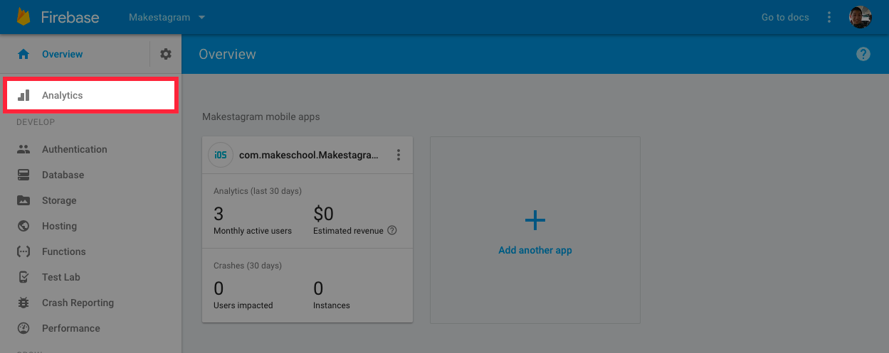
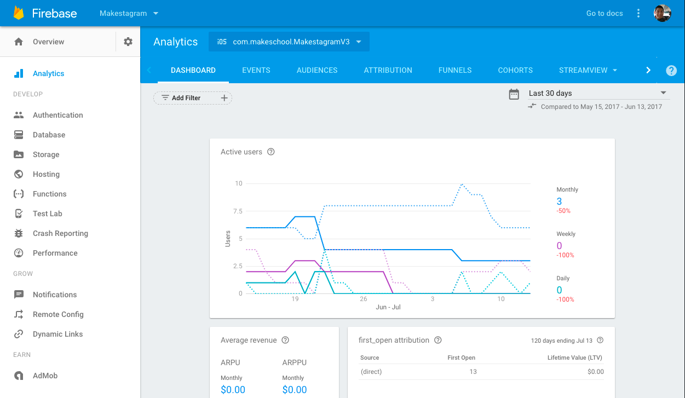
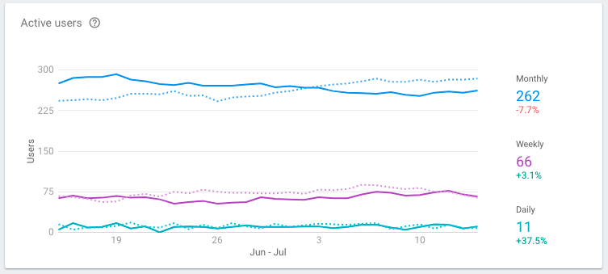
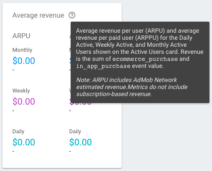
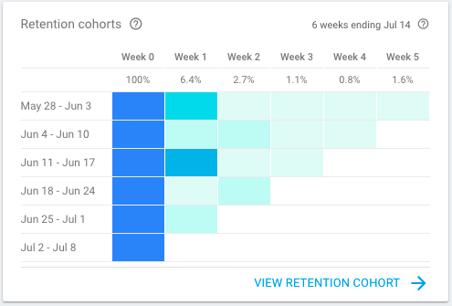
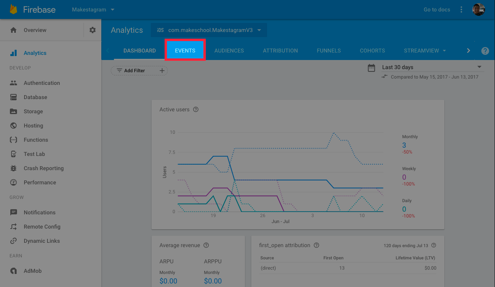
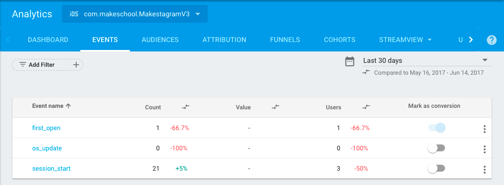
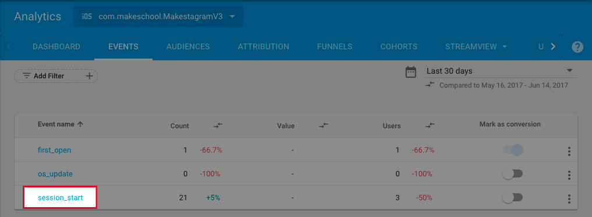
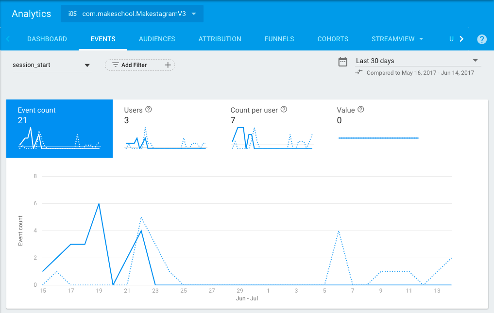

In this extension, we'll learn about analytics and how to use data to improve our apps.

Analytics is the measurement and interpretation of data. For our apps, we'll collect user data (what users do in our app) to understand user behavior (why they're doing it). Using these learnings, we can make better decisions to improve our app.

Listed below, are some common examples of using analytics to improve your app.

<!-- TODO: what's the best way to display this data? -->

**Example 1:**

1. **Analytics:** Large number of users don't complete the signup flow.
1. **Interpretation:** The signup flow could be too long or confusing which is causing users to leave before completing the signup process.
1. **Product Decision:** Investigate more on which screen users are dropping off. Make changes to the signup flow so that more users complete the signup process.

<!-- break -->

**Example 2:**

1. **Analytics:** Users don't come back to the app after their first use.
1. **Interpretation:** The app doesn't provide value to the user or the user doesn't understand the value proposition of the app.
1. **Product Decisions:** Add an onboarding tutorial to help users navigate the app on their first use. Create prompts so that the user takes key actions on their first use.

<!-- TODO: could explore using real examples... -->
<!-- Lyft gives you 5 $10 coupons when you first download the app so you get used to using the product and have a free trial. -->
<!-- Facebook prompts you to add friends because the value of Facebook comes from seeing others post on your social network. -->

In this extension, we'll explore key concepts in analytics, important metrics to track, how to track custom events and how to interpret data.

# Installation

There are many solutions for mobile analytics. Some of the most popular include Mixpanel, Amplitude, Fabric Answers, and Google Analytics. In this tutorial, we'll be using Google Analytics.

Like the others, Google Analytics is a analytics tool that helps you track and analyze app data. However, it's super convenient for our situation because it's built into Firebase and is free!

If you're using another analytics solution, you'll need to install a third-party SDK via CocoaPods. However since Google Analytics is already built into Firebase, we won't need to do anything to use it.

> [info]
>
**If you are not using Firebase in your app**, we recommend you use [Fabric Answers](https://www.fabric.io/kits/ios/answers/install) to integrate analytics into your app. There is no need to install the entirity of Firebase just for analytics! Fabric has a really nice [install guide here](https://www.fabric.io/kits/ios/answers/install).

Next, let's take a look at our Firebase Analytics Dashboard!

# Analytics Dashboard

The Firebase console has a analytics dashboard that allows you to visualize and interpret your data. Firebase automatically tracks certain key events such as Active Users and Retention.

Let's navigate to our analytics dashboard to take a look.

> [action]
Open your web browser of choice. Navigate to your Firebase project overview and select the _Analytics_ tab on the left-hand navigation pane. 
>
This is what your analytics dashboard will look like. 

Don't worry if there's not much data there yet. This is normal since we haven't (and won't) launch Makestagram to the App Store.

Before moving on to tracking custom events, let's take a look at the metrics Firebase automatically tracks for us.

## Active Users

The first graph you'll notice is _Active Users_. It should look like this:



This graph shows a general indicator of user engagement: daily active user (DAU), weekly active users (WAU) and monthly active users (MAU).

- **DAU:** total unique users who have opened your app on the current day.
- **WAU:** total unique users who have opened your app in the last week (previous 7 days).
- **MAU:** total unique users who have opened your app in the last month (previous 30 days).

Using your Active Users data, you can also calculate a metric called Stickiness. [Stickiness](https://www.quora.com/What-is-the-utility-of-DAU-MAU-as-an-engagement-metric) is widely-used benchmark for app retention. Your DAU/MAU ratio represents the percentage of monthly active users that engage with your app every day.

Although Stickiness is a useful metric, Firebase also provides _cohort analysis_ for retention. We'll learn about this later.

## Average Revenue

Next, we'll look at the _Average Revenue_ metric. We won't be using this in Makestagram, but we'll go over it briefly incase you want to add in-app purchases to your app.

- **Average Revenue Per User (ARPU):** total amount of in-app purchases divided by the total active users in the given time period.
- **Average Revenue Per Paying User (ARPPU):** total amount of in-app purchases divided by the number of paying users in the given time period.

Before we move on, notice that each metric on the analytics dashboard has a (?) question mark by it's name. If you hover over the question mark, you can view more info about the corresponding metric.



## Audience and Attribution Tracking

You'll notice that some of the metrics on your analytics dashboard contain info about how users discovered your app and insights about your demographics such as age and gender.

To track and view this data, you'll need to enable the AdSupport framework in your project. [Click here](https://firebase.google.com/support/guides/analytics-adsupport) for instructions on adding the framework to enable these features.

This information can be useful for understanding your user demographics for ads and marketing. Understanding your user will help you figure out which users need your app!

## Retention

The last metric we'll look in our analytics dashboard is retention. You should see a chart that looks like the following:



Don't worry if you don't understand how to read this chart yet, we'll go over that next.

The chart above is a cohort analysis. A cohort analysis separates users into cohorts, or groups, based on a common attribute. For our retention chart, users are put into a cohort based on their first use date.

Each row (top to bottom) of the chart represents a new cohort. The date ranges on the left of the chart, represent each cohort's first use week.

The columns (from left to right) represent the number of users that return each week following their first use. It's common for a smaller percentage of the initial cohort to return each week.

With this chart, you can see how new features you implement change the retention of a new user.

Retention is one of the most important metrics. If a user keeps coming back to your app, you can be fairly sure you've created some sort of value for the user.

If your retention flattens out after a certain week, meaning that you've retained a certain percent of users, then you've achieved some level of product-market fit. For a great resource on understanding the importance of retention, you can watch [this video.](https://www.youtube.com/watch?v=URiIsrdplbo)

## Additional Metrics

There are many other metrics that can be tracked to measure app health and success. Success metrics, also know as key performance indicators (KPI), vary from market to market and app to app.

When selecting KPI to quantifiably measure app health, you should think about what objectives are important for your app and brainstorm how you can map those objectives to hard metrics. A good place to start is often defining your value proposition and what a successful user journey looks like.

# Custom Event Tracking

Now that we've learned a little about the events Firebase tracks automatically, we'll look at tracking our own custom events.

We can track custom events using `FirebaseAnalytics`. First, to use the SDK, we'll need to add the corresponding import statement to the top of our source file:

```
import FirebaseAnalytics
```

Next, we can use the `Analytics.logEvent(_:parameters:)` class method to track a custom event.

Here's an example of tracking a post being shared:

```
Analytics.logEvent(AnalyticsEventShare, parameters: [AnalyticsParameterItemID: post.key, AnalyticsParameterContentType: "Post"])
```

You'll notice in the code snippet above, we name the event using one of Firebase's predefined analytics event names. Firebase has a list of predefined event names you can find [here](https://firebase.google.com/docs/reference/ios/firebaseanalytics/api/reference/Constants).

For simple tracking, you can use the predefined event names and parameter names that Firebase has provided. Firebase has provided some documentation of events you might want to track for apps in different categories. You can find them by [clicking here](https://support.google.com/firebase/answer/6317508?hl=en&ref_topic=6317484).

You can also define custom event and parameter names using strings. For example, if we wanted to create an app-specific event for tracking when users create new posts, we could create log an event like so:

```
Analytics.logEvent("create_post", parameters: [AnalyticsParameterItemID: post.key, "poster_uid": poster.uid])
```

Notice that we're using a custom event name `create_post` and a custom parameter name `poster_uid`. In both instances, we're able to create a custom name using strings. Be careful of typos when tracking events. It's a good idea to create your own event/parameter name constants to avoid stringly-typed code.

## What Should I Track?

Firebase analytics allows you to track any custom events you want. But before you start adding custom events, it's best to think about what events should you track.

Tracking too many events can clutter your dataset with incomplete or irrelevant information making it hard to display and interpret your data.

Not tracking enough events can lead to incomplete information when trying to make product decisions.

Similarly, tracking the wrong data can lead to incomplete information when trying to interpret data.

To prevent us from any of these pitfalls, we want to think carefully about which events are important to our app and it's objectives. Each app is different, so the events that are tracked should be personalize per app.

A couple helpful mental frameworks are:

- think about your value proposition and what users would get from using your app
- think about your app goals and any objectives you're trying to achieve

Next, ask yourself:

- How can you use event tracking to monitor whether you're successfully delivering your value proposition?
- What KPI would define success for your app goals or objectives?

As a catch all, it's also helpful to think about what questions you're trying to answer with your data. Start with the questions you want to answer and work back to what events or metrics would help clarify the answers to those questions.

If you're interested in learning more about creating app objectives, check out the [AARRR!!! Startup Metrics](https://www.slideshare.net/dmc500hats/startup-metrics-for-pirates-long-version).

For example, Makestagram is a photo sharing app that helps people share and connect over photos. Events we'd want to track are:

- Following a User: Makestagram loses any value if you're not following any other users because your feed will be empty. We could create a custom event track the action of following a user.
- Creating a Post: It's super important for people to share photos as it creates more content for other users and makes the current user more invested in the product.
- Liking a Post: Find out if people are interacting with each other's content.

<!-- TODO: add analytics for some user flow in Makestagram -->

# Viewing Data

Tracking events isn't helpful if you don't know how to view and interpret the data you've collected. Luckily, Firebase has tools that display your data.

> [action]
Open your web browser and navigate to your analytics dashboard. 
>
Next, navigate on the top horizontal tab bar to _Events_. 

Since we haven't tracked any custom events, you should see the following default events:



Here you can view all of the events that are being tracked in your app. Additionally, you can click on each event to view more information about the specific event.

> [action]
From the events overview, click on the event named `session_start`. 

After clicking on a specific event, you should see more information about the event:



<!-- TODO: could add a section on creating funnels -->

# Conclusion

In this extension, you've learned about the basics of analytics and how to track your own custom events. Tracking custom events and monitoring your app's health with metrics will give you feedback on how users use your app.

As you begin to build your own apps, make sure you take the time to think about your app goals and objectives. By applying what you've learned in this extension, you'll know what your users are doing and what features you can add to improve your user experience!
