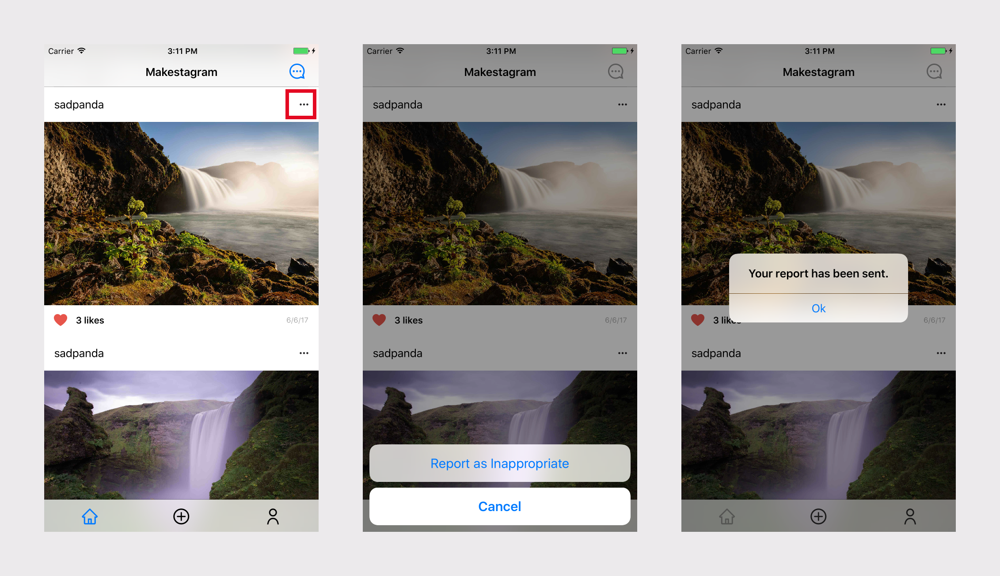

In this extension, we'll add a solution for flagging inappropriate content in Makestagram. As part of the [App Store guidelines](https://developer.apple.com/app-store/review/guidelines/#user-generated-content), it's required that apps with user-generated content (UGC) have ways to report offensive content. This is because users can potentially post content that is offensive or inappropriate. As such, Apple requires developers to take pre-cautions to handle these situations.

Although we won't actually submit Makestagram to the App Store, we'll go through the process of building flagging feature in the case that you're planning to have user-generated content in one of your own apps.

In this particular example, we'll stick to a very simple solution by heavily using the built-in `UIAlertController`. In your own apps, feel free to build custom views or user flows.

Let's start by reviewing our flag user flow.

# Flag Content User Flow

In this extension, we'll give users the functionality to flag posts. As part of our logic, we won't let users report their own posts.

To keep things simple, we won't be designing or building any of our own custom views. Our user flow will look like the one below:



1. The user taps on the options button in the `PostHeaderCell`.
1. If the user is not the post's poster, they have the option to report the post as inappropriate.
1. After reporting the post, there will be a confirmation letting the user know that their report was recieved.

As you can see, we make heavy use of the `UIAlertController` both for presenting the action sheet and the alert.

Let's get started by implementing our service mething for flagging a post.

# Flagging Service Method

In order to flag a post, we'll need to add a new service method to our `PostService`. In this method, we'll create a new root-level subtree with all posts that have been flagged.

> [action]
Open your `PostService` and add the following service method below:
>
```
static func flag(_ post: Post) {
    // 1
    guard let postKey = post.key else { return }
>
    // 2
    let flaggedPostRef = Database.database().reference().child("flaggedPosts").child(postKey)
>
    // 3
    let flaggedDict = ["image_url": post.imageURL,
                        "poster_uid": post.poster.uid,
                        "reporter_uid": User.current.uid]
>
    // 4
    flaggedPostRef.updateChildValues(flaggedDict)
>
    // 5
    let flagCountRef = flaggedPostRef.child("flag_count")
    flagCountRef.runTransactionBlock({ (mutableData) -> TransactionResult in
        let currentCount = mutableData.value as? Int ?? 0
>
        mutableData.value = currentCount + 1
>
        return TransactionResult.success(withValue: mutableData)
    })
}
```

We've implemented similar functionality in core Makestagram tutorial. By now, you should be able to walk through the code to understand what's happening.

Try breaking down the code by walking through it line by line to understand what's going on.

> [solution]
In case you need a refresher, here's a breakdown of what's happening above.
>
1. Check the the post is an existing post by confirming that it has a key.
1. Build a reference to the `DatabaseReference` path for flagged posts.
1. Create a dictionary with relevant information for the specific flagged post.
1. Write to the database.
1. Increment a flag count for each time a specific post is flagged.

Next, let's implement the user flow so we can put our new service method into use.

# Handling The Option Button

Let's take another look at the `PostHeaderCell`.


As you can see in the image above, on the left side of the cell is an options button. If a user taps on that button, we'll display an action sheet using `UIAlertController` that gives them the ability to flag the corresponding `Post`. As discussed earlier, we'll be using the `UIAlertController` to display the action sheet.

First, we'll need a way for the `UITableViewCell` to communicate when the option button has been tapped by the user.

> [challenge]
What communication pattern could we use to send button tap events to the containing view controller?

<!-- Line Break -->

> [solution]
Two potential solutions for this problem are closures and delegates. Although either would work, closures are better suited for one-off situations. If you're more comfortable with protocols/delegates, you can implement the following steps using delegates.

Assuming you've decided to follow this tutorial and use closures, let's start implementing!

> [action]
Open `PostHeaderCell` and add the following variable to your cell:
>
```
class PostHeaderCell: UITableViewCell {
>
// ...
>
    var didTapOptionsButtonForCell: ((PostHeaderCell) -> Void)?
>
// ...
>
}
```
>
As you may recall, functions are first-class citizens in Swift, meaning they can be stored as variables. In our case, we've created a optional closure named `didTapOptionsButtonForCell`. Notice that it takes a `PostHeaderCell` as an argument and returns `Void`.
>
Next, we'll need to call the closure whenever the options button is tapped. Luckily, we've already created an IBAction whenever the user taps the options button. Let's use that now.
>
```
@IBAction func optionsButtonTapped(_ sender: UIButton) {
    didTapOptionsButtonForCell?(self)
}
```

In the code above, we call the `didTapOptionsButtonForCell` closure and pass the instance of the cell as an argument. 

You may be wondering why there's a question mark between the function name and parameters. This is because the `didTapOptionsButtonForCell` is optional and may be nil. This syntax is referred to as optional chaining and provides an easy shorthand syntax for unwrapping and calling the closure if it exists. If the closure doesn't exist, the code won't be executed.

In other words, optional chaining is the equavalent of the code below:

```
@IBAction func optionsButtonTapped(_ sender: UIButton) {
    if let closure = didTapOptionsButtonForCell {
        closure(self)
    }
}
```

See how much typing we saved using the shorthand syntax?

At this point, we've added a new service method for flagging posts and configure the `PostHeaderCell` to handle option button tapped events by calling the closure.

Next, we'll need to setup the containing view controller, `HomeViewController` to set each cell's `didTapOptionsButtonForCell` property as it's dequeued in the table view.

> [action]
Open `HomeViewController` and add the following method below:
>
```
func handleOptionsButtonTap(from cell: PostHeaderCell) {
    // implement logic here
}
```

This method will handle the button tap event. We'll need to configure our datasource to set this method as the closure of each `PostHeaderCell`.

> [action]
In your `HomeViewController` table view data source methods, modify `tableView(_:cellForRowAt:)` to the following:
>
```
func tableView(_ tableView: UITableView, cellForRowAt indexPath: IndexPath) -> UITableViewCell {
    let post = posts[indexPath.section]
>
    switch indexPath.row {
    case 0:
        let cell: PostHeaderCell = tableView.dequeueReusableCell()
        cell.usernameLabel.text = post.poster.username
        cell.didTapOptionsButtonForCell = handleOptionsButtonTap(from:)
>
    // ...
```

As you can see above, we set the `didTapOptionsButtonForCell` property of each `PostHeaderCell` to the `handleOptionsButtonTap` method we previously added.

Next we can focus on adding the logic for displaying an action sheet whenever the user taps on the options button.

# Displaying Action Sheets

In the `handleOptionsButtonTap` method, we'll need to add logic to display and action sheet using the `UIAlertController`. If you remember from the previous sections, we used an action sheet to display the user's options for selecting a photo to be posted to Makestagram. We'll implement something similar here.

> [action]
Modify `handleOptionsButtonTap` in your `HomeViewController` to the following:
>
```
func handleOptionsButtonTap(from cell: PostHeaderCell) {
    // 1
    guard let indexPath = tableView.indexPath(for: cell) else { return }
>
    // 2
    let post = posts[indexPath.section]
    let poster = post.poster
>
    // 3 
    let alertController = UIAlertController(title: nil, message: nil, preferredStyle: .actionSheet)
>
    // 4
    if poster.uid != User.current.uid {
        let flagAction = UIAlertAction(title: "Report as Inappropriate", style: .default) { _ in
            print("report post")
        }
>
        alertController.addAction(flagAction)
    }
>
    // 5
    let cancelAction = UIAlertAction(title: "Cancel", style: .cancel, handler: nil)
    alertController.addAction(cancelAction)
>
    // 6
    present(alertController, animated: true, completion: nil)
}
```

Let's walk through the code above step by step.

1. Get a reference to the corresponding index path for the table view cell. We'll need this to reference the post.
1. Using the index path above we can get a reference to the post and the poster. We'll need both of these references later.
1. Instantiate a `UIAlertController` with the action sheet style.
1. Configure the action sheet options based on whether the user is the poster. We don't want the poster to be able to flag their own content.
1. Add a default cancel button so that users can exit the action sheet.
1. Present the action sheet alert controller from the `HomeViewController`.

We've added a lot of new code. Before moving on, build and run the app. As always, test your code frequently to make sure it's working as expected. Create a couple of posts from multiple different user accounts and go through the user flow of reporting a post.

Finally, to wrap things up, we'll add the logic to the `UIAlertAction` for flagging a post.

> [action]
In the same `handleOptionsButtonTap` method, find the `flagAction` that is a `UIAlertAction`. Within the closure, add the following code:
>
```
let flagAction = UIAlertAction(title: "Report as Inappropriate", style: .default) { _ in
    PostService.flag(post)
>
    let okAlert = UIAlertController(title: nil, message: "The post has been flagged.", preferredStyle: .alert)
    okAlert.addAction(UIAlertAction(title: "Ok", style: .default))
    self.present(okAlert, animated: true)
}
```

# Conclusion

In this extension, we added a simple solution for building a reporting feature for Makestagram. Remember, the App Store has specific rules around apps that contain user-generated content. If one of your apps that you're building contains user-generated content, make sure you implement a flagging mechanism for users to report inappropriate content.
