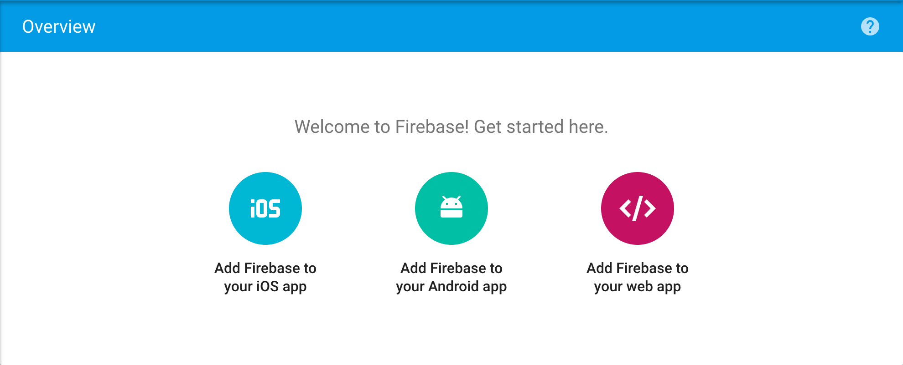
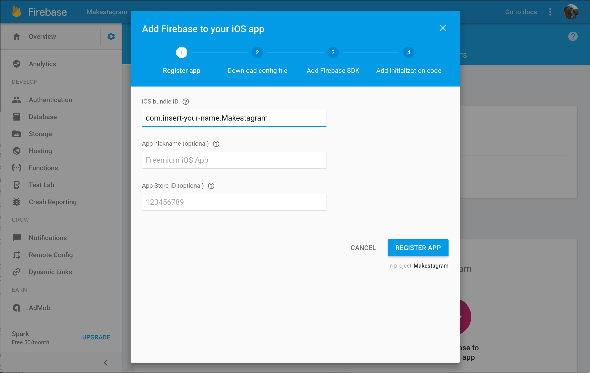
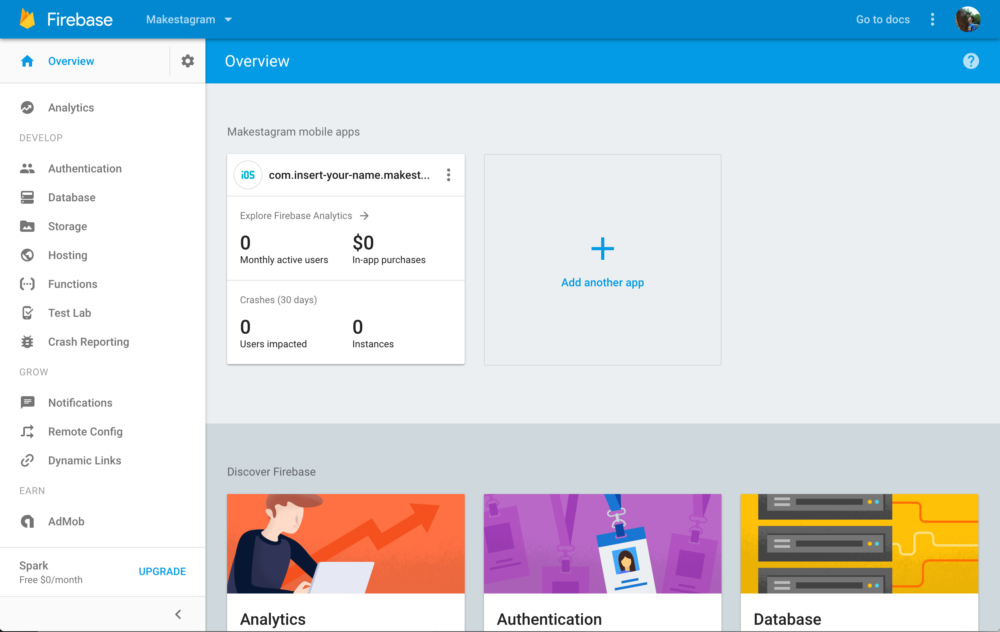

Time to pull up your browser again. You've created a new Firebase and Xcode project, but you need to connect them so they can communicate with each other.

# Adding Firebase to your iOS app
Go to your Firebase project overview. You should see three buttons for connecting Firebase to your app. You're going to click on the "Add Firebase to your iOS app" button and follow the instructions listed.

Follow the instructions provided to connect Firebase with your app.

You will have already installed and adding the Firebase SDK in step 3. Confirm that you have added and installed the 'Firebase/Core' cocoapod and are using the `.xcworkspace` file.

# Finishing Up
After following the Firebase steps, your project overview should look like this:

Well done! You've just connected your app to Firebase so you can easily store and retrieve data. Let's begin building our app by structuring our app.

<!-- TODO: not sure about the last line -->
