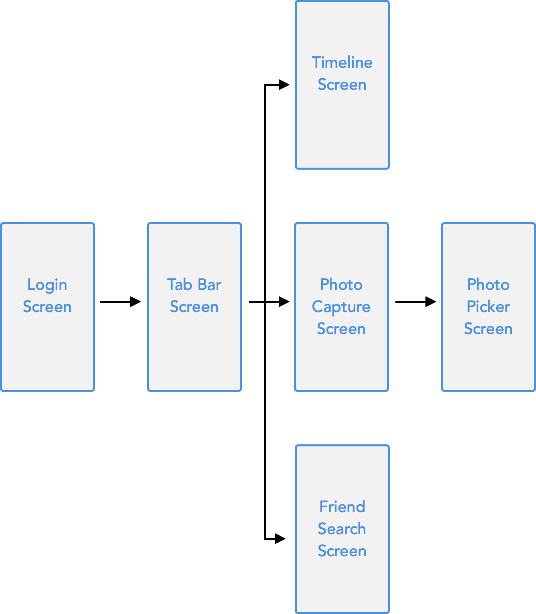
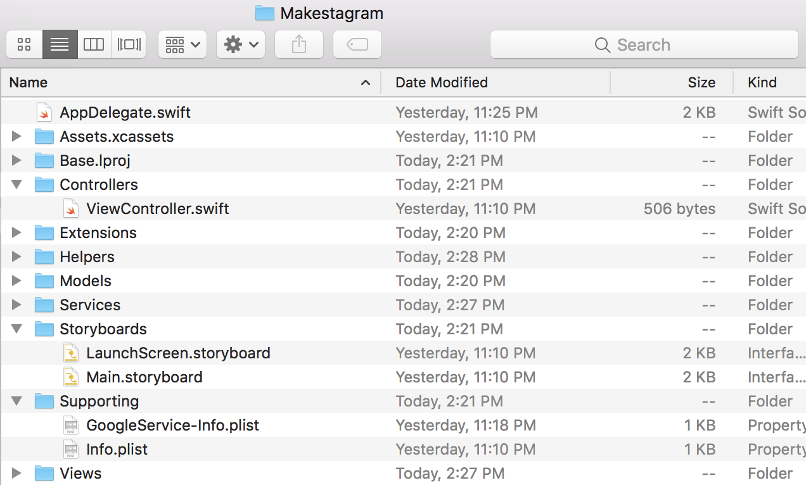
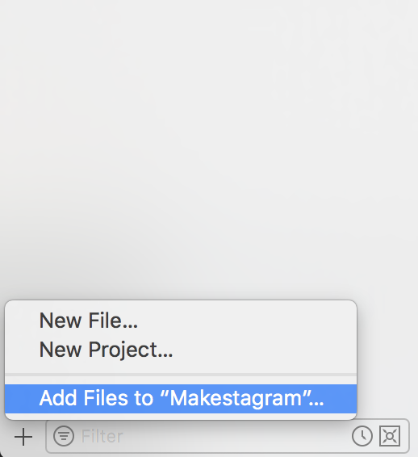
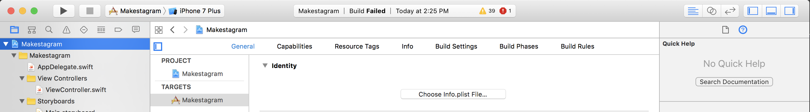
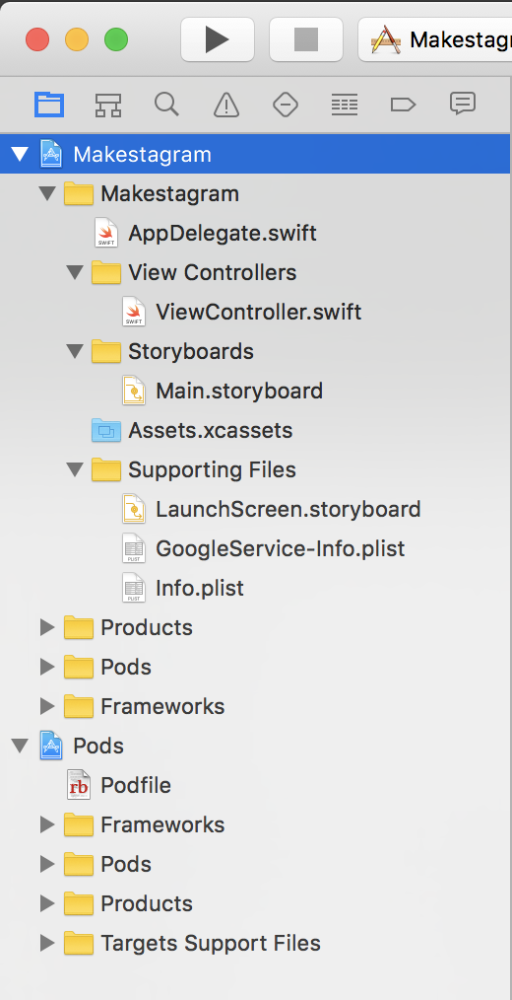

 ---
title: "Basic App Architecture"
slug: basic-app-architecture
---

Although the term "Architecture" can be intimidating to new programmers, it's not as scary as you think. Architecture can be simply put as a fancy word for organizing your code so that it's easier to build, change and debug.

In this step, we'll take some time to think about how we'll build our app and organize our code.

# Makestagram Features

The goal of this tutorial is to build a photo sharing app. Users shall be able to share photos, follow users and interact with other users through likes.

This is detailed list of features our app will have:

- Sign up and login with email/password
- Follow other users
- View photos posted by other users
- Like photos
- Post photos
- Delete photos you posted
- Flag photos other users have posted

You are probably familiar with most of these features from popular social network apps. You might wonder why we included *flagging* content in this simple photo sharing app. It turns out that it's an important feature to get your app into Apple's App Store. Apple requires apps with user created content to have a *flag* feature - this way users can report inappropriate content. Since you will likely need this feature in your own apps, we have included it as part of the tutorial.

# App Outline

Once you have decided on your app's features, your next step should be to outline your app's structure. The outline should contain all the screens in your app, and should include how they will be connected. For **Makestagram**, the outline would look like this:

You should come up with a similar diagram before writing code for your original app - it will give you a better idea of how much effort it will take to build your app.

# Directory Structure

Now let's create our directory structure to better organize our code. Open the Makestagram subdirectory in the root directory of your Makestagram project. This is where all the new code and files you create will go. Create the following subdirectories to help organize our files:

- Controllers
- Extensions
- Helpers
- Models
- Services
- Storyboards
- Supporting
- Views

Next move all the related files into the correct subdirectories. This will cause some problems with Xcode not being able to find your files. This is ok, we'll fix that next. Your file directory should look like this:

# Project Structure

Similar to our directory structure, let's go ahead and organize our Xcode project so that we can easily navigate our files. From our rearranging our files in our last step, a lot of our files will be greyed out or red to show that Xcode can't find them. To fix this we'll have to add them all back into our project from thier new subdirectory.

After we've added back all our files into our project, Xcode will complain that's it's missing the info.plist file. This is because we moved it into supporting files and didn't tell our Xcode project. Navigate to the General tab of your project and choose your `info.plist` file from your file system. Make sure it's the correct info.plist!

Last, we'll organize our project structure and group our files so we can easily navigate between files. Change your project structure as below:

# Intro to App Architecture

When we build apps, we want to try our best to think about architecture, or how we organize our code. Benefits of good software architecture include:

- Code is easy for other developers and yourself to understand
- Can easily change, add and/or remove code
- Can be reused and shared with other projects
- Reduces and manages complexity

One big shift in thinking is from objects to domains. Each domain will have a single responsiblity. We'll be using the MVC architectural pattern where we separate our models, views and controllers.

- **Models** store and represent data
- **Views** display the data as UI to the user
- **Controllers** will manage the logic between our models and views

We'll also create service layers to manage networking code between the Firebase SDK and our Controllers and helper objects to make specific actions like paginating or taking photos reusable.

If that sounds like a lot, don't worry. Basically all we're doing is organizing our code into different files that each have a single responsibility and work together.

<!-- insert an image about our architecture -->

This is a high level overview of our architecture. You'll learn more as we begin to code.
