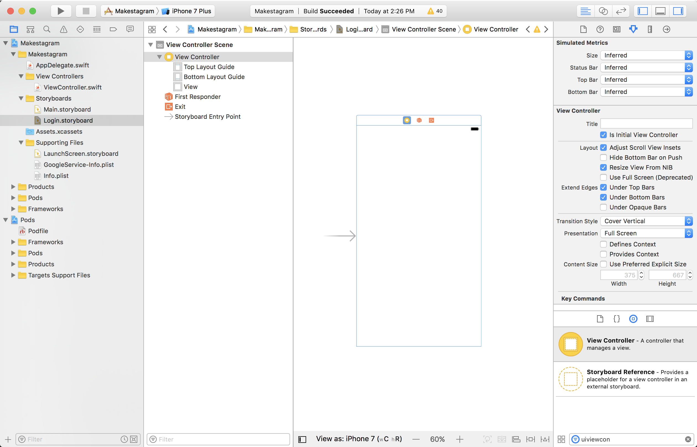
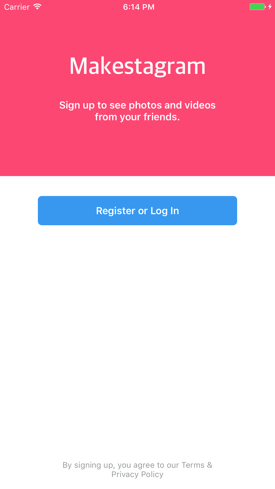
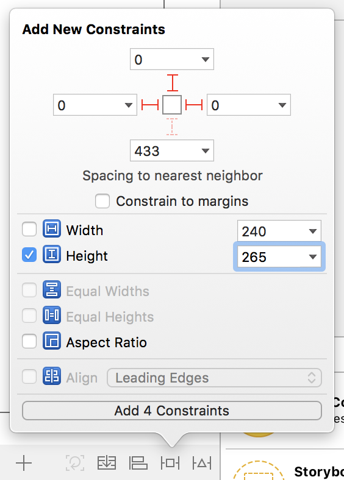
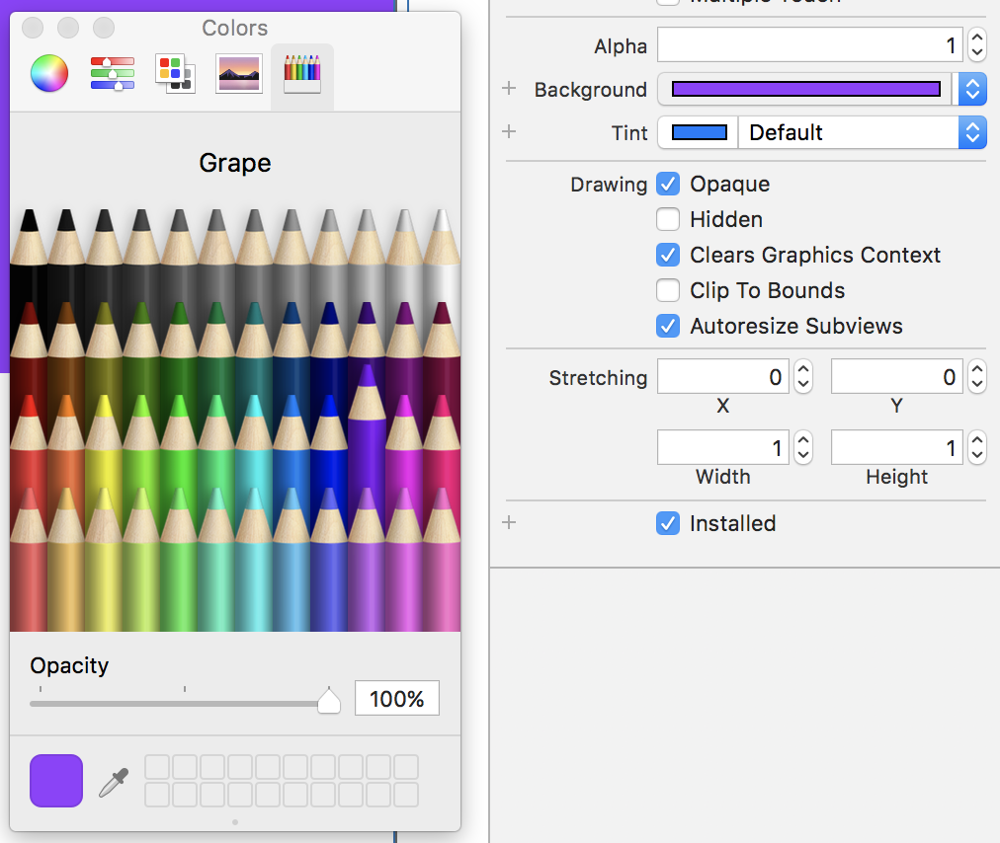
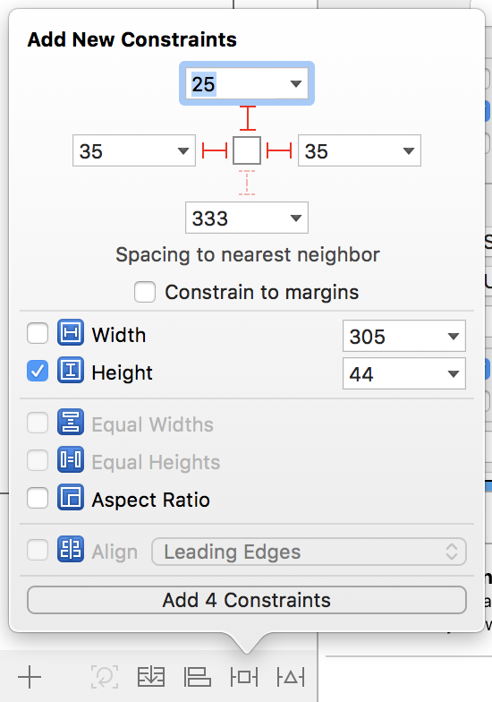

We're finally done with configuring all of the app setup. Let's start coding! The first thing we're going to do is create a signup / login flow for new users to create a new account. Let's explore authentication with Firebase!

# What is Authentication?

Authentication is verifying the identity of a user. Knowing a user's identity allows us to keep track of which data belongs to which user. In addition, if a user decides to log out, all of their data will be saved securely should they return.

## Firebase Auth

Firebase provides us with an easy way of authenticating users with their built in SDK and libraries. Throughout our login flow, we'll be using these pre-built components to save time and not have to worry about securely handling sensitive information.

To make sure we have access to these APIs and components, make sure you have FirebaseAuth and FirebaseUI listed and installed in your Podfile. If you do not, go back to the previous steps to add them to your Xcode workspace.

# Creating a Login storyboard

Let's start building our login flow by creating a new storyboard, specifically for signup and logins. Create a new storyboard file and name it `login.storyboard`. Make sure you've created the new .storyboard file in the Storyboard directory. 

## Why multiple storyboards?

Separating the main flows of your app into specific, well-defined storyboards allows you keep your storyboards small and organized.

Imagine if you had 30 view controllers in a single storyboard! Not only would it be tough to find view controllers that you're looking for, the file would be extremely slow to open because of it's size. Version control and working with other developers would also be a nightmare. As a general rule, keep your storyboards small and defined to a single flow of your app.

# Setting up the Login View Controller

When the user opens the app for the first time, we want them to see the login screen. To achieve that, let's first create a new view controller within the login storyboard.

Navigate to the Login storyboard and open the object library. Drag a new view controller from the object library onto your Login storyboard. Click on the new view controller and open the attributes inspector. Find the checkbox for `Is Initial View Controller` and make sure the option is selected. You should see an arrow pointing to the left side of the view controller after you've completed this step. 

## What's the initial view controller?

The initial view controller represents the starting point for a specific storyboard file. This usually is the first screen that is presented to the user within a storyboard.

UIStoryboard provides you with a method to create a new instance of the initial view controller.

# Connecting the Login View Controller to code

So far we've created a new view controller within interface builder, but we haven't connected it to code. Create a new LoginViewController.swift class. Navigate back to the Login storyboard, click on the initial view controller and open the class inspector. Under the `Custom Class` subheader, set the Class to LoginViewController.

# Testing progress thus far

Let's test things out to make sure things are working as we expect them to. We need some way to make sure that when the app opens, it's showing the Login View Controller.

An easy way to verify our code is working, is changing the background color of the view controller to orange (or another color of your choosing). Navigate to the Login storyboard, click on the Login View Controller's view, and change it's background color to orange. When we run the app, we'll expect to see a blank orange screen.

Run the app. What happens?

# Setting the root view controller

You'll notice the screen is still the default white. That's because by default, the initial view controller that will be shown to the user on launch will be inside the Main.storyboard. This is defined within the Info.plist file, under the Main storyboard file base name property.

Instead of changing the Info.plist directly, we'll run code when the app first launches to set the initial view controller to be the Login storyboard's initial view controller. Place the following code in your AppDelegate in the `application(_:didFinishLaunchingWithOptions:)` method.

    let storyboard = UIStoryboard(name: "Login", bundle: .main)
    if let initialViewController = storyboard.instantiateInitialViewController() {
        window?.rootViewController = initialViewController
    }

Here we create an instance of the Login storyboard, check if it has an initial view controller, and set our window's root view controller to the Login storyboard's initial view controller.

After making the changes, let's run our app again! You should now see that orange screen confirming that we're showing the correct initial view controller.

Next let's add some UI elements to allow the user to signup / login.

# Adding the UI

We're going to create a really simple design and hand-off most of the heavy lifting to a pre-made UI component using FirebaseUI. After we finish, our login is going to look like this:

First let's change the background color of the view controller back to the default white. Next, let's create a header view that will contain the name of our app `Makestagram` and a brief description of what our app does.

Drag a new view from the object library onto the view controller and set the following constraints.

Make sure that the `Constraint to Margin` checkbox is unchecked and that the top constraint is relative to the view, not the top layout guide. Change the background color of the header view to purple.

Add two UILabels from the object library onto the header view. Change the text and font of each label to match the designs.

Next we'll position the labels by adding them into a vertical stackview and adding constraints to the stackview.

Select both UILabels and click the `Embed In Stack` button. Next, make sure you have the stack view selected and center it horizontally and vertically within the superview.

<!-- show image of adding constraints above -->

Last, let's add a login button, right below the header view. Drag an UIButton from the object library directly below the header view. And set the constraints to match the design.

# Connecting our IBOutlets

Now that we've setup all our UI elements in storyboard, we need to connect them to our corresponding .swift view controller so we can reference them in code.

Use your assistant editor to open both the Login storyboard and the Login View Controller side by side. An easy way to do this by holding the option button and right clicking on the file you want to open in the assistant editor.

Once both files are open, create an IBOutlet to the login button by holding control, right clicking on the login button and dragging to the view controller.

Also create a IBAction for when your login button is tapped. Control-drag from the button to the below the IBOutlet you previously set. This time, change the type of connection from an IBOutlet to an IBAction.

<!-- show image below -->

Let's test our code is working. Running our code frequently is a great way to make sure we haven't missed steps or accidentally introduced bugs into our code. 

Place a print statement the following text: `login button tapped` within the IBAction. Run the app and tap the login button. If the print statement shows up in the console, you've successfully setup your login screen.

Next, we'll move on to using FirebaseUI to handle the authentication functionality.
