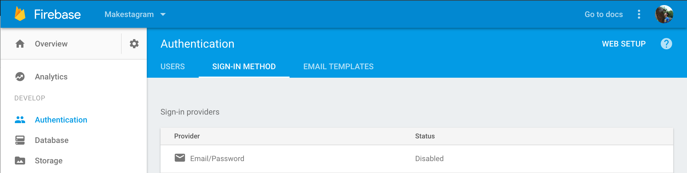
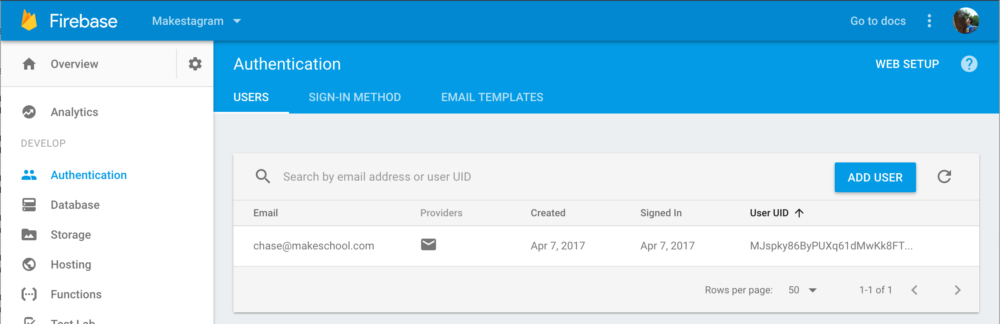

This step will focus on connecting the login screen we built with some pre-built Firebase UI components that will help us sign up or log in the user. We'll use FirebaseUI to make development easier, but it's also possible to implement your own custom authentication flow.

# Setting up FirebaseUI

First, we'll need to import FirebaseAuthUI in order to access the library that will help us with authentication. Add the following line to the top of your file.

    import FirebaseAuthUI

Now, when the user clicks on the Login button, we can hand off authentication to Firebase's pre-built authViewController. In the `loginButtonTapped(sender:)`, add the following code:

    @IBAction func loginButtonTapped(_ sender: UIButton) {
        // 1
        if let authUI = FUIAuth.defaultAuthUI() {
            // 2
            authUI.delegate = self
            
            // 3
            let authViewController = authUI.authViewController()
            present(authViewController, animated: true)
        }
    }
   
Let's break this apart:

1. We reference the FUIAuth.defaultAuthUI() singleton and make sure it isn't nil.
2. We set the delegate of the authUI singleton to the LoginViewController.
3. We present the authViewController that is a property of authUI.

When authViewController is presented, Firebase presents it's own UI to handle signing up or logging in the user. In addition, Firebase's authViewController can be customized to include different types of login. i.e. Facebook, Google, Github

Since we've set the delegate of authUI to be the LoginViewController, we need to conform LoginViewController to the protocol. Add the following code to the bottom of the file (after the closing }).

    class LoginViewController: UIViewController {
        // ...
    }

    extension LoginViewController: FUIAuthDelegate {
        func authUI(_ authUI: FUIAuth, didSignInWith user: FIRUser?, error: Error?) {
            // handle user signup / login
        }
    }

# Enabling Firebase Sign-in Providers

Before we can use FirebaseUI to manage our user accounts, we need to tell Firebase which sign-in methods it accepts. Open your Firebase project, and navigate to the Authentication tab. Once you're on the Authentication tab, Firebase should prompt you to setup your sign-up method. Click the `SET UP SIGN-IN METHOD` button and enable the email/password sign-in provider.

Now, if you run the app, you should be able to create new user accounts with Firebase. Run the app and create a new account. Then click the authentication tab to see if your user acconut has been created.

## FIRAuth Singleton

When a new account is created, our delegate method that we implemented will get called. The main thing to keep in mind is that the delegate returns the FIRUser that just signed up / logged in and an error if it occured. Let's go ahead do some very basic error handling so we'll know if an error occurs. Add the following code below:

    func authUI(_ authUI: FUIAuth, didSignInWith user: FIRUser?, error: Error?) {
        if let error = error {
            print("Error signing in: \(error.localizedDescription)")
        }

        // handle user signup / login
    }
    
You'll notice that we're also returned a user of type `FIRUser?`. This will allow us to access some basic information associated with our FIRUser such as displayName and email. The most important property of FIRUser is uid.

## What is an UID?

UID is an acronym for unique identifier and represents a way to uniquely identify each of our users. When a user creates an account with FirebaseAuth, Firebase will assign each new user a unique string for that user account. We don't have to worry about creating the string ourselves, Firebase will manage that for us.

## FIRUser Singleton

One thing that we want to keep in might is that once there is a user that is logged into Firebase, we can access it through the FIRAuth singleton. We can access the currently logged in user with the following code:

    let user: FIRUser? = FIRAuth.auth()?.currentUser

## What is a singleton?

A singleton is similar to a global variable in that it provides an easy way for us to access a shared resource. Although singletons are used widely through the iOS ecosystem, we want to be careful and deliberate when creating our own singletons. Singletons are usually a sign of bad code architecture.

# Handling User Signup / Login

After the user authenticated with Firebase, we want to redirect the user to a different view controller depending on whether they are a new user or an existing user. 

1. **New users** should be sent to choose thier username.
2. **Existing users** should be sent to the home view controller of thier feed.

To determine if the user is a new user, we'll need to have some way to retrieve previous data about the user. Your first instinct might be to see if the FUIAuthDelegate returns any information that'll tell us if the user is a new or existing user. Unfortunately, it doesn't provide us much information outside of confirming that a new or existing user with authenticated by Firebase. FirebaseAuth doesn't help us much outside of providing a easy way to authenticate users. Instead we'll have to use the Firebase realtime database!

