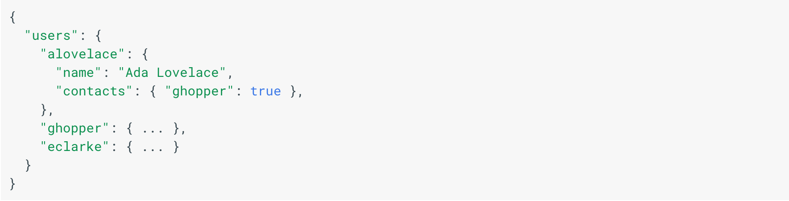
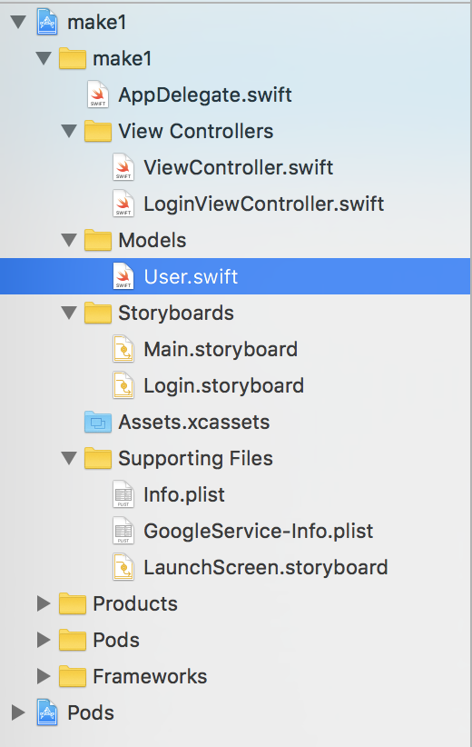

`FirebaseAuth` & `FIRUser` allow us to authenticate users but don't provide much functionality outside of that. Although each `FIRUser` object contains a few properties for storing basic user information, we can't add additional properties that can be stored with the `FIRUser`. The default fields within `FIRUser`:

The default fields include:

1. UID (unique identifier)
2. Display Name (first & last name)
3. Email
4. Photo URL

What if we want to store a custom property such as an username? Although `FirebaseAuth` won't help us, we can use a combination of `FirebaseAuth` and the Firebase Realtime Database to store additional user information.

# Introducing the Firebase Realtime Database

The Firebase Realtime Database is a NoSQL database that can be used to store and retrieve data for our app. The Realtime Database is optimized for reading and writing quickly. Data is stored as a JSON object and the entire database can be thought of as a giant JSON tree. Data is written at specific locations defined by relative paths (associated keys) and can be retrieved using the same path. As data is added to the JSON tree, it becomes a node in the existing JSON structure.



Here, we see an example Firebase database that has users and posts. The root path of the database is `makestagram-b5d74`.

If we wanted to fetch all posts within our database, we'd fetch from the relative path:

    root > posts

Similarly, if we wanted to write a user, we would write to a specific location within our database:

    root > users > uid

<!-- maybe talk about how to structure data -->

# Reading from the Database

To read data from the database, we need to implement the following steps:

1. Build a `FIRDatabaseReference` to the location you want to read from
2. Use `observe(_:with)` or `observeSingleEvent(of:with:)` method of `FIRDatabaseReference` to observe `FIRDataEventTypeValue` events
3. Handle the event callback that is passed a snapshot that contains all data at the location

Let's walk through each of these steps individually to see what they look like:

## Build a FIRDatabaseReference

First, we'll need to import the appropriate library to use the Firebase Realtime Database:

```
import FirebaseDatabase
```

To read data, we'll first need to create a location to where we want to read from in the database. Let's look at an example where we want to read the current user's data from Firebase:

```
// 1
if let user = FIRAuth.auth()?.currentUser {
    // 2
    let rootRef = FIRDatabase.database().reference()
    // 3
    let userRef = rootRef.child("users").child(user.uid)

    // 4 read from database with userRef
}
```

Let's break this down:

1. We check if there is a current user logged into Firebase by checking the `FIRAuth` current user singleton. We'll need the uid of the current user to build a relative path to the location we want to read from
2. If a `FIRUser` exists, we get a reference to the root of our JSON dictionary with the `FIRDatabase.database().reference()` singleton
3. We create a `FIRDatabaseReference` by adding a relative path of `/users/#{user.uid}`

We've successfully created a relative path to the location we want to read from! Now we need to read the data at the location we specified.

## Reading Data from a FIRDatabaseReference Location

Data is read from the database by using `observe(_:with)` or `observeSingleEvent(of:with:)` method of `FIRDatabaseReference`. The difference between these two methods is that `observe(_:with)` will create an object continuously listens for an event type. Whenever an event happens, usually a change that's made to the data, the event callback will be triggered. With this method, the event callback can be triggered multiple times.

In comparison, `observeSingleEvent(of:with:)` will only trigger the event callback once. This is useful for reading data that only needs to be loaded once and isn't expected to change. For this tutorial we'll mainly focus on `observeSingleEvent(of:with:)`. Continuing our previous example, let's look at how we would implement `observeSingleEvent(of:with:)`:

```
if let user = FIRAuth.auth()?.currentUser {
    let rootRef = FIRDatabase.database().reference()
    let userRef = rootRef.child("users").child(user.uid)

    // 1
    userRef.observeSingleEvent(of: .value, with: { (snapshot) in
        // 2 handle snapshot containing data
    })
}
```

1. We use the userRef location that we previously created and call the `observeSingleEvent(of:with:)` method to read the data stored at that location. We observe the `FIRDataEventTypeValue` event to read the data at a given path, as it exists at the time of the event.
2. We need to handle the `FIRDataSnapshot` that contains the data returned. If there is no data at the location read from, the value of the snapshot returned is nil.

## Handling the Event Callback

Last, we'll need to retrieve the data stored within the snapshot:

```
if let user = FIRAuth.auth()?.currentUser {
    let rootRef = FIRDatabase.database().reference()
    let userRef = rootRef.child("users").child(user.uid)

    userRef.observeSingleEvent(of: .value, with: { (snapshot) in
        // 1
        if let userDict = snapshot.value as? [String : Any] {
            print(userDict.debugDescription)
        }
    })
}
```

1. We retrieve the data from the `FIRDataSnapshot` using the `value` property. We unwrap and check that the type is what we're expecting it to be, in this case a dictionary.
2. We print the contents of the dictionary using the convenient `debugDescription` property.

Following the previous steps, we've successfully read the current user's data from our database. Let's use this knowledge to create a solution for managing new and existing users.

# Managing User Accounts

To manage our user accounts, we'll need to create a location within our database to store all data related to each user account. Following the previous example, we'll store data in the following relative path:

    root > users > uid

Remember, the `FIRUser` and our database user are separate. We'll be using them together to manage user accounts, but it's important not to get them confused for the same thing. A `FIRUser` is an user that has been authenticated with `FirebaseAuth`. A database user is a JSON object of additional data we want to store within our database at a relative user path of `/users/#{uid}`.

Our logic for managing new and existing users will be:

1. Create a corresponding user JSON in our database whenever a `FIRUser` is created.
2. Whenever a user is authenticated with `FIRAuth`, check our database for an existing user JSON object at the `/users/#{uid}` relative path.
3. If data exists at the `/users/#{uid}` location, we'll know that the current user is a returning existing user. If no data is returned, we'll know the current user is a new user that just signed up.

## Implementing Database User Accounts

Open our `LoginViewController`. To reference our Firebase Realtime Database, let's import the corresponding library. Add the following line at the top of our file with the rest of our imports:

```
import UIKit
import FirebaseAuth
import FirebaseAuthUI
import FirebaseDatabase
```

Next, let's implement reading the user JSON object from our database if it exists. Add the following in our `FUIAuthDelegate` method:

```
func authUI(_ authUI: FUIAuth, didSignInWith user: FIRUser?, error: Error?) {
    if let error = error {
        assertionFailure("Error signing in: \(error.localizedDescription)")
    }

    // 1
    guard let user = user
        else { return }

    // 2
    let userRef = FIRDatabase.database().reference().child("users").child(user.uid)

    // 3
    userRef.observeSingleEvent(of: .value, with: { (snapshot) in
        // 4 retrieve user data from snapshot
    })
}
```

Let's break down the code we just added:

1. First we check that the FIRUser returned from authentication is not nil by unwrapping it. We guard this statement, because we cannot proceed further if the user is nil. We need the `FIRUser` object's uid property to build the relative path for the user at `/users/#{uid}`.
2. We construct a relative path to the reference of the user's information in our database.
3. We read from the path we created and pass an event closure to handle the data (snapshot) is passed back from the database.

Now we'll need to handle the user data to check that the user exists.

# Retrieving Data #

When we retrieve data from Firebase, we recieve a `FIRSnapshot` object that contains the data we retrieved. We can now access the data through it's value property:

```
let data: Any? = snapshot.value
```

Data will be returned as one of the following native types:

- NSDictionary
- NSArray
- NSNumber (includes booleans)
- NSString

In the case of our user that we retrieved, we'll expect the data to be returned as a dictionary. Add the following code inside the `observeSingleEvent(of:with:)` closure:

```
userRef.observeSingleEvent(of: .value, with: { (snapshot) in
    // 1
    if let userDict = snapshot.value as? [String : Any] {
        print("User already exists \(userDict.debugDescription).")
    } else {
        print("New user!")
    }
})
```

To retrieve the user data from `FIRDataSnapshot` we:

1. We check that the snapshot exists, and that it is of the expected Dictionary type
2. Handle and execute the appropriate logic based on whether the user dictionary exists. Based on whether the user dictionary exists, we'll know that the current user is a new or returning user.

# Testing our Logic

Run the app a couple times and sign up to create a few new users. Each time you sign-up with a new user, you should see `New user!` printed to the debug console. You should be able to verify the creation of these new `FIRAuth` users in your Firebase project dashboard.

Now write down the email/password credentials for one of the new `FIRUser` you recently signed up with so we can test logging in with an existing user.

Run the app a couple more times and try testing the login functionality.

You'll notice that even though we're logging in as an existing user, our logic is entering the else clause and printing `New user!` to the console.

This isn't what we expected! When we log in with an existing `FIRUser` we want it to enter the if clause that prints `User already exists \(userDict.debugDescription)`.

Can you guess why our code isn't working like we expect it to?

If you open your Firebase overview in your browser and click on the database tab, you'll notice that it's currently empty. Even when we sign up with new users, our database still remains empty.

Our current code reads from the `users/#{uid}` relative path to see if a user JSON object exists in the database, but because we never write any data when users first sign up with `FIRAuth`, and reads from the Firebase database will always return `nil`.

We'll fix this by handling the new user login flow in the next section, but before we move on, we'll first refactor some of the code that we've written.

# Refactoring Users

Fetching user information as a dictionary is very error prone because it forces us to retrieve values with keys that are *stringly* typed. Let's refactor this by creating our first data model: User.

Create a new `.swift` file called `User.swift` and add it into the Models folder. Create a new grouping in your project navigator for your Models.



Insert the following code into your `User.swift` class:

```
import Foundation

class User {

    // MARK: - Properties

    let uid: String
    let username: String

    // MARK: - Init

    init(uid: String, username: String) {
        self.uid = uid
        self.username = username
    }
}
```

Here we've created a basic user class that has two properties, a UID and username. Next we're going to create a special initializer to take a FIRSnapshot to make things easier. First let's import FIRDataSnapshot into our User model:

```
import Foundation
import FirebaseDatabase.FIRDataSnapshot
```

Next, we'll look at creating our first failable initializer to initialize a user from a `FIRDataSnapshot`.

## What is a Failable Initializer?

Failable initializers allow the initialization of an object to fail. If an initializer fails, it'll return nil instead. This is useful for requiring the initialization to have key information. In our case, if a user doesn't have a UID or a username, we'll fail the initialization and return nil. Add the following to your User init methods:

```
init?(snapshot: FIRDataSnapshot) {
    guard let dict = snapshot.value as? [String : Any],
        let username = dict["username"] as? String
        else { return nil }

    self.uid = snapshot.key
    self.username = username
}
```

Here we guard by requiring the snapshot to be casted to a dictionary and checking the dictionary contains `username` key/value. If either of these requirements fail, we return nil. Note that we also store the key property of `FIRDataSnapshot` which is the UID that correlates with the user being initialized.

This cleans up our code by creating a reusable initializer that we can use to create user objects from snapshots. In addition, we no longer have to fetch information directly from snapshots using *stringly* typed key/value pairs. Let's go ahead and finish by refactoring our original code to use our failable initializer.

```
ref.observeSingleEvent(of: .value, with: { (snapshot) in
    if let user = User(snapshot: snapshot) {
        print("Welcome back, \(user.username).")
    } else {
        print("New user!")
    }
})
```

Great! Let's move on to implementing the logic to handle new users.
