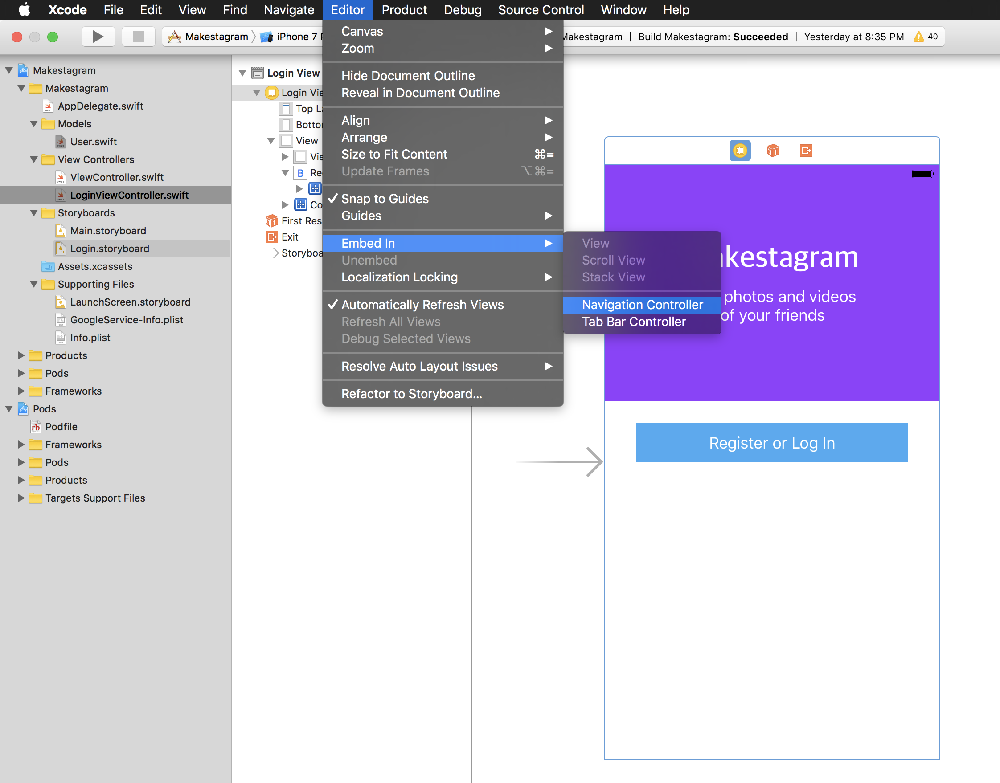
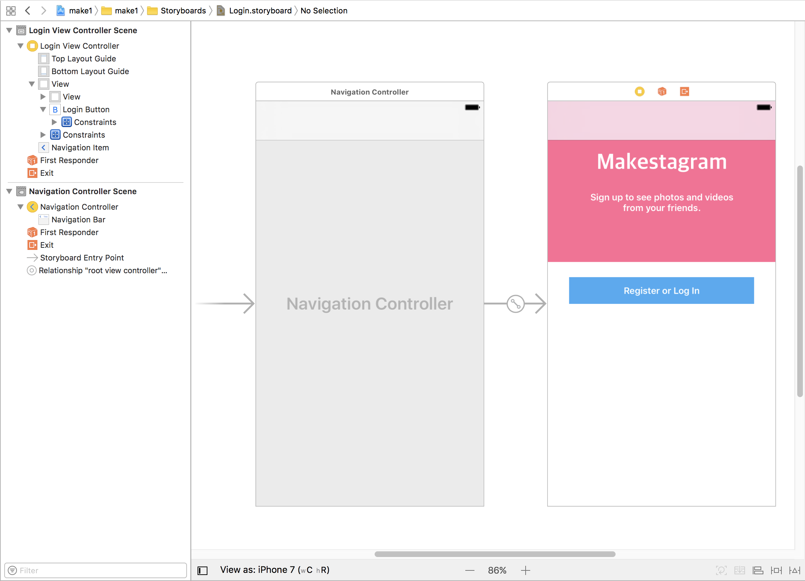
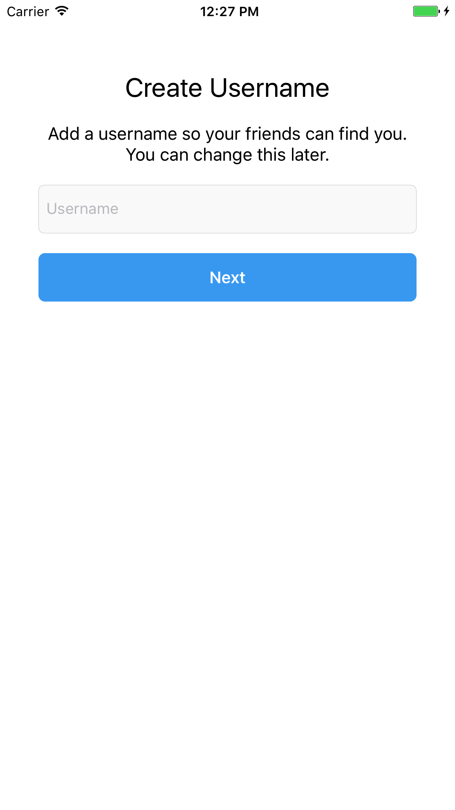

Previously, we setup some logic to determine whether a user that signed in through FirebaseUI is a new or existing user. We'll first handle the case of a new user.

Even though FirebaseAuth is properly authenticating our users, our previous code doesn't work. Try creating an user, verifying the user account exists in FirebaseAuth, and then logging in again. Even though the user's account has already been created our `authUI(_:didSignInWith: error:)` method still prints "New user!".

This is because we're checking the Firebase database for the associated user uid in order to see if the user exists, but after we create a new user, we never write the new user to the database. This is important, otherwise we won't be able to tell whether any user that signs in is a new or existing user.

Let's now handle creating a new user inside the Firebase database.

# Creating a Username

In order to create a new user inside the Firebase database, we're going to segue to a new view controller that first allows them to choose a username.

Open the Login storyboard and select the Login View Controller. With the view controller selected, go to the `Editor` menu in the menu bar and select Embed In > Navigation Controller.

Before we move on, we won't need the navigation bar that a navigation controller provides. Select the navigation controller and go to the property inspector. Under `Navigation Controller`, make sure you uncheck `Shows Navigation Bar` checkbox. 

Next we'll want to create a new view controller to allow the user to create a new username. This is what the design should look like when we're done.

We've been through this process a couple of times now. See if you can figure out how to set all of the UIKit elements and connect them to code by yourself. Don't proceed to the next section until you've at least tried implementing the design by yourself.

## Implementing the logic

After you've set all your UI elements in storyboard, you should have created a new view controller called `CreateUsernameViewController`. After connecting your IBOutlets and IBActions, your view controller should look like this:

<!-- insert image of create username view controller -->

The main thing we'll focus on is the following method:

    @IBAction func nextButtonTapped(_ sender: UIButton) {
        // create user account here
    }
    
Before we implement the logic for when the next button is tapped, we need to first make the Login View Controller segue to the Create Username View Controller when a new user is created. Add the following line to your code:

    extension LoginViewController: FUIAuthDelegate {
        func authUI(_ authUI: FUIAuth, didSignInWith user: FIRUser?, error: Error?) {
            if let error = error {
                print("Error signing in: \(error.localizedDescription)")
            }

            guard let user = user else { return }

            let ref = FIRDatabase.database().reference().child("users").child(user.uid)

            ref.observeSingleEvent(of: .value, with: { [unowned self] (snapshot) in
                if let user = User(snapshot: snapshot) {
                    print("Welcome back, \(user.username).")
                } else {
                    self.performSegue(withIdentifier: "toCreateUsername", sender: self)
                }
            })
        }
    }

Don't forget to create a segue in your login storyboard by ctrl-dragging from the LoginViewController to the CreateUsernameViewController. After creating the segue, make sure you selected and add `toCreateUsername` under Identifier in the attributes inspector.

Now when a new user signs up, they'll be redirected to choose thier username. After the user types in a user name and clicks on the next button, we'll make sure that that username text field has text in it and if it does, we'll create the new user in our database.

    @IBAction func nextButtonTapped(_ sender: UIButton) {
        // 1
        guard let user = FIRAuth.auth()?.currentUser,
            let username = usernameTextField.text,
            !username.isEmpty else { return }
        
        // 2
        let userAttrs: [String : Any] = ["username": username]
        
        // 3
        let ref = FIRDatabase.database().reference().child("users").child(user.uid)
        
        // 4
        ref.setValue(userAttrs) { (error, ref) in
            if let error = error {
                assertionFailure(error.localizedDescription)
                return
            }
            
            ref.observeSingleEvent(of: .value, with: { (snapshot) in
                let user = User(snapshot: snapshot)
                
                // handle newly created user here
            })
        }
    }
    
Let's walk through the code above:

1. First we guard to check that the user has provided a username in the textfield.
2. We create a dictionary for the data we want to store inside our database. In this case just want to store the user's username.
3. We create the path of where we want to store our data.
4. We write the data we want to store at the location we provided in step 3.

Now whenever an user is created, a user JSON object will also be created for them within our database.

# Service Classes

Before we move on, let's do some refactoring for the code we've written so far. We want to have good code architecture that is decoupled so that we can easily change our code later if we need to. 

# What is a Service Class? #

A service class helps you decouple your view controllers from your networking logic. We want to remove the networking code, such as reading and writing to our database, so that we can reuse the same code and access our networking logic from other view controllers.

Let's create a new class called `UserService.swift`. We'll put all our methods related to user networking in here. 

    struct UserService {
        // insert user-related networking code here
    }

Next let's create a static method that encapsulates create an user.

    import Foundation
    import FirebaseAuth.FIRUser
    import FirebaseDatabase

    struct UserService {
        static func create(_ firUser: FIRUser, username: String, completion: @escaping (User?) -> Void) {
            let userAttrs: [String : Any] = ["username": username]

            let ref = FIRDatabase.database().reference().child("users").child(firUser.uid)
            ref.setValue(userAttrs) { (error, ref) in
                if let error = error {
                    assertionFailure(error.localizedDescription)
                    return completion(nil)
                }

                ref.observeSingleEvent(of: .value, with: { (snapshot) in
                    let user = User(snapshot: snapshot)
                    completion(user)
                })
            }
        }
    }

Here we remove the networking-related code of creating a new user in our view controller and place it inside our service class. The service class will act as an intermediary for communicating between our app and Firebase.

Now let's go back to our Create Username View Controller and refactor the code to use our new service class.

    @IBAction func nextButtonTapped(_ sender: UIButton) {
        guard let firUser = FIRAuth.auth()?.currentUser,
            let username = usernameTextField.text,
            !username.isEmpty else { return }
        
        UserService.create(firUser, username: username) { (user) in
            guard let user = user else { return }

            print("Created new user: \(user.username)")
        }
    }
    
Let's make sure everything works as expected. Run the app and create a new user. If anything goes unexpectedly, review the steps to make sure you didn't miss anything.

# Changing the Root View Controller

After creating a new user in our view controller, we want to let the user into the main flow of the app. To do that we need to change the current window's root view controller. Just as we initially set the root view controller in the app delegate to the intial view controller of the login storyboard, after the user has logged in, we need to change it back to the main storyboard.

Add the following code below:

    UserService.create(firUser, username: username) { (user) in
        guard let _ = user else {
            // handle error
            return
        }

        // 1
        let storyboard = UIStoryboard(name: "Main", bundle: .main)

        // 2
        if let initialViewController = storyboard.instantiateInitialViewController() {
            // 3
            self.view.window?.rootViewController = initialViewController
            self.view.window?.makeKeyAndVisible()
        }
    }

Let's walk through the code we just added:

1. Create a new instance of our main storyboard.
2. Check that the storyboard has an initial view controller that's set.
3. Get reference to the current window and set the rootViewController to the initial view controller.

Let's run the app and test it out! If everything works correctly, you should be redirected to a blank white screen that is the initial view controller of the main storyboard.

## Handling Existing Users

Simliarly to our approach to new users, if we recieved an existing user on our login view controller, we also want to redirect them to the main storyboard by setting the window's root view controller.

Go ahead and add the following code to our login view controller. This is the exact same code we used to set the root view controller after a new user was created.

    ref.observeSingleEvent(of: .value, with: { [unowned self] (snapshot) in
        if let _ = User(snapshot: snapshot) {
            let storyboard = UIStoryboard(name: "Main", bundle: .main)
            if let initialViewController = storyboard.instantiateInitialViewController() {
                self.view.window?.rootViewController = initialViewController
                self.view.window?.makeKeyAndVisible()
            }
        } else {
            self.performSegue(withIdentifier: "toCreateUsername", sender: self)
        }
    })

# Creating a User singleton

Before moving on, we're going to create our own user singleton. Be wary of singletons. They're generally considered an anti-pattern and you want to only use them when it makes sense.

<!-- maybe explain more depth about why singletons are bad and when to use them -->

In our `User.swift` file, we're going to create a class variable like so:

    // MARK: - Singleton
    
    // 1
    private static var _current: User?
    
    // 2
    static var current: User {
        // 3
        guard let currentUser = _current else {
            fatalError("Error: current user doesn't exist")
        }
        
        // 4
        return currentUser
    }
    
    // MARK: - Class Methods
    
    // 5
    static func setCurrent(_ user: User) {
        _current = user
    }

Let's walk through the code we just created:

1. Create a private static variable to hold our current user. This method is private so it can't be access outside of this class.
2. Create a computed variable that only has a getter that can access the private _current variable. 
3. Check that _current that is of type User? isn't nil. If _current is nil, and current is being read, the guard statement will crash with fatalError(). 
4. If _current isn't nil, it will be returned to the user.
5. Create a custom setter method to set the current user.

Now that we've created a User singleton, we need to make sure to set it once we recieve the user from the database we set the singleton with our custom setter method. After the singleton is set, it will remain in memory for the rest of the app's lifecycle. It can also be accessed from any view controller with the following code:

    let user = User.current
    
Let's go ahead and make sure we set the current user. Add the following code in your Login View Controller:

    ref.observeSingleEvent(of: .value, with: { [unowned self] (snapshot) in
        if let user = User(snapshot: snapshot) {
            User.setCurrent(user)

            let storyboard = UIStoryboard(name: "Main", bundle: .main)
            if let initialViewController = storyboard.instantiateInitialViewController() {
                self.view.window?.rootViewController = initialViewController
                self.view.window?.makeKeyAndVisible()
            }
        } else {
            self.performSegue(withIdentifier: "toCreateUsername", sender: self)
        }
    })
    
Next update the following code in your Create Username View Controller:

    UserService.create(firUser, username: username) { (user) in
        guard let user = user else {
            // handle error
            return
        }

        User.setCurrent(user)

        let storyboard = UIStoryboard(name: "Main", bundle: .main)
        if let initialViewController = storyboard.instantiateInitialViewController() {
            self.view.window?.rootViewController = initialViewController
            self.view.window?.makeKeyAndVisible()
        }
    }

Congrats, now we successfully handle both new and existing users when they sign up or login in through our authentication system. Run the app a couple times and try create new user accounts as well as logging into existing user accounts. Make sure that for each case, you're being taken through the correct user flow and redirect to the main storyboard.

