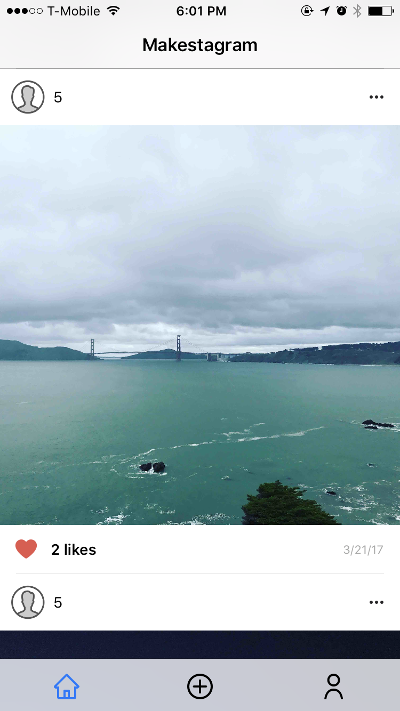
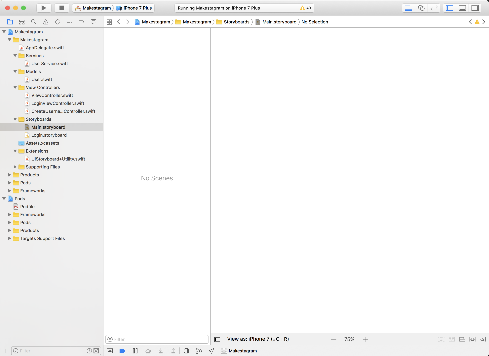
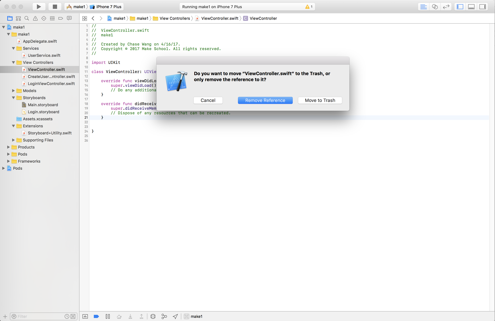
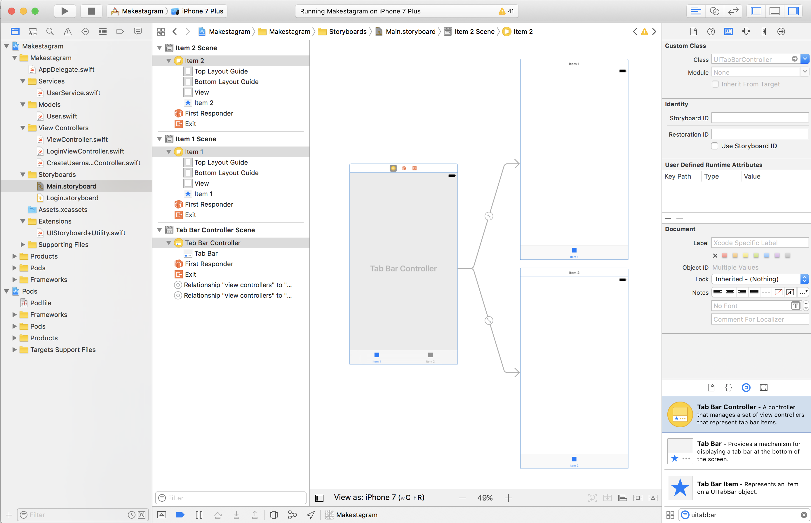
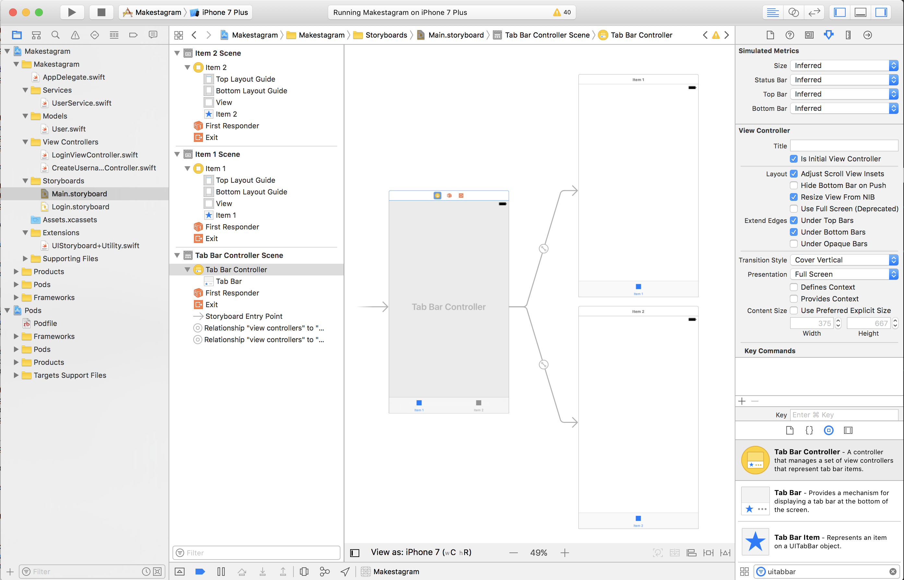
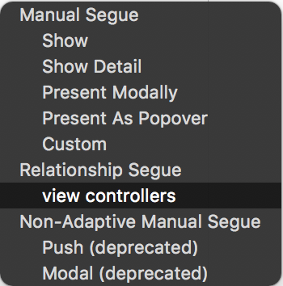
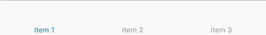
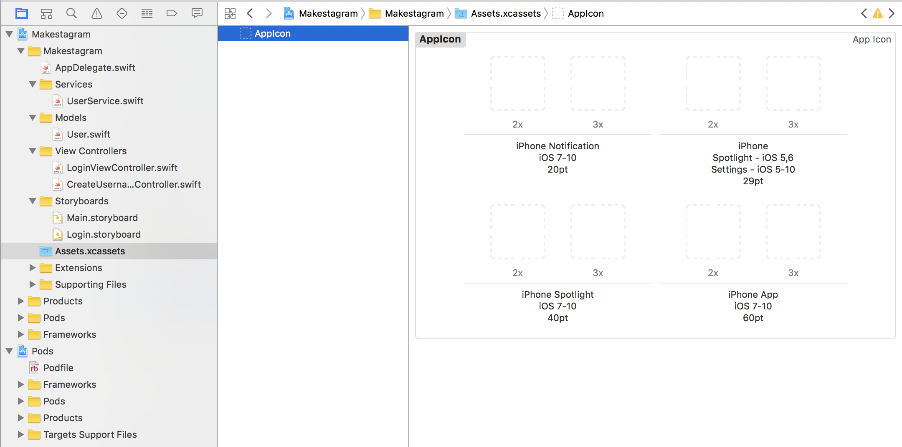
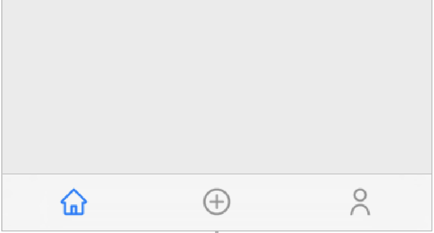

We've successfully finished out login flow for new and existing users! Let's refer back to our initial app outline to see to implement our next feature:

It's helpful to update and refer back to your app outline as you build your app. It'll give you a clear roadmap for which parts you've completed and which parts still need to be implemented.

Now that we've built out our login flow, we'll need to implement the main flow of our app: taking photos, timeline and following users. We'll begin by setting up the structural UI components of our main flow in storyboard.

# Introducing the UITabBarController

In our app, we'll be using a `UITabBarController`. The `UITabBarController` is a container view controller that contains a *tab bar* and *tab bar items*. Even if you don't know what a tab bar is, you've probably used a tab bar in many of the most popular apps on the App Store today:

<!-- insert image of popular apps with tab bar -->

Each tab bar item is connected to a specific view controller and tapping a tab bar item displays the appropriate view controller.

Let's begin setting up our `UITabBarController`.

## Setting Up the UITabBarController

In our *Makestagram* app, our `UITabBarController` will allow an user to select and switch between the Timeline screen, Photo Capture screen, and Friends Search screen:

Open `Main.storyboard`. You'll see that it currently contains the default view controller that Xcode automatically adds to each single view application. We won't be using it, so go ahead and delete the storyboard view controller and it's corresponding `ViewController.swift` class.

> [action]
Open *Main.storyboard*. Select the existing view controller; after you have selected it you should see a blue border surrounding it:

>
Hit the *delete* key to remove this view controller. Now you should see a blank storyboard:

> [action]
Delete the accompanying source file *ViewController.swift*; when prompted, click the button that says `Move to Trash`:

Now we can add the `UITabBarController`:

> [action]
Drag the `UITabBarController` from the component library into the storyboard:

## Testing our UITabBarController

Now that we've set up our `UITabBarController`, let's make sure things are working!

> [action]
Run the app!

Oops! What happened? If you ran the app, you'll notice that our app just displays a empty black screen:

If you look at you're debug console, you'll also notice the following error:

Makestagram[79956:42367980] [Application] Failed to instantiate the default view controller for UIMainStoryboardFile 'Main' - perhaps the designated entry point is not set?

## Why Are We Seeing This Error?

When working with storyboards, we have to designate an entry point, or more simply, we have to tell UIKit (the Apple framwork which handles manipulating the user interface) what view controller should appear first (we call this view controller the *Initial View Controller*). When the compiler doesn't know which view controller to show first (a.k.a. when the entry point is not set), it defaults to showing an empty black screen.

We are seeing this error because the `UIViewController` that we initially deleted from the project was set as the Initial View Controller, and after deleting it, we never set another view controller to be the new *initial view controller*. Let's fix this error by assigning our tab bar controller as the *initial view controller*.

> [action]
Configure the tab bar controller to be our app's Initial View Controller. First select the *Attributes Inspector* in the right bar (1). Then check the *is Initial View Controller* checkbox (2). As a confirmation you should see an arrow pointing to the Tab Bar View Controller (3):

Great! Run the app again. When the app first launches you should see the `LoginViewController`. After authenticating, you should see the tab bar you set as the *initial view controller* of `Main.storyboard`.

# Adding a Third View Controller to the Tab Bar

The default tab bar comes with two view controllers; however, we need three view controllers for **Makestagram**. Lets add the third view controller now.

> [action]
Drag a new view controller from the object library. Select your `UITabBarController` and ctrl-drag from the `UITabBarController` to the added view controller. Select `view controllers` when prompted to set the relationship between the two:

Run the app. We now have the correct number of view controllers set up for our `UITabBarController`!

# Decorating the Tab Bar Items

Currently the tab bar has three entries and looks like this:

The empty tab bar looks pretty bad, so let's add an image to each tab bar item to make things look nicer. (Images will also have the benefit of making it easier to identify the different tabs.)

> [action]
Download the .zip file for image resources for this app:
<!-- insert link for tab bar images pack -->

## Adding Assets to an App

Now it's time to add some of these assets you just downloaded to our app. To keep your images organized, all assets used within an iOS app should be stored in *Asset catalogs*. Every iOS projects that you create with Xcode comes with one default asset catalog called *Images.xcassets*:

That asset catalog contains one resource for the App's icon. You add new resources to your app by creating new entries (called *Image Sets*) in this asset catalog. You can also create multiple asset catalogs which is useful for apps with huge amounts of images.

Let's add our first images to our app!

Unzip the downloaded art pack, then add all of the assets to the asset catalog.

Let's briefly discuss some important concepts about asset handling on iOS. You probably have realized that we're providing three different image files for each asset we wanted to use in our App (*@1x*, *@2x* and *@3x*). These different images have different resolutions, each suited to a specific type of iOS devices with a different screen resolution. The *@1x* assets are used for the oldest iOS devices, e.g. iPhone 3Gs, which don't have retina displays. The *@2x* images are used for the 3.5 and 4 inch retina screens of the iPhone 4(S) and iPhone 5(S). Finally, the *@3x* images are used by the iPhone 7 and iPhone 7 Plus. In most cases you won't have to spend too much time thinking about this, as long as you provide assets in all relevant resolutions. If you don't provide the necessary resolutions, your image assets will look blurry or pixelated on certain devices.

You should also note that we don't reference images in asset catalogs by their file name, but instead by the name of their Image Set. In our example, our image sets are called *camera*, *friends* and *home*.

## Assigning Images to Tab Bar Items

Now that we have added images to our asset catalog, we can assign them to our tab bar items.

> [action]
**Repeat the following steps for all three view controllers**:
>
1. Select a view controller in the left panel of `Main.storyboard`
2. Select the view controller's tab bar item
3. Open the *Attributes Inspector* in the right panel
4. Delete the Item *Title*
5. Set the Item *Image* to *home*, *camera* or *friends*, depending on which view controller you are currently setting up
>

Now we have images on each tab bar item - but something doesn't look quite right. The images aren't vertically centered. That's because iOS reserves some space below the image for the *Title* of the tab bar item. For **Makestagram** we don't need titles, instead we want the images to be centered. We can accomplish that by adjusting the *Image Inset* for each tab bar item.

> [action]
**Repeat the following steps for all three view controllers**:
>
1. With the tab bar item selected, open the *Size Inspector* on the right panel
2. Set the *Image Insets* as following:
      - *Top*: 7
      - *Bottom*: -7
>

Now all of your tab bar items should have images that are nicely centered.

Run the app. Your tab bar should now look like this:

## Reordering Tab Bar Items

Just in case you didn't arrange the `UITabBarController` view controllers in the correct order, you can easily reorder them. Select the `Tab Bar` of the `UITabBarController` in your storyboard. With the `Tab Bar` selected, you can simply drag the tab bar items to the correct order.

Now we have a nice looking `Tab Bar` that connects to the three view controllers of our app!

# Creating Classes for our View Controllers

To finish this section, create the source code files for `HomeViewController` and `FindFriendsViewController`. We will be working on these two new view controllers throughout this tutorial. Add them to the  *View Controllers* group to keep this project nicely structured.

> [action]
Create two new source files for each new view controller:
>
- `HomeViewController.swift`
- `FindFriendsViewController.swift`

If you are wondering why we didn't create a corresponding view controller for our capture photo tab. It's because we'll be using Apple's `UIImagePickerController` to handle taking or uploading a photo for us.

## Configuring Custom Classes in Storyboard

Don't forget! Whenever you create new source files you need to set each corresponding class in the storyboard.

> [action]
**Repeat the following steps for the Home and Find Friends View Controllers**:
>
1. Select the View Controller in Storyboard
1. Open the *Identity Inspector* in the right panel
1. Set the custom class to match the current View Controller
>

# Wrapping up

Congratulations! We have now set up the basic structure of **Makestagram**! You should have three tab bar items with icons, connected to three view controllers in your storyboard, each backed by a corresponding Swift file.
