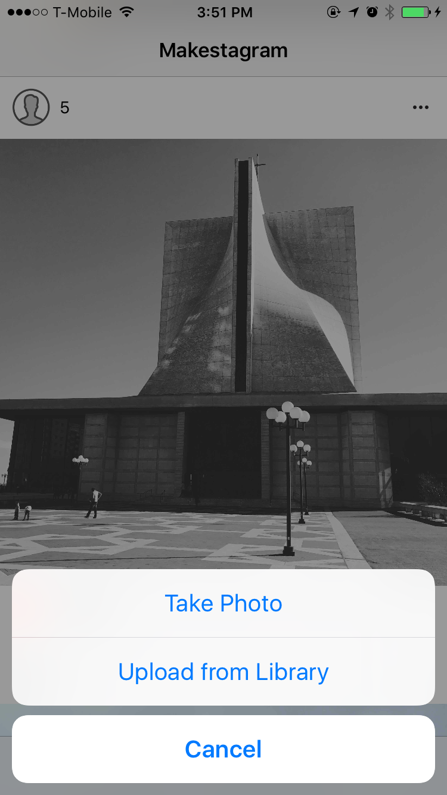
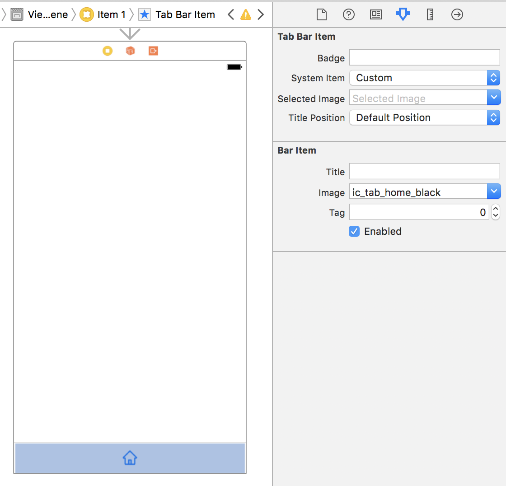
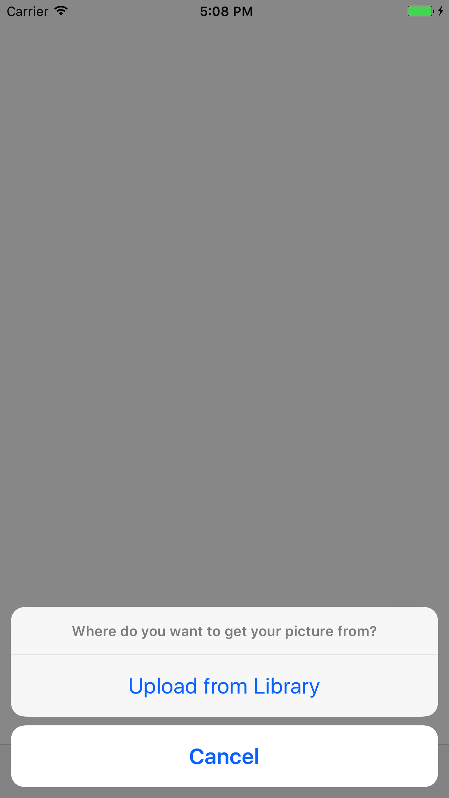

It's time to implement our next feature: uploading photos to Firebase! In **Makestagram**, we want to allow the users to upload or take a photo as soon as they tap the camera button in the middle of the tab bar.

Typically a tab bar view controller only allows a user to switch between different view controllers; however, we don't want to switch to a view controller when the button is tapped, instead we want to show an action dialog that lets the user take or select a picture:

Unfortunately, using a tab bar view controller, we cannot *easily* perform an arbitrary method when one of the tab bar items is selected; however, there's a **workaround**.

# Using a Tab Bar Item Like a Button

Essentially we want to use the photo tab bar item like a button. When it is tapped, we want to call a method to present the dialog shown above.

One of the ways to accomplish this is to make use of the `UITabBarControllerDelegate` protocol.

That protocol contains a method that is interesting for us:

    optional public func tabBarController(_ tabBarController: UITabBarController, shouldSelect viewController: UIViewController) -> Bool

You can read the full documentation of the method [here](https://developer.apple.com/reference/uikit/uitabbarcontrollerdelegate/1621166-tabbarcontroller).

Using this method the tab bar view controller asks its delegate whether or not it should present the view controller that belongs to the tab bar item that the user just tapped.

**Can you imagine how we could use this method to accomplish our goal?**

> [solution]
One of our classes can become the `delegate` of the `UITabBarViewController` and implement the method above. We can implement the method such that whenever the `PhotoViewController` should be presented, we show the photo capture dialog instead!

Let's implement this solution!

Implementing our solution involves two steps:
1. Subclass `UITabBarController` with our own custom `MainTabBarController` class.
2. Have our custom tab bar controller implement the `UITab​Bar​Controller​Delegate`.

First let's create a new file `MainTabBarController.swift`. Make sure you don't forget to go to the Main storyboard and set the class of the tab bar to `MainTabBarController` in the identity inspector.

In the `MainTabBarController.swift` file add the following code:

    class MainTabBarController: UITabBarController {

        override func viewDidLoad() {
            super.viewDidLoad()

            delegate = self
            tabBar.unselectedItemTintColor = .black
        }
    }

Next, let's implement the UITabBarControllerDelegate in an extension for our `MainTabBarController`:

    extension MainTabBarController: UITabBarControllerDelegate {
        func tabBarController(_ tabBarController: UITabBarController, shouldSelect viewController: UIViewController) -> Bool {
            if viewController.tabBarItem.tag == 1 {
                // present photo taking action sheet
                print("take photo")

                return false
            } else {
                return true
            }
        }
    }

What are we doing here? In `viewDidLoad` we are setting our custom `MainTabBarController` to implement it's delegate. We set the unselectedItemTintColor of our tabBarItems from gray to black. Then we implement the delegate method `tabBarController(_:shouldSelect:)`. The protocol method requires us to return a boolean value. If we return true the tab bar will behave as usual and present the view controller that the user has selected. If we return false the view controller will not be displayed - exactly the behavior that we want for the Photo Tab Bar Item.

Within the protocol method, we check which view controller is about to be selected. If the view controller's tag is the middle tag we return false and print "take photo" to the console. Later we'll replace this line with the actual photo taking code. If the view controller isn't a PhotoViewController, we return true and let the tab bar controller behave as usual.

But to make this work, we'll need to implement the tag property for each tabBarItem in our storyboard.

Open your storyboard and click on each view controller's tabBarItem. Next open the property inspector and set the Tag property under the Bar Item. Set the Home tabBarItem's tag to 0, Add Photo to 1 and Find Friends to 2 respectively.

With this code in place, it's time to run the app. When you tap the left or the right tab bar item, they are selected. When you tap the middle button, you see our console output instead! Now we can replace this console output with our actual photo taking code!

# Structuring the Photo Code

Recall from our *Setting Up the App Structure* tutorial that, after deciding on our app's features, we outlined our app's screens and explicitly defined how screens would be connected. In a similar fashion, before diving into the photo code, let's think about what specific photo related features we want to offer and how they will be structured.

Regarding features, as **Makestagram** is a photo sharing app, users should be able to either upload photos from their existing photo library or capture new photos with the built-in camera.

Regarding structure, let's discuss the process step-by-step:

1. The user taps the camera button, which triggers an event in the `MainTabBarController`. (Currently, we are logging "take photo" to the console during this step.)
2. The `TimelineViewController` notifies a helper class, called `MGPhotoHelper`, that the camera button was pressed. (We use the `MGPhotoHelper` to handle all of our photo related features to help make our code more modular and easier to read.)
3. The `MGPhotoHelper` presents the popover that allows the user to choose between taking a photo with the camera or picking one from the library. (The popover is implemented as a `UIAlertController`, a standard iOS component.)
4. Once the user has selected one of the two options, we present a `UIImagePickerController`, another standard iOS component. (The `UIImagePickerController` handles the actual image picking - either by letting the user take a picture, or by letting them pick one from their library.)
5. Once the user is finished, the selected image gets returned to the `MGPhotoHelper`
6. The `MGPhotoHelper` notifies the `MainTabBarController` that a photo has been picked, and returns the image to the `MainTabBarController`.

As you can see, there are many steps to getting our photo features up and running. If we skipped diagramming our structure and went straight to coding, we would probably make the mistake of putting all of our code into the `MainTabBarController`, which would lead to an *extremely messy project*!

When working on your own apps remember to use helper classes to handle distinct features. For instance, a `PhotoTakingHelper` to handle all image capturing or a `MicrophoneRecordingHelper` to record all sound from the microphone.

# Maintaining Project Structure

Before we jump into implementing our photo code, let's create a new folder for our `MGPhotoHelper` class to keep our project structure tidy.

> [action]
Open the folder that contains your Xcode project and find the folder called *Helpers*. It should be on the same level as the *ViewControllers* folder:

We can now add our new source code file to the *Helpers* group.

> [action]
>
1. Create a new Cocoa Touch class within the *Helpers* group
2. Name this class *MGPhotoHelper* and make it a subclass of *NSObject* (we will discuss why this is necessary later on): 

Now that we have a plan and a place to put our code, let's start implementing this feature!

## Implementing the PhotoTakingHelper

Our `PhotoTakingHelper` will have three main responsibilities:

1. Presenting the popover to allow the user to choose between taking a new photo or selecting one from the photo library.
2. Depending on the user's selection, presenting the camera or photo library.
2. Returning the image that the user has taken or selected.

The first and second responsibilities of the `MGPhotoHelper` require it to present a `UIAlertController` and `UIImagePickerController`, respectively. However, in iOS, only view controllers can present other view controllers, and the `MGPhotoHelper` is a simple `NSObject`, not a `UIViewController`. To enable view controller presentation inside the `MGPhotoHelper` class, we will implement our method that presents the `UIAlertController` to require a reference to a `UIViewController`.

To implement the third responsibility of the `MGPhotoHelper` we will need to have a way to communicate with the `MainTabBarController` - as shown in Step 6 of our outline above. For this we could use the concept of delegation (on the previous page we used delegation to receive information from the `UITabBarController`). A more convenient solution for this specific case is using a *Callback*. A *Callback* is basically a reference to a function. When setting up `MainTabBarController`, we'll will provide it with a callback function. As soon as the `PhotoTakingHelper` has selected an image, it will call that *Callback* function and provide the selected image to the *MainTabBarController*.

Let's get started with building the `MGPhotoHelper`!

### Initializer and Properties

> [action]
Replace the entire content of `PhotoTakingHelper.swift` with the following code:

    import UIKit

    class MGPhotoHelper: NSObject {

        // MARK: - Properties

        var completionHandler: ((UIImage) -> Void)?

        // MARK: - Helper Methods

        func presentActionSheet(from viewController: UIViewController) {

        }

    }

Let's discuss this code. `MGPhotoHelper` has a `completionHandler` that will be called when the user has selected a photo from `UIImagePickerController`.

Additionally, `MGPhotoHelper` has a `presentActionSheet(from:)` method that takes a reference to a view controller as a reference. As we discussed earlier, this reference is necessary because the `MGPhotoHelper` needs a `UIViewController` on which it can present other view controllers.

From our `MainTabBarController`, we'll call `presentActionSheet(from:)`. The method is empty right now, but later it will present the dialog that allows users to choose between their camera and their photo library.

###Implementing the Photo Source Selection Popover

To implement the selection dialog we will use the [`UIAlertViewController`](https://developer.apple.com/library/ios/documentation/UIKit/Reference/UIAlertController_class/index.html) class. It allows us to choose a title for the popup and add multiple options. We want to add two options: photo library and camera.

However, we need to keep one thing in mind: we want to run our app on the iOS Simulator during development and the simulator doesn't have a camera! `UIImagePickerController` provides us with a nice way to check whether a camera is available or not. We'll use that feature to decide whether or not to add the camera option to our popup.

Let's add the code for the popup to `MGPhotoHelper`:

> [action]
Replace the empty implementation of `showPhotoSourceSelection()` with the following one:
>
func presentActionSheet(from viewController: UIViewController) {
    let alertController = UIAlertController(title: nil, message: "Where do you want to get your picture from?", preferredStyle: .actionSheet)
>
    if UIImagePickerController.isSourceTypeAvailable(.camera) {
        let capturePhotoAction = UIAlertAction(title: "Take Photo", style: .default, handler: { action in
            // do nothing yet...
        })
>
        alertController.addAction(capturePhotoAction)
    }
>
    if UIImagePickerController.isSourceTypeAvailable(.photoLibrary) {
        let uploadAction = UIAlertAction(title: "Upload from Library", style: .default, handler: { [unowned self] action in
            // do nothing yet...
        })
>
        alertController.addAction(uploadAction)
    }
>
    let cancelAction = UIAlertAction(title: "Cancel", style: .cancel, handler: nil)
    alertController.addAction(cancelAction)
>
    viewController.present(alertController, animated: true)
}

In the first line we set up the `UIAlertController` by providing it with a `message`
and a `preferredStyle`. The `UIAlertController` can be used to present different types of popups. By choosing the `.actionSheet` option we create a popup that gets displayed from the bottom edge of the screen.

After the initial set up, we add different `UIAlertAction`s to the alert controller, each action will result in one additional button on the popup.

The first action allows the user to take a new photo. We check if the device the user has access to a camera. If a camera is available, we add an action to the alert controller that allows the user to take a new photo. (The body of the action is empty right now, but we will add the code in the next section.)

The second action we add allows the user to pick an image from the library. We create a `UIAlertAction` for the library and add it to the `UIAlertController`. (We will add code to the body of this action in the next section as well.)

The last action is the default *Cancel* action; you should add this one to almost all of your alert controllers. It will add a "Cancel" button that allows the user to close the popup without any action.

In the very last line we present the `alertController`. As we discussed earlier, view controllers can only be presented from other view controllers. We use the reference to the view controller that is passed in as a parameter and call the `presentViewController` method on it. Now the popup will be displayed on whichever view controller is passed into the method.

None of this code will run at this point - to test it we need to connect it to the `MainTabBarController`. Let's do that next! After we've connected the `MainTabBarController` and the `MGPhotoHelper`, we will come back to complete this code so that we actually present the camera or the photo library when one of the two options is selected.

##Connecting the PhotoTakingHelper

Time to switch back to the `MainTabBarController`. Currently we are printing a string to the console whenever the camera button is tapped; now we want to create an instance of a `MGPhotoHelper` that will display our popup.

First, let's create an instance of the `MGPhotoHelper` object in our tab bar controller:

    // MARK: - Properties
    
    let photoHelper = MGPhotoHelper()

Next, let's set the `photoHelper`'s completionHandler property in `viewDidLoad`:

    override func viewDidLoad() {
        super.viewDidLoad()
        
        photoHelper.completionHandler = { image in
            // handle image
        }
        
        delegate = self
        tabBar.unselectedItemTintColor = .black
    }

In our `viewDidLoad` we set a *closure*. A closure is basically a function without a name.

This part of the code is the closure:

    photoHelper.completionHandler = { image in
        // handle image
    }

The entire closure is enclosed in curly braces. It starts with the list of parameters in parentheses. Our callback receives a `UIImage?` from the `PhotoTakingHelper`. The `in` keyword marks the beginning of the actual code of the closure - for now we only have a comment in there.

Whenever the `PhotoTakingHelper` has received an image, it will call this closure. This is where we will implement the photo upload later on.

Last, we'll change the tab bar related code:

> [action]
Change the the tab bar related code to call the `presentActionSheet(from:)` method in our `MGPhotoHelper`, instead of printing to the console:
>
extension MainTabBarController: UITabBarControllerDelegate {
    func tabBarController(_ tabBarController: UITabBarController, shouldSelect viewController: UIViewController) -> Bool {
        if viewController.tabBarItem.tag == 1 {
            photoHelper.presentActionSheet(from: self)
            return false
        }
>
        return true
    }
}

Here, we're presenting the action sheet from the photoHelper that will allow the user to capture a photo from their camera or upload a photo from their photo library.

Now our code should compile and run! Time to test if everything is working as expected. If the action sheet isn't showing up, make sure that you've set the tag to it's correct index in the storyboard.

When you run the app and tap the camera button, you should see a popup show up:

Well done! At this point you should have a basic understanding of how information can travel through different classes in our apps - as an iOS developer you will use callbacks in the form of closures pretty frequently.

# Implementing the Photo Taking

Now that we've successfully connected the `MGPhotoHelper` with the `MainTabBarController` we can implement the actual photo taking code.

Let's add a method to the `MGPhotoHelper` that presents the `UIImagePickerController` (you might remember that this is the system component that will allow the user to take pictures!).

> [action]
Add the `presentImagePickerController(with:from:)` method to the `MGPhotoHelper` class:
>
    func presentImagePickerController(with sourceType: UIImagePickerControllerSourceType, from viewController: UIViewController) {
        let imagePickerController = UIImagePickerController()
        imagePickerController.sourceType = sourceType

        viewController.present(imagePickerController, animated: true)
    }

In the first line, this method creates a `UIImagePickerController`. In the second line, we set the `sourceType` of that controller. Depending on the `sourceType` the `UIImagePickerController` will activate the camera and display a photo taking overlay - or will show the user's photo library. Our `presentImagePickerController(with:from:)` method takes the `sourceType` as an argument and hands it on to the `imagePickerController` - that allows the caller of this method to specify whether the camera or the photo library should be used as an image source.

Once the `imagePickerController` is initialized and configured, we present it.

Now we need to call this method when a popup button is selected. Currently we aren't performing any code when a user selects one of the two options.

> [action]
Change the following section within `presentActionSheet(from:)` so that the `presentImagePickerController(with:from:)` method is called:
>
    ...
>
    if UIImagePickerController.isSourceTypeAvailable(.camera) {
        let capturePhotoAction = UIAlertAction(title: "Take Photo", style: .default, handler: { [unowned self] action in
            self.presentImagePickerController(with: .camera, from: viewController)
        })

        alertController.addAction(capturePhotoAction)
    }
>
    if UIImagePickerController.isSourceTypeAvailable(.photoLibrary) {
        let uploadAction = UIAlertAction(title: "Upload from Library", style: .default, handler: { [unowned self] action in
            self.presentImagePickerController(with: .photoLibrary, from: viewController)
        })
>
        alertController.addAction(uploadAction)
    }
>
    ...

The changes are pretty simple. We call `showImagePickerController` and pass either `.PhotoLibrary` or `.Camera` as argument - based on the user's choice.

Now you should be able to see a `UIImagePickerController` pop up when you select the "Photo from Library" button in the app. Before we move on, we need to setup our app to ask the user for permission to access the camera and photo library. Navigate to your info.plist and add `Privacy - Photo Library Usage Description` with a short description. Repeat the steps for `Privacy - Camera Usage Description`.

Now we can let the user pick an image; however, currently we don't get informed when the user has selected an image and we don't gain access to the selected image.

# Closing the Loop

To gain access to the selected image we will use a pattern with which you should be familiar with by now: _Delegation_. The `UIImagePickerController` allows a delegate to listen for selected images and other events.

Take a short look at the documentation for the [`UIImagePickerControllerDelegate`](https://developer.apple.com/library/ios/documentation/UIKit/Reference/UIImagePickerControllerDelegate_Protocol/) protocol.

**Can you see which method we can use?**

Correct! We'll use the `imagePickerController(picker: UIImagePickerController, didFinishPickingImage: UIImage!, editingInfo: [NSObject : AnyObject]!)` method!

We'll need to implement this in two steps:

1. Sign up to become the delegate of the `UIImagePickerController`
2. Implement `imagePickerController(picker: UIImagePickerController, didFinishPickingImage: UIImage!, editingInfo: [NSObject : AnyObject]!)`

Let's start with the simple part - becoming the delegate of `UIImagePickerController`.

> [action]
Extend the `presentImagePickerController(with:from:)` method to include a line that sets up the `delegate` property of `imagePickerController`:
>
    func presentImagePickerController(with sourceType: UIImagePickerControllerSourceType, from viewController: UIViewController) {
        let imagePickerController = UIImagePickerController()
        imagePickerController.sourceType = sourceType
        imagePickerController.delegate = self
>
        viewController.present(imagePickerController, animated: true)
    }

Now that we're the `delegate` we need to conform to some protocols. Otherwise the compiler will be unhappy and our project won't run!

By being the delegate of a `UIImagePickerController` we are required to implement the `UIImagePickerControllerDelegate` protocol and the `UINavigationControllerDelegate`.

However, all methods in the `UINavigationControllerDelegate` protocol are `optional` - which means we don't need to implement any of them.

As always, we will implement the code that is relevant for a certain protocol within an `extension`.

> [action]
Add the extension following extension to _PhotoTakingHelper.swift_ - always make sure that the extension is placed outside of the class definition:
>
    extension MGPhotoHelper: UINavigationControllerDelegate, UIImagePickerControllerDelegate {
        func imagePickerController(_ picker: UIImagePickerController, didFinishPickingMediaWithInfo info: [String : Any]) {
            if let selectedImage = info[UIImagePickerControllerOriginalImage] as? UIImage {
                completionHandler?(selectedImage)
            }
>
            picker.dismiss(animated: true)
        }
>
        func imagePickerControllerDidCancel(_ picker: UIImagePickerController) {
            picker.dismiss(animated: true)
        }
    }

We don't have too much code in this extension. We implement two different delegate methods: One is called when an image is selected, the other is called when the cancel button is tapped.

Within `imagePickerControllerDidCancel` we simply hide the image picker controller by calling `dismiss(animated:)` on `picker`.

Before we became the delegate of the image picker controller, it was automatically hidden as soon as a user hit the cancel button or selected an image. Now that we are the delegate, we are responsible for hiding it.

The `imagePickerController(_:didFinishPickingMediaWithInfo:)` method is also pretty simple. First we check if we were passed back an image in the info dictionary. Then we hide the image picker controller.

Let's test if that is actually working correctly.

> [action]
Open _`MainTabBarController.swift`_ and replace the comment in our `MGPhotoHelper` callback method with a print line statement:
>
    print("received a image")
>
Then set a breakpoint in that line. Next, run the app and select an image using the image picker.
The debugger should halt on the breakpoint and you should see that the callback receives a value for the `image` parameter:
>

As long as the value in the red circle is **not** showing `0x0000000000000000` (which would mean the `image` argument is `nil`), then everything is working! We now have access to the selected image inside of the `MainTabBarController`.

Here's a short reminder of all the information flow you have implemented in this step:

**Well done!**

In the next step we are going to upload this image to Firebase!
