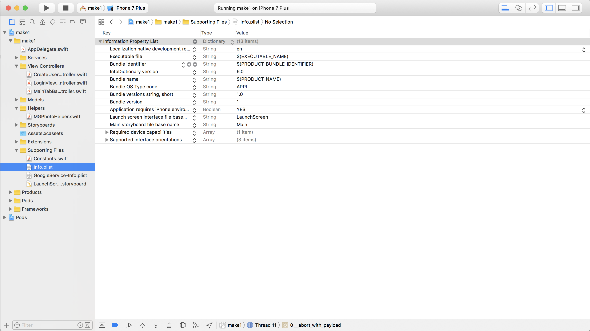

It's time to implement our next feature: uploading photos to Firebase! In **Makestagram**, we want to allow the users to upload or take a photo as soon as they tap the camera button in the middle of the tab bar.

Typically a tab bar view controller only allows a user to switch between different view controllers; however, we don't want to switch to a view controller when the center tab bar item is tapped, instead we want to show an action dialog that lets the user take or select a picture:

Unfortunately, using a tab bar view controller, we cannot *easily* perform an arbitrary method when one of the tab bar items is selected; however, there's a **workaround**.

# Using a Tab Bar Item Like a Button

Essentially we want to use the photo tab bar item like a button. When it is tapped, we want to call a method to present the dialog shown above.

One of the ways to accomplish this is to make use of the `UITabBarControllerDelegate` protocol.

That protocol contains a method that is interesting for us:

    optional public func tabBarController(_ tabBarController: UITabBarController, shouldSelect viewController: UIViewController) -> Bool

You can read the full documentation of the method [here](https://developer.apple.com/reference/uikit/uitabbarcontrollerdelegate/1621166-tabbarcontroller).

Using this method the tab bar view controller asks its delegate whether or not it should present the view controller that belongs to the tab bar item that the user just tapped.

**Can you imagine how we could use this method to accomplish our goal?**

> [solution]
We can set the `delegate` of the `UITabBarViewController` and implement the method above. We can implement the method such that whenever the center tab bar item is tapped, we show the photo capture dialog. Let's implement this solution!

Our solution involves two steps:
1. Subclassing `UITabBarController` with our own custom `MainTabBarController` class.
2. Have our custom tab bar controller implement the `UITab​Bar​Controller​Delegate`.

## Custom UITabBarController

First let's create a new file `MainTabBarController.swift`. Make sure you don't forget to go to the Main storyboard and set the class of the tab bar to `MainTabBarController` in the identity inspector.

In the `MainTabBarController.swift` file add the following code:

    class MainTabBarController: UITabBarController {

        override func viewDidLoad() {
            super.viewDidLoad()

            // 1
            delegate = self
            // 2
            tabBar.unselectedItemTintColor = .black
        }
    }

1. First we set the `MainTabBarController` as the delegate of it's tab bar
2. We set the tab bar's `unselectedItemTintColor` from the default of gray to black

Build the app and you'll notice we'll get an error that `MainTabBarController` doesn't implement `UITabBarControllerDelegate`. Let's add an extension and implement `tabBarController(_:shouldSelect:)` to fix this error:

    extension MainTabBarController: UITabBarControllerDelegate {
        func tabBarController(_ tabBarController: UITabBarController, shouldSelect viewController: UIViewController) -> Bool {
            return true
        }
    }

The `UITabBarControllerDelegate` method `tabBarController(_:shouldSelect:)` returns a `Bool` value that determines if the tab bar will present the corresponding `UIViewController` that the user has selected. If `true`, the tab bar will behave as usual. If we return `false`, the view controller will not be displayed – exactly the behavior that we want for our photo tab bar item.

Don't forget, we'll need to set the `Custom Class` property in the Identity Inspector for our `UITabBarController`:

## Identifying Tab Bar Items

In order to determine when to return `true` or `false` we need a way of identifying which tab bar item was selected. We'll use the `tag` property of the `tabBarItem`. In `Main.storyboard`, repeat the following steps for each tab bar item:

> [action]
**Repeat the following steps for all three view controllers**:
>
1. With the tab bar item selected, open the *Attributes Inspector* on the right panel
2. Set the *Tag* of the *Bar Item* to 0, 1, 2 corresponding to the position from left to right for each tab bar item
>

We can now make use of the `tag` property to identify the center tab bar item. We know from our storyboard that our center tab bar item's tag will be 1. Let's set this as a constant in our `Constants.swift` file:

    struct Constants {
        // ...

        struct TabBarItem {
            static let centerTag = 1
        }
    }
    
> [action]
Implement the logic in `tabBarController(_:shouldSelect:)` to present the selected view controller:
>
    extension MainTabBarController: UITabBarControllerDelegate {
        func tabBarController(_ tabBarController: UITabBarController, shouldSelect viewController: UIViewController) -> Bool {
            if viewController.tabBarItem.tag == Constants.TabBarItem.centerTag {
                // present photo taking action sheet
                print("take photo")

                return false
            } else {
                return true
            }
        }
    }

If the view controller's tag is the center tag we return false and print "take photo" to the console. Later we'll replace this line with the actual photo taking code. If the view controller isn't the center tag, we return true and let the tab bar controller behave as usual.

With this code in place, it's time to test our code. Run the app. When you tap the left or the right tab bar item, they are selected and the corresponding view controller is presented. When you tap the middle button, you see our console output instead:

Now we can replace this console output with our actual photo taking code!

# Structuring the Photo Code

Recall from our *Setting Up the App Structure* tutorial that, after deciding on our app's features, we outlined our app's screens and explicitly defined how screens would be connected. In a similar fashion, before diving into the photo code, let's think about what specific photo related features we want to offer and how they will be structured.

Regarding features, as **Makestagram** is a photo sharing app, users should be able to either upload photos from their existing photo library or capture new photos with the built-in camera.

Regarding structure, let's discuss the process step-by-step:

1. The user taps the camera button, which triggers an event in the `MainTabBarController`. (Currently, we are logging "take photo" to the console during this step.)
2. The `HomeViewController` notifies a helper class, called `MGPhotoHelper`, that the camera button was pressed. (We use the `MGPhotoHelper` to handle all of our photo related features to help make our code more modular and easier to read.)
3. The `MGPhotoHelper` presents the alert dialog that allows the user to choose between taking a photo with the camera or picking one from the library. (The popover is implemented as a `UIAlertController`, a standard iOS component.)
4. Once the user has selected one of the two options, we present a `UIImagePickerController`, another standard iOS component. (The `UIImagePickerController` handles the actual image picking - either by letting the user take a picture, or by letting them pick one from their library.)
5. Once the user is finished, the selected image gets returned to the `MGPhotoHelper`
6. The `MGPhotoHelper` notifies the `MainTabBarController` that a photo has been picked, and returns the image to the `MainTabBarController`.

As you can see, there are many steps to getting our photo features up and running. If we skipped diagramming our structure and went straight to coding, we would probably make the mistake of putting all of our code into the `MainTabBarController`, which would lead to an *extremely messy project*!

When working on your own apps remember to use helper classes to handle distinct features. For instance, a `MGPhotoHelper` to handle all image capturing or a `SpeechHelper` to record all sound from the microphone.

# Creating a Helper

Create a new source file called `MGPhotoHelper.swift`:

> [action]
>
1. Create a new Cocoa Touch class within the *Helpers* directory
2. Name this class *MGPhotoHelper* and make it a subclass of *NSObject* (we will discuss why this is necessary later on): 
3. Select your new helper class and add it to a *Helpers* group

Now that we have a plan and a place to put our code, let's start implementing this feature!

## Implementing the MGPhotoHelper

Our `MGPhotoHelper` will have three main responsibilities:

1. Presenting the popover to allow the user to choose between taking a new photo or selecting one from the photo library
2. Depending on the user's selection, presenting the camera or photo library
2. Returning the image that the user has taken or selected

The first and second responsibilities of the `MGPhotoHelper` require it to present a `UIAlertController` and `UIImagePickerController`. However, in iOS, only view controllers can present other view controllers, and the `MGPhotoHelper` is a simple `NSObject`, not a `UIViewController`. To enable view controller presentation inside the `MGPhotoHelper` class, we will pass our method a reference to our `UITabBarController` to our `MGPhotoHelper`.

To implement the third responsibility of the `MGPhotoHelper` we will need to have a way to communicate with the `MainTabBarController` - as shown in Step 6 of our outline above. For this we could use the concept of delegation (on the previous page we used delegation to receive information from the `UITabBarController`). A more convenient solution for this specific case is using a *Callback*. A *Callback* is basically a reference to a function. When setting up `MainTabBarController`, we'll will provide it with a callback function. As soon as the `MGPhotoHelper` has selected an image, it will call that *Callback* function and provide the selected image to the *MainTabBarController*.

Let's get started with building the `MGPhotoHelper`!

### Initializer and Properties

> [action]
Replace the entire content of `MGPhotoHelper.swift` with the following code:

    import UIKit

    class MGPhotoHelper: NSObject {

        // MARK: - Properties

        var completionHandler: ((UIImage) -> Void)?

        // MARK: - Helper Methods

        func presentActionSheet(from viewController: UIViewController) {

        }

    }

Let's discuss this code. `MGPhotoHelper` has a `completionHandler` that will be called when the user has selected a photo from `UIImagePickerController`.

Additionally, `MGPhotoHelper` has a `presentActionSheet(from:)` method that takes a reference to a view controller as a reference. As we discussed earlier, this reference is necessary because the `MGPhotoHelper` needs a `UIViewController` on which it can present other view controllers.

From our `MainTabBarController`, we'll call `presentActionSheet(from:)`. The method is empty right now, but later it will present the dialog that allows users to choose between their camera and their photo library.

### Implementing the Photo Source Selection Popover

To implement the selection dialog we will use the [`UIAlertViewController`](https://developer.apple.com/library/ios/documentation/UIKit/Reference/UIAlertController_class/index.html) class. It allows us to choose a title for the popup and add multiple options. We want to add two options: photo library and camera.

However, we need to keep one thing in mind: we want to run our app on the iOS Simulator during development and the simulator doesn't have a camera! `UIImagePickerController` provides us with a nice way to check whether a camera is available or not. We'll use that feature to decide whether or not to add the camera option to our popup.

Let's add the code for the popup to `MGPhotoHelper`:

> [action]
Replace the empty implementation of `showPhotoSourceSelection()` with the following one:
>
    func presentActionSheet(from viewController: UIViewController) {
        // 1
        let alertController = UIAlertController(title: nil, message: "Where do you want to get your picture from?", preferredStyle: .actionSheet)
>
        // 2
        if UIImagePickerController.isSourceTypeAvailable(.camera) {
            // 3
            let capturePhotoAction = UIAlertAction(title: "Take Photo", style: .default, handler: { action in
                // do nothing yet...
            })
>
            // 4
            alertController.addAction(capturePhotoAction)
        }
>
        // 5
        if UIImagePickerController.isSourceTypeAvailable(.photoLibrary) {
            let uploadAction = UIAlertAction(title: "Upload from Library", style: .default, handler: { action in
                // do nothing yet...
            })
>
            alertController.addAction(uploadAction)
        }
>
        // 6
        let cancelAction = UIAlertAction(title: "Cancel", style: .cancel, handler: nil)
        alertController.addAction(cancelAction)
>
        // 7
        viewController.present(alertController, animated: true)
    }

1. Initialize a new `UIAlertController` of type `actionSheet`. `UIAlertController` can be used to present different types of alerts. An action sheet is a popup that will be displayed at the bottom edge of the screen.
2. Check if the current device has a camera available. The simulator doesn't have a camera and won't execute the if clause.
3. Create a new `UIAlertAction`. Each `UIAlertAction` represents an action on the `UIAlertController`. As part of the `UIAlertAction` initializer, you can provide a title, style, and handler that will execute when the action is selected.
4. Add the action to the `alertController` instance we created.
5. Repeat the previous sets 2-4 for the user's photo library.
6. Add a cancel action to allow an user to close the `UIAlertController` action sheet. Notice that the style is `.cancel` instead of `.default`.
7. Present the `UIAlertController` from our `UIViewController`. Remember, we must pass in a reference from the view controller presenting the alert controller for this method to properly present the `UIAlertController`.

None of this code will run at this point - to test it we need to connect it to the `MainTabBarController`. Let's do that next! After we've connected the `MainTabBarController` and the `MGPhotoHelper`, we will come back to complete this code so that we actually present the camera or the photo library when one of the two options is selected.

## Connecting the MGPhotoHelper

Time to switch back to the `MainTabBarController`. Currently we are printing a string to the console whenever the camera button is tapped; now we want to create an instance of a `MGPhotoHelper` that will display our action sheet.

First, let's create an instance of the `MGPhotoHelper` object in `MainTabBarController.swift`:

    // MARK: - Properties
    
    let photoHelper = MGPhotoHelper()

Next, let's set the `completionHandler` property of `MGPhotoHelper` in `viewDidLoad`:

    override func viewDidLoad() {
        super.viewDidLoad()
        
        photoHelper.completionHandler = { image in
            print("handle image")
        }
        
        delegate = self
        tabBar.unselectedItemTintColor = .black
    }

In our `viewDidLoad` we set a *closure*. A closure can be thought as a function without a name.

This part of the code is the closure:

    photoHelper.completionHandler = { image in
        print("handle image")
    }

The entire closure is enclosed in curly braces. It starts with the list of parameters in parentheses. Our callback receives a `UIImage?` from the `MGPhotoHelper`. The `in` keyword marks the beginning of the actual code of the closure - for now we only have a print statement in there.

Whenever `MGPhotoHelper` receives an image, it will call this closure. This is where we will implement the photo upload later on.

Last, we'll change the tab bar related code:

> [action]
Change the the tab bar related code to call the `presentActionSheet(from:)` method in our `MGPhotoHelper`, instead of printing to the console:
>
    extension MainTabBarController: UITabBarControllerDelegate {
        func tabBarController(_ tabBarController: UITabBarController, shouldSelect viewController: UIViewController) -> Bool {
            if viewController.tabBarItem.tag == 1 {
                photoHelper.presentActionSheet(from: self)
                return false
            }
>
            return true
        }
    }

Here, we're presenting the action sheet from the `photoHelper` that will allow the user to capture a photo from their camera or upload a photo from their photo library.

Now our code should compile and run! Time to test if everything is working as expected. If the action sheet isn't showing up, make sure that you've set the tag to it's correct index in the storyboard.

When you run the app and tap the camera button, you should see a popup show up:

Notice our action sheet only has a `Upload from Library` and `Cancel` option. This is because we're running the app on a simulator. If you're running the app on a real device you should also see the option to `Take Photo`

Well done! At this point you should have a basic understanding of how information can travel through different classes in our apps - as an iOS developer you will use callbacks in the form of closures pretty frequently.

# Implementing the Photo Taking

Now that we've successfully connected the `MGPhotoHelper` with the `MainTabBarController` we can implement the actual photo taking code.

Let's add a method to the `MGPhotoHelper` that presents the `UIImagePickerController` (you might remember that this is the system component that will allow the user to take pictures!).

> [action]
Add the `presentImagePickerController(with:from:)` method to the `MGPhotoHelper` class:
>
    func presentImagePickerController(with sourceType: UIImagePickerControllerSourceType, from viewController: UIViewController) {
        let imagePickerController = UIImagePickerController()
        imagePickerController.sourceType = sourceType

        viewController.present(imagePickerController, animated: true)
    }

In the first line, this method creates a `UIImagePickerController`. In the second line, we set the `sourceType` of that controller. Depending on the `sourceType` the `UIImagePickerController` will activate the camera and display a photo taking overlay - or will show the user's photo library. Our `presentImagePickerController(with:from:)` method takes the `sourceType` as an argument and hands it on to the `imagePickerController` - that allows the caller of this method to specify whether the camera or the photo library should be used as an image source.

Once the `imagePickerController` is initialized and configured, we present it.

Now we need to call this method when a `UIAlertAction` is selected. Currently we aren't performing any code when a user selects one of the two options.

> [action]
Change the following section within `presentActionSheet(from:)` so that the `presentImagePickerController(with:from:)` method is called:
>
    ...
>
    if UIImagePickerController.isSourceTypeAvailable(.camera) {
        let capturePhotoAction = UIAlertAction(title: "Take Photo", style: .default, handler: { [unowned self] action in
            self.presentImagePickerController(with: .camera, from: viewController)
        })

        alertController.addAction(capturePhotoAction)
    }
>
    if UIImagePickerController.isSourceTypeAvailable(.photoLibrary) {
        let uploadAction = UIAlertAction(title: "Upload from Library", style: .default, handler: { [unowned self] action in
            self.presentImagePickerController(with: .photoLibrary, from: viewController)
        })
>
        alertController.addAction(uploadAction)
    }
>
    ...

In both `UIAlertAction` actions, we call our method to present the `UIImagePickerController` with the appropriate `sourceType`, based on the user's selection.

## Testing our UIImagePickerController

Build and run the app! If everything is working correctly, we should now be able to see our `UIImagePickerController` pop up after we select an action on our action sheet.

What's that? The app is crashing?

If you check the debug consule, you'll notice that Xcode is complaining that you're trying to access the user's data without their permission. To fix this, we'll need to open our `Info.plist` and add a key for `Privacy - Photo Library Usage Description` and a short description.

> [action]
1. Open your `Info.plist`

>
2. Add a key to your `.plist` for `Privacy - Photo Library Usage Description`

>
3. Add a short description for why you need to access the user's data

Repeat the same steps for `Privacy - Camera Usage Description` to ask permission for camera usage. When added both keys, your `Info.plist` should look like the following:

Now an user can pick an image; however, currently we don't get informed when the user has selected an image and we don't gain access to the selected image.

# Closing the Loop

To gain access to the image a user has selected, we will use a pattern with which you should be familiar with by now: _Delegation_. The `UIImagePickerController` allows a delegate to listen for selected images and other events.

Take a short look at the documentation for the [`UIImagePickerControllerDelegate`](https://developer.apple.com/library/ios/documentation/UIKit/Reference/UIImagePickerControllerDelegate_Protocol/) protocol.

**Can you see which method we can use?**

Correct! We'll use the `imagePickerController(picker: UIImagePickerController, didFinishPickingImage: UIImage!, editingInfo: [NSObject : AnyObject]!)` method!

We'll need to implement this in two steps:

1. Sign up to become the delegate of the `UIImagePickerController`
2. Implement `imagePickerController(picker: UIImagePickerController, didFinishPickingImage: UIImage!, editingInfo: [NSObject : AnyObject]!)`

Let's start with the simple part - becoming the delegate of `UIImagePickerController`.

> [action]
Extend the `presentImagePickerController(with:from:)` method to include a line that sets up the `delegate` property of `imagePickerController`:
>
    func presentImagePickerController(with sourceType: UIImagePickerControllerSourceType, from viewController: UIViewController) {
        let imagePickerController = UIImagePickerController()
        imagePickerController.sourceType = sourceType
        imagePickerController.delegate = self
>
        viewController.present(imagePickerController, animated: true)
    }

Now that we're the `delegate` we need to conform to some protocols. Otherwise the compiler will be unhappy and our project won't run!

By being the delegate of a `UIImagePickerController` we are required to implement the `UIImagePickerControllerDelegate` protocol and the `UINavigationControllerDelegate`.

However, all methods in the `UINavigationControllerDelegate` protocol are `optional` - which means we don't need to implement any of them.

As always, we will implement the code that is relevant for a certain protocol within an `extension`.

> [action]
Add the extension following extension to _MGPhotoHelper.swift_ - make sure that the extension is placed outside of the class definition:
>
    extension MGPhotoHelper: UINavigationControllerDelegate, UIImagePickerControllerDelegate {
        func imagePickerController(_ picker: UIImagePickerController, didFinishPickingMediaWithInfo info: [String : Any]) {
            if let selectedImage = info[UIImagePickerControllerOriginalImage] as? UIImage {
                completionHandler?(selectedImage)
            }
>
            picker.dismiss(animated: true)
        }
>
        func imagePickerControllerDidCancel(_ picker: UIImagePickerController) {
            picker.dismiss(animated: true)
        }
    }

We don't have too much code in this extension. We implement two different delegate methods: One is called when an image is selected, the other is called when the cancel button is tapped.

Within `imagePickerControllerDidCancel` we simply hide the image picker controller by calling `dismiss(animated:)` on `picker`.

Before we became the delegate of the `UIImagePickerController`, the `UIImagePickerController` was automatically dismissed as soon as a user hit the cancel button or selected an image. Now that we are the delegate, we are responsible for dismissing it.

The `imagePickerController(_:didFinishPickingMediaWithInfo:)` method is also pretty simple. First we check if we were passed back an image in the `info` dictionary. If the `info` dictionary contains an image, we pass it to our `completionHandler` property. Then we dismiss the image picker controller.

Let's test if that is actually working correctly.

> [action]
Open `MainTabBarController.swift` and place a breakpoint on the print statement inside our `MGPhotoHelper` callback method:

>
Run the app and select an image using the `UIImagePickerController`. The debugger should halt on the breakpoint and you should see that the callback receives a value for the `image` parameter:

As long as the value in the variables view beside `UIImage` is **not** showing `0x0000000000000000` (which would mean the `image` argument is `nil`), then everything is working! We now have access to the selected image inside of the `MainTabBarController`.

Here's a short reminder of all the information flow you have implemented in this step:

**Well done!**

In the next step we are going to upload this image to Firebase!
