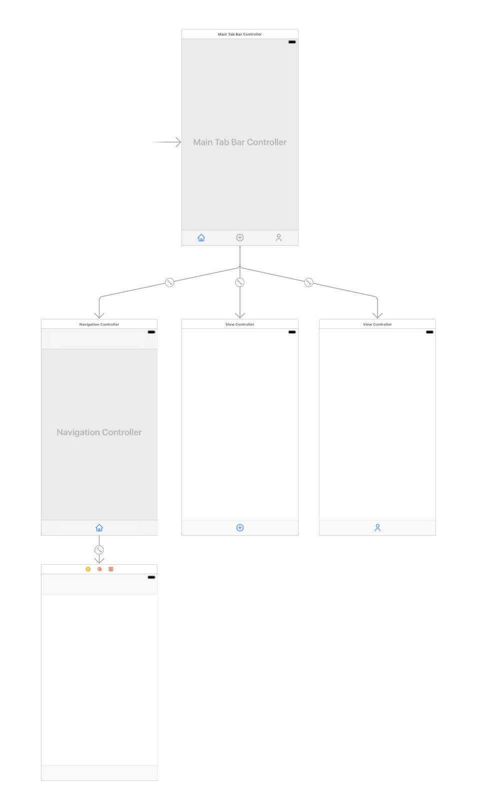
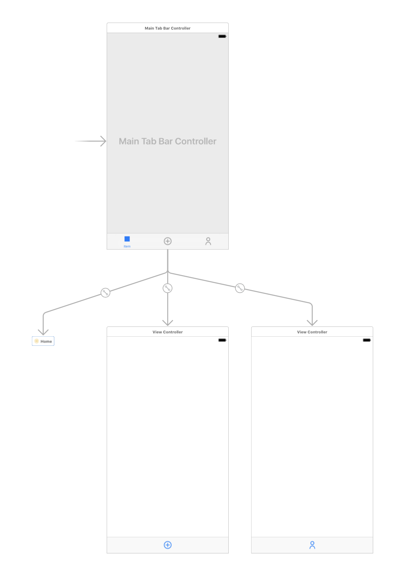
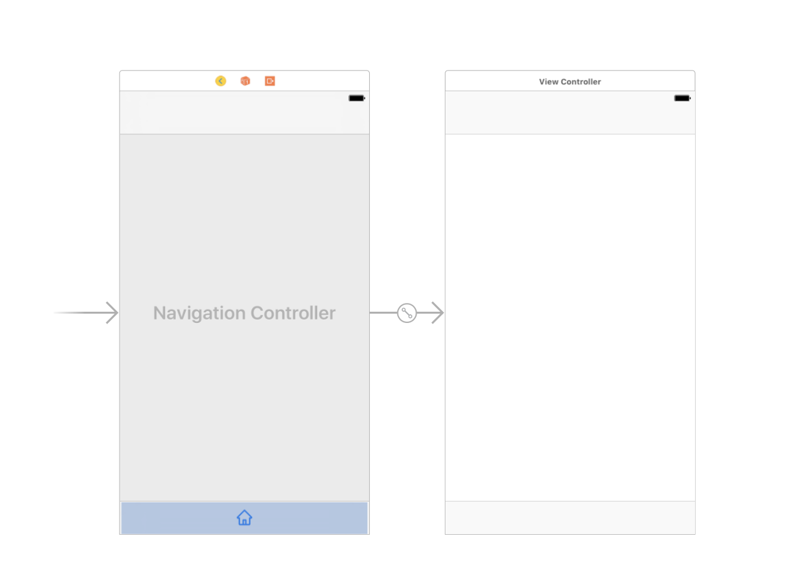
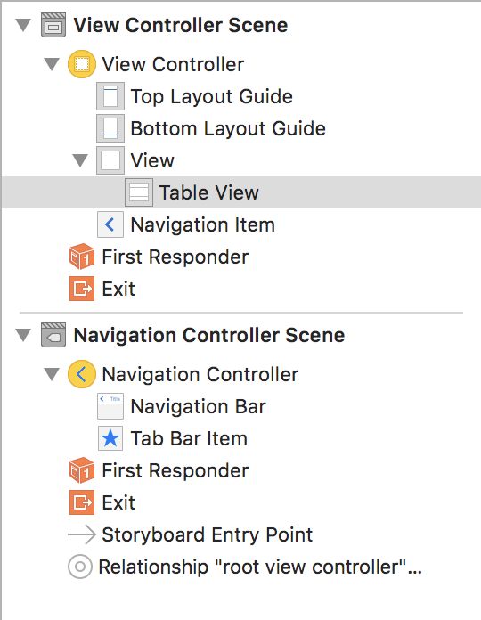
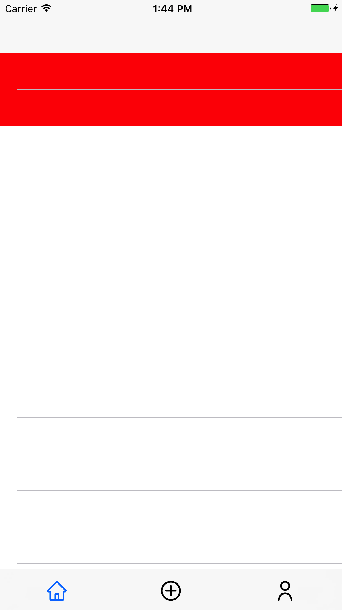

We have spent the last few steps discussing how to store data in Firebase. In this step we will look at how to fetch it!
Throughout this step we will discuss the basics of querying data, while starting to work on the important _Timeline_ feature of **Makestagram**.

As a first step in implementing the _Timeline_ feature, we will set up the basic UI for the `HomeViewController`.

# Adding a Navigation Controller

Before we do anything else, let's first add a navigation controller to the hiearchy of our `HomeViewController`. Select the `HomeViewController` and click on the menu item `Editor`>`Embed In`>`Navigation Controller`.

Your storyboard should now look like this:

# Refactoring to Storyboard

Let's keep our storyboards small and keep separate parts of our app organized. Select the `NavigationController` and `HomeViewController` and click on the menu item `Editor`>`Refactor to Storyboard`. This will prompt you to create a new storyboard. Create a new storyboard in the Storyboard folder called `Home.storyboard`. You now have refactor one of the tab bar view controllers into another storyboard.

Your `Main.storyboard` file should now look like this:

And your `Home.storyboard` file should look like the following:

# Adding a Table View to the HomeViewController

Let's add a table view to the `HomeViewController` - we will use that table view to display the posts in a user's timeline.

> [action]
Open _Main.storyboard_ and add a Table View to the _HomeViewController_. The resulting scene hierarchy should look like this:
>

Next we want to set the constraints. Make sure that the tableView's top and bottom constraints are to the view, not the top and bottom layout guide respectively.

##Defining a Table View Data Source

In order to fill this table view with data, we need to define a data source (just as we did in the _Make School Notes_ app).

> [action]
Set the `HomeViewController` to be the data source of the table view.

<!-- insert image of setting up tableview datasource -->

# Creating the Home View Controller

Let's create the associated code file with our `HomeViewController`. Add a new file to your project called `HomeViewController.swift`. Make sure you set the class of the `HomeViewController` scene in the storyboard under the identity inspector.

## Defining a Referencing Outlet

We will also need to access this table view in code; therefore we need to set up a referencing outlet. Ctrl-drag from your storyboard tableView to your `HomeViewController.swift` to create an `IBOutlet`.

> [action]
Set up a referencing outlet, as shown below, and name the property `tableView`:

# Create a Prototype Cell

We'll need a cell to display the posts that we download. Let's add it to the Table View from the object library.

Next, select the cell and open the attributes inspector. We want to add a `Reuse Identifer` so we can reference our cell in code. First set the reference to `PostCell`.

# Basics of Querying in Firebase

We retrieve data the same way we did in our login flow. First we'll setup a way to retrieve all of our user's post. Later in this tutorial, we'll setup building a timeline of posts from followers.

Here we'll create another class method in our `UserService`. This method will retrieve all of a user's post from Firebase.

First let's create a failable initialer in our `Post` class to take a `FIRDataSnapshot`. Open your `Post.swift` class and add the following:

    init?(snapshot: FIRDataSnapshot) {
        guard let dict = snapshot.value as? [String : Any],
            let imageURL = dict["image_url"] as? String,
            let imageHeight = dict["image_height"] as? CGFloat,
            let createdAgo = dict["created_at"] as? TimeInterval
            else { return nil }
        
        self.key = snapshot.key
        self.imageURL = imageURL
        self.imageHeight = imageHeight
        self.creationDate = Date(timeIntervalSince1970: createdAgo)
    }

Next we'll add the following to our `UserService` for fetching all of a user's posts from Firebase.

    static func posts(for user: User, completion: @escaping ([Post]) -> Void) {
        let ref = FIRDatabase.database().reference().child("posts").child(user.uid)
        
        ref.observeSingleEvent(of: .value, with: { (snapshot) in
            guard let snapshot = snapshot.children.allObjects as? [FIRDataSnapshot] else {
                return completion([])
            }
            
            let posts = snapshot.reversed().flatMap(Post.init)
            completion(posts)
        })
    }
    
Great! Now we have a method that will fetch and return all of our posts from Firebase from a given user. We can use this to display the posts we've made so far. Let's go back to our `HomeViewController` and display our posts.

# Displaying our Posts

In the future, we want our `HomeViewController` to display a timeline of posts from people we're following, but for now we're going just dispay our own.

First we'll need to setup our `HomeViewController` to have a datasource. Let's go ahead and initialize an empty array of posts.

    var posts = [Post]()
    
Next we'll setup our `TableViewDataSource` to retrieve data from our `Post` array.

    // MARK: - UITableViewDataSource

    extension HomeViewController: UITableViewDataSource {
        func tableView(_ tableView: UITableView, numberOfRowsInSection section: Int) -> Int {
            return posts.count
        }

        func tableView(_ tableView: UITableView, cellForRowAt indexPath: IndexPath) -> UITableViewCell {
            let cell = tableView.dequeueReusableCell(withIdentifier: "Cell", for: indexPath)
            cell.backgroundColor = .red

            return cell
        }
    }

Now our table view will display the same number of cells as in our `posts` array. Last, we'll add the following code to our `viewDidLoad` to fetch our posts from Firebase:

    override func viewDidLoad() {
        super.viewDidLoad()
        
        UserService.posts(for: User.current) { (posts) in
            self.posts = posts
            self.tableView.reloadData()
        }
    }
    
Let's run our code and see if it's working. If all goes right, you should see some of the posts that are stored in your database.

If you open your Firebase project and navigate to the database, you should be able to expand your JSON tree and see your posts. If everything has gone right your project should look like this:

# Conclusion

Admittedly the app is still looking pretty boring - but with the timeline query you have implemented a very important feature! To make our progress a little bit more visual, we will focus on displaying posts with images in the next step!
