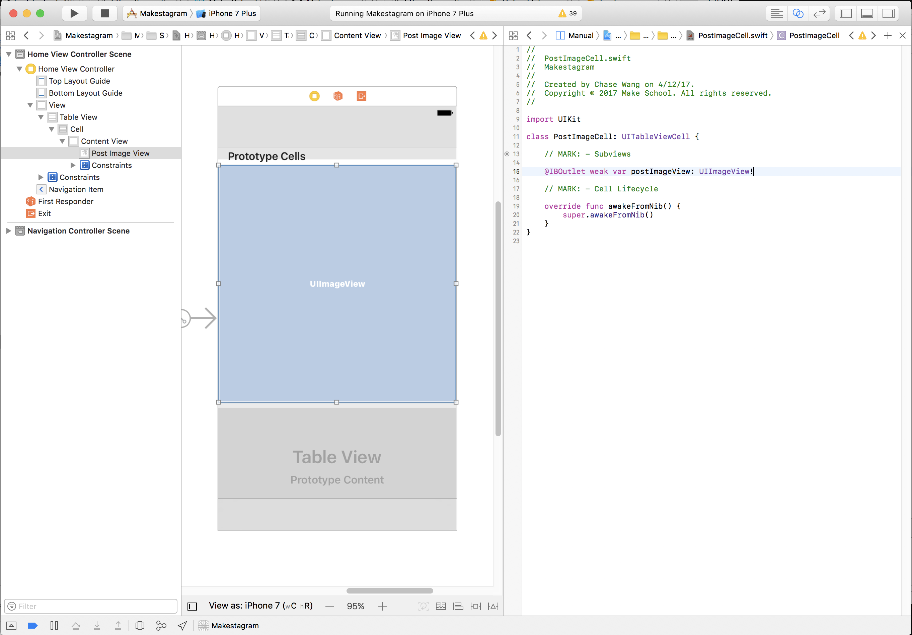

As promised, this step will focus on displaying the photos associated with each post. To display the posts we will need to switch from the default table view cell that we are using right now to a custom one. Whenever you want to create a table view cell that doesn't use one of the few default layouts that iOS has to offer, you will end up creating a custom one.

#Setting up a Custom Table View Cell

First we want to set the view controller to respond to the `UITableViewDelegate`. Open your `Home.storyboard` and ctrl-drag from your storyboard to your view controller. Make sure the delegate is setup.

# Implementing UITableViewDelegate

Next, add the following to your view controller:

    // MARK: - UITableViewDelegate

    extension HomeViewController: UITableViewDelegate {
        func tableView(_ tableView: UITableView, heightForRowAt indexPath: IndexPath) -> CGFloat {
            let post = posts[indexPath.row]

            return post.imageHeight
        }
    }

This fetches the post associated with the cell that will be displayed. We then return the aspect height that we calculated for the post when creating the post.

Next we'll need to install a pod to download our image and display it in our table view cell.

# Installing Kingfisher

Navigate to the following [github link](https://github.com/onevcat/Kingfisher) and follow the instructions for downloading Kingfisher. You'll have to add `Kingfisher` to your pod file and type `pod install` to download the associated pod.

Kingfisher is a popular Swift library for asychronously downloading and caching images. We'll be able to use it like this:

    let url = URL(string: "https://domain.com/image.jpg")!
    imageView.kf.setImage(with: url)
    
# Setting up our PostImageCell

Now that we have the ability to download images from URLs we're going to open our `Home.storyboard` and configure our prototype post cell. The way we'll build our cell, is that we'll have one cell for the header, one for the image, and one more for the actions. We'll group posts by sections and each section will have 3 rows for each respective cells.

The first one we'll configure is the `PostImageCell`. First let's create a new class for our cell. Create a new file called `PostImageCell.swift` that is a subclass of `UITableViewCell`. Replace the contents of the file with the following:

    import UIKit

    class PostImageCell: UITableViewCell {

        override func awakeFromNib() {
            super.awakeFromNib()
        }
    }
    
Let's navigate to our Home storyboard and set the class of our prototype cell to be of type `PostImageCell`. Next let's change the default height of the prototype cell in the size inspector to be 375. After, we'll add an imageview to our cell and hook up the IBOutlet in our code. You should have the following:

Additionally we need to change the Content Mode of the image view. Currently it is set to the default value which is Scale To Fill. That will distort the image to fit into the size of the image view. Distorted images look ugly! It's much better to crop them. To do that we change the Content Mode to Aspect Fit.

# Configuring the Post Image Cell

Last, let's update our tableview's datasource to show our image. First let's import the Kingfisher library with the following line:

    import Kingfisher

Change your `UITableViewDataSource` in your `HomeViewController` to the following:

    func tableView(_ tableView: UITableView, cellForRowAt indexPath: IndexPath) -> UITableViewCell {
        let post = posts[indexPath.row]
        let cell = tableView.dequeueReusableCell(withIdentifier: "Cell", for: indexPath) as! PostImageCell
        
        let imageURL = URL(string: post.imageURL)
        cell.postImageView.kf.setImage(with: imageURL)
        
        return cell
    }

# Configuring our TableView

Next let's add some configuration for our table:

    func configureTableView() {
        // remove separators for empty cells
        tableView.tableFooterView = UIView()
        // remove separators from cells
        tableView.separatorStyle = .none
    }
    
Next let's call the method in our `viewDidLoad`:

override func viewDidLoad() {
        super.viewDidLoad()
        
        configureTableView()
        
        // ...
    }
    
Now you can run the app again. And for the first time you should see our photos on the screen!

# Conclusion

In this chapter you have learned how to set up a custom table view cell. Almost all iOS apps use table views in combination with custom cells, so this knowledge will be very useful for your own app! For now we have implemented downloading the photos for each post - after all, the focus of this chapter was to make some visual progress!

In the next step we will focus on improving the UI by adding a header and action footer for each post.

Let's turn this working solution into a good one!
