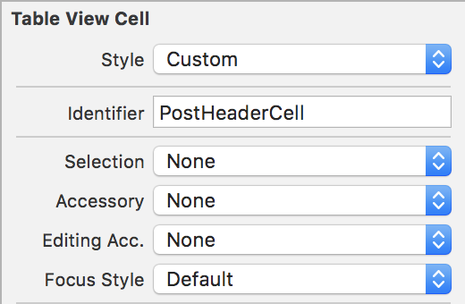
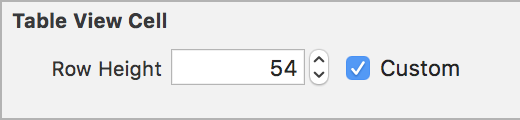
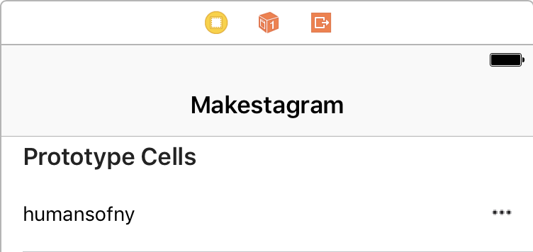
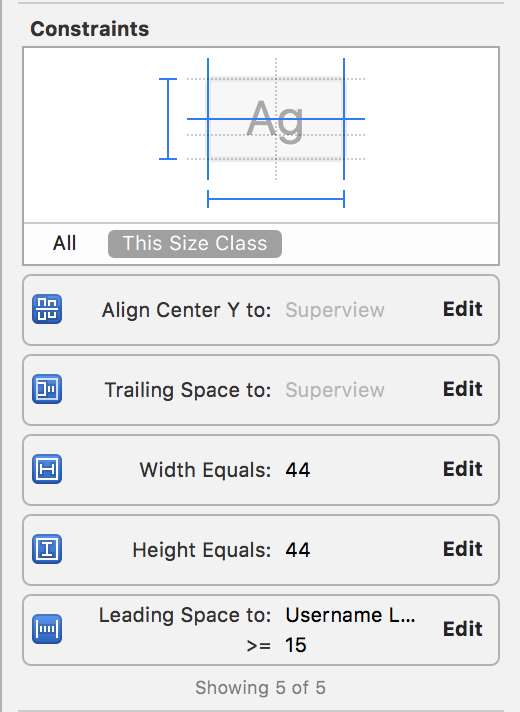
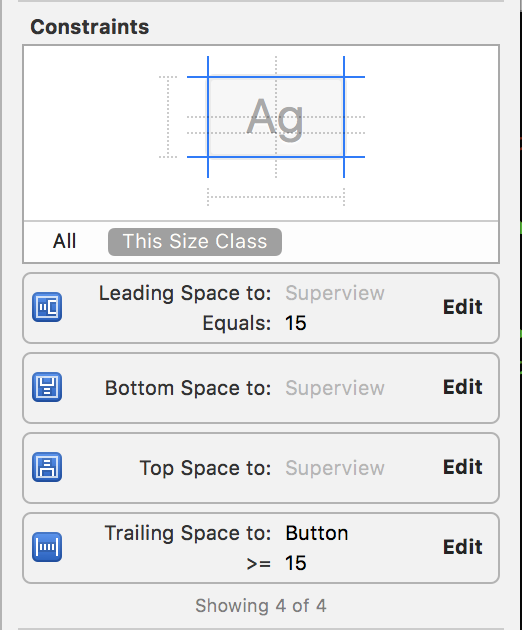
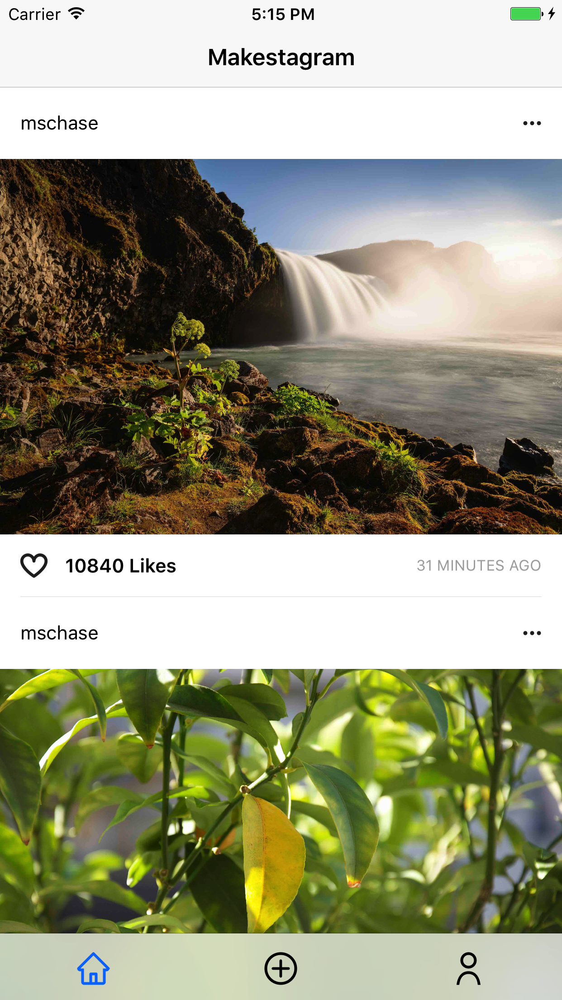

In this section, we're going to take our `PostImageCell` and add some more UI elements to make our `HomeViewController` look better. Let's finish creating the UI for our post. Aside from our `PostImageCell`, we'll also need a post header above each image, as well as an action cell so users can give likes to posts.

# Creating a Post Header Cell

We're going to implement a post header that follows the following design:

We've created custom cells a couple of times now. Let's start by adding a new prototype cell in our Home storyboard. Select the cell and open the properties inspector. We're going to disable `Selection` style to `None` and give the cell an `Identifer` of `PostHeaderCell`.

Next, let's customize the height of the cell on storyboard. Open the size inspector and set a custom `Row Height` of 54.

After we've finished configuring our cell, let's add some subviews onto our prototype cell. We'll add a `UILabel` to display the username of the poster and a options button for users to report inappropriate content.

Drag a `UIButton` from the object library onto the prototype cell. Add the following constraints:

Next, we'll do the same with a `UILabel` and add the following constraints:

Now that we've setup our subviews, we'll need to connect them to code. Create a new `PostHeaderCell.swift` that is a subclass of `UITableViewCell`. Make your file containts the following:

    import UIKit

    class PostHeaderCell: UITableViewCell {

        override func awakeFromNib() {
            super.awakeFromNib()
        }

    }

Next, let's add an IBOutlet for the username label. Open your Home storyboard and `PostHeaderCell` side by side with the assistant navigator and ctrl-drag from the username label to right above the `awakeFromNib` method:

    @IBOutlet weak var usernameLabel: UILabel!

    override func awakeFromNib() {
        super.awakeFromNib()
    }

Next, we'll add an IBAction for when the options button is tapped. Ctrl-drag from the options button right below `awakeFromNib`. This type, we'll change the connection type from an outlet to an action. Your `PostHeaderCell` should look like the following:

    class PostHeaderCell: UITableViewCell {

        @IBOutlet weak var usernameLabel: UILabel!

        override func awakeFromNib() {
            super.awakeFromNib()
        }

        @IBAction func optionsButtonTapped(_ sender: UIButton) {
            print("options button tapped")
        }
    }

Great! We've finished creating our `PostHeaderCell`. Now we'll move on to creating our `PostActionCell`.

# Creating a Post Action Cell

We'll repeat similar steps to do the same for creating a `PostActionCell` that will be displayed below each `PostImageCell`. Add another prototype cell in our Home storyboard below the `PostImageCell`.

Make sure the `Selection` style is `None`, the cell `Identifier` is `PostActionCell` and the row height is 46. If you don't remember how to configure a custom table view go back to the last step to refresh your memory.

On our action cell, we'll add a button for users to like a post, a label to display the number of likes a post has, another label for a timestamp, and finally a custom separator. After adding the subviews, you prototype cell should look like the following:

[Action Cell Hiearchy](assets/action_cell_hiearchy.png)

Let's create our IBOutlets and IBAction methods. Create a new `PostActionCell.swift` class and add the following:

    import UIKit

    class PostActionsCell: UITableViewCell {

        // MARK: - Subviews

        @IBOutlet weak var likesCountLabel: UILabel!
        @IBOutlet weak var timeAgoLabel: UILabel!

        // MARK: - Cell Lifecycle

        override func awakeFromNib() {
            super.awakeFromNib()
        }

        // MARK: - IBActions

        @IBAction func likesButtonTapped(_ sender: UIButton) {
            print("likes button tapped")
        }
    }

We've successfully created two more cells that will help display our cell. Next we'll look at configuring our `UITableViewDataSource` and `UITableViewDelegate` so that our two new cells display before and after our `PostImageCell`.

# Configuring our DataSource and Delegate

To display our newly added header and action cells, we'll need to reconfigure our table view data source and delegate. Instead of displaying a single cell, we now need to display 3 cells for each post: a header, image and action cell.

To do this, we'll group table view into sections. Each section will represent a `Post`, with 3 rows for each respective cell.

Add the following to our `UITableViewDataSource`:

    func numberOfSections(in tableView: UITableView) -> Int {
        return posts.count
    }
    
Next, we'll reconfigure `tableView(_:numberOfRowsInSection)` to the following:

    func tableView(_ tableView: UITableView, numberOfRowsInSection section: Int) -> Int {
        return 3
    }
    
This method will now return 3 rows for each section to correspond with our header, image and action cells.

Now that we've set up the data source to display the correct number of sections and rows, we'll need to return the corresponding cell in `tableView(_:cellForRowAt:)`:

    func tableView(_ tableView: UITableView, cellForRowAt indexPath: IndexPath) -> UITableViewCell {
        let post = posts[indexPath.section]
        
        switch indexPath.row {
        case 0:
            let cell = tableView.dequeueReusableCell(withIdentifier: "PostHeaderCell") as! PostHeaderCell
            cell.usernameLabel.text = User.current.username
            
            return cell
            
        case 1:
            let cell = tableView.dequeueReusableCell(withIdentifier: "PostImageCell") as! PostImageCell
            let imageURL = URL(string: post.imageURL)
            cell.postImageView.kf.setImage(with: imageURL)
            
            return cell
            
        case 2:
            let cell = tableView.dequeueReusableCell(withIdentifier: "PostActionCell") as! PostActionsCell
            
            return cell
            
        default:
            fatalError("Error: unexpected indexPath.")
        }
    }
    
Now that we've setup our data source, we'll need to move onto our `UITableViewDelegate`. The main thing we'll need to make sure of is that the height of each cell is being displayed correctly. Change your `UITableViewDelegate` to the following:

    // MARK: - UITableViewDelegate

    extension HomeViewController: UITableViewDelegate {
        func tableView(_ tableView: UITableView, heightForRowAt indexPath: IndexPath) -> CGFloat {
            switch indexPath.row {
            case 0:
                return PostHeaderCell.height

            case 1:
                let post = posts[indexPath.section]
                return post.imageHeight

            case 2:
                return PostActionsCell.height

            default:
                fatalError()
            }
        }
    }

Run the app and see if your post now displays. It should look like the image below:

# Adding a Navigation Bar title

Let's add a navigation bar title at the top that says `Makestagram`. Go to your storyboard, click on the `HomeViewController` and set the title to `Makestagram`.

Great, now we've successfully setup some more UI for our posts. Let's move on and add the ability to like posts.
