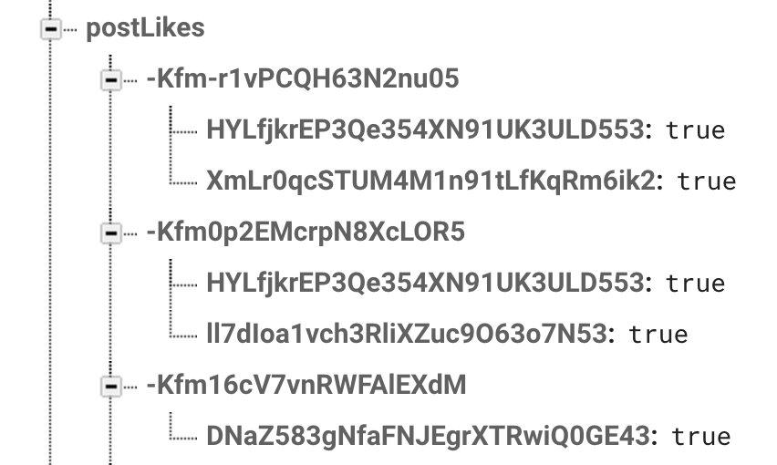

Users on our app can now create new posts and see them displayed in the `HomeViewController`. In this section, we'll work on the like feature, allowing users to like posts and displaying the number of likes each post has.

Whenever we add new data that will be stored in our database, it's important to take some time to thinking about the best way to structure the new data into the existing JSON tree.

# Structuring our Likes Data

Similar to how we flattened our database JSON tree by separating the `posts` from `users` into separate subtrees, we'll follow the same strategy for `likes`. In our database we'll create a new subtree for `likes` that will look like:

    root: {
        postLikes: {
            postKey: {
                user1_uid: true,
                user2_uid: true,
                user3_uid: true
            }
        }
    }

We create a new root level node for likes called `postLikes`. Within the `postLikes` subtree, we'll store the key of each post that has been liked along with each user that liked that specific post.

In Firebase, our JSON structure will look like:

## Adding a Like Count

In addition to storing the likes for each user, we'll also story a like count property for each post. This property will return the number of likes each post currently has. Implementing count properties is convenient because it'll allow us to read the number of likes a post has, without having to read and sum likes from the `postLikes` node. We'll story the like count property with each post inside of the `posts` JSON subtree.

# Creating a Like Service

After deciding about how we'll structure our data, we'll move on to creating a likes service to contain all networking code related to likes. In this service, we'll add the functionality to like and unlike posts.

> [action]
Create a new `LikeService.swift` source file in the `Services` directory.
>
    import Foundation
    import FirebaseDatabase
>
    struct LikeService {
        // ...
    }
    
Next, we'll add the functionality to like posts:

> [action]
Add the following class method inside your `LikeService`:
>
    static func create(for post: Post, success: @escaping (Bool) -> Void) {
        // 1
        guard let key = post.key else {
            return success(false)
        }
>
        // 2
        let currentUID = User.current.uid
>
        // code to like a post
    }
    
First we do some setup to allow us to like a post:

1. Each post that we like must have a key. We check the post has a key and return false if there is not.
2. We create a reference to the current user's UID. We'll use this soon to build the location of where we'll store the data for liking the post.

Next, we'll add the code for writing the data for liking a post to our database. As with all writes, we follow the following steps:

1. Define a location for where we're planning to write data
2. Write the data by setting the value for the location specified
3. Handle a callback for the success of the write

> [action]
In the same `create(for:success)` method, add the following code:

    static func create(for post: Post, success: @escaping (Bool) -> Void) {
        // ...

        let likesRef = FIRDatabase.database().reference().child("postLikes").child(key).child(currentUID)
        likesRef.setValue(true) { (error, _) in
            if let error = error {
                assertionFailure(error.localizedDescription)
                return success(false)
            }

            return success(true)
        }
    }

You'll notice our callback `success` returns a `Bool` on whether the data was successfully written to our database.

## Unliking Posts

We've implemented the service method for liking a post. Let's implement the reverse of unliking a given post:

    static func delete(for post: Post, success: @escaping (Bool) -> Void) {
        guard let key = post.key else { 
            return success(false) 
        }

        let currentUID = User.current.uid

        let likesRef = FIRDatabase.database().reference().child("postLikes").child(key).child(currentUID)
        likesRef.setValue(nil) { (error, _) in
            if let error = error {
                assertionFailure(error.localizedDescription)
                return success(false)
            }

            return success(true)
        }
    }
    
In this method, we do the same as the previous step, but we set the value of data stored at the specified location to `nil`. This will delete the current node at that location, if it exists.

Up to this point, we've created two class methods in our `LikeService` that can like and unlike posts. After writing data to the database, each method will return a success callback on whether the write was successful. Extending our current functionality, we also want to add the functionality for incrementing and decrementing a like count for each post. To add this functionality, we'll need to reference the UID of the user that each post belongs to. Using the poster's UID, we be able to traverse the `posts` subtree to modify a `like_count` of each post.

# Implementing a Like Count

To create a reference to the poster's UID, we'll use a common technique in NoSQL databases called *denormalization*. *Denormalization* is the process of improving read performance by adding redundant copies of the same information. In this case, we'll be storing an additional copy of the user with each post.

We'll begin by modifying our `Post` data model to contain the poster.

> [action]
Open the `Post.swift` source file and add a new `poster` and `like_count` property:
>
    let poster: User
    var likeCount: Int
    
Our `poster` property will store a reference to the user that owns the post.

> [action]
Next, we'll need to update each of our initialization methods to set the `poster` and `likeCount` property:
>
    // MARK: - Init
>
    init?(snapshot: FIRDataSnapshot) {
        guard let dict = snapshot.value as? [String : Any],
>
            // ...
>
            let likeCount = dict["like_count"] as? Int,
            let userDict = dict["poster"] as? [String : Any],
            let uid = userDict["uid"] as? String,
            let username = userDict["username"] as? String
            else { return nil }
>
        // ...
>
        self.poster = User(uid: uid, username: username)
    }
>
    init(imageURL: String, imageHeight: CGFloat) {
>
        // ...
>
        self.likeCount = 0
        self.poster = User.current
    }

Last, we'll need to update our `dictValue` computed variable on our `Post` model. Whenever we use `dictValue` to create a new post, we'll also want to add the data of the like count and poster:

> [action]
Change the `dictValue` property of `Post`:
>
    var dictValue: [String : Any] {
        let createdAgo = creationDate.timeIntervalSince1970
        let userDict = ["uid" : poster.uid,
                        "username" : poster.username]
>
        return ["image_url" : imageURL,
                "image_height" : imageHeight,
                "created_at" : createdAgo,
                "like_count" : likeCount,
                "poster" : userDict]
    }

We've successfully setup our model so that new post we create will include a copy of the poster who created the post. In additional, when we read posts from the database, we'll be able to easily access the `poster` property in-memory. To keep the database consistent, you might need to delete any current posts inside of your database's `posts` subtree that don't contain it's poster's data.

## Adding Transaction Blocks

Now that we've completed all of the setup for implementing a like count, we'll need implement the actual functionality itself. We'll do this by modifying our existing `LikeService` methods for liking and unliking posts.

> [action]
In your `LikeService`, update the following:
>
    static func create(for post: Post, success: @escaping (Bool) -> Void) {
        guard let key = post.key else { 
            return success(false) 
        }
>
        let currentUID = User.current.uid
>
        let likesRef = FIRDatabase.database().reference().child("postLikes").child(key).child(currentUID)
        likesRef.setValue(true) { (error, _) in
            if let error = error {
                assertionFailure(error.localizedDescription)
                return success(false)
            }
>
            let likeCountRef = FIRDatabase.database().reference().child("posts").child(post.poster.uid).child(key).child("like_count")
            likeCountRef.runTransactionBlock({ (mutableData) -> FIRTransactionResult in
                let currentCount = mutableData.value as? Int ?? 0
>
                mutableData.value = currentCount + 1
>
                return FIRTransactionResult.success(withValue: mutableData)
            }, andCompletionBlock: { (error, _, _) in
                if let error = error {
                    assertionFailure(error.localizedDescription)
                    success(false)
                } else {
                    success(true)
                }
            })
        }
    }
>
    static func delete(for post: Post, success: @escaping (Bool) -> Void) {
        guard let key = post.key else { 
            return success(false) 
        }
>
        let currentUID = User.current.uid
>
        let likesRef = FIRDatabase.database().reference().child("postLikes").child(key).child(currentUID)
        likesRef.setValue(nil) { (error, _) in
            if let error = error {
                assertionFailure(error.localizedDescription)
                return success(false)
            }
>
            let likeCountRef = FIRDatabase.database().reference().child("posts").child(post.poster.uid).child(key).child("like_count")
            likeCountRef.runTransactionBlock({ (mutableData) -> FIRTransactionResult in
                let currentCount = mutableData.value as? Int ?? 0
>
                mutableData.value = currentCount - 1
>
                return FIRTransactionResult.success(withValue: mutableData)
            }, andCompletionBlock: { (error, _, _) in
                if let error = error {
                    assertionFailure(error.localizedDescription)
                    success(false)
                } else {
                    success(true)
                }
            })
        }
    }

We update our like and unlike class methods to increment or decrement the `likes_count` property of each post using a Firebase transaction block.

## What is a Transaction Block?

Whenever working with data that can be corrupted by concurrent modifications, we can use transaction blocks to make sure no data is corrupted. Data, usually incremental counters, can be corrupted when multiple users are all modifying and writing different data at the same time. In our context, we'll use transaction blocks to prevent like counts from being incorrect if multiple users like or unlike the same post at the same time.

Great, we've now connected and added the new functionality to support our likes feature. We'll need to update the UI to make it work. Add the following for your datasource in your `HomeViewController`:

    case 2:
        let cell = tableView.dequeueReusableCell(withIdentifier: "PostActionCell") as! PostActionsCell
        cell.likesCountLabel.text = "\(post.likesCount) likes"

        return cell

## Connecting the Like Button

We'll also need to connect our like button to use our service class to create and delete likes.

We need to return whether the post is already liked so we know which state the post is currently in. This will require us to re-do some of the code we've already done to factor in likes.

First, let's add an `isLiked` property to our post. This will tell us whether the current user has liked the current post:

    var isLiked = false

We'll give this a default value of `false` because initially when we first read the post from the database, we won't know the initial value. In addition, we'll make this a variable instead of a constant because we want to be able to change the state of this property later to match whether the current user has actually liked the post. Next we'll need to add a class method to our `LikeService` to tell whether a post is liked by the current user. 

> [action]
Create a new service method for determining whether the current `Post` is liked:
>
    static func isPost(_ post: Post, likedByUser user: User, completion: @escaping (Bool) -> Void) {
        guard let postKey = post.key else {
            assertionFailure("Error: post must have key.")
            return completion(false)
        }
>
        let likesRef = FIRDatabase.database().reference().child("postLikes").child(postKey)
        likesRef.queryEqual(toValue: nil, childKey: user.uid).observeSingleEvent(of: .value, with: { (snapshot) in
            if let _ = snapshot.value as? [String : Bool] {
                completion(true)
            } else {
                completion(false)
            }
        })
    }

First we make sure that the post has a key. Then we create a relative path to the location of where we store the data of our uid for the current user if there is a like. Then we use a special query that checks whether anything exists at the value that we're reading from. If there is, we know that the current user has liked the post. Otherwise, we know that the user hasn't.

We'll need to update our reading from posts to check if each post returned is liked by the current user. Let's do that now:

    static func posts(for user: User, completion: @escaping ([Post]) -> Void) {
        let ref = FIRDatabase.database().reference().child("posts").child(user.uid)
        ref.observeSingleEvent(of: .value, with: { (snapshot) in
            guard let snapshot = snapshot.children.allObjects as? [FIRDataSnapshot] else {
                return completion([])
            }

            let dispatchGroup = DispatchGroup()

            let posts: [Post] =
                snapshot
                    .reversed()
                    .flatMap {
                        guard let post = Post(snapshot: $0)
                            else { return nil }

                        dispatchGroup.enter()

                        LikeService.isPost(post, likedByUser: User.current, completion: { (isLiked) in
                            post.isLiked = isLiked

                            dispatchGroup.leave()

                        })

                        return post
                    }

            dispatchGroup.notify(queue: .main, execute: {
                completion(posts)
            })
        })
    }

Here we rewrite our code to check whether each of our posts is liked by the current user. We use dispatch groups to wait for all of the asychronous code to return. Once all of our requests have returned, we send our posts to the completion handler on the main thread. Now each post that is returned with our `posts(for:completion:)` service method will have whether the user has liked it or not.

## What are Dispatch Groups?

<!-- add description of dispatch groups -->

## Hooking up the UI

<!-- missing section of implementing delegate -->

Now we can move on to the UI part. Let's go to our home view controller and add the following when we are configuring our cell:

    case 2:
        let cell = tableView.dequeueReusableCell(withIdentifier: "PostActionCell") as! PostActionCell
        cell.delegate = self
        cell.likeButton.isSelected = post.isLiked
        cell.likeCountLabel.text = "\(post.likeCount) likes"

        return cell

Then let's go to our storyboard to set the image of the selected button.

Next we'll add the logic for handling setting and removing the like. Let's create another service class in our `LikeService` to interface with liking and unliking posts:

    static func setIsLiked(_ isLiked: Bool, for post: Post, success: @escaping (Bool) -> Void) {
        if isLiked {
            create(for: post, success: success)
        } else {
            delete(for: post, success: success)
        }
    }

And to wrap things up, we'll need to handle the logic of when the button is pressed by the user:

    func didTapLikeButton(_ likeButton: UIButton, on cell: PostActionCell) {
        guard let indexPath = tableView.indexPath(for: cell)
            else { return }

        likeButton.isUserInteractionEnabled = false
        let post = posts[indexPath.section]

        LikeService.setIsLiked(!post.isLiked, for: post) { (success) in
            defer {
                likeButton.isUserInteractionEnabled = true
            }

            guard success
                else { return }

            post.likesCount += !post.isLiked ? 1 : -1
            post.isLiked = !post.isLiked

            guard let cell = self.tableView.cellForRow(at: indexPath) as? PostActionCell
                else { return }

            DispatchQueue.main.async {
                self.configureCell(cell, with: post)
            }

        }
    }

Great, we're now done with liking and unliking posts! Congrats!
