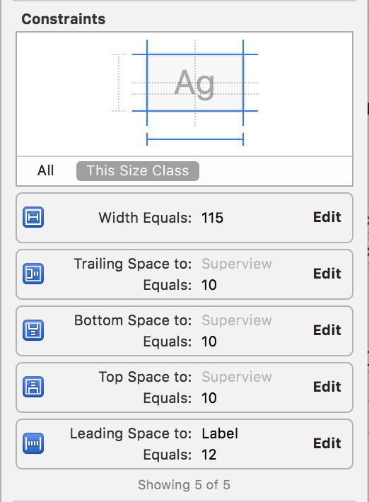

In the last step we setup likes functionality. Now we can view the posts that we've made and like / unlike them. But a social network isn't very social if you're only able to interact with your own content. So in this section we're going to focus on following and unfollowing users.

# Structuring our data

For storing information following other users, we'll need to create new subtrees in our Firebase database. The first will be for `Followers` and the other will be `Following`. We need two subtrees to store this information because if we don't store this information, then in order to figure out who's following a given user, we'd have to go through each user's list of users that they are following and verify whether each is following the given user. A smart way of doing this is using the technique of denormalization as we discuessed earlier.

Let's see what that would look like:

followers: {
    user1: {
      user2: true,
      user 3, true
    }
},
following: {
    user1: {
      user3: true
    }
}

Great, now we'll build our service classes to follow and unfollow users. Create a new service struct for your `FollowService`:

    private static func followUser(_ user: User, forCurrentUserWithSuccess success: @escaping (Bool) -> Void) {
        // 1
        let currentUID = User.current.uid
        let followData = ["followers/\(user.uid)/\(currentUID)" : true,
                          "following/\(currentUID)/\(user.uid)" : true]
        
        // 2
        let ref = FIRDatabase.database().reference()
        ref.updateChildValues(followData) { (error, _) in
            if let error = error {
                assertionFailure(error.localizedDescription)
            }
            
            // 3
            success(error == nil)
        }
    }
    
Let's walk through our code:

1. We create a dictionary to update multiple locations at the same time. We set the appropriate key-value for our followers and following.
2. We write our new relationship to Firebase
3. We return whether the update was successful based on whether there was an error.

Now, let's do the same for unfollowing a user:

    private static func unfollowUser(_ user: User, forCurrentUserWithSuccess success: @escaping (Bool) -> Void) {
        let currentUID = User.current.uid
        // Use NSNull() object instead of nil because updateChildValues expects type [Hashable : Any]
        // http://stackoverflow.com/questions/38462074/using-updatechildvalues-to-delete-from-firebase
        let followData = ["followers/\(user.uid)/\(currentUID)" : NSNull(),
                          "following/\(currentUID)/\(user.uid)" : NSNull()]
        
        let ref = FIRDatabase.database().reference()
        ref.updateChildValues(followData) { (error, ref) in
            if let error = error {
                assertionFailure(error.localizedDescription)
            }
            
            success(error == nil)
        }
    }

Here we're doing the same thing but delete multiple parts of our JSON tree by setting the relative paths to NSNull(). Note that we can't use nil, otherwise we'll get an error because `updateChildValues` is expecting a parameter of `[String : Any]`. Last we'll create a method where we can directly set whether we want a user to be followed or unfollowed:

    static func setIsFollowing(_ isFollowing: Bool, fromCurrentUserTo followee: User, success: @escaping (Bool) -> Void) {
        if isFollowing {
            followUser(followee, forCurrentUserWithSuccess: success)
        } else {
            unfollowUser(followee, forCurrentUserWithSuccess: success)
        }
    }

Great! Now that we've setup our initial service methods for following and unfollowing users, we'll need to create some UI to display the relationship. Let's go to our Main storyboard.

# Setting the UI

Instead of making a profile, for now we're going to create a find friends view controller to find and follow other friends. When our design is finished, it'll look like this:

Let's get started by creating a `FindFriendViewController.swift` file. After creating the file, we'll want to set the class for our third tab view controller in our main storyboard.

Next, we'll embed our `FindFriendsViewController` within a navigation controller. This will give us a navigation bar for our view controller. Let's set the title of our navigation bar to `Find Friends`.

Now we'll refactor our `FindFriendsViewController` into it's own storyboard. Select the `FindFriendsViewController` view controller in your main storyboard and click the `Editor`>`Refactor to Storyboard...` button in the top menu. Name this storyboard `FindFriends.storyboard`.

When your done your `FindFriends.storyboard` should look like the image below:

We'll now add our `UITableView` to our view controller. Make sure you constraint the top and bottom of the table view to the view, not the top and bottom layout guides:

Now we're going to create our prototype cell that will represent other users. For each user we need a label for thier username and a button for whether they're being followed or not. Drag and drop a prototype cell from the object library to the `UITableView`. Set the cell to have a custom row height of 71 and give it a cell identifier of `FindFriendCell`.

Add a `UILabel` with the following with the following constraints:

Next we'll add a button to follow and unfollow other users. Add a button with the following constraints:

Now let's create the `FindFriendsCell.swift` file to go along with our cell. Let's make IBOutlets for both the label and the button. In addition, we'll create an IBAction for the follow button. Your code should look like the following:

    import UIKit

    class FindFriendsCell: UITableViewCell {

        // MARK: - Properties

        @IBOutlet weak var followButton: UIButton!
        @IBOutlet weak var usernameLabel: UILabel!

        // MARK: - Cell Lifecycle

        override func awakeFromNib() {
            super.awakeFromNib()
        }

        // MARK: - IBActions

        @IBAction func followButtonTapped(_ sender: UIButton) {
            print("follow button tapped")
        }
    }

We've created the basic structure for our cell, now it's time to add some small customizations. We're going to add different titles based on the selection of the cell. Change `awakeFromNib` to the following:

    override func awakeFromNib() {
        super.awakeFromNib()
        
        followButton.layer.borderColor = UIColor.lightGray.cgColor
        followButton.layer.borderWidth = 1
        followButton.layer.cornerRadius = 6
        followButton.clipsToBounds = true
        
        followButton.setTitle("Follow", for: .normal)
        followButton.setTitle("Following", for: .selected)
    }
    
Now let's hook up the datasource of the tableview. We'll need an IBOutlet for our tableview and to connect the tableview's datasource to the view controller. First add the following to your `FindFriendsViewController`:

    class FindFriendsViewController: UIViewController {

        // MARK: - Properties

        var users = [User]()

        // MARK: - Subviews

        @IBOutlet weak var tableView: UITableView!

        // MARK: - VC Lifecycle

        override func viewDidLoad() {
            super.viewDidLoad()

            // remove separators for empty cells
            tableView.tableFooterView = UIView()
        }
    }

We create a empty array of users to hold all of our users. Next we'll need to setup our `UITableViewDataSource`. Add the following add the bottom of your file:

    // MARK: - UITableViewDataSource

    extension FindFriendsViewController: UITableViewDataSource {
        func tableView(_ tableView: UITableView, numberOfRowsInSection section: Int) -> Int {
            return users.count
        }

        func tableView(_ tableView: UITableView, cellForRowAt indexPath: IndexPath) -> UITableViewCell {
            let cell = tableView.dequeueReusableCell(withIdentifier: "FindFriendsCell") as! FindFriendsCell
            configure(cell: cell, atIndexPath: indexPath)

            return cell
        }

        func configure(cell: FindFriendsCell, atIndexPath indexPath: IndexPath) {
            let user = users[indexPath.row]

            cell.usernameLabel.text = user.username
        }
    }
    
Now we need to fetch all of the users on the server and display them. But first we'll add a isFollowed property to our user:

    var isFollowed = false
    
Next, we'll edit our `configure(cell:atIndexPath:)` with the following:

    func configure(cell: FindFriendsCell, atIndexPath indexPath: IndexPath) {
        let user = users[indexPath.row]
        
        cell.usernameLabel.text = user.username
        cell.followButton.isSelected = user.isFollowed
    }
    
Now to finish things up, let's create a service to fetch all users on the app and display them. We'll add the following class method to our `UserService` struct:

    static func usersExcludingCurrentUser(completion: @escaping ([User]) -> Void) {
        let currentUser = User.current
        let ref = FIRDatabase.database().reference().child("users")
        
        ref.observeSingleEvent(of: .value, with: { (snapshot) in
            guard let snapshot = snapshot.children.allObjects as? [FIRDataSnapshot]
                else { return completion([]) }
            
            let users =
                snapshot
                    .flatMap(User.init)
                    .filter { $0.uid == currentUser.uid }
            
            completion(users)
        })
    }

Let's hook this up in our `FindFriendsViewController`. Add the following in `viewWillAppear(_:)`:

    override func viewWillAppear(_ animated: Bool) {
        super.viewWillAppear(animated)

        UserService.usersExcludingCurrentUser { [unowned self] (users) in
            self.users = users
            
            DispatchQueue.main.async {
                self.tableView.reloadData()
            }
        }
    }

Here, we fetch all users from our database and set them to our datasource. Then we refresh the UI on the main thread because all UI updates must be on the main thread. If everything works correctly you should see all others you've created on the database. If you don't have any other users, delete the app and create a couple to see your progress.

You might notice that we haven't handled the state for our follow buttons. Let's go ahead and do that now. We'll need to create a new class method in our service class, to tell whether a user is being followed by the current users. Let's created that in the `FollowService` now:

    static func isUser(_ user: User, followedByCurrentUserWithCompletion completion: @escaping (Bool) -> Void) {
        let currentUID = User.current.uid
        let userRef = FIRDatabase.database().reference().child("users").child(user.uid)
        
        userRef.queryEqual(toValue: nil, childKey: currentUID).observeSingleEvent(of: .value, with: { (snapshot) in
            if let _ = snapshot.value as? [String : Bool] {
                completion(true)
            } else {
                completion(false)
            }
        })
    }

Now, we'll need to go back to our `UserService` and change our method that fetches all users from the database. Let's do that now:

    static func usersExcludingCurrentUser(completion: @escaping ([User]) -> Void) {
        let currentUser = User.current
        let ref = FIRDatabase.database().reference().child("users")
        
        ref.observeSingleEvent(of: .value, with: { (snapshot) in
            guard let snapshot = snapshot.children.allObjects as? [FIRDataSnapshot]
                else { return completion([]) }
            
            let users =
                snapshot
                    .flatMap(User.init)
                    .filter { $0.uid != currentUser.uid }
            
            let dispatchGroup = DispatchGroup()
            users.forEach { (user) in
                dispatchGroup.enter()
                
                FollowService.isUserFollowed(user) { (isFollowed) in
                    user.isFollowed = isFollowed
                    dispatchGroup.leave()
                }
            }
            
            dispatchGroup.notify(queue: .main, execute: {
                completion(users)
            })
        })
    }

Here we add a dispatch group to asynchronously tell if each user is being followed before returning all of the users.

Now we can move on to the last part of configuring our UI: enabling our button to work. To do so, let's create a delegate for our `FindFriendsCell`. Add the following to the top of your `FindFriendsCell` class:

    protocol FindFriendsCellDelegate: class {
        func didTapFollowButton(_ followButton: UIButton, on cell: FindFriendsCell)
    }
    
Next we'll add a delegate to the cell itself:

    weak var delegate: FindFriendsCellDelegate?
    
And call the delegate when the follow button is tapped:

    @IBAction func followButtonTapped(_ sender: UIButton) {
        delegate?.didTapFollowButton(sender, on: self)
    }
    
Last we'll implement the delegate in our `tableView(_:cellForRowAt:)` datasource method:

    func tableView(_ tableView: UITableView, cellForRowAt indexPath: IndexPath) -> UITableViewCell {
        let cell = tableView.dequeueReusableCell(withIdentifier: "FindFriendsCell") as! FindFriendsCell
        cell.delegate = self
        configure(cell: cell, atIndexPath: indexPath)
        
        return cell
    }

And make sure our `FindFriendsViewController` conforms to the protocol:

    extension FindFriendsViewController: FindFriendsCellDelegate {
        func didTapFollowButton(_ followButton: UIButton, on cell: FindFriendsCell) {
            guard let indexPath = tableView.indexPath(for: cell) else { return }

            followButton.isUserInteractionEnabled = false
            let followee = users[indexPath.row]

            FollowService.setIsFollowing(!followee.isFollowed, fromCurrentUserTo: followee) { (success) in
                defer {
                    followButton.isUserInteractionEnabled = true
                }

                guard success else { return }

                followee.isFollowed = !followee.isFollowed
                self.tableView.reloadRows(at: [indexPath], with: .none)
            }
        }
    }

We're done! Test it out. Try following and unfollowing users and see the changes in your Firebase database. You should also see the UI change from follow to following whether a user is being followed.
